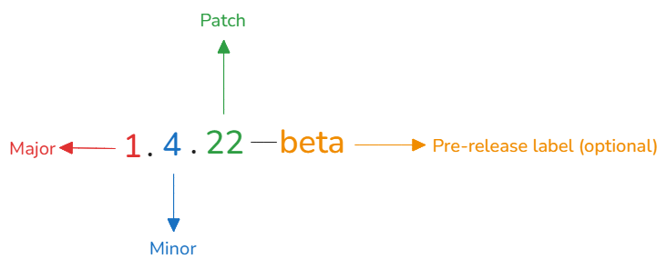

<!-- truncate -->

Have you ever confused when saw something like u <u>v2.1.3</u> or <u>v1.11.0-beta</u>.

## What is that?

This is **Semantic Versioning**, or we usually call **SemVer**. It's offer a systematic approach to versioning software, ensuring that release version number is following the rule to explain the changes between old and new version. As defined on <u>semver.org</u>, it uses a three-part version number: `MAJOR.MINOR.PATCH`

1. **`MAJOR`**: Incremented whenever major changes are made like architectural change, database schema update
2. **`MINOR`**: Incremented whenever minor changes are made like add new feature, add new API endpoint
3. **`PATCH`**: Incremented with bug fixes, no new feature
4. `Pre-release label` - (Optional): Release software informally for testing purposes

## Why we need that?

- It helps manage project version easily, avoid conflict update
- Make communicate between develop teams and user more clearly

## Tips

- Use `0.x.x` for unstable version or first beta test version
- Never use negative number for any parts
- Using automatic tag versioning tool (ex: semantic-release) to avoid confusion
- When you need to update version, I recommend update from `PATCH` -> `MINOR` -> `MAJOR`

## Conclusion

Don't let the update phase become an nightmare, use SemVer like 'magic pills' to make it easy. Consideration to use each parts for right demand, don't be scare when increment `MAJOR` because it's the evidence that your software are growing up.

Happy Coding!
