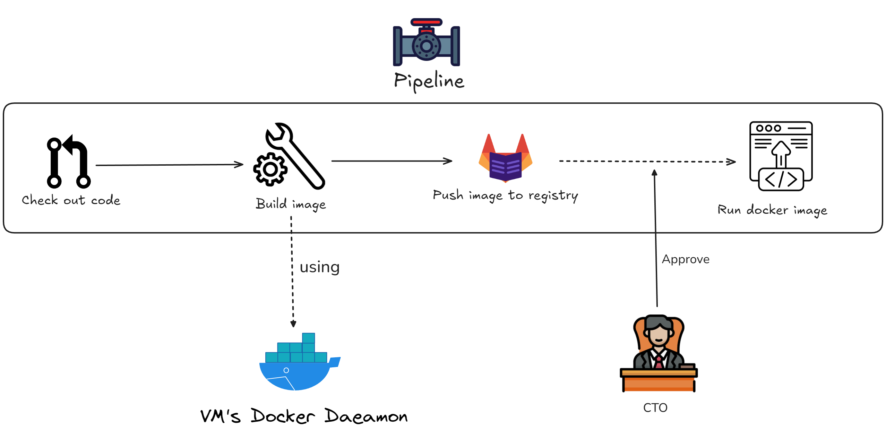

<!-- truncate -->

# Guideline: CI/CD from scratch

**Target:** This guideline take you from zero to build a complete DevOps system on Google Cloud Platform (GCP), including Technitium - DNS server, NPM - Reverse Proxy, Gitlab, Jenkins, Docker, and finally, an pipeline deploy to Docker automatically.

**Final Result:** You will have the system which just `git push` and everything relate (build, check, approval, deploy) will run automatically

## Virtual Machine's architecture

Let's take a look into VM's architecture first

The containers are organized into:

- **NGINX container (NPM):**

  - **Port expose:** 80 (HTTP)
  - Acts as a **reverse proxy**, forwarding traffic to:
    - **Jenkins** on port **8080,443**
    - **Gitlab** on port **80,443**

<!-- - **Technitium container (DNS):**

  - **Port expose:** 5380
  - Acts as a **local DNS** -->

- **Jenkins container:**

  - **Port expose:** 8080
  - Connected directly to the **VM's Docker daemon**

- **Gitlab container:**
  - **Port expose:** 80 (UI), 22 (ssh), 5050 (container registry)

## Public Workflow

## Pipeline

