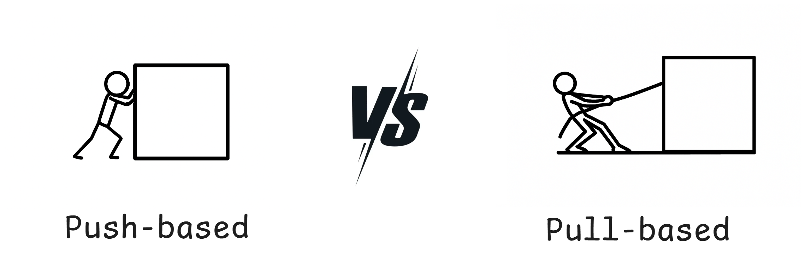
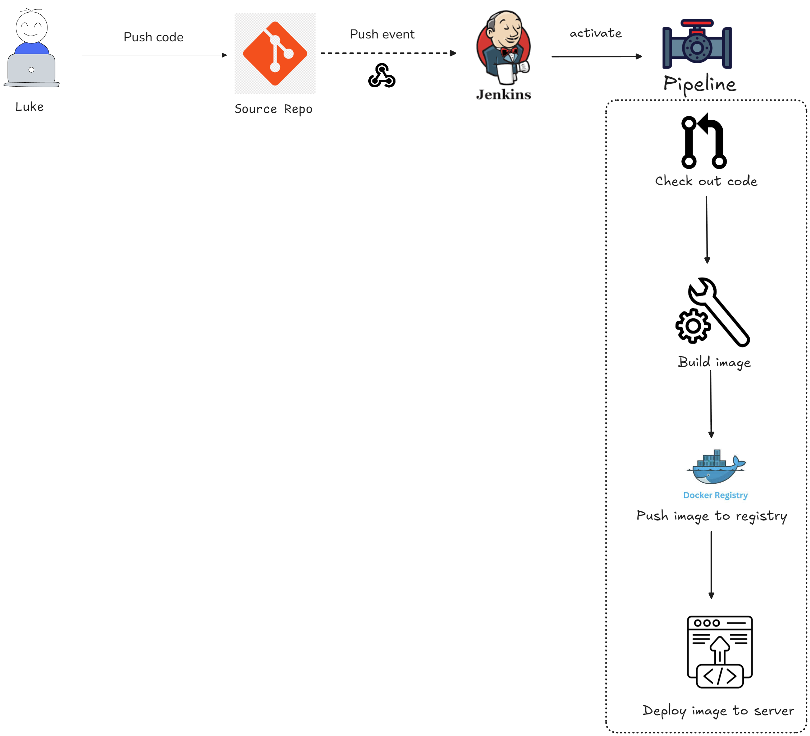
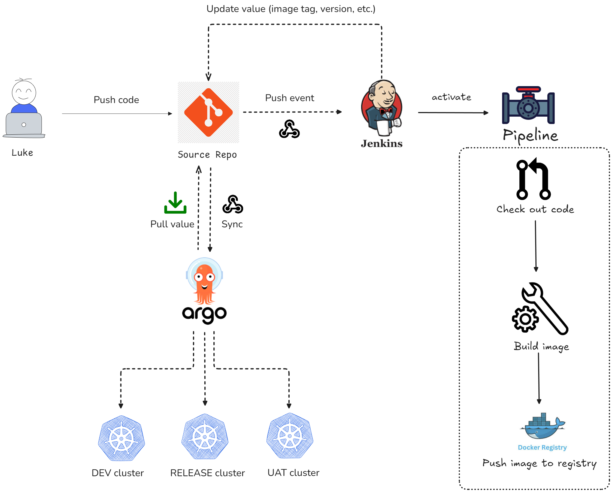

<!-- truncate -->

<!-- Work as DevOps, at least one time you heard "Push-based and Pull-based". So what is it? -->

Push-based or Pull-based are synchronize code/config between dev, server and repository - but mechanism of synchronization is different.

## Push-based

In **push-based**, we'll have an CI/CD flow which active "push" the changes to server. This model usually use in traditional deployment, apply the changes after pipeline run directly.

- Pros:
  - Easy to deployment
  - Re-use existing pipeline
  - Immediate execution
- Cons:
  - Hard to track drift
  - Pipeline dependence
  - Rollback missing
  - Security risk
  - Audit challenges

## Pull-based

In **pull-based**, the server actively pulls changes from the project’s repository. This approach is called GitOps, where Git acts as the **Single Source of Truth**. The workflow is similar to push-based, but with some key differences - The pipeline won't deploy to server directly - We add an agent (ArgoCD / Flux) to the server side, which continuously observes the project’s repository and pulls the changes to apply them to the server whenever updates occur.

- Pros:
  - Automation
  - Easy rollback
  - Multi-cluster support
- Cons:
  - Agent installation
  - Complex configuration
  - Polling latency

## Comparison

| Criteria               | Pull-Based                                 | Push-Based                                         |
| ---------------------- | ------------------------------------------ | -------------------------------------------------- |
| Status Synchronization | Automation                                 | Manual (triggered by pipeline run)                 |
| Installation           | Install agent in server side               | No need agent                                      |
| Suitable For           | Kubernetes, multi-cluster, complex project | Medium-sized project, simple pipeline              |
| Security               | More secure (server only pulls from Git)   | High risk (pipeline needs direct access to server) |
