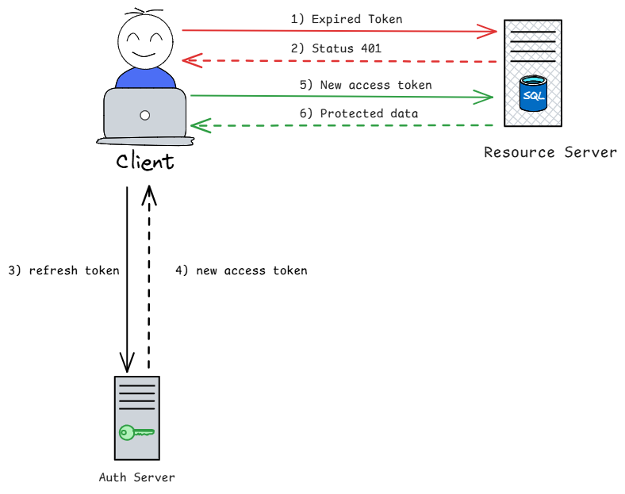

Beside **access token**, we also have **refresh token**. They're best friend forever, you need them to help your authentication mechanism to be more secure and reliable. So what is it? 

<!-- truncate -->

Have you ever see the alert like `Your session has expired` when use your app ? That's the signal of your access token has been expired. So may you ask the question...

Look like option A is fine and maybe, option C and D will work, MAYBE 🤣, but the better and common answer is `Refresh token`. So how to do it? 

## What is refresh token?

When a user logs in successfully, the server provides two tokens: an access token and a refresh token.

Think of the **access token** as your employee badge and the **refresh token** as your government ID card. Both prove who you are, but they serve different purposes and have different lifetimes.

- **Role:** If your employee badge expires, you can use your ID card to request a new one. But you can’t use your badge to get a new ID card.

- **Lifetime:** Your employee badge is short-lived and may expire quickly, while your ID card lasts much longer — though it can still be revoked if necessary.

Summary, **refresh token** is a token that is used to request a new access token when the current access token has expired. This mechanism ensures that the user stays logged in even if the access token expires. 

## How to use refresh token?

1) App request with expired token
2) Server return 401
3) App use `refresh token` to request new token from server
4) Server verify `refresh token` and return new `access token`
5) App use new `access token` to request resource
6) Server verify new `access token ` and return resource to app

## Best practices
### Life time

- **Access token:** Keep it short, maybe around 5-10 mins, it ensure if the hacker can get it but can't use it forever

- **Refresh token:** Because we use it to request new access token, so make it longer than access token, maybe 7-14 days, or even a month. 

### Token type

- **Access token:** Use **JWT** for access token, because we can use `stateless` property of it to make the authentication more faster.

- **Refresh token:** We can use **opaque token** or **JWT**, both are fine, but I prefer **opaque token** because it is easy to revoke. If we use **JWT**, we must to wait until the token expire or we need to create an black list to store invalid token, this thing violate the **stateless** property

### Storage in client-side

- **Access token:** Because it life time is short, so we can store it in `memory` or `cookie` without specify config. Save in `memory` maybe better because it prevent XSS attack, but it'll lost when user close or refresh the page

- **Refresh token:** Because it life time is longer, so I recommend store it in `cookie` with 
    - `httpOnly` 
    - `SameSite=strict` or `SameSite=Lax` 
    - `Secure`

:::danger
Never store **refresh token** in `localStorage` or `sessionStorage`, because it can be steal by XSS attack
:::

### Storage in server-side

- **Access Token:** No need to store it in server

- **Refresh Token:** We should **hashing** it before storing it in database. 

:::tip
We should return raw token (token before hashing) to client.
:::

### Refresh token rotation

**Refresh token** should be use only one time, it means when we use **refresh token** to get a new access token, we should **revoke** the old **refresh token** and return new **refresh token** to client. 

:::info
This practice help to prevent the case when hacker have **refresh token** and use it to request new **access token**. When official user reuse old **refresh token**, the system can detect **suspicious activity**, from there we can take action to revoke every token related to this user.

Also, this make user who access usually never been logout and user who won't access for a long time will be logout. 
:::

### Binding to specific user device
This make one more security step, it prevent the case when hacker get **refresh token**, but they can't use it if they don't have user device. We can make it by create an "fingerprint" for client which combine some information:

- **IP address (optional):** User's ip address
- **Device id:** An random string generated by server and store it in **cookie** with `Secure, SameSite=strict\lax`.  
- **User agent:** Browser and OS information (it can't be fake if hacker know your user agent)

**Fingerprint** = `IP` + `Device ID` + `User Agent`

:::note
When client use `refresh token` to request new access token, we can use **fingerprint** to verify that the request is from the same client.
:::

