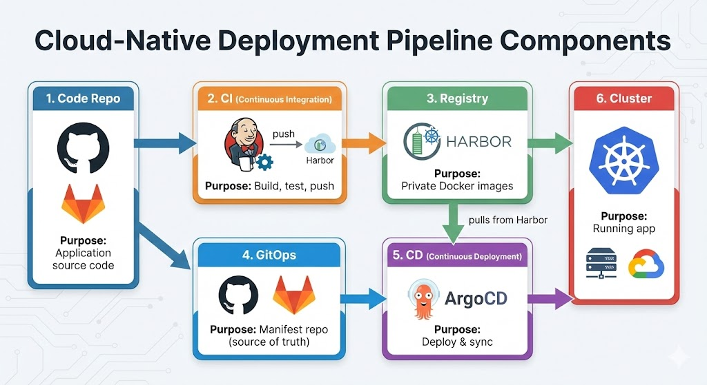
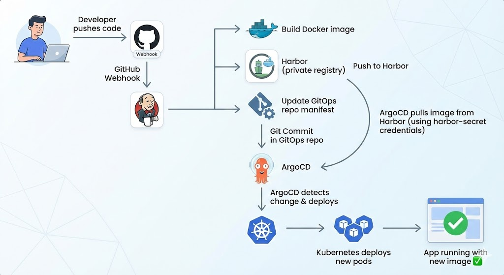

# Install ArgoCD via Helm + Harbor Registry + Jenkins CI/CD Pipeline

Now let's build a complete enterprise-grade setup: **Harbor (private Docker registry) ← Jenkins (CI) ← ArgoCD (CD)**. Harbor replaces Docker Hub, keeping all your images private and safe. Jenkins builds and pushes to Harbor, ArgoCD pulls from Harbor to deploy. Perfect for on-premise or GCP environments.



## Step 1: Install Harbor via Helm (Private Docker Registry)

Harbor is your private Docker registry—like Docker Hub but running on your own Kubernetes cluster, with vulnerability scanning and access control built-in.

### Add Harbor Helm Repo and Install

```bash
helm repo add harbor https://helm.goharbor.io
helm repo update
```

Create the Harbor namespace:

```bash
kubectl create namespace harbor
```

**Install Harbor with minimal config** (insecure for testing—use HTTPS in production):

```bash
helm install harbor harbor/harbor \
  --namespace harbor \
  --set expose.type=NodePort \
  --set expose.tls.enabled=false \
  --set externalURL=http://harbor.example.com \
  --set harborAdminPassword=Harbor12345
```

Or if you're on localhost (testing):

```bash
helm install harbor harbor/harbor \
  --namespace harbor \
  --set expose.type=NodePort \
  --set expose.tls.enabled=false \
  --set externalURL=http://localhost:30003 \
  --set harborAdminPassword=Harbor12345
```

**Wait for all pods to be ready:**

```bash
kubectl get pods -n harbor -w
```

You should see `harbor-core`, `harbor-database`, `harbor-redis`, `harbor-registry`, etc. all in `Running` status.

**Get the Harbor access details:**

```bash
kubectl get svc -n harbor
```

Find the NodePort for Harbor (usually something like `30003` for HTTP). Access Harbor UI at `http://localhost:30003` (or your server IP).

**Default credentials:**

- **Username:** `admin`
- **Password:** `Harbor12345` (or whatever you set)

---

## Step 2: Create Harbor Project and User

1. Log into Harbor UI at `http://harbor.example.com` (or localhost:30003)
2. Click **Projects** → **New Project**
3. Name it `myapp` (or your app name)
4. Leave it **Private** (secure)
5. Click **OK**

Now you have a private Harbor project at `harbor.example.com/myapp`.

---

## Step 3: Test Harbor: Push a Sample Image

From any machine with Docker installed:

```bash
# Login to Harbor
docker login harbor.example.com
# Enter username: admin, password: Harbor12345

# Pull a sample image from Docker Hub
docker pull nginx:latest

# Tag it for your Harbor repo
docker tag nginx:latest harbor.example.com/myapp/nginx:v1.0

# Push to Harbor
docker push harbor.example.com/myapp/nginx:v1.0
```

In Harbor UI, go to **Projects → myapp → Repositories**, and you should see `myapp/nginx` with tag `v1.0`.

---

## Step 4: Install ArgoCD via Helm (Not kubectl manifests)

Now install ArgoCD using Helm, which gives us more control over configuration.

**Add ArgoCD Helm repo:**

```bash
helm repo add argo https://argoproj.github.io/argo-helm
helm repo update
```

**Create ArgoCD namespace:**

```bash
kubectl create namespace argocd
```

**Install ArgoCD with Helm:**

```bash
helm install argocd argo/argo-cd \
  --namespace argocd \
  --set server.insecure=true \
  --set server.service.type=LoadBalancer
```

Or for a simpler setup (NodePort instead of LoadBalancer):

```bash
helm install argocd argo/argo-cd \
  --namespace argocd \
  --set server.insecure=true \
  --set server.service.type=NodePort
```

**Wait for pods to be ready:**

```bash
kubectl get pods -n argocd -w
```

**Get the ArgoCD UI access:**

If using LoadBalancer:

```bash
kubectl get svc argocd-server -n argocd
```

Copy the `EXTERNAL-IP`. Open `https://<EXTERNAL-IP>` in your browser.

If using NodePort:

```bash
kubectl get svc argocd-server -n argocd
# Find the port (e.g., 32145)
```

Open `https://localhost:32145` (or your server IP:32145).

**Get ArgoCD admin password:**

```bash
kubectl -n argocd get secret argocd-initial-admin-secret -o jsonpath="{.data.password}" | base64 -d; echo
```

Login with `admin` + this password.

---

## Step 5: Create Kubernetes Secret for Harbor in ArgoCD

ArgoCD needs to know how to authenticate to Harbor to pull images from your private registry.

**Create the secret in ArgoCD namespace:**

```bash
kubectl create secret docker-registry harbor-secret \
  --docker-server=harbor.example.com \
  --docker-username=admin \
  --docker-password=Harbor12345 \
  -n argocd
```

For localhost/testing:

```bash
kubectl create secret docker-registry harbor-secret \
  --docker-server=harbor.example.com:30003 \
  --docker-username=admin \
  --docker-password=Harbor12345 \
  -n argocd
```

**Verify the secret:**

```bash
kubectl get secret harbor-secret -n argocd
```

---

## Step 6: Create Jenkins Credentials for Harbor

Jenkins needs to push images to Harbor.

1. Go to **Jenkins Dashboard → Manage Jenkins → Manage Credentials**
2. Click **Add Credentials**
3. Fill in:
   - **Kind:** `Username with password`
   - **Username:** `admin`
   - **Password:** `Harbor12345`
   - **ID:** `harbor-credentials`
4. Click **Create**

---

## Step 7: Create Updated Jenkinsfile (Build & Push to Harbor)

Here's a complete Jenkinsfile that:

1. Clones app code
2. Builds Docker image
3. Pushes to Harbor (not Docker Hub)
4. Updates GitOps repo with new image tag

```groovy
pipeline {
    agent any

    environment {
        HARBOR_HOST = 'harbor.example.com:30003'  // Change to your Harbor URL
        HARBOR_PROJECT = 'myapp'
        HARBOR_REPO = "${HARBOR_HOST}/${HARBOR_PROJECT}"
        IMAGE_TAG = "${BUILD_NUMBER}"
        IMAGE_NAME = "${HARBOR_REPO}/myapp:${IMAGE_TAG}"
        GITHUB_REPO = 'https://github.com/your-user/argocd-gitops-repo.git'
        GITHUB_TOKEN = credentials('github-token')
    }

    stages {
        stage('Checkout App Repo') {
            steps {
                checkout scm
            }
        }

        stage('Build Docker Image') {
            steps {
                script {
                    sh 'docker build -t ${IMAGE_NAME} .'
                }
            }
        }

        stage('Push to Harbor') {
            steps {
                script {
                    withCredentials([usernamePassword(credentialsId: 'harbor-credentials',
                                                       usernameVariable: 'HARBOR_USER',
                                                       passwordVariable: 'HARBOR_PASSWORD')]) {
                        sh '''
                            echo $HARBOR_PASSWORD | docker login -u $HARBOR_USER --password-stdin $HARBOR_HOST
                            docker push ${IMAGE_NAME}
                        '''
                    }
                }
            }
        }

        stage('Update GitOps Repo') {
            steps {
                script {
                    sh '''
                        # Clone GitOps repo
                        git clone https://${GITHUB_TOKEN}@github.com/your-user/argocd-gitops-repo.git gitops
                        cd gitops

                        # Update image tag in deployment.yaml
                        sed -i "s|image: .*/myapp:.*|image: ${IMAGE_NAME}|g" deployment.yaml

                        # Commit and push
                        git config user.email "jenkins@example.com"
                        git config user.name "Jenkins Bot"
                        git add deployment.yaml
                        git commit -m "Update image to ${IMAGE_NAME}"
                        git push https://${GITHUB_TOKEN}@github.com/your-user/argocd-gitops-repo.git main
                    '''
                }
            }
        }
    }

    post {
        success {
            echo "✅ Image built, pushed to Harbor, GitOps repo updated. ArgoCD will auto-sync!"
        }
        failure {
            echo "❌ Pipeline failed"
        }
    }
}
```

Key changes from before:

- **Harbor host**: `harbor.example.com:30003` (change to your setup)
- **Harbor credentials**: uses `harbor-credentials` from Jenkins
- **Image path**: `harbor.example.com:30003/myapp/myapp:123` instead of Docker Hub

---

## Step 8: Set Up GitOps Repo with ArgoCD Integration

Make sure your GitOps repo has:

**deployment.yaml:**

```yaml
apiVersion: apps/v1
kind: Deployment
metadata:
  name: myapp
  namespace: default
spec:
  replicas: 2
  selector:
    matchLabels:
      app: myapp
  template:
    metadata:
      labels:
        app: myapp
    spec:
      imagePullSecrets:
        - name: harbor-secret # Reference the Harbor secret
      containers:
        - name: myapp
          image: harbor.example.com:30003/myapp/myapp:latest # Harbor image
          ports:
            - containerPort: 3000
---
apiVersion: v1
kind: Service
metadata:
  name: myapp-svc
  namespace: default
spec:
  selector:
    app: myapp
  ports:
    - port: 80
      targetPort: 3000
  type: LoadBalancer
```

**Important:** Include `imagePullSecrets: - name: harbor-secret` so Kubernetes knows to use the Harbor credentials when pulling the image.

Commit and push this to your GitOps repo.

---

## Step 9: Register GitOps Repo in ArgoCD

**Via CLI:**

```bash
argocd app create myapp \
  --repo https://github.com/your-user/argocd-gitops-repo.git \
  --path . \
  --dest-server https://kubernetes.default.svc \
  --dest-namespace default \
  --sync-policy automated
```

**Via UI:**

1. Click **+ NEW APP** in ArgoCD
2. Fill in:
   - **Application Name:** `myapp`
   - **Repository URL:** `https://github.com/your-user/argocd-gitops-repo.git`
   - **Path:** `.`
   - **Cluster URL:** `https://kubernetes.default.svc`
   - **Namespace:** `default`
   - **Sync Policy:** `Automatic`
3. Click **CREATE**

ArgoCD will now watch your GitOps repo and auto-sync when manifests change.

---

## Step 10: Test the Full Pipeline

1. **Make a code change** in your app repo:

   ```bash
   git add .
   git commit -m "Update feature"
   git push origin main
   ```

2. **Watch Jenkins build:**

   - Webhook triggers Jenkins
   - Jenkins builds Docker image
   - Jenkins pushes to Harbor (`harbor.example.com:30003/myapp/myapp:123`)
   - Jenkins updates `deployment.yaml` in GitOps repo with new image tag

3. **Watch ArgoCD sync:**

   - ArgoCD detects change in GitOps repo
   - ArgoCD pulls new manifest
   - ArgoCD pulls Docker image from Harbor (using `harbor-secret`)
   - New pods spin up with image from Harbor

4. **Verify deployment:**
   ```bash
   kubectl get pods
   kubectl describe deployment myapp
   kubectl logs -f deployment/myapp
   ```

---

## Complete Architecture Diagram



---

## Troubleshooting

**1. Jenkins can't push to Harbor (Login failed):**

- Verify Harbor is accessible: `curl http://harbor.example.com:30003`
- Check Harbor credentials in Jenkins match actual username/password
- Verify `harbor-credentials` ID exists in Jenkins

**2. ArgoCD can't pull image from Harbor (ImagePullBackOff):**

- Confirm `harbor-secret` exists in `argocd` namespace: `kubectl get secret -n argocd`
- Verify secret has correct credentials: `kubectl get secret harbor-secret -n argocd -o yaml`
- Ensure `imagePullSecrets: - name: harbor-secret` is in your `deployment.yaml`

**3. Harbor image not found (404):**

- Verify image was pushed: check Harbor UI or `docker search harbor.example.com/myapp`
- Confirm image tag matches between Jenkins Jenkinsfile and GitOps repo manifest
- Check Jenkins logs: `docker push` output should show success

**4. ArgoCD sync keeps failing:**

- Click app in ArgoCD UI and check "Conditions" for error messages
- Verify GitOps repo is accessible: `git clone https://github.com/your-user/argocd-gitops-repo.git`
- Check if manifest YAML is valid: `kubectl apply -f deployment.yaml --dry-run`

---

## Best Practices

1. **Use HTTPS for Harbor in production** — configure TLS certs and use proper domain
2. **Create Harbor users per team** — don't share the admin account
3. **Enable image vulnerability scanning** — Harbor can scan for CVEs automatically
4. **Use image tags, never `:latest`** — use `${BUILD_NUMBER}` for traceability
5. **Separate app repo from GitOps repo** — cleaner Git history
6. **Enable ArgoCD automatic sync** — Git becomes the source of truth

---
