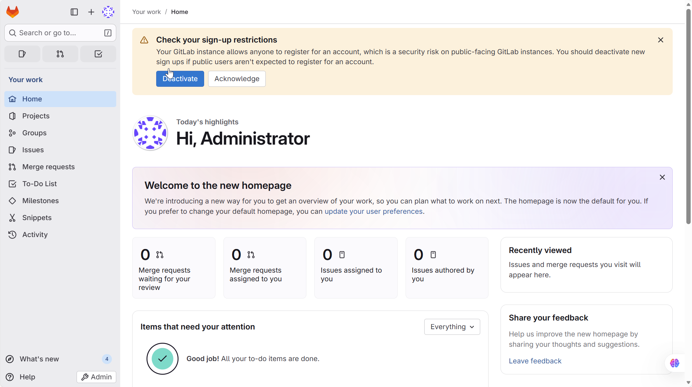

# Install GitLab with Docker

1. Create file `docker-compose.yaml` with following content:

```yml
version: "3.8"

services:
  gitlab:
    image: "gitlab/gitlab-ce:latest"
    container_name: gitlab
    restart: always
    hostname: "gitlab.local"
    environment:
      GITLAB_OMNIBUS_CONFIG: |
        external_url 'http://gitlab.local'
        gitlab_rails['initial_root_password'] = 'Gb%GRhqQxp9%@ChX'
    ports:
      - "80:80"
      - "443:443"
      - "2222:22"
    volumes:
      - "/opt/gitlab/config:/etc/gitlab"
      - "/opt/gitlab/logs:/var/log/gitlab"
      - "/opt/gitlab/data:/var/opt/gitlab"
    networks:
      gitlab-network:
        aliases:
          - gitlab.local
networks:
  gitlab-network:
    driver: bridge
```

2. Run `docker-compose up -d`
3. Open browser and go to `http://localhost`
   > you can use `gitlab.local` instead after update hostname file in `C:\Windows\System32\Drivers\etc\hosts`
4. Login with username `admin` and password `Gb%GRhqQxp9%@ChX`
5. You'll see the dashboard like img below
   
