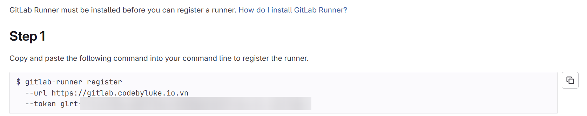
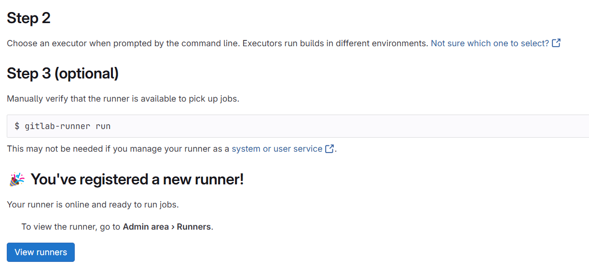

# Install GitLab Runner with Docker
## Prequisites
- Already install GitLab Server (if not, check [Install GitLab with Docker](/DevOps/Gitlab/InstallByDocker))

## Steps
1) Update `docker-compose.yaml` file with the following content:
```yaml
  gitlab-runner:
    image: 'gitlab/gitlab-runner:latest'
    container_name: gitlab-runner
    restart: always
    depends_on:
      - gitlab
    volumes:
      - '/opt/gitlab-runner/config:/etc/gitlab-runner'
      - '/var/run/docker.sock:/var/run/docker.sock'
    networks:
      - gitlab-network
```

2) Drop container with `docker compose down` and start again with `docker compose up -d`

3) Access to GitLab and navigate to **Admin area** > **CI/CD** > **Runner**


4) Fill the information for your runner and click **Create Runner** button

5) Copy command line and run it with `docker compose -rm <your-command>`


6) After verify success, it will show you **Active** status
