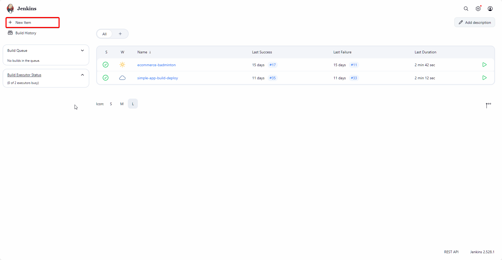
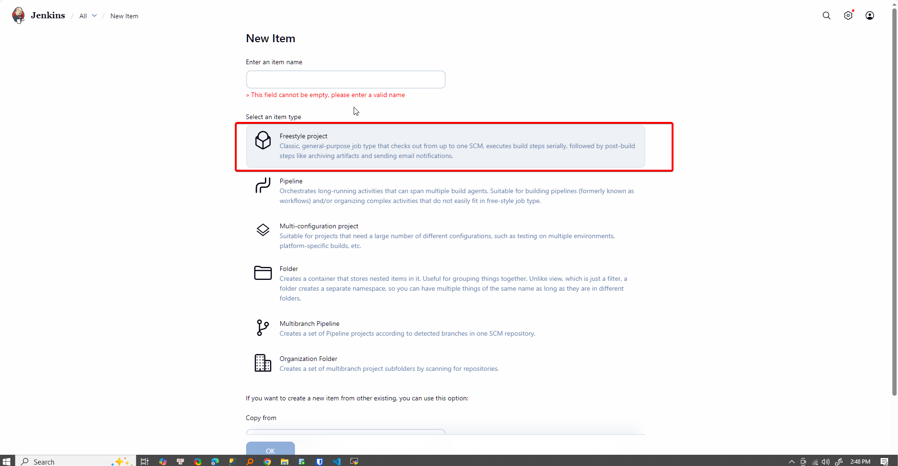
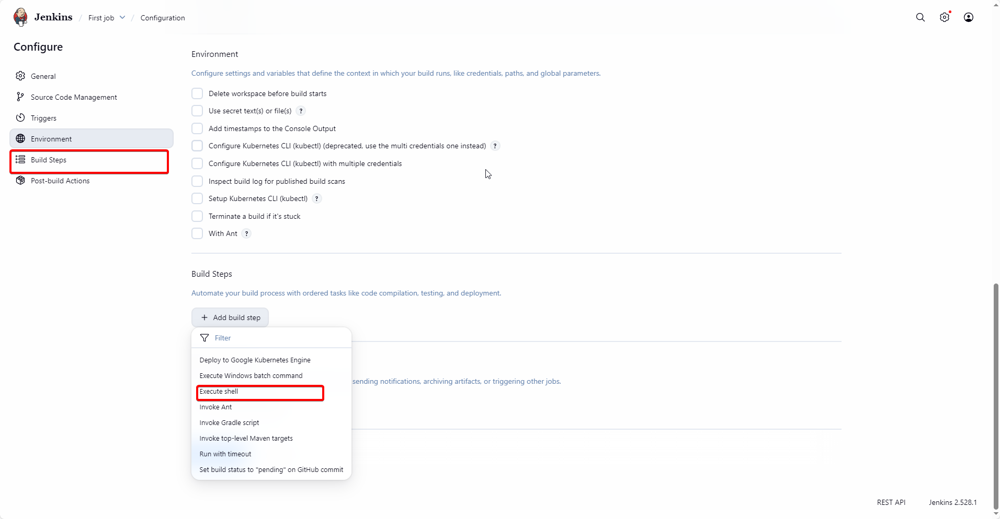
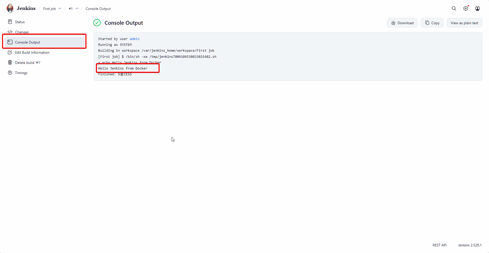

# Run first job: Hello CI

- Choose **New Item**
  
- Choose **Freestyle project**.
  
- Add build step with “Execute shell”:
  
- Fill out with following script
  ```bash
  echo "Hello Jenkins from Docker"
  ```
- Click save and choose **Build Now**. If console log show like image below, it's mean Jenkins work fine.
  
