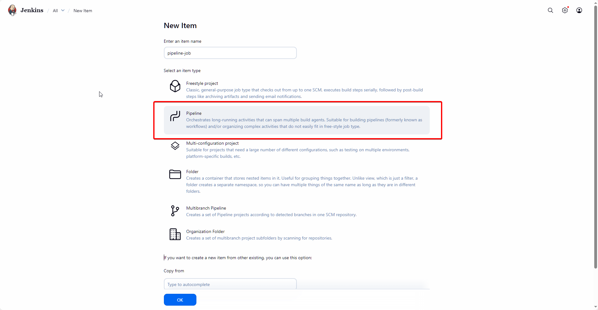
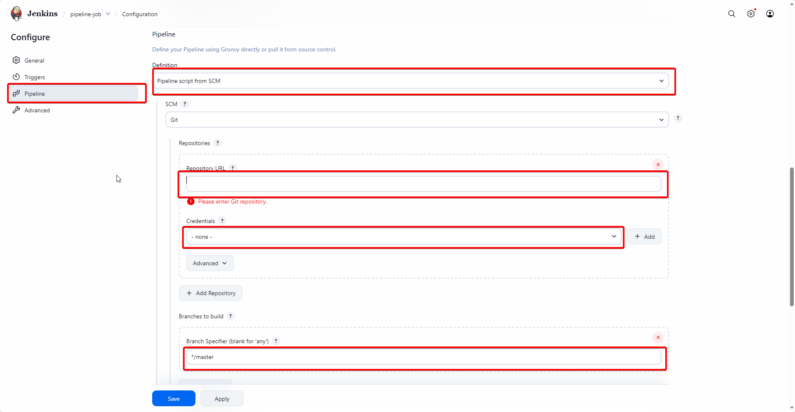

# Run first job: Hello CI

## Option 1: Freestyle job

- Choose **New Item**
  
- Choose **Freestyle project**.
  
- Add build step with “Execute shell”:
  
- Fill out with following script
  ```bash
  echo "Hello Jenkins from Docker"
  ```
- Click save and choose **Build Now**. If console log show like image below, it's mean Jenkins work fine.
  

### Option 2: Pipeline job

- Choose **New Item**
  

- Choose **pipeline**
  

- Config git/gitlab to build
  

- Click save and choose **Build Now**
