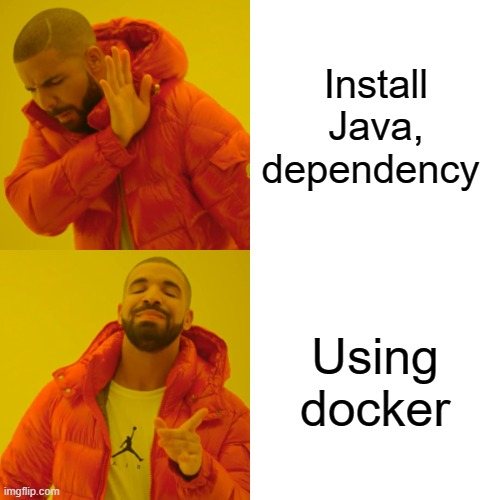

# Install Jenkins by Docker

You are a DevOps fresher and want to practice with Jenkins for CI/CD, but you remember you need install Java, service config, port mapping, etc. A huge messy things you need to do first, this post is for you


---

## Environment Setup

To begin, you need two things:

- Install docker
- At least 4GB RAM to run

Quick check:

- `docker --version`
- `docker ps`

If two commands above run without zero, READY TO START

## Install Jenkins by docker run

### Step 1: Create folder to store Jenkins data

```bash
mkdir ~/jenkins_home
```

This folder will store Jenkins configuration, plugin, job, credential, etc. It's make sure the data/config is "safe" when stop/remove container

### Step 2: Run Jenkins container

Open command prompt / terminal and run

```bash
docker run -d \
  --name jenkins \
  -p 8080:8080 \
  -p 50000:50000 \
  -v ~/jenkins_home:/var/jenkins_home \
  jenkins/jenkins:lts
```

Quick explain:

- `-p 8080:8080`: mapping port `8000` in container to port `8000` in host machine

- `-p 50000:50000`: port connect for agent (I will write about it in other post)

- `-v ~/jenkins_home:/var/jenkins_home`: mount `jenkins_home` folder into container

- `jenkins/jenkins:lts`: the latest Jenkins image

## Install Jenkins with docker-compose

If you want deploy Jenkins like IaC (Infrastructure As Code), `docker-compose` is the best suite

### Step 1: Create project folder

```bash
mkdir jenkins-docker
cd jenkins-docker
mkdir jenkins_home
```

### Bước 2: Create file `docker-compose.yml`

```yaml title="docker-compose.yml"
version: "3.8"

services:
  jenkins:
    image: jenkins/jenkins:lts
    container_name: jenkins
    ports:
      - "8080:8080"
      - "50000:50000"
    volumes:
      - ./jenkins_home:/var/jenkins_home
    restart: unless-stopped
```

Some setting optional:

- `restart: unless-stopped`: Jenkins will start automatically after server restart
- Put `./jenkins_home` folder in the same directory of file compose, easy to backup.

### Step 3: Start service

```bash
docker compose up -d
```

Older version:

```bash
docker-compose up -d
```

Check:

```bash
docker compose ps
docker compose logs -f jenkins
```

If you see Jenkins log “Jenkins is fully up and running”, you're all set.

---
