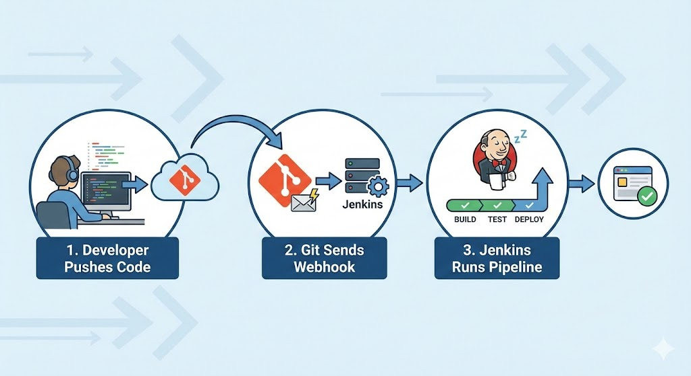
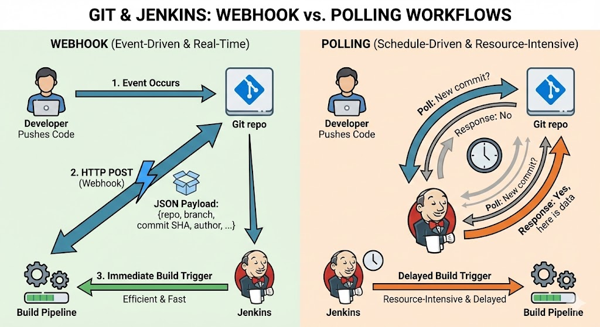

# Build Jenkins Pipeline Triggered by Git Webhook

The goal: every time you push code, Jenkins builds and tests automatically—no more “Build Now” button spam. Git webhooks let your Git server (GitHub, GitLab, Bitbucket, etc.) call Jenkins via HTTP whenever there’s a new commit or pull request, and Jenkins kicks off a pipeline for you.



---

## What is a Webhook (in Normal Human Words)?



A **webhook** is just an HTTP POST that your Git server sends to a URL you configure whenever a specific event happens in your repo (push, PR/MR, tag, etc.). The POST body contains a JSON payload describing what changed: repo, branch, commit SHA, author, etc.

Instead of Jenkins constantly polling Git (“New commit yet? Now? How about now?”), webhooks are **event-driven**:  
when an event occurs, Git notifies Jenkins immediately. That saves resources and makes builds almost real-time after a push.

---

## What You Need Before Starting

You’ll need:

- **A working Jenkins instance**  
  On a server, VM, container, or even your laptop (localhost is fine for testing).

- **Plugins installed**

  - Git plugin
  - GitHub plugin (if using GitHub)
  - GitLab plugin (if using GitLab)

- **A Git repo** on GitHub/GitLab/Bitbucket where you can configure webhooks.

- **A Jenkinsfile or Pipeline script** defining your stages: build, test, deploy.

If Jenkins is running only on localhost, you’ll also need something like **ngrok** to expose Jenkins to the internet so Git can send it a webhook.

---

## Step 1: Install Required Plugins in Jenkins

In Jenkins:

1. Go to **Manage Jenkins → Manage Plugins → Available**.
2. Install:
   - **Git**
   - **GitHub** (for GitHub)
   - **GitLab** (for GitLab)
3. Click **Install without restart** (restart if Jenkins asks nicely).

These plugins give Jenkins the ability to clone your repo and understand incoming webhook events.

---

## Step 2: Create a Jenkins Pipeline Job

You have two main choices:

- **Pipeline**: for a single branch (e.g., `main`).
- **Multibranch Pipeline**: automatically creates sub-jobs for each branch in your repo.

Let’s start with a simple **Pipeline** job:

1. From the Jenkins dashboard, click **New Item**.
2. Enter a name (e.g., `github-webhook-demo`).
3. Choose **Pipeline** and click **OK**.
4. In **Build Triggers**, tick:
   - For GitHub: **GitHub hook trigger for GITScm polling**
   - For GitLab: **Build when a change is pushed to GitLab**
5. In the **Pipeline** section:
   - Choose **Pipeline script from SCM**.
   - Set **SCM** to **Git**.
   - **Repository URL**: your repo URL (e.g. `https://github.com/your-user/your-repo.git`).
   - **Credentials**: add a personal access token or username/password if the repo is private.
   - **Branch Specifier**: `*/main` or whichever branch you want.
   - **Script Path**: `Jenkinsfile` (assuming you keep your pipeline in that file).

Click **Save**.

Now Jenkins is ready to be triggered by webhooks—it just doesn’t have a caller yet.

---

## Step 3 (Optional): Expose Local Jenkins Using ngrok

If Jenkins is running on your local machine (e.g., `http://localhost:8080`), GitHub/GitLab cannot reach it directly. Use **ngrok** as a quick tunnel.

On your machine:

```bash
./ngrok http 8080
```

Ngrok will output something like:

```text
Forwarding  https://abc123.ngrok.io -> http://localhost:8080
```

Use `https://abc123.ngrok.io` as your **public Jenkins URL** in the webhook settings.

Note: free ngrok URLs change every time you restart ngrok. Great for demos, terrible for production.

---

## Step 4: Configure Webhook in GitHub

In your GitHub repo:

1. Go to **Settings → Webhooks → Add webhook**.
2. **Payload URL**:
   - If using ngrok: `https://abc123.ngrok.io/github-webhook/`
   - If using real domain: `https://jenkins.yourcompany.com/github-webhook/`
3. **Content type**: `application/json`.
4. **Secret**:
   - For testing, you _can_ leave it empty.
   - For real environments, always set a secret string (Jenkins will validate it for security).
5. **Events**:
   - Select **Just the push event**, or add **Pull requests** as well if you want PR builds.
6. Ensure **Active** is checked.
7. Click **Add webhook**.

GitHub immediately sends a ping request. If it gets a **200 OK** from Jenkins, the webhook will show a green check mark. If it’s red, click into the webhook and inspect **Recent Deliveries** for HTTP status and error details.

---

## Step 5: Configure Webhook in GitLab (Alternative)

If you’re using GitLab instead:

1. Open your project → **Settings → Webhooks**.
2. **URL**:
   - Often something like `https://jenkins.yourcompany.com/project/your-job`  
     or the endpoint provided by the GitLab Jenkins plugin.
3. **Secret Token**:
   - Use the token from your Jenkins job config if the plugin generates one.
4. Check the events you care about (Push events, Merge request events, Tag push, etc.).
5. Optionally disable SSL verification only in dev if you’re using self-signed certificates.
6. Click **Add webhook**.
7. Click **Test** to send a sample event and confirm HTTP 200.

---

## Step 6: Create a Simple Jenkinsfile

In your repo, at the root, add a file named `Jenkinsfile`:

```groovy
pipeline {
    agent any

    stages {
        stage('Checkout') {
            steps {
                echo 'Code has been checked out by Jenkins through SCM config'
            }
        }

        stage('Build') {
            steps {
                echo 'Building the application...'
                sh 'npm install'  // or mvn clean package, docker build, etc.
            }
        }

        stage('Test') {
            steps {
                echo 'Running tests...'
                sh 'npm test'
            }
        }

        stage('Deploy') {
            when {
                branch 'main'
            }
            steps {
                echo 'Deploying to production...'
                // your deploy script here
            }
        }
    }

    post {
        success {
            echo 'Build succeeded!'
        }
        failure {
            echo 'Build failed!'
        }
    }
}
```

Commit and push this file to the branch Jenkins is watching (`main` in this example).

---

## Step 7: Test the Whole Flow

On your local machine:

```bash
git add .
git commit -m "Test Jenkins webhook"
git push origin main
```

What should happen:

1. GitHub/GitLab sends a webhook to the Jenkins URL.
2. Jenkins receives it and notices that your repo/branch has changed.
3. Jenkins automatically starts a new build of your Pipeline job.
4. You see a new build number appear in Jenkins without clicking any button.
5. Check **Console Output** to follow each stage.

If that works, congratulations: you now have a Jenkins pipeline fully driven by Git webhooks.

---

## Common Problems and How to Fix Them

### 1. Webhook says “Delivered” but Jenkins doesn’t build

Typical causes:

- Build trigger checkbox is not enabled.
- Jenkins has never successfully built the job before (first run must sometimes be manual).
- Jenkins logs show no incoming event.

Fixes:

- Double‑check **Build Triggers** in the job:
  - GitHub: **GitHub hook trigger for GITScm polling**.
  - GitLab: **Build when a change is pushed to GitLab**.
- Manually run the job once from Jenkins UI so Jenkins knows the repo.
- Check `System Log` in Jenkins for any Git or webhook-related errors.

### 2. GitHub/GitLab shows 403 / 404 / timeout on the webhook

- **403 Forbidden**  
  Jenkins endpoint is protected or CSRF is blocking the request.

  - Ensure you are using the correct plugin endpoint (`/github-webhook/`, not something random).
  - Configure Jenkins security so that the webhook endpoint is allowed, or use tokens appropriately.

- **404 Not Found**  
  The path is wrong.

  - Double‑check the URL: trailing slashes, `/github-webhook/` vs `/project/job-name`, etc.

- **Timeout**  
  Jenkins is unreachable (firewall, DNS issues) or too slow to respond.
  - Check network: can you `curl` from outside to Jenkins URL?
  - Check Jenkins performance (CPU, RAM) and logs.

## Securing Your Webhook

Don’t leave your Jenkins webhook endpoint wide open. At minimum:

- **Use HTTPS**  
  Encrypts traffic between Git provider and Jenkins.

- **Use a Secret/Token**

  - In GitHub: set the **Secret** field when creating the webhook.
  - Jenkins (GitHub plugin) can validate the `X-Hub-Signature-256` header.
  - In GitLab: use the **Secret Token** field; Jenkins plugin validates `X-Gitlab-Token`.

- **Restrict source IPs**  
  At firewall or reverse proxy level, only allow IP ranges of GitHub/GitLab to hit your webhook endpoint.

- **Use authentication where supported**  
  Some plugins support a token in the URL (`?token=SECRET`) that must match before a job is triggered.

These steps prevent random bots (or bored “hackers” in your office) from hammering your Jenkins with fake builds.

---

## Bonus: Send Build Status Back to GitHub/GitLab

If you want nice green/red checks on commits and PRs:

### For GitHub

1. Create a **GitHub Personal Access Token** with `repo:status` scope.
2. Store it as a **Secret text** credential in Jenkins.
3. Use `httpRequest` or a dedicated plugin to POST build status to GitHub’s Statuses API inside the `post` section of your Jenkinsfile.

You’ll then see “✔ ci/jenkins — Build succeeded” right on your PR.

### For GitLab

Use the GitLab plugin’s `updateGitlabCommitStatus` step inside your pipeline to report success/failure back to merge requests.

---
