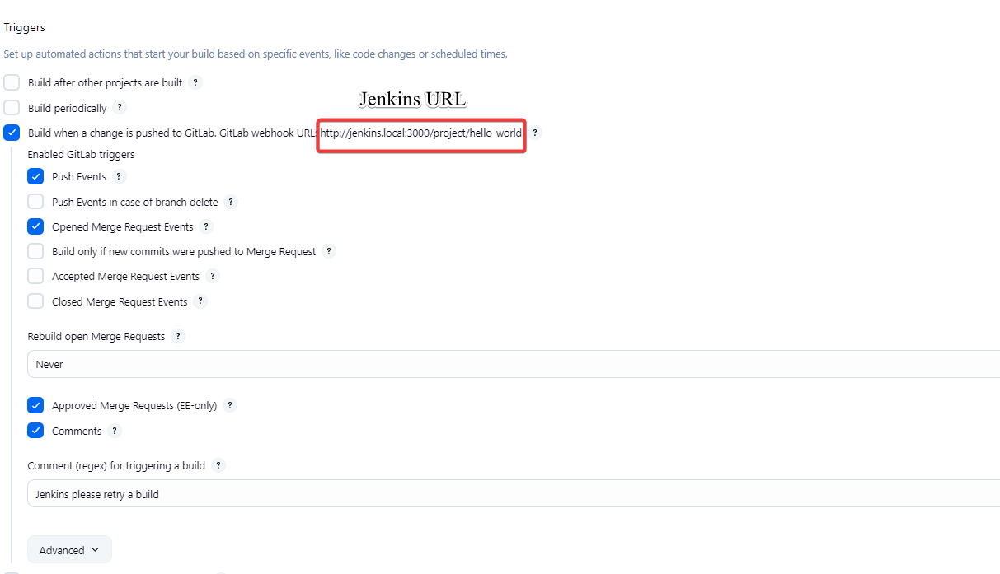
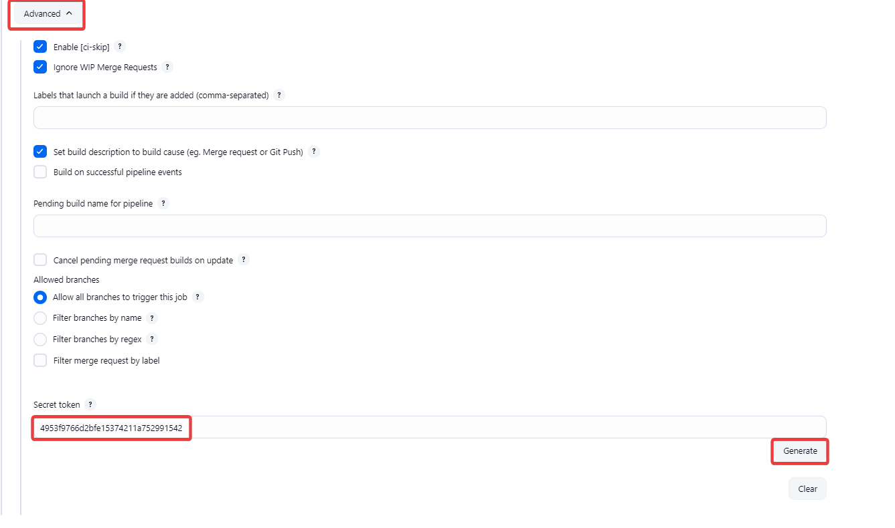
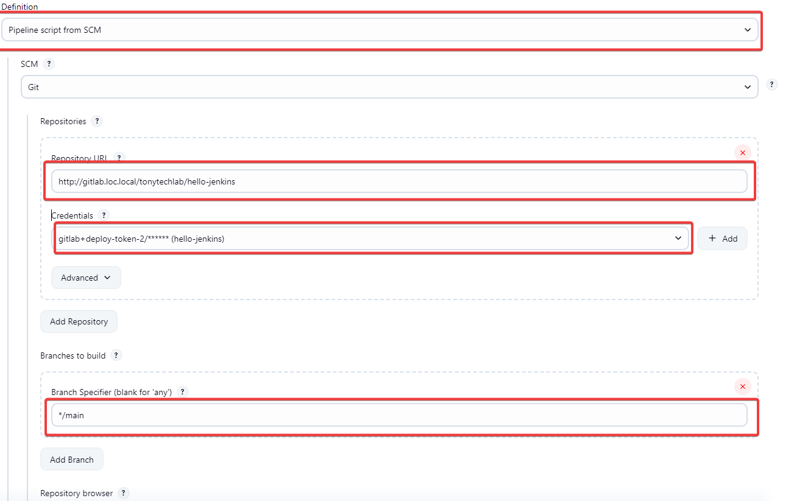
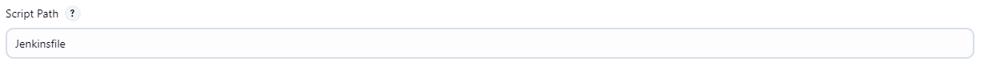
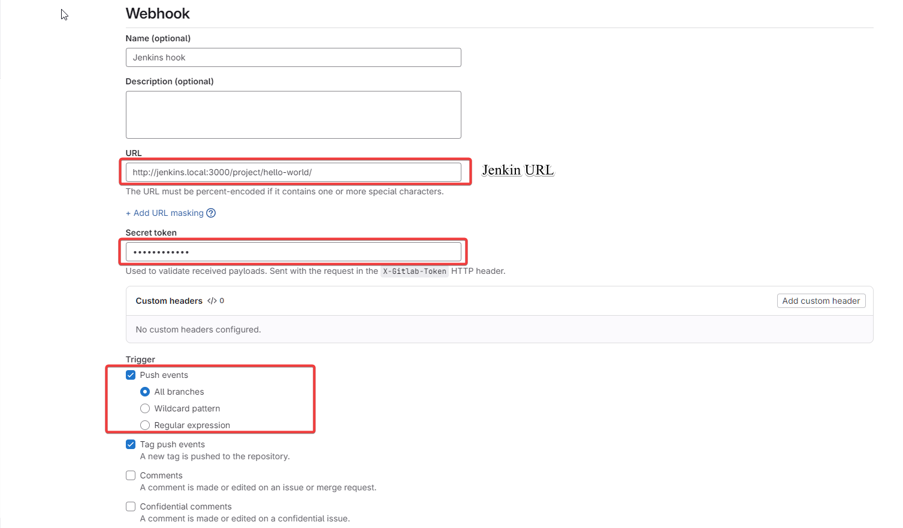

# Notes

# Day 1

1. Cài đặt jenkin với docker
2. Truy cập Jenkin UI
3. Lấy init password
4. Setup Jenkin
5. Install plugin Role-based Authorization Strategy
6. Install gitlab plugin
7. Setting Authorization với role-based trong Security
8. Cấu hình gitlab trong setting
9. Cấu hình role cho user

```bash title="./jenkins/Dockerfile"
FROM jenkins/jenkins:lts
USER root

# install curl, kubectl and docker CLI
RUN apt-get update \
  && apt-get install -y ca-certificates curl apt-transport-https gnupg2 lsb-release docker.io \
  && curl -fsSL "https://dl.k8s.io/release/$(curl -L -s https://dl.k8s.io/release/stable.txt)/bin/linux/amd64/kubectl" -o /usr/local/bin/kubectl \
  && chmod +x /usr/local/bin/kubectl /usr/bin/docker || true \
  && apt-get clean && rm -rf /var/lib/apt/lists/*

USER jenkins
```

```yaml title="./compose.yaml"
services:
  gitlab:
    image: "gitlab/gitlab-ce:latest"
    container_name: gitlab-server
    hostname: "gitlab.loc.local"
    extra_hosts:
      - "jenkins.local:host-gateway"
    environment:
      # GITLAB_OMNIBUS_CONFIG: |
      #   external_url 'http://gitlab.local'
      #   gitlab_rails['initial_root_password'] = 'your_strong_password'
      GITLAB_OMNIBUS_CONFIG: |
        external_url 'http://gitlab.loc.local:80'
        gitlab_rails['initial_root_password'] = '4blbGQHaYodvYz'
      GITLAB_ROOT_EMAIL: "npv.loc@gmail.com"
      GITLAB_ROOT_PASSWORD: "4blbGQHaYodvYz"
    ports:
      - "80:80"
      - "443:443"
      - "22:22"
    volumes:
      - "./config:/etc/gitlab"
      - "./logs:/var/log/gitlab"
      - "./data:/var/opt/gitlab"
    shm_size: "256m"
    networks:
      gitlab-net:
        aliases:
          - gitlab.loc.local

  gitlab-runner:
    image: "gitlab/gitlab-runner:alpine"
    container_name: gitlab-runner
    depends_on:
      - gitlab
    restart: always
    volumes:
      # - './runner-config:/etc/gitlab-runner'
      - "/var/run/docker.sock:/var/run/docker.sock"
    networks:
      - gitlab-net

  # Jenkins
  jenkins:
    build:
      context: ./jenkins
    container_name: jenkins
    restart: unless-stopped
    privileged: true
    user: root
    ports:
      - "3000:8080" # Jenkins UI
      - "50000:50000" # Agent communication
    volumes:
      #- /home/nhanjs/.kube:/root/.kube           # mount local kube config
      #- /home/nhanjs/.minikube:/root/.minikube   # mount minikube certs and keys
      - jenkins_home:/var/jenkins_home
      - /var/run/docker.sock:/var/run/docker.sock # Allows Jenkins to run docker commands
    networks:
      - gitlab-net

  jenkins-agent:
    build:
      context: ./jenkins
    container_name: jenkins-agent
    restart: unless-stopped
    privileged: true
    extra_hosts:
      - "jenkins.local:host-gateway"
    environment:
      - JENKINS_URL=http://jenkins:3000
      - JENKINS_AGENT_NAME=docker-agent
      - JENKINS_SECRET=<SECRET>
      - JENKINS_WEB_SOCKET=true
    volumes:
      - /var/run/docker.sock:/var/run/docker.sock
      - /home/jenkins/agent:/home/jenkins/agent
    networks:
      - gitlab-net
volumes:
  jenkins_home:
    name: jenkins_home
networks:
  gitlab-net:
    name: gitlab-net
```

```bash title="get Jenkins init password"
docker exec -it jenkins cat /var/jenkins_home/secrets/initialAdminPassword
```

# Day 2

1. Tạo item trên Jenkins

   - Cấu hình trigger build
     
   - Setup secret key cho webhook
     
   - Cấu hình repo
     
   - Cấu hình Jenkinfiles
     

2. Cấu hình webhook bên project gitlab
   

3. Tạo jenkins file

```text title="Jenkinsfile"
pipeline{
    agent any
    stages{
        stage('Clone stage'){
            steps{
                echo 'Hello world'
            }
        }
    }
}
```
