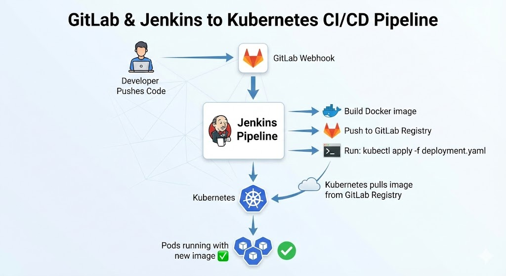

# Upgrade Version: Run with K8s

This guide shows how to deploy applications from Jenkins directly to Kubernetes using `kubectl apply`.

---

## Architecture Overview


**Components:**

- **GCP VM** with Jenkins + GitLab + Nginx (Docker containers)
- **GKE Kubernetes Cluster** (separate)
- **GitLab Registry** (private Docker images)
- **kubectl** in Jenkins to deploy to K8s

---

## Prerequisites

You need:

- GCP VM with Jenkins + GitLab + Nginx running (from previous guide)
- GKE Kubernetes cluster already created
- `kubectl` installed and configured to access GKE
- kubeconfig credentials ready

---

## Step 1: Create Kubernetes Secret for GitLab Registry

Your K8s cluster needs credentials to pull images from GitLab Registry.

### 1.1 Create the Secret in K8s

```bash
kubectl create secret docker-registry gitlab-registry-secret \
  --docker-server=<VM_EXTERNAL_IP>:5380 \
  --docker-username=root \
  --docker-password=<GITLAB_ROOT_PASSWORD> \
  -n default
```

**Example:**

```bash
kubectl create secret docker-registry gitlab-registry-secret \
  --docker-server=34.136.104.61:5380 \
  --docker-username=root \
  --docker-password=MyGitLabPassword123 \
  -n default
```

### 1.2 Verify the Secret

```bash
kubectl get secret gitlab-registry-secret -n default
kubectl describe secret gitlab-registry-secret -n default
```

---

## Step 2: Install kubectl in Jenkins Container

Jenkins needs `kubectl` to deploy to K8s.

### 2.1 Update docker-compose.yml

Modify the Jenkins service to install kubectl:

```yaml
jenkins:
  image: jenkins/jenkins:lts
  container_name: jenkins
  ports:
    - "8080:8080"
    - "50000:50000"
  volumes:
    - jenkins_data:/var/jenkins_home
    - /var/run/docker.sock:/var/run/docker.sock
    - ~/.kube/config:/root/.kube/config:ro # Add this line
  environment:
    - JENKINS_OPTS="--prefix=/jenkins"
  user: root
  restart: always
  networks:
    - devops-network
```

### 2.2 Rebuild Jenkins Container

```bash
docker-compose down
docker-compose up -d jenkins
```

### 2.3 Install kubectl in Jenkins

SSH into the Jenkins container and install kubectl:

```bash
docker exec -it jenkins bash

# Inside container:
curl -LO "https://dl.k8s.io/release/$(curl -L -s https://dl.k8s.io/release/stable.txt)/bin/linux/amd64/kubectl"
chmod +x kubectl
mv kubectl /usr/local/bin/

# Verify
kubectl version --client
```

Or use a Dockerfile to build a custom Jenkins image with kubectl pre-installed.

---

## Step 3: Create Kubernetes Deployment Manifest

Create a `deployment.yaml` file in your GitLab repo:

```yaml
apiVersion: apps/v1
kind: Deployment
metadata:
  name: demo-app
  namespace: default
spec:
  replicas: 2
  selector:
    matchLabels:
      app: demo-app
  template:
    metadata:
      labels:
        app: demo-app
    spec:
      imagePullSecrets:
        - name: gitlab-registry-secret # Reference the K8s secret
      containers:
        - name: demo-app
          image: <VM_EXTERNAL_IP>:5380/root/demo-app:latest
          imagePullPolicy: Always
          ports:
            - containerPort: 3000
          livenessProbe:
            httpGet:
              path: /
              port: 3000
            initialDelaySeconds: 30
            periodSeconds: 10
          readinessProbe:
            httpGet:
              path: /
              port: 3000
            initialDelaySeconds: 10
            periodSeconds: 5
---
apiVersion: v1
kind: Service
metadata:
  name: demo-app-svc
  namespace: default
spec:
  type: LoadBalancer
  selector:
    app: demo-app
  ports:
    - port: 80
      targetPort: 3000
      protocol: TCP
```

**Key points:**

- `imagePullSecrets: - name: gitlab-registry-secret` → tells K8s to use the secret
- `image: <VM_EXTERNAL_IP>:5380/root/demo-app:latest` → pull from GitLab Registry
- `imagePullPolicy: Always` → always pull fresh image on deployment
- `Service` exposes the app via LoadBalancer

Commit this to your GitLab repo.

---

## Step 4: Update Jenkins Pipeline to Deploy to K8s

Modify your Jenkins Jenkinsfile to include kubectl deployment:

```groovy
pipeline {
    agent any

    environment {
        GITLAB_REGISTRY = '34.136.104.61:5380'  // Change to your VM IP
        PROJECT_NAME = 'root'  // GitLab group/user
        IMAGE_NAME = "${GITLAB_REGISTRY}/${PROJECT_NAME}/demo-app"
        IMAGE_TAG = "${BUILD_NUMBER}"
        KUBECONFIG = '/root/.kube/config'  // K8s config path
        KUBE_NAMESPACE = 'default'
    }

    stages {
        stage('Checkout') {
            steps {
                echo "Cloning repository..."
                git credentialsId: 'gitlab-token',
                    url: 'http://gitlab/root/demo-app.git',
                    branch: 'main'
            }
        }

        stage('Build Docker Image') {
            steps {
                echo "Building Docker image..."
                script {
                    sh "docker build -t ${IMAGE_NAME}:${IMAGE_TAG} ."
                    sh "docker tag ${IMAGE_NAME}:${IMAGE_TAG} ${IMAGE_NAME}:latest"
                }
            }
        }

        stage('Push to GitLab Registry') {
            steps {
                echo "Pushing to GitLab Registry..."
                script {
                    withCredentials([usernamePassword(
                        credentialsId: 'gitlab-credentials',
                        usernameVariable: 'USER',
                        passwordVariable: 'PASS'
                    )]) {
                        sh '''
                            echo $PASS | docker login -u $USER --password-stdin ${GITLAB_REGISTRY}
                            docker push ${IMAGE_NAME}:${IMAGE_TAG}
                            docker push ${IMAGE_NAME}:latest
                        '''
                    }
                }
            }
        }

        stage('Update Deployment Manifest') {
            steps {
                echo "Updating deployment image tag..."
                script {
                    sh '''
                        sed -i "s|image: .*/demo-app:.*|image: ${IMAGE_NAME}:${IMAGE_TAG}|g" deployment.yaml
                        cat deployment.yaml
                    '''
                }
            }
        }

        stage('Deploy to Kubernetes') {
            steps {
                echo "Deploying to Kubernetes..."
                script {
                    sh '''
                        kubectl apply -f deployment.yaml --kubeconfig=${KUBECONFIG}
                        kubectl rollout status deployment/demo-app -n ${KUBE_NAMESPACE} --timeout=2m
                    '''
                }
            }
        }

        stage('Verify Deployment') {
            steps {
                echo "Verifying deployment..."
                script {
                    sh '''
                        echo "Pods:"
                        kubectl get pods -n ${KUBE_NAMESPACE} -l app=demo-app
                        echo ""
                        echo "Service:"
                        kubectl get svc -n ${KUBE_NAMESPACE} demo-app-svc
                    '''
                }
            }
        }
    }

    post {
        success {
            echo "✅ Deployment to Kubernetes successful!"
            sh "kubectl get all -n ${KUBE_NAMESPACE} -l app=demo-app"
        }
        failure {
            echo "❌ Deployment failed!"
            sh "kubectl describe deployment demo-app -n ${KUBE_NAMESPACE}"
        }
    }
}
```

**Pipeline stages:**

1. **Checkout** → clone app code from GitLab
2. **Build Docker Image** → build and tag image
3. **Push to GitLab Registry** → push image with build number tag and latest tag
4. **Update Deployment Manifest** → update image tag in deployment.yaml
5. **Deploy to Kubernetes** → run `kubectl apply -f deployment.yaml`
6. **Verify Deployment** → check pods and services

---

## Step 5: Add Jenkins Credentials for GitLab Registry

Jenkins needs credentials to push images to GitLab Registry.

### 5.1 Add Credentials in Jenkins UI

1. Go to **Manage Jenkins → Manage Credentials**
2. Click **Add Credentials**
3. Fill in:
   - **Kind:** `Username with password`
   - **Username:** `root` (GitLab admin user)
   - **Password:** `<GITLAB_ROOT_PASSWORD>`
   - **ID:** `gitlab-credentials`
4. Click **Create**

---

## Step 6: Set Up GitLab Webhook to Trigger Jenkins

### 6.1 Create Jenkins Pipeline Job

1. In Jenkins, click **New Item**
2. Name: `demo-app-pipeline`
3. Type: **Pipeline**
4. In **Build Triggers**, check **Build when a change is pushed to GitLab**
5. In **Pipeline Script**, paste the Jenkinsfile from Step 4
6. Save

### 6.2 Add Webhook in GitLab

1. In GitLab project, go to **Settings → Webhooks**
2. **URL:** `http://jenkins:8080/project/demo-app-pipeline`
3. **Secret Token:** (optional, leave blank for testing)
4. **Trigger:** Check **Push events**
5. Uncheck **Enable SSL verification** (for testing)
6. Click **Add webhook**
7. Click **Test → Push events**

Jenkins should automatically start a build.

---

## Step 7: Test the Complete Pipeline

### 7.1 Clone App Repo and Make Changes

```bash
git clone http://<VM_EXTERNAL_IP>:8081/root/demo-app.git
cd demo-app
```

### 7.2 Add Dockerfile

Create a `Dockerfile`:

```dockerfile
FROM node:16-alpine

WORKDIR /app

COPY package.json package-lock.json ./
RUN npm install

COPY . .

EXPOSE 3000

CMD ["npm", "start"]
```

(Or use any language/framework you prefer)

### 7.3 Commit and Push

```bash
git add Dockerfile deployment.yaml
git commit -m "Add Docker and K8s deployment"
git push origin main
```

### 7.4 Watch Jenkins Build and Deploy

1. Jenkins receives webhook notification
2. Jenkins builds Docker image
3. Jenkins pushes to GitLab Registry
4. Jenkins runs `kubectl apply -f deployment.yaml`
5. K8s pulls image from GitLab Registry
6. Pods start running
7. Service exposes app via LoadBalancer

**Check in K8s:**

```bash
kubectl get pods -n default -l app=demo-app
kubectl get svc -n default demo-app-svc
kubectl logs -n default deployment/demo-app
```

**Get external IP:**

```bash
kubectl get svc demo-app-svc -n default
# Copy the EXTERNAL-IP and open in browser
```

---

## Updating Your App

Every time you push code:

1. **Git push** → GitLab webhook fires
2. **Jenkins builds** new Docker image with `BUILD_NUMBER` tag
3. **Jenkins pushes** to GitLab Registry
4. **Jenkins updates** deployment.yaml with new image tag
5. **Jenkins runs** `kubectl apply -f deployment.yaml`
6. **K8s sees** new image tag
7. **K8s rolls out** new pods automatically
8. **Old pods** gradually replaced (rolling update)

No manual `kubectl` commands needed!

---

## Troubleshooting

### Jenkins can't access GitLab Registry

**Error:** `denied: access denied`

**Fix:**

```bash
# Verify credentials in Jenkins
docker exec jenkins docker login 34.136.104.61:5380
# Enter username: root, password: <GitLab password>

# Should see "Login Succeeded"
```

### K8s can't pull image from GitLab Registry

**Error:** `ImagePullBackOff` or `Failed to pull image`

**Fix:**

```bash
# Verify secret exists
kubectl get secret gitlab-registry-secret -n default

# Verify secret contents
kubectl get secret gitlab-registry-secret -n default -o yaml

# Check if image path is correct
kubectl describe pod <pod-name> -n default
# Look for image pull errors

# Test manual pull
docker pull 34.136.104.61:5380/root/demo-app:latest
```

### Deployment times out

**Error:** `deployment rollout status timeout`

**Fix:**

```bash
# Check pod status
kubectl describe pod <pod-name> -n default

# Check image pull status
kubectl get events -n default --sort-by='.lastTimestamp'

# Check resource limits
kubectl top nodes
kubectl top pods -n default

# Increase timeout in Jenkinsfile if needed
# kubectl rollout status deployment/demo-app -n ${KUBE_NAMESPACE} --timeout=5m
```

### Jenkins doesn't have kubectl access

**Error:** `kubectl command not found` or `kubeconfig not found`

**Fix:**

```bash
# SSH into Jenkins container
docker exec -it jenkins bash

# Check if kubectl is installed
which kubectl

# Check if kubeconfig exists
ls -la ~/.kube/config

# If not, install kubectl again (see Step 2)
```

### Image not updating in K8s

**Problem:** Even after pushing new image, pods still run old image

**Fix:**

```bash
# Set imagePullPolicy to Always in deployment.yaml
imagePullPolicy: Always

# Or manually delete old pods
kubectl delete pod -l app=demo-app -n default

# Or force new rollout
kubectl rollout restart deployment/demo-app -n default
```

---

## Security Notes

1. **GitLab Registry Secret** should be created in each namespace that needs access
2. **KUBECONFIG** mounted as read-only in Jenkins container
3. **Jenkins service account** should have limited RBAC permissions (not cluster-admin)
4. **Credentials stored** in Jenkins credentials store, never hardcoded
5. **Network policies** can restrict traffic between namespaces/pods

---

## Next Steps

To improve this setup:

1. **Add RBAC** → Create Jenkins service account with minimal permissions
2. **Add network policies** → Restrict traffic between pods
3. **Add monitoring** → Prometheus + Grafana to monitor deployments
4. **Add logging** → ELK stack or Google Cloud Logging
5. **Add backup** → Backup K8s configurations and GitLab data
6. **Add multiple environments** → Dev, staging, prod clusters with separate pipelines

---

## Conclusion

You now have a simple, working CI/CD pipeline:

- **Jenkins** builds images and deploys
- **GitLab Registry** stores images
- **Kubernetes** runs the app
