# Quản lý truy cập với IAM và tạo cụm EKS

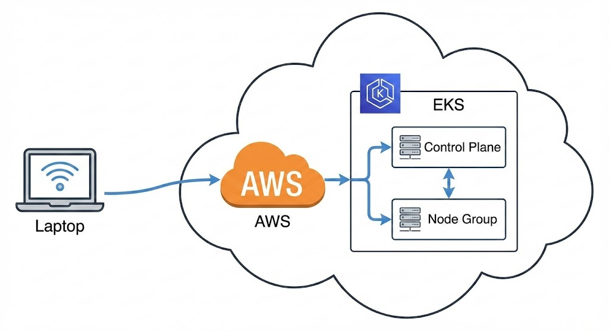

:::note[TLDR;]
Sau khi hoàn thành:

- Đăng nhập được vào AWS bằng IAM user riêng
- Cấu hình xong AWS CLI trên máy
- Cấu hình file Infrastructure as Code (IaC) đầu tiên.
- Tạo được một EKS cluster lab chạy được.
  :::

---

## Bước 1: Tạo IAM user

Sau khi đăng ký tài khoản AWS, phần lớn người mới sẽ có xu hướng dùng luôn tài khoản root <u>(email + password đăng ký ban đầu)</u>. Đây là thói quen cực kỳ xấu trong môi trường production.

**Khuyến nghị:**

- **Root account**: Chỉ cho việc quản trị cấp cao.
- **IAM user**: dùng hằng ngày để thao tác (kể cả lab).

:::tip[Best practice]
Ngay khi đăng nhập lần đầu:

- Bật MFA cho root để bảo vệ tài khoản gốc.
- Tạo IAM user để dùng hàng ngày với phân quyền vừa đủ.
  :::

### Tạo IAM user

- Truy cập `IAM` -> `Users` -> `Create User`
  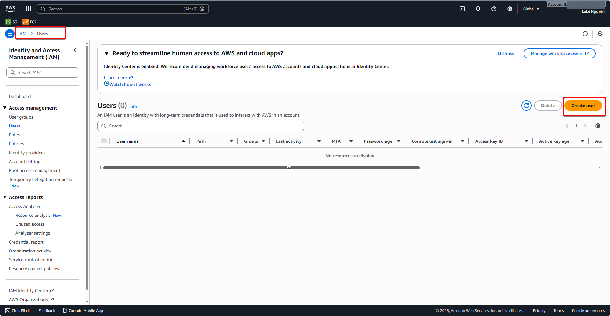

- Cho phép đăng nhập console
  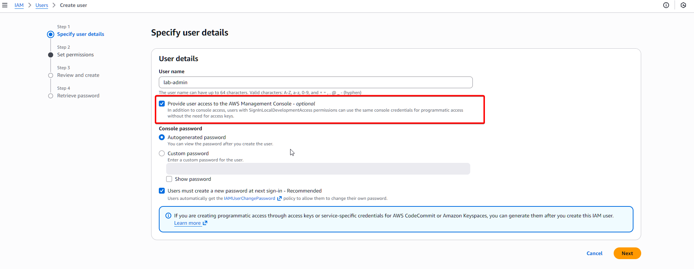

- Gán quyền `AdministratorAccess`
  

:::danger
Trong môi trường thực tế, không nên gán quyền `AdministratorAccess` cho IAM - trừ khi bạn được yêu cầu như vậy
:::

---

## Bước 2: Tạo Access Key và kết nối máy local với AWS

Để dùng AWS qua command line (AWS CLI, eksctl, Terraform, v.v.), ta cần một “chiếc chìa khóa” gồm:

- **Access Key ID**
- **Secret Access Key**

:::note
Chìa khóa này gắn với `IAM user`
:::

Các bước thực hiện:

- Mở IAM → Users → chọn `<your-IAM-user>`, để tạo Access Key sẽ có 2 option như hình
  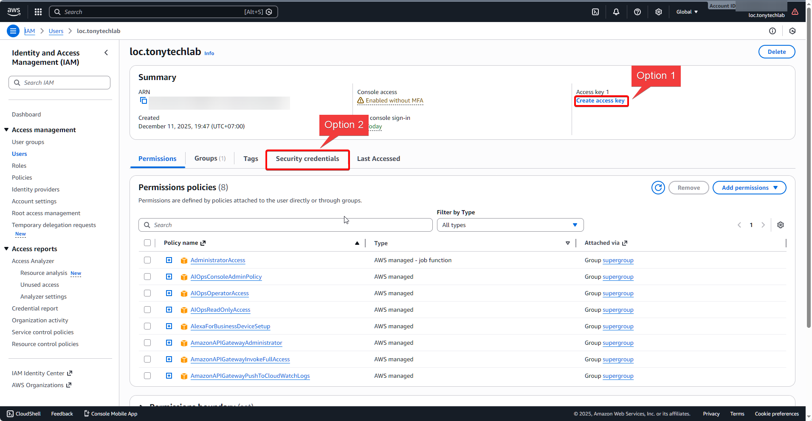

- Chọn `CLI`
  

- Ghi lại **Access Key ID** và **Secret Access Key** vào nơi an toàn.
  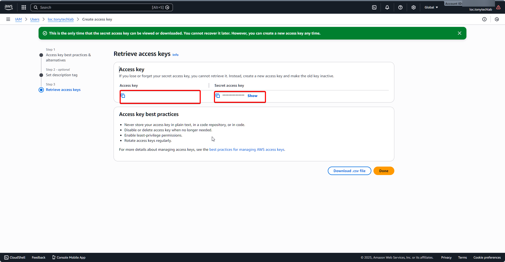
:::danger
- Không commit lên git.
- Không gửi qua chat công khai.
:::

---

## Bước 3: Cài đặt AWS CLI trên máy

Để connect và thao tác với AWS, ta cần phải cài đặt bộ công cụ CLI trên máy:
- AWS CLI v2: để dùng lệnh `aws ...`.
- `kubectl`: để giao tiếp với Kubernetes cluster.
- `eksctl`: để tạo và quản lý EKS cluster bằng lệnh

### Install AWS CLI 2

- Truy cập [link](https://docs.aws.amazon.com/cli/latest/userguide/getting-started-install.html), chọn gói cài phù hợp cho OS
  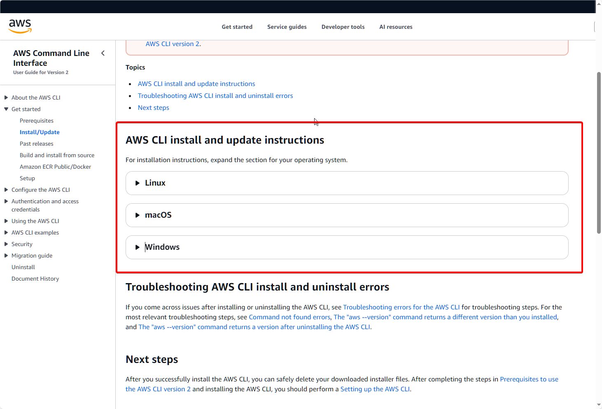

- Tải về và chạy

- Setup `path` cho phù hợp (hoặc để default cũng được)
  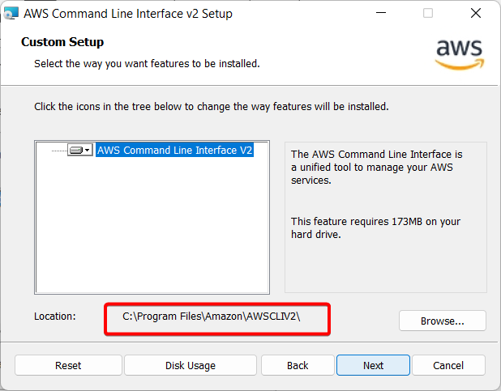

:::tip[Dành cho Window]
Nếu setup custom path, nhớ cài đặt `path` vào **Environments Variables**
:::

### Install `eksctl`

- Truy cập [link](https://github.com/eksctl-io/eksctl/releases) để tải

- Giải nén và copy `eksctl.exe` vào cùng một folder của **AWS CLI v2**

### Kiểm tra

- Chạy `aws --version` để kiểm tra CLI.

  

- Chạy `kubectl version --client` để kiểm tra kubectl.

  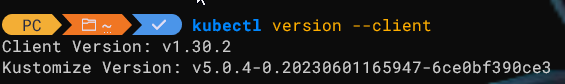

- Chạy `eksctl version` để kiểm tra eksctl.

  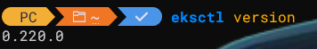

---

## Bước 4: Cấu hình AWS CLI

Bây giờ ta cần cấu hình CLI sử dụng AccessKey và SecrectKey đã tạo để kết nối tới AWS

Chạy câu lệnh:

```bash
aws configure
```

Và nhập:

- AWS Access Key ID
- AWS Secret Access Key
- Default region name: Custom region của bạn
- Default output format: `json`

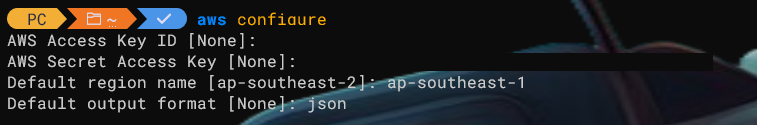

Sau đó, chạy lệnh để test:

```bash
aws sts get-caller-identity
```

Nếu trả về một JSON có Account, Arn là bạn đã kết nối thành công.

:::tip[Nếu gặp lỗi `Error when retrieving token from sso: Token has expired and refresh failed`]

- Thử chạy lệnh `aws sts get-caller-identity --profile default`
- Nếu vẫn không được, truy cập:
  - Window: `%USERPROFILE%\.aws\`
  - Mac/Linux: `~/.aws/`
- Kiểm tra file `credentials` để đảm bảo `access key` và `secret key` đúng
- Kiểm tra file `config`, đảm bảo không có cấu hình `sso_session` hay `sso_start_url` trong profile `default`. Nếu có thì xóa/comment lại
- Chạy lại lệnh `aws sts get-caller-identity`

:::

---

## Bước 5: Cấu hình cho EKS – IAM Role cho control plane và worker

EKS là Kubernetes được AWS quản lý, nên control plane và worker cần quyền để tạo các dịch vụ AWS khác (EC2, VPC, ELB, IAM, EBS,…).

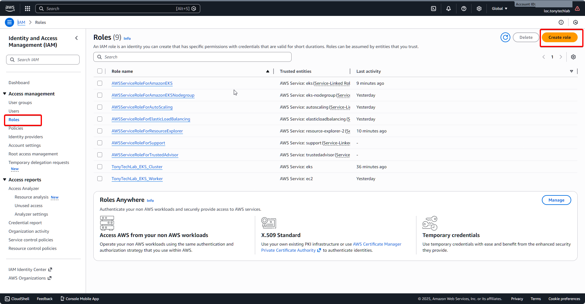

Tạo 2 role:

1. **Role cho EKS control plane (Cluster Role)**

   - Use case: `EKS - Cluster`.
     
   - Policy: `AmazonEKSClusterPolicy`.

2. **Role cho worker node (Node Role)**
   - Service: `EC2`.
     
   - Policies:
     - `AmazonEKSWorkerNodePolicy`
       
     - `AmazonEC2ContainerRegistryReadOnly`
       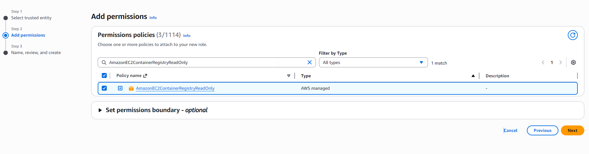
     - `AmazonEKS_CNI_Policy`
       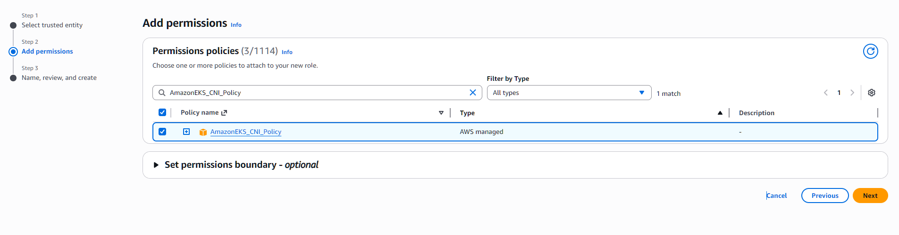

Sau khi tạo, hãy ghi lại ARN của 2 role này để dùng trong file cấu hình cluster.
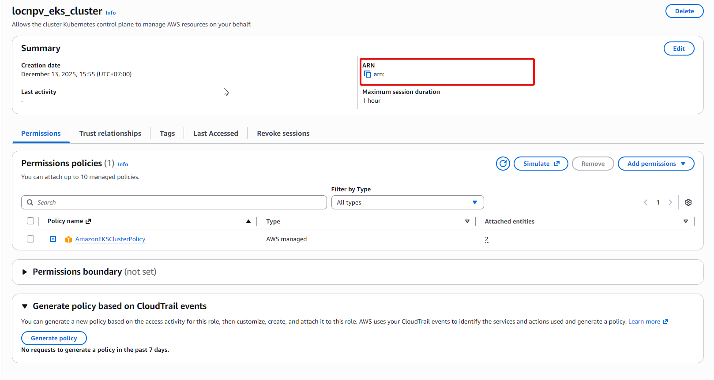
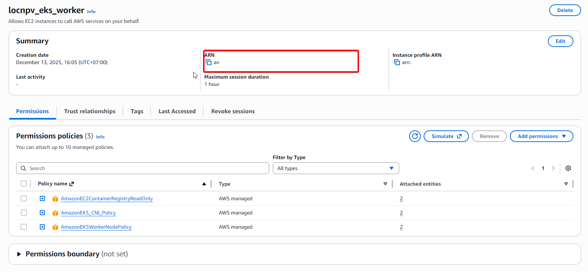

---

## Bước 6: Tạo key pair EC2

Để sau này có thể SSH vào worker node (debug, kiểm tra cấu hình), ta cần tạo key pair:

- EC2 → Key Pairs → Create key pair.
  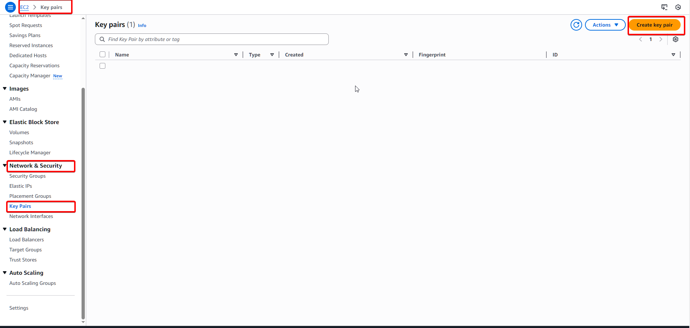
- Name: `<your-key-name>`.
- Key pair type: RSA.
- Private key file format: `.pem`.
  
- Lưu file `.pem` trên máy.

:::danger
Tuyệt đối không chia sẻ key này với ai
:::

---

## Bước 7: Viết file cấu hình EKS với eksctl

Tạo file `lab-cluster.yaml` với nội dung như sau:

- **apiVersion:** eksctl.io/v1alpha5
- **kind:** ClusterConfig
- **metadata**:

  - `name`: tên cluster (ví dụ `lab-eks-cluster`).
  - `region`: `ap-southeast-1`.
  - `version`: version Kubernetes.

- **vpc**:

  - `nat.gateway: Disable` để tiết kiệm chi phí (lab only).
  - `clusterEndpoints.publicAccess: true`, `privateAccess: false`.

- **iam**:

  - `serviceRoleARN`: ARN role cluster đã tạo.
  - `withOIDC: true`.

- **addons**:

  - `vpc-cni`
  - `coredns`
  - `kube-proxy`
  - `metrics-server`

- **managedNodeGroups**:
  - name: `student-workers`.
  - instanceType: một loại nhỏ/rẻ (ví dụ `t3.small` hoặc `c7i-flex.large`).
  - amiFamily: `Ubuntu2404`.
  - minSize
  - maxSize
  - desiredCapacity.
  - ssh.allow: `true`, ssh.publicKeyName: `<your-key-name>`.
  - iam.instanceRoleARN: ARN role worker.

---

## Bước 8: Tạo cluster

Giờ là lúc tạo cluster bằng lệnh:

1. Mở terminal trong thư mục chứa `lab-cluster.yaml`.
2. Kiểm tra lại:
```bash
   aws sts get-caller-identity
```

3. Chạy (có thể set timeout lớn hơn nếu tài nguyên lớn):

```bash
eksctl create cluster -f lab-cluster.yaml --timeout=40m
```
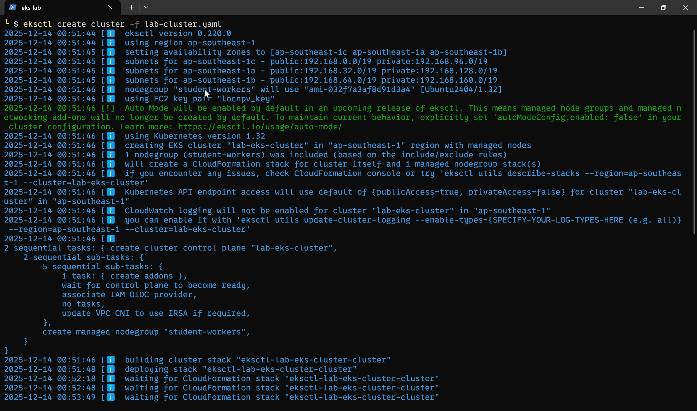

4. Đợi khoảng 15–20 phút. Bạn sẽ thấy log như:

   - tạo CloudFormation stack
   - tạo VPC
   - tạo nodegroup
   - tạo addons
   - cluster ready
  
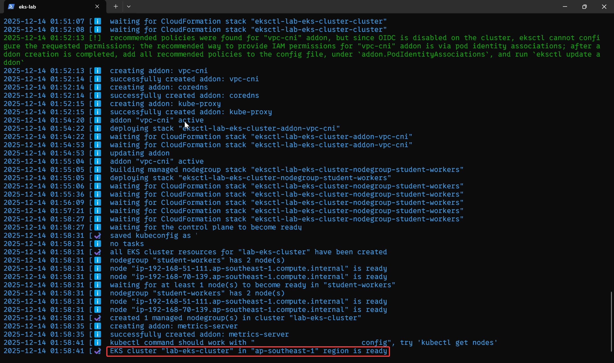

5. Khi lệnh hoàn tất, chạy:

   ```bash
   kubectl get nodes
   ```

Nếu bạn thấy một hoặc vài dòng node với STATUS = `Ready`, nghĩa là bạn đã tạo thành công cụm EKS đầu tiên của mình.
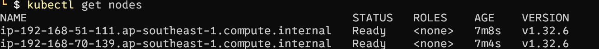

:::tip[Nếu CLI hiển thị lỗi]
- Kiểm tra xem có phải `exceeded max wait time for StackCreateComplete waiter` -> nâng thời gian timeout lên

- Truy cập vào `AWS` -> `CloudFormation` -> `Stacks` -> `<your-cluster-name>`, mở tab `Event` để kiểm tra
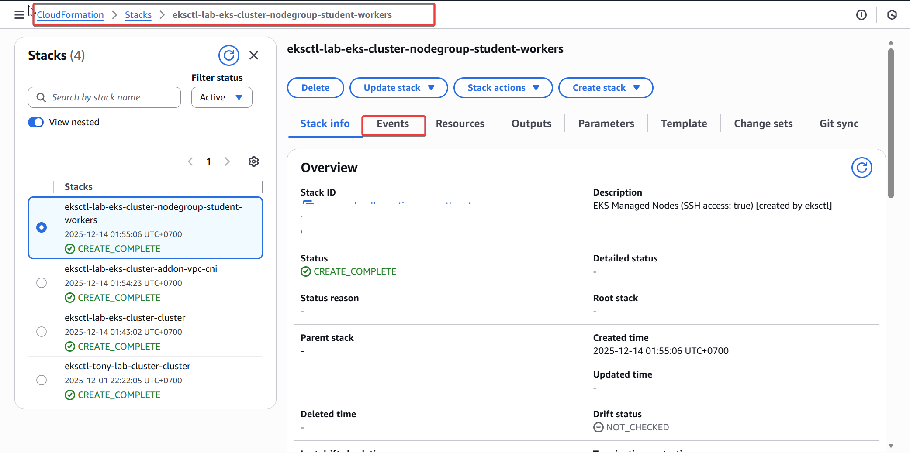

- Nếu trạng thái là:
  - `CREATE_IN_PROGRESS`: AWS vẫn đang cố gắng tạo resource
  - `CREATE_FAILED` / `ROLLBACK_IN_PROGRESS`: Kiểm tra xem báo lỗi gì và sửa

- Chạy câu lệnh xóa resource trước khi chạy lại (BẮT BUỘc)
```bash
eksctl delete cluster -f lab-cluster.yaml
``` 

:::

---

## Xóa tài nguyên

Vì đây là lab và budget giới hạn, đừng quên:

- Khi không cần nữa, xoá cluster:

```bash
  eksctl delete cluster -f lab-cluster.yaml
```

- Thi thoảng vào EC2 Console kiểm tra xem còn instance, load balancer, volume “rác” nào chạy không.
---
