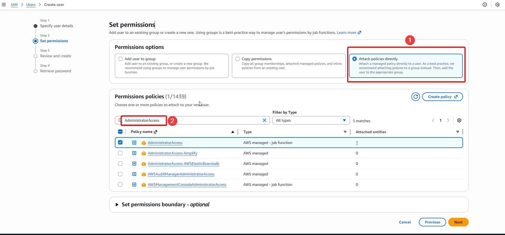
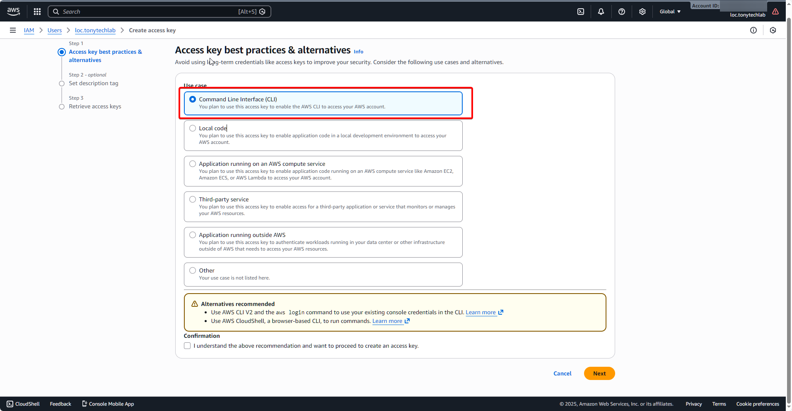
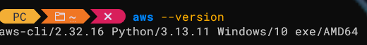
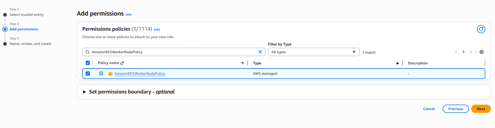
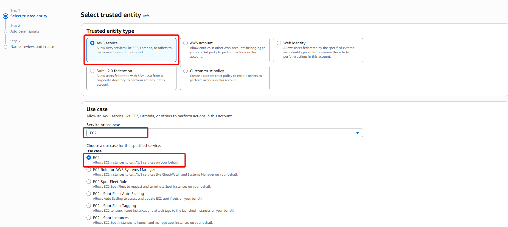

Day 1: Làm quen AWS và tạo cụm EKS đầu tiên (dành cho người mới 100%)

---

## Mở đầu: Vì sao nên bắt đầu với EKS?

Nếu bạn là developer hoặc engineer muốn bước chân vào thế giới cloud, đặc biệt là Kubernetes trên AWS, rất dễ bị “ngợp” bởi quá nhiều dịch vụ và khái niệm mới. Day 1 này được thiết kế cho đúng đối tượng “chưa biết gì về AWS”, giúp bạn đi trọn một vòng: từ tạo tài khoản, chuẩn bị môi trường, đến việc nhìn thấy cụm EKS đầu tiên với lệnh `kubectl get nodes`.

Mục tiêu cuối bài: bạn đăng nhập được vào AWS bằng IAM user riêng, cấu hình xong AWS CLI trên máy, và tạo được một EKS cluster lab chạy được.


---

## Bước 1: Tạo tài khoản và user riêng để không “chơi” bằng root

Sau khi đăng ký tài khoản AWS, phần lớn người mới sẽ có xu hướng dùng luôn tài khoản root (email + password đăng ký ban đầu). Đây là thói quen cực kỳ xấu trong môi trường production, nhưng ngay từ lab bạn cũng nên tập tư duy đúng.

Ý tưởng chuẩn:

- Tài khoản root: dùng rất ít, chỉ cho việc quản trị cấp cao.
- Tài khoản IAM user: dùng hằng ngày để thao tác (kể cả lab).

Ngay khi đăng nhập lần đầu:

- Bật MFA cho root để bảo vệ tài khoản gốc.

### Tạo IAM user

- Truy cập `IAM` -> `Users` -> `Create User`
  

- Cho phép đăng nhập console
  

- Gán quyền `AdministratorAccess`
  

:::danger
Trong môi trường thực tế, không nên gán quyền `AdministratorAccess` cho IAM - trừ khi bạn được yêu cầu như vậy
:::

---

## Bước 2: Tạo Access Key và kết nối máy của bạn với AWS

Để dùng AWS qua command line (AWS CLI, eksctl, Terraform, v.v.), bạn cần một “chiếc chìa khóa” gồm:

- Access Key ID
- Secret Access Key

Chìa khóa này gắn với IAM user `lab-admin`, và máy cá nhân sẽ dùng nó để “tự giới thiệu” với AWS.

Tư duy:

- Máy ngoài AWS → cần Access Key.
- Máy trong AWS (EC2, Lambda) → ưu tiên IAM Role, không hard-code Access Key.

Quy trình:

- Mở IAM → Users → chọn `lab-admin`, để tạo Access Key sẽ có 2 option như hình
  

- Chọn `CLI`
  

- Ghi lại Access Key ID và Secret Access Key vào nơi an toàn, không commit lên git, không gửi qua chat công khai.
  

---

## Bước 3: Chuẩn bị công cụ trên máy – AWS CLI, kubectl, eksctl

Giờ bạn biến máy cá nhân thành “trạm điều khiển” cho AWS:

- AWS CLI v2: để dùng lệnh `aws ...`.
- `kubectl`: để giao tiếp với Kubernetes cluster.
- `eksctl`: để tạo và quản lý EKS cluster bằng lệnh, thay vì click tay.

### Install AWS CLI 2

- Truy cập [link](https://docs.aws.amazon.com/cli/latest/userguide/getting-started-install.html), chọn gói cài phù hợp cho OS
  

- Tải về và chạy

- Setup `path` cho phù hợp (hoặc để default cũng được)
  

:::tip[Dành cho Window]
Nếu setup custom path, nhớ cài đặt `path` vào **Environments Variables**
:::

### Install `eksctl`

- Truy cập [link](https://github.com/eksctl-io/eksctl/releases) để tải

- Giải nén và copy `eksctl.exe` vào cùng một folder của **AWS CLI v2**

### Kiểm tra

- Chạy `aws --version` để kiểm tra CLI.

  

- Chạy `kubectl version --client` để kiểm tra kubectl.

  

- Chạy `eksctl version` để kiểm tra eksctl.

  

---

## Bước 4: Cấu hình AWS CLI – để lệnh của bạn “biết” đang là ai

AWS CLI hiện tại mới chỉ là “cái vỏ”. Bạn cần:

- Gắn nó với IAM user `lab-admin` thông qua Access Key.
- Chọn region mặc định (lab dùng `ap-southeast-1`).
- Chọn định dạng output (json).

Chỉ cần lệnh:

```bash
aws configure
```

Và nhập:

- AWS Access Key ID
- AWS Secret Access Key
- Default region name: Custom region của bạn
- Default output format: `json`

Sau đó, test:

```bash
aws sts get-caller-identity
```

Nếu trả về một JSON có Account, Arn là bạn đã kết nối thành công.


:::tip[Nếu gặp lỗi `Error when retrieving token from sso: Token has expired and refresh failed`]

- Thử chạy lệnh `aws sts get-caller-identity --profile default`
- Nếu vẫn không được, truy cập:
  - Window: `%USERPROFILE%\.aws\`
  - Mac/Linux: `~/.aws/`
- Kiểm tra file `credentials` để đảm bảo `access key` và `secret key` đúng
- Kiểm tra file `config`, đảm bảo không có cấu hình `sso_session` hay `sso_start_url` trong profile `default`. Nếu có thì xóa/comment lại
- Chạy lại lệnh `aws sts get-caller-identity`

:::

---

## Bước 5: Thiết kế quyền cho EKS – IAM Role cho control plane và worker

EKS là Kubernetes được AWS quản lý, nên control plane và worker cần quyền để “gọi” các dịch vụ AWS khác (EC2, VPC, ELB, IAM, EBS,…).

Bạn sẽ tạo 2 role:

1. **Role cho EKS control plane (Cluster Role)**

   - Use case: “EKS - Cluster”.
   - Policy: `AmazonEKSClusterPolicy`.

2. **Role cho worker node (Node Role)**
   - Service: EC2.
   - Policies:
     - `AmazonEKSWorkerNodePolicy`
       
     - `AmazonEC2ContainerRegistryReadOnly`
       
     - `AmazonEKS_CNI_Policy`
       

Sau khi tạo, hãy ghi lại ARN của 2 role này để dùng trong file cấu hình cluster.





---

## Bước 6: Tạo key pair EC2 – “chìa khóa SSH” vào node

Để sau này có thể SSH vào worker node (debug, kiểm tra cấu hình), bạn nên tạo key pair:

- EC2 → Key Pairs → Create key pair.
- Name: `lab-key`.
- Key pair type: RSA.
- Private key file format: `.pem`.
- Lưu file `.pem` trên máy (không chia sẻ).

Key pair này sẽ được tham chiếu trong phần cấu hình node group của EKS.


---

## Bước 7: Viết file cấu hình EKS với eksctl

Thay vì click tay từng bước, bạn mô tả cluster bằng YAML (hạ tầng-as-code). Ví dụ file `lab-cluster.yaml` được tổ chức như sau:

- **metadata**:

  - `name`: tên cluster (ví dụ `lab-eks-cluster`).
  - `region`: `ap-southeast-1`.
  - `version`: version Kubernetes.

- **vpc**:

  - `nat.gateway: Disable` để tiết kiệm chi phí (lab only).
  - `clusterEndpoints.publicAccess: true`, `privateAccess: false`.

- **iam**:

  - `serviceRoleARN`: ARN role cluster đã tạo.
  - `withOIDC: true`.

- **addons**:

  - `vpc-cni`, `coredns`, `kube-proxy`, `metrics-server`.

- **managedNodeGroups**:
  - name: `student-workers`.
  - instanceType: một loại nhỏ/rẻ (ví dụ `t3.medium` hoặc `c7i-flex.large`).
  - amiFamily: `Ubuntu2404`.
  - minSize, maxSize, desiredCapacity.
  - ssh.allow: `true`, ssh.publicKeyName: `lab-key`.
  - iam.instanceRoleARN: ARN role worker.

> Gợi ý hình:
>
> - Hình 13: Screenshot VS Code/IDE với file `lab-cluster.yaml`, highlight/box đỏ:
>   - ARN role cluster
>   - ARN role worker
>   - tên key pair
>   - dòng `nat.gateway: Disable` kèm comment “LAB ONLY”.

---

## Bước 8: Tạo cluster – khoảnh khắc “kubectl get nodes”

Giờ là lúc thực sự “bật” cluster:

1. Mở terminal trong thư mục chứa `lab-cluster.yaml`.
2. Kiểm tra lại:

   ```bash
   aws sts get-caller-identity
   ```

3. Chạy:

   ```bash
   eksctl create cluster -f lab-cluster.yaml
   ```

4. Đợi khoảng 15–20 phút. Bạn sẽ thấy log như:

   - tạo CloudFormation stack
   - tạo VPC
   - tạo nodegroup
   - tạo addons
   - cluster ready

5. Khi lệnh hoàn tất, chạy:

   ```bash
   kubectl get nodes
   ```

Nếu bạn thấy một hoặc vài dòng node với STATUS = `Ready`, nghĩa là bạn đã tạo thành công cụm EKS đầu tiên của mình.

> Gợi ý hình:
>
> - Hình 14: Terminal hiển thị log `eksctl create cluster -f lab-cluster.yaml` (đang tạo stack, nodegroup, addons,…).
> - Hình 15: Terminal với `kubectl get nodes` và 1–2 node `Ready`.

---

## Kết thúc Day 1: Tập thói quen “bật lên rồi tắt”

Vì đây là lab và budget giới hạn, đừng quên:

- Khi không học nữa, xoá cluster:

  ```bash
  eksctl delete cluster -f lab-cluster.yaml
  ```

- Thi thoảng vào EC2 Console kiểm tra xem còn instance, load balancer, volume “rác” nào chạy không.

Thành quả Day 1:

- Bạn đã biết cách dùng IAM user thay vì root.
- Máy local có thể nói chuyện với AWS qua AWS CLI.
- Bạn hiểu cơ bản IAM Role cho EKS control plane và worker.
- Bạn viết được file yaml để mô tả cluster.
- Bạn thấy được node EKS thật sự đang chạy.

---
