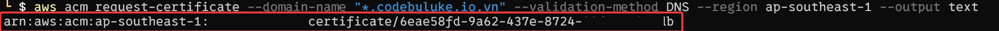
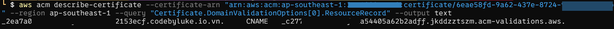
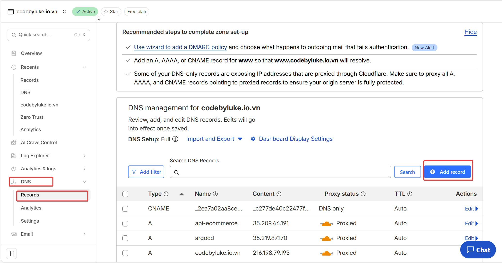
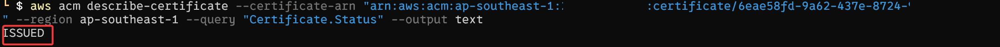
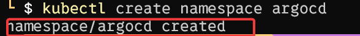
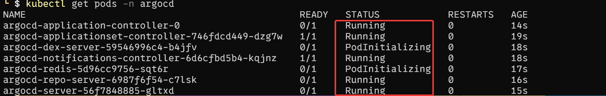
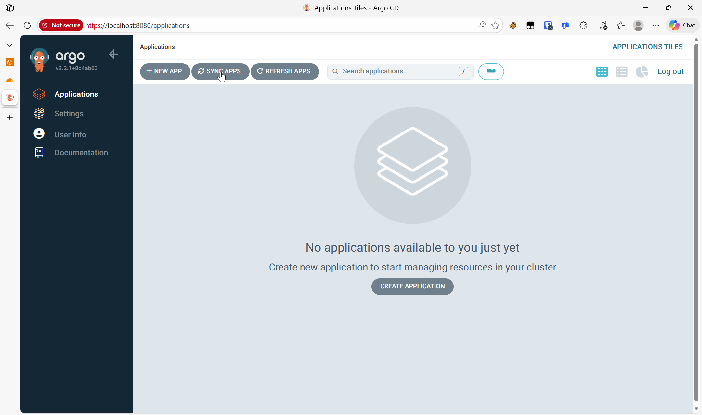

# Day 2: Thiết lập TLS và DNS với ACM + Cloudflare

Sau khi hoàn thành Day 1 (EKS cluster chạy), Day 2 tập trung vào một lớp quan trọng: **TLS/HTTPS và DNS**. Bây giờ bạn sẽ tạo một wildcard certificate và kết nối với domain name để mọi thứ vào ra đều an toàn qua HTTPS.

***

## Mục tiêu của Day 2

1. **Tạo chứng chỉ SSL/TLS wildcard** bằng AWS ACM (miễn phí, tự động renew).
2. **Xác thực ownership của domain** thông qua DNS (CNAME).
3. **Cấu hình DNS** trên Cloudflare để trỏ tới các Load Balancer AWS (chuẩn bị cho Day 3-4).
4. **Cài đặt ArgoCD** - "trái tim" của hệ thống GitOps.

Kết quả: Bạn sẽ có một wildcard certificate (ví dụ `*.yourdomain.com`) sẵn sàng để gắn vào ALB và NLB, cùng với ArgoCD chạy trên cluster.

***

## Phần 1: Chuẩn bị

### Yêu cầu

- EKS cluster đã chạy.
- AWS CLI đã configure đúng.
- Một domain name (ví dụ: `yourdomain.com`).
- Domain này quản lý DNS qua **Cloudflare** (hoặc NS của bạn trỏ tới Cloudflare).

### Tại sao Cloudflare?

Cloudflare miễn phí, nhanh, và dễ bắt tay với AWS ACM để xác thực DNS. Nếu bạn dùng Route53 thay vì Cloudflare, quy trình tương tự nhưng bạn không cần copy CNAME, AWS sẽ tự làm.

***

## Phần 2: Tạo Wildcard Certificate bằng AWS ACM

### Bước 1: Gửi yêu cầu certificate

Mở CMD/Terminal và chạy lệnh sau (thay `yourdomain.com` bằng domain thật của bạn):

```bash
aws acm request-certificate \
  --domain-name "*.yourdomain.com" \
  --validation-method DNS \
  --region ap-southeast-1 \
  --output text
```
**Giải thích:**
- `--domain-name "*.yourdomain.com"`: Yêu cầu wildcard cert (dùng cho mọi subdomain).
- `--validation-method DNS`: Xác thực qua DNS thay vì email (nhanh hơn, chuẩn AWS).
- `--region ap-southeast-1`: Tạo cert ở region Singapore (nơi cluster chạy).
- `--output text`: Hiển thị kết quả dạng text dễ đọc.

**Kết quả:** AWS sẽ trả về một **ARN** (Amazon Resource Name) của certificate, ví dụ:
```
arn:aws:acm:ap-southeast-1:241688915712:certificate/abc12345-def6-7890-ghij-klmnopqrstuv
```

**Lưu lại ARN này** (bạn sẽ dùng nó ở Day 3-4).



***

### Bước 2: Lấy thông tin CNAME xác thực

AWS tạo ra certificate nhưng nó ở trạng thái **PENDING_VALIDATION** (chờ xác thực). Bạn cần cấp một CNAME record trên DNS của domain để AWS biết bạn thực sự sở hữu domain.

Chạy lệnh sau (thay ARN bằng ARN vừa nhận):

```bash
aws acm describe-certificate \
  --certificate-arn "arn:aws:acm:ap-southeast-1:241688915712:certificate/abc12345-def6-7890-ghij-klmnopqrstuv" \
  --region ap-southeast-1 \
  --query "Certificate.DomainValidationOptions[0].ResourceRecord" \
  --output text
```
**Kết quả:** Bạn sẽ thấy một dòng chứa 3 phần quan trọng:
```
Name: _xyz123abc.yourdomain.com.
Type: CNAME
Value: _validate123def.acm-validations.aws.
```

**Copy 2 phần:** `Name` (CNAME record name) và `Value` (CNAME record value).


***

## Phần 3: Cấu hình DNS trên Cloudflare

### Bước 1: Đăng nhập Cloudflare

1. Truy cập [link](https://dash.cloudflare.com).
2. Chọn domain của bạn.
3. Trong menu bên trái, chọn **DNS** -> **Records**.

### Bước 2: Thêm CNAME record xác thực

Bấm nút **Add record** và nhập:
- **Type:** CNAME
- **Name:** `_xyz123abc` (phần trước `.yourdomain.com.` từ lệnh trên)
- **Target (Content):** `_validate123def.acm-validations.aws.` (phần Value từ lệnh trên)
- **Proxy status:** Gray cloud (DNS only, không cache)
- **TTL:** Auto

Bấm **Save**.

**Lưu ý:** Cloudflare có thể tự động thêm `.yourdomain.com` vào Name nếu bạn nhập gọn. Chỉ cần nhập phần subdomain (`_xyz123abc`).


***

## Phần 4: Xác nhận certificate

Sau khi cấu hình CNAME trên Cloudflare (mất 1-2 phút để DNS lan truyền), chạy lệnh kiểm tra trạng thái:

```bash
aws acm describe-certificate \
  --certificate-arn "arn:aws:acm:ap-southeast-1:241688915712:certificate/abc12345-def6-7890-ghij-klmnopqrstuv" \
  --region ap-southeast-1 \
  --query "Certificate.Status" \
  --output text
```

**Trạng thái có thể là:**
- `PENDING_VALIDATION`: Vẫn chờ xác thực. Hãy chờ 1-2 phút nữa rồi chạy lại.
- `ISSUED`: ✅ Xong! Certificate đã được cấp.


***

## Phần 5: Lưu lại thông tin quan trọng

Tạo một file `day2-notes.txt` hoặc lưu vào Keypass với những thông tin sau:

```
=== DAY 2 - ACM & Cloudflare ===

Domain: yourdomain.com
Wildcard Domain: *.yourdomain.com

Certificate ARN: arn:aws:acm:ap-southeast-1:241688915712:certificate/abc12345-def6-7890-ghij-klmnopqrstuv
Certificate Status: ISSUED

CNAME Record (Cloudflare):
- Name: _xyz123abc.yourdomain.com
- Type: CNAME
- Value: _validate123def.acm-validations.aws.

Sử dụng:
- Day 3: Gắn ARN này vào Ingress của ArgoCD (ALB)
- Day 4: Gắn ARN này vào Ingress của App (NLB)
```

***

## Phần 6: Cài đặt ArgoCD lên EKS

Sau khi có certificate, bước tiếp theo là cài đặt "trái tim" của hệ thống GitOps: **ArgoCD**.

### Bước 1: Tạo namespace
ArgoCD nên chạy trong namespace riêng biệt để dễ quản lý.
```bash
kubectl create namespace argocd
```


### Bước 2: Apply manifest cài đặt
Chúng ta sẽ dùng manifest cài đặt chuẩn từ repo chính thức của Argo Project. Với Lab, bản Non-HA là đủ nhẹ.

```bash
kubectl apply -n argocd -f https://raw.githubusercontent.com/argoproj/argo-cd/stable/manifests/install.yaml
```

### Bước 3: Kiểm tra trạng thái Pods
Chờ khoảng 1-2 phút để các pod khởi động.
```bash
kubectl get pods -n argocd
```
Bạn cần thấy tất cả các pod (argocd-server, argocd-repo-server, argocd-application-controller...) đều ở trạng thái `Running` hoặc `Completed`.



***

## Phần 7: Cài đặt ArgoCD CLI (trên máy local của bạn)

ArgoCD CLI giúp bạn quản lý app, cluster từ dòng lệnh, rất tiện lợi sau này.

### Với Windows (Dùng Chocolatey hoặc tải trực tiếp)
**Cách 1: Chocolatey (Khuyên dùng)**
```powershell
choco install argocd-cli
```

**Cách 2: Tải file exe**
1.  Vào [GitHub Releases](https://github.com/argoproj/argo-cd/releases/latest).
2.  Tải file 
3.  Đổi tên thành `argocd.exe` và bỏ vào thư mục đã cài AWS CLI.

### Với Mac/Linux
```bash
brew install argocd
```

***

## Phần 8: Đăng nhập lần đầu & Đổi mật khẩu

### Bước 1: Lấy mật khẩu admin mặc định
Mật khẩu mặc định của tài khoản `admin` được lưu trong một Secret tên là `argocd-initial-admin-secret`.

**Lệnh lấy mật khẩu (Windows PowerShell):**
```powershell
kubectl -n argocd get secret argocd-initial-admin-secret -o jsonpath="{.data.password}" | ForEach-Object { [System.Text.Encoding]::UTF8.GetString([System.Convert]::FromBase64String($_)) }
```

**Lệnh lấy mật khẩu (Mac/Linux/Git Bash):**
```bash
kubectl -n argocd get secret argocd-initial-admin-secret -o jsonpath="{.data.password}" | base64 -d
```

Copy chuỗi ký tự nhận được. Đó là mật khẩu.

### Bước 2: Truy cập tạm thời bằng Port-Forwarding
Vì chúng ta chưa setup ALB Ingress (đó là việc của Day 3), nên giờ phải "đi cửa sau" để vào UI.

```bash
kubectl port-forward svc/argocd-server -n argocd 8080:443
```
*(Giữ nguyên cửa sổ terminal này, đừng tắt)*.

### Bước 3: Đăng nhập trên trình duyệt
1.  Mở trình duyệt: `https://localhost:8080`
2.  Trình duyệt sẽ cảnh báo **"Your connection is not private"** (vì certificate tự ký của ArgoCD). → Bấm **Advanced** -> **Proceed to localhost (unsafe)**.
3.  **Username:** `admin`
4.  **Password:** (Chuỗi vừa copy ở trên).


### Bước 4: Đổi mật khẩu (Optional nhưng nên làm)
Sau khi login, vào **User Info** -> **Update Password** để đổi sang cái gì đó dễ nhớ hơn cho lab.

***

## Phần 9: Cấu hình quan trọng cho Day 3 (ALB)

Để Day 3 (cài ALB Ingress) chạy mượt mà, chúng ta cần tắt chế độ TLS/HTTPS nội bộ của ArgoCD Server. Lý do:
*   ALB sẽ lo phần HTTPS (Termination) ở ngoài.
*   ALB nói chuyện với ArgoCD Pod bằng HTTP thường (cho nhẹ và đỡ phức tạp cert).

### Bước 1: Patch cấu hình ArgoCD Server thành --insecure
Mở một terminal mới (terminal cũ đang chạy port-forward), chạy lệnh sau:

```bash
kubectl edit configmap argocd-cmd-params-cm -n argocd
```
Nó sẽ mở ra trình soạn thảo (vi hoặc notepad). Bạn hãy sửa nội dung thành như sau:
```yaml
apiVersion: v1
kind: ConfigMap
metadata:
  # ... (giữ nguyên các dòng metadata ở trên) ...
  uid: eb88c939-d7b1-47c1-b5a4-7bc2a16412cf
# --- THÊM PHẦN NÀY VÀO CUỐI CÙNG ---
data:
  server.insecure: "true"

```
- Thoát ra và restart lại pod 
``` bash
kubectl rollout restart deployment/argocd-server -n argocd
```
### Tại sao cần bước này?
Nếu không có cờ `--insecure`, khi bạn setup ALB ở Day 3, bạn sẽ gặp lỗi **"Login Loop"** hoặc **"Redirect Loop"** (đăng nhập xong lại bị đá ra trang login liên tục). Đây là bước chuẩn bị cực kỳ quan trọng.

***

## Tóm tắt Day 2

**Bạn đã:**
1.  ✅ Request wildcard certificate `*.yourdomain.com` bằng AWS ACM.
2.  ✅ Validate domain qua DNS CNAME trên Cloudflare.
3.  ✅ Lưu lại ARN certificate để dùng cho Day 3-4.
4.  ✅ Cài ArgoCD vào namespace `argocd` trên cluster.
5.  ✅ Lấy được password admin và login thử qua Port-Forward.
6.  ✅ Cấu hình ArgoCD chạy mode `--insecure` để sẵn sàng đón nhận ALB ở Day 3.

**Next:** Day 3 sẽ cài **AWS Load Balancer Controller** và tạo **Ingress** để public ArgoCD ra internet bằng domain thật (`argocd.yourdomain.com`).

***
