# Day 3: Public ArgoCD qua ALB Ingress Controller

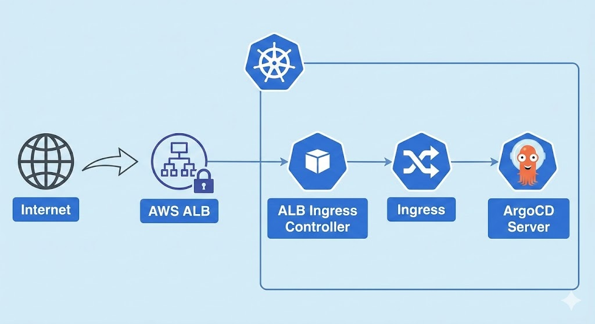

## Mục tiêu của Day 3

1. **Kích hoạt OIDC** để IAM Service Account có thể lấy token tự động (không cần access key).
2. **Cài AWS Load Balancer Controller** bằng Helm (controller này sẽ tự tạo ALB khi bạn tạo Ingress).
3. **Gắn tag cho Public Subnet** (bắt buộc để ALB tìm được subnet).
4. **Tạo Ingress** cho ArgoCD với cấu hình SSL Termination (ALB lo HTTPS, Pod chỉ nhận HTTP).
5. **Cấu hình DNS trên Cloudflare** để trỏ domain tới ALB.

Kết quả: ArgoCD sẽ có thể truy cập qua `https://argocd-aws.yourdomain.com` với certificate ACM tự động.

---

## Phần 1: Kích hoạt OIDC (IAM OIDC Provider)

OIDC cho phép các pod trong cluster có thể xin token từ AWS IAM mà **không cần** lưu Access Key/Secret Key trong cluster (rất an toàn).

### Bước 1: Kích hoạt OIDC Provider

Chạy lệnh sau (thay tên cluster nếu cần):

```bash
eksctl utils associate-iam-oidc-provider \
  --cluster=lab-eks-cluster \
  --region=ap-southeast-1 \
  --approve
```

**Giải thích:**

- `--cluster=lab-eks-cluster`: Tên cluster của bạn.
- `--region=ap-southeast-1`: Region nơi cluster chạy.
- `--approve`: Tự động approve mà không hỏi xác nhận.

**Kết quả:** OIDC Provider được tạo trên AWS. Bạn có thể kiểm tra bằng lệnh:

```bash
eksctl utils describe-addon-versions --cluster lab-eks-cluster --region ap-southeast-1
```

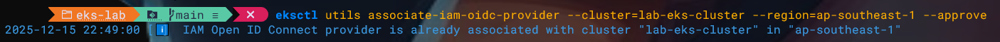

---

## Phần 2: Gắn Tag cho Public Subnet (Bắt buộc)

AWS Load Balancer Controller cần biết **những subnet nào** là Public (để đặt ALB vào đó). Nó tìm kiếm dựa vào **tag**.

### Bước 1: Tìm danh sách Public Subnet

1.  Vào **AWS Console** → **VPC** → **Subnets**.
2.  Tìm những subnet có tên dạng: `eksctl-lab-eks-cluster-clusterSubnetPublic...` (hoặc tương tự).
3.  Bạn cần tìm **3 Public Subnet** (mỗi Availability Zone một cái).
    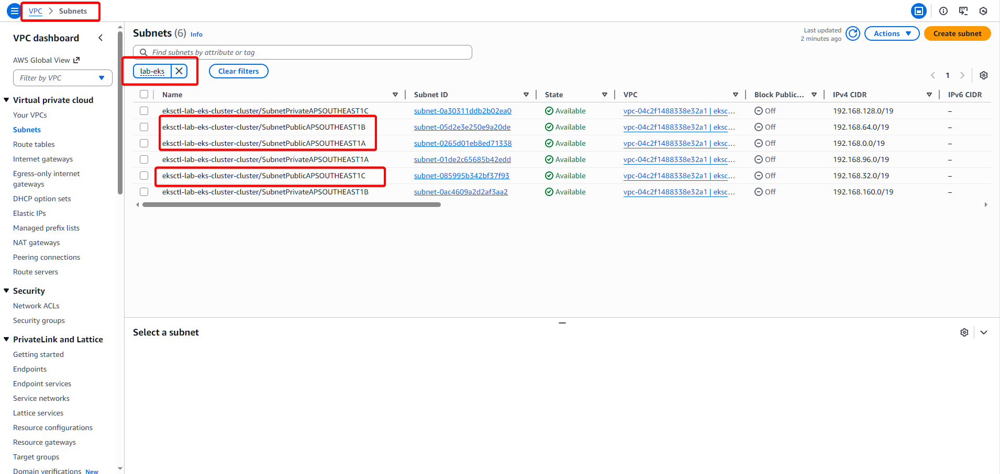

### Bước 2: Gắn Tag vào từng Public Subnet

Đối với mỗi Public Subnet, bạn cần gắn tag sau:

- **Key:** `kubernetes.io/role/elb`
- **Value:** `1`

**Cách làm trên Console:**

1.  Chọn 1 Public Subnet (click vào tên).
2.  Scroll xuống tab **Tags**.
3.  Bấm **Add tag**.
    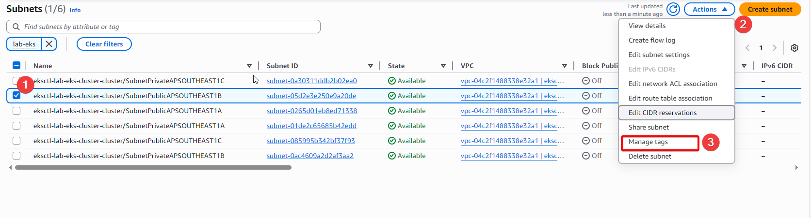
4.  Nhập **Key** = `kubernetes.io/role/elb`, **Value** = `1`.
5.  Bấm **Save**.
6.  Lặp lại cho 2 subnet khác.
    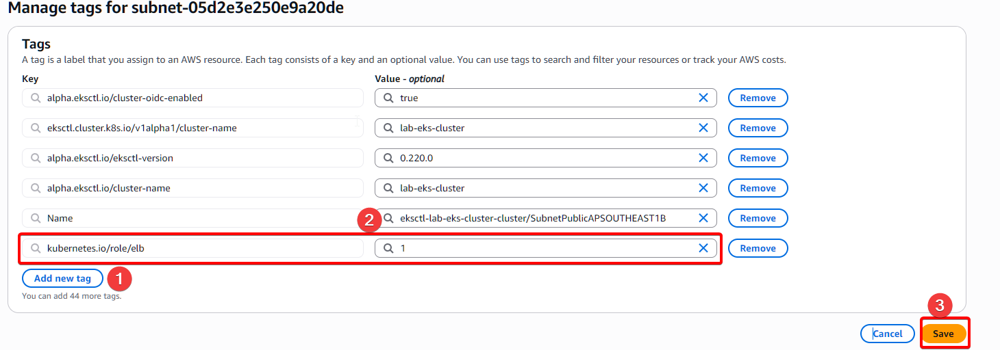

**Hoặc dùng AWS CLI (nhanh hơn):**

```bash
# Tìm subnet IDs
aws ec2 describe-subnets \
  --filters "Name=tag:aws:cloudformation:stack-name,Values=eksctl-lab-eks-cluster-cluster" \
  --region ap-southeast-1 \
  --query "Subnets[?MapPublicIpOnLaunch==true].SubnetId" \
  --output text
```

Nó sẽ in ra list SubnetID của public subnet, ví dụ:

```
subnet-abc123 subnet-def456 subnet-ghi789
```

Sau đó, gắn tag cho từng cái:

```bash
aws ec2 create-tags \
  --resources subnet-abc123 subnet-def456 subnet-ghi789 \
  --tags Key=kubernetes.io/role/elb,Value=1 \
  --region ap-southeast-1
```

---

## Phần 3: Tạo IAM Policy và Service Account cho Load Balancer Controller

AWS Load Balancer Controller cần quyền hạn để tạo/sửa/xóa ALB. Quyền này được cung cấp qua một IAM Policy và IAM Service Account.

### Bước 1: Download IAM Policy mẫu

```bash
curl -O https://raw.githubusercontent.com/kubernetes-sigs/aws-load-balancer-controller/v2.6.0/docs/install/iam_policy.json
```

_Nó sẽ tải file `iam_policy.json` vào thư mục hiện tại._

### Bước 2: Tạo IAM Policy từ file đó

```bash
aws iam create-policy \
  --policy-name AWSLoadBalancerControllerIAMPolicy \
  --policy-document file://iam_policy.json \
  --region ap-southeast-1
```

**Kết quả:** Bạn sẽ nhận một ARN, ví dụ:

```
arn:aws:iam::241688915712:policy/AWSLoadBalancerControllerIAMPolicy
```

**Lưu lại ARN này** (dùng ở bước tiếp).

### Bước 3: Tạo IAM Service Account

IAM Service Account là "người dùng" giả (không có mật khẩu), chuyên dùng cho pod Kubernetes. Nó được cấp quyền thông qua IAM Policy.

```bash
eksctl create iamserviceaccount \
  --cluster=lab-eks-cluster \
  --namespace=kube-system \
  --name=aws-load-balancer-controller \
  --role-name=AmazonEKSLoadBalancerControllerRole \
  --attach-policy-arn=<your-policy-arn> \
  --region=ap-southeast-1 \
  --approve
```

**Giải thích:**

- `--namespace=kube-system`: Service account chạy ở namespace kube-system (nơi các system component chạy).
- `--name=aws-load-balancer-controller`: Tên service account.
- `--role-name=AmazonEKSLoadBalancerControllerRole`: Tên IAM role sẽ được tạo.
- `--attach-policy-arn=<your-policy-arn>`: Gắn policy vừa tạo vào role này.
  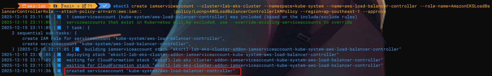

**Kết quả:** Service account được tạo và tự động liên kết với IAM role (qua OIDC).

---

## Phần 4: Cài đặt AWS Load Balancer Controller bằng Helm

### Cài đặt Helm

- Truy cập [link](https://github.com/helm/helm/releases)
- Chọn package phù hợp cho OS
- Tải về và giải nén
- Move vào folder cài `aws cli`

### Bước 1: Thêm Helm Repository

```bash
helm repo add eks https://aws.github.io/eks-charts
helm repo update
```

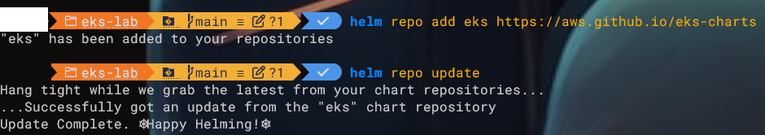

### Bước 2: Cài AWS Load Balancer Controller

```bash
helm install aws-load-balancer-controller eks/aws-load-balancer-controller \
  -n kube-system \
  --set clusterName=lab-eks-cluster \
  --set serviceAccount.create=false \
  --set serviceAccount.name=aws-load-balancer-controller
```

**Giải thích:**

- `--set clusterName=lab-eks-cluster`: Tên cluster (controller cần biết).
- `--set serviceAccount.create=false`: Đừng tạo service account mới, dùng cái đã tạo ở bước 3.
- `--set serviceAccount.name=aws-load-balancer-controller`: Tên service account để dùng.

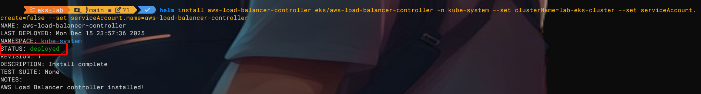

### Bước 3: Kiểm tra xem controller đã chạy chưa

```bash
kubectl get deployment -n kube-system aws-load-balancer-controller
```

Bạn cần thấy:

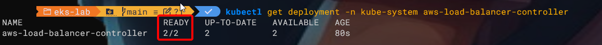

---

## Phần 5: Tạo Ingress cho ArgoCD

Bây giờ chúng ta sẽ tạo một Ingress object. Khi Ingress này được apply, AWS Load Balancer Controller sẽ **tự động tạo một ALB** cho chúng ta.

### Bước 1: Tạo file `argocd-ingress.yaml`

Tạo một file mới với nội dung sau. **NHỚ thay các giá trị chữ VIẾT HOA:**

```yaml
apiVersion: networking.k8s.io/v1
kind: Ingress
metadata:
  name: argocd-server-ingress
  namespace: argocd
  annotations:
    # Cho biết đây là Ingress của ALB
    kubernetes.io/ingress.class: alb

    # Tạo ALB internet-facing (public)
    alb.ingress.kubernetes.io/scheme: internet-facing

    # Target type IP (trỏ trực tiếp tới Pod IP, nhanh hơn NodePort)
    alb.ingress.kubernetes.io/target-type: ip

    # Gắn ACM certificate (thay ARN bằng ARN của bạn từ Day 2)
    alb.ingress.kubernetes.io/certificate-arn: arn:aws:acm:ap-southeast-1:241688915712:certificate/YOUR-CERT-ARN-HERE

    # Lắng nghe trên cả HTTP 80 và HTTPS 443
    alb.ingress.kubernetes.io/listen-ports: '[{"HTTP": 80}, {"HTTPS": 443}]'

    # Tự động redirect HTTP → HTTPS
    alb.ingress.kubernetes.io/ssl-redirect: "443"

    # Backend nói chuyện bằng HTTPS (ArgoCD pod chạy HTTPS)
    alb.ingress.kubernetes.io/backend-protocol: HTTPS

    # Health check gửi qua HTTPS
    alb.ingress.kubernetes.io/healthcheck-protocol: HTTPS
    alb.ingress.kubernetes.io/healthcheck-path: /healthz
    alb.ingress.kubernetes.io/success-codes: "200"

spec:
  ingressClassName: alb
  rules:
    - http:
        paths:
          - path: /
            pathType: Prefix
            backend:
              service:
                name: argocd-server
                port:
                  number: 443
```

### Bước 2: Sửa lại file để match cấu hình của bạn

**QUAN TRỌNG:** Sửa các chỗ sau:

1. **Thay ARN certificate:**

   ```yaml
   alb.ingress.kubernetes.io/certificate-arn: arn:aws:acm:ap-southeast-1:241688915712:certificate/YOUR-CERT-ARN-HERE
   ```

   Thành ARN thực của certificate từ Day 2 (ví dụ: `arn:aws:acm:ap-southeast-1:241688915712:certificate/abc12345-def6-7890-ghij-klmnopqrstuv`).

2. **Nếu bạn chỉ muốn HTTPS (không redirect HTTP):**
   Xóa dòng:
   ```yaml
   alb.ingress.kubernetes.io/ssl-redirect: "443"
   ```

### Bước 3: Apply Ingress

```bash
kubectl apply -f argocd-ingress.yaml
```

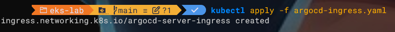

### Bước 4: Chờ ALB được tạo và lấy địa chỉ

AWS Load Balancer Controller sẽ tạo ALB. Điều này mất khoảng **2-3 phút**.

```bash
kubectl get ingress -n argocd
```

Ban đầu, cột `ADDRESS` sẽ trống. Sau 2-3 phút, nó sẽ hiển thị DNS của ALB

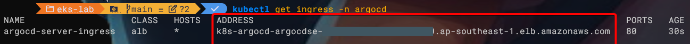
**Copy DNS của ALB** (chuỗi dài dạng `k8s-argocd-...`).

<!-- Có thể sẽ bị permission không có => check log bị thiếu permission nào và thêm vào -->

## Phần 6: Cấu hình DNS trên Cloudflare

### Bước 1: Đăng nhập Cloudflare

1. Vào [https://dash.cloudflare.com](https://dash.cloudflare.com).
2. Chọn domain của bạn.
3. Chọn **DNS** → **Records**.

### Bước 2: Thêm CNAME record cho ArgoCD

Bấm **Add record** và nhập:

- **Type:** CNAME
- **Name:** `argocd-aws` (hoặc subdomain nào bạn muốn cho ArgoCD)
- **Target (Content):** `k8s-argocd-argocdse-abc123def456-1234567890.ap-southeast-1.elb.amazonaws.com` (DNS của ALB từ bước 4)
- **Proxy status:** Gray cloud (DNS only, không cache)
- **TTL:** Auto

Bấm **Save**.

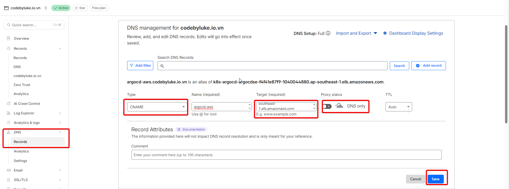

---

## Phần 7: Kiểm tra kết quả

Chờ 1-2 phút để DNS lan truyền, rồi mở trình duyệt:

```
https://argocd-aws.yourdomain.com
```

**Bạn sẽ thấy:**

1. Giao diện ArgoCD login.
2. SSL certificate là wildcard của bạn (không còn tự ký).
3. Địa chỉ bar hiển thị domain của bạn (không phải `localhost`).

Đăng nhập bằng tài khoản `admin` + password từ Day 2.5.

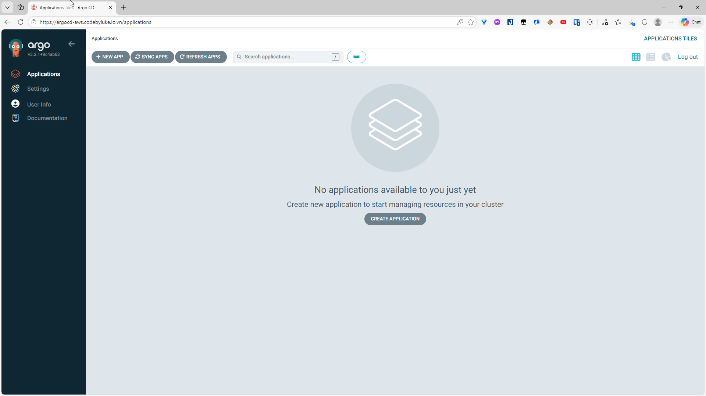

---

## Troubleshooting

### ALB chưa được tạo (ADDRESS vẫn trống sau 5 phút)

- Kiểm tra xem Public Subnet đã được tag đúng chưa (Bước 2).
- Kiểm tra log của Load Balancer Controller: `kubectl logs -n kube-system -l app.kubernetes.io/name=aws-load-balancer-controller -f`.

### Không thể truy cập qua domain

- Kiểm tra Cloudflare CNAME record đã đúng chưa.
- Chờ thêm 5-10 phút để DNS lan truyền.
- Thử `nslookup argocd-aws.yourdomain.com` để kiểm tra DNS resolve.

### Login bị loop (login xong lại về trang login)

- Bạn có cấu hình `server.insecure: true` trong ConfigMap chưa? (Từ Day 2.5).
- Kiểm tra: `kubectl get cm -n argocd argocd-cmd-params-cm -o yaml | grep insecure`.

---

## Tóm tắt Day 3

**Bạn đã:**

1. ✅ Kích hoạt OIDC Provider.
2. ✅ Gắn tag cho Public Subnet.
3. ✅ Tạo IAM Policy và Service Account cho Load Balancer Controller.
4. ✅ Cài AWS Load Balancer Controller.
5. ✅ Tạo Ingress cho ArgoCD (ALB tự động được tạo).
6. ✅ Cấu hình DNS trên Cloudflare.
7. ✅ Truy cập ArgoCD qua domain thực bằng HTTPS.
