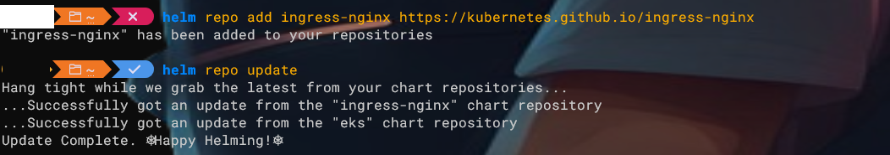
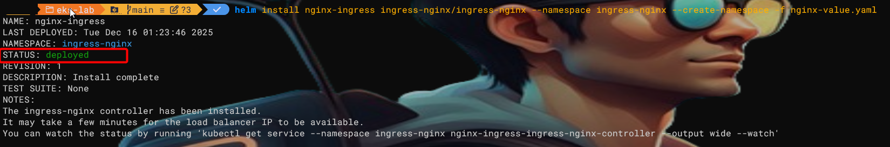
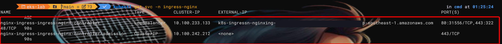
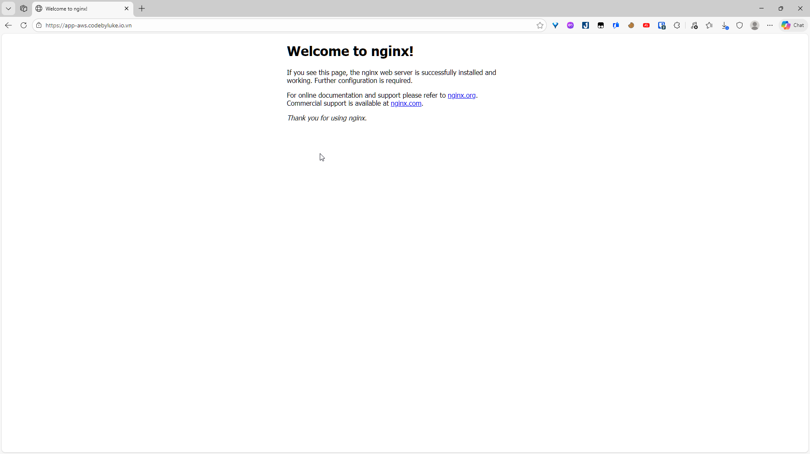

## Install Nginx Ingress

Day 4 sẽ tập trung vào việc **cài Nginx Ingress Controller dùng NLB + ACM**, mở đường cho ứng dụng của bạn ra internet, song song với ArgoCD.

---

## Mục tiêu Day 4

- Cài **Nginx Ingress Controller** trên EKS bằng Helm.
- Dùng **Network Load Balancer (NLB)** + **ACM certificate** để terminate TLS.
- Chuẩn bị DNS (Cloudflare) để app truy cập qua `https://app.yourdomain.com`.

---

## Phần 1: Cài Nginx Ingress Controller với NLB

### Bước 1: Thêm repo và update Helm

```bash
helm repo add ingress-nginx https://kubernetes.github.io/ingress-nginx
helm repo update
```



### Bước 2: Cài Nginx với NLB + ACM

Tạo một file `nginx-value.yaml` với nội dung sau:

```yaml
controller:
  service:
    type: LoadBalancer
    annotations:
      service.beta.kubernetes.io/aws-load-balancer-type: nlb
      service.beta.kubernetes.io/aws-load-balancer-scheme: internet-facing

      # Thay `YOUR-CERT-ARN` bằng ARN wildcard từ Day 2:
      service.beta.kubernetes.io/aws-load-balancer-ssl-cert: arn:aws:acm:ap-southeast-1:ACCOUNT_ID:certificate/YOUR-CERT-ARN

      service.beta.kubernetes.io/aws-load-balancer-ssl-ports: "443"
    targetPorts:
      https: http
```

```bash
helm install nginx-ingress ingress-nginx/ingress-nginx \
  --namespace ingress-nginx \
  --create-namespace \
  -f path/to/nginx-value.yaml
```

Ý nghĩa chính:

- Service type `LoadBalancer` → EKS tạo NLB.
- Annotation type NLB, scheme internet-facing → NLB public.
- `ssl-cert` → gắn ACM certificate.
- `ssl-ports 443` + `targetPorts.https=http` → TLS terminate tại NLB, NLB gửi HTTP 80 vào Nginx.



### Bước 3: Kiểm tra NLB đã tạo chưa

```bash
kubectl get svc -n ingress-nginx
```

Bạn sẽ thấy service `ingress-nginx-controller` với một `EXTERNAL-IP` là DNS của NLB (hoặc `<pending>` vài phút rồi mới có).


Vào EC2 → Load Balancers → bạn cũng sẽ thấy một **Network Load Balancer** mới.

---

## Phần 2: Cấu hình DNS cho NLB

### Bước 1: Lấy DNS của NLB

Từ `kubectl get svc`:

```bash
kubectl get svc -n ingress-nginx
```

Copy giá trị `EXTERNAL-IP` (ví dụ: `a1b2c3d4e5f6g7h8.elb.ap-southeast-1.amazonaws.com`).

### Bước 2: Thêm CNAME trên Cloudflare

Trong Cloudflare DNS:

- Type: `CNAME`
- Name: ví dụ `app-aws`
- Target: DNS của NLB vừa copy
- Proxy: DNS only (tắt cloud cam)
- Lưu.

Sau này bạn sẽ dùng `https://app-aws.yourdomain.com` để truy cập app qua Nginx/NLB.

---

## Phần 3: Test Nginx Ingress bằng một app demo

### Bước 1: Tạo namespace & deploy app đơn giản

```bash
kubectl create namespace demo-app

kubectl create deployment demo --image=nginx -n demo-app
kubectl expose deployment demo --port=80 --target-port=80 -n demo-app
```

### Bước 2: Tạo Ingress cho app qua Nginx

Tạo file `demo-app-ingress.yaml`:

```yaml
apiVersion: networking.k8s.io/v1
kind: Ingress
metadata:
  name: demo-app-ingress
  namespace: demo-app
  annotations:
    kubernetes.io/ingress.class: nginx
spec:
  rules:
    - host: app-aws.yourdomain.com
      http:
        paths:
          - path: /
            pathType: Prefix
            backend:
              service:
                name: demo
                port:
                  number: 80
```

Apply:

```bash
kubectl apply -f demo-app-ingress.yaml
```

Đợi 1–2 phút cho Nginx cập nhật, rồi mở trình duyệt:

```text
https://app-aws.yourdomain.com
```

Bạn sẽ thấy trang mặc định của Nginx (“Welcome to nginx!”) qua HTTPS (cert ACM).


Đây chính là đường đi của **ứng dụng thực**, trong bài tiếp theo bạn sẽ thay bằng app Helm + ArgoCD.

---
