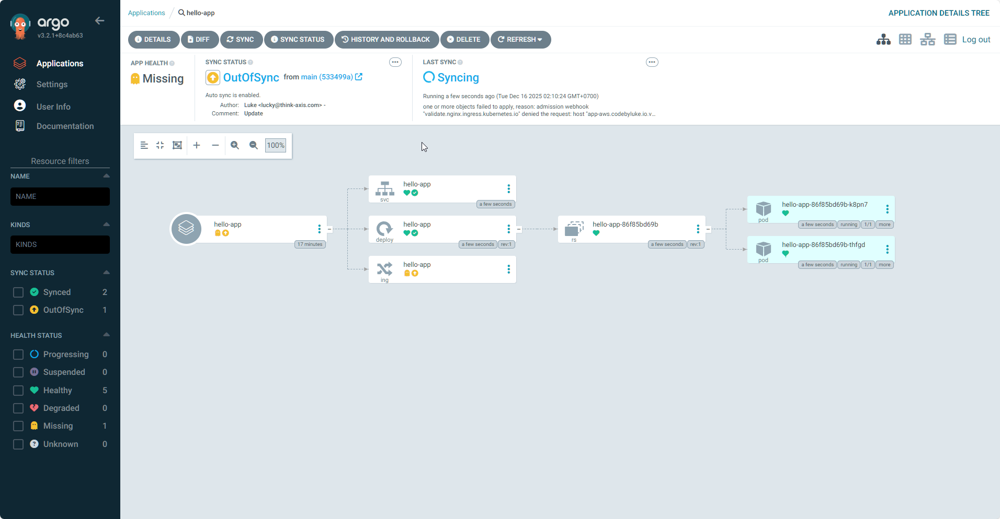
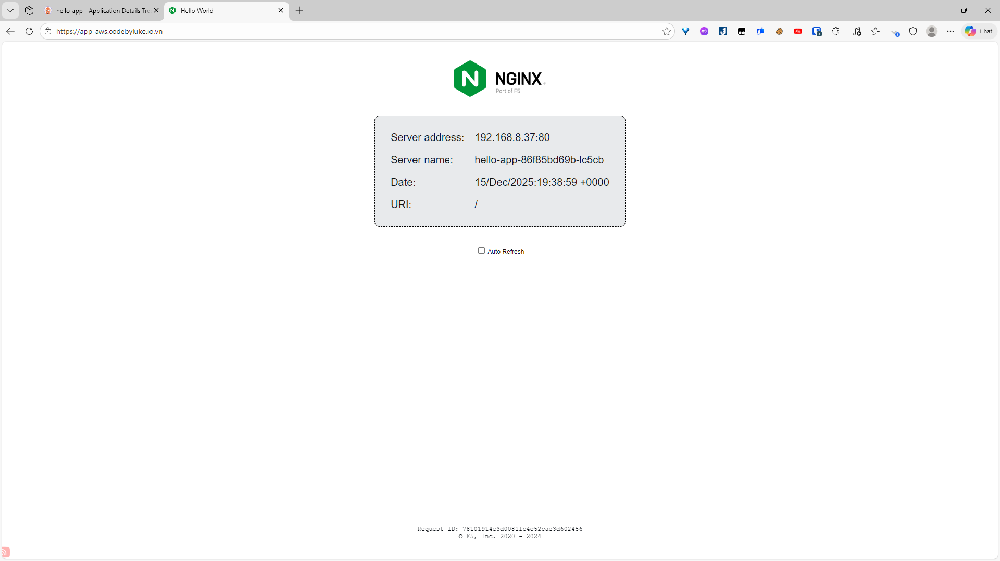

# Day 5: Deploy App With Helm Chart

---

Mục tiêu:

- Tạo namespace mới `hello-app` riêng cho demo GitOps.
- Viết một Helm chart đơn giản cho app web (image `nginxdemos/hello`).
- Đưa chart vào Git.
- Tạo ArgoCD Application kiểu Helm trỏ đến chart đó, deploy vào namespace `hello-app`.
- Expose app ra ngoài qua Nginx Ingress + NLB + ACM.
- Thử một vòng GitOps: sửa `values.yaml` → commit → ArgoCD tự sync.

---

## Bước 1 – Tạo namespace mới `hello-app`

```bash
kubectl create namespace hello-app --dry-run=client -o yaml | kubectl apply -f -
kubectl get ns hello-app
```

Sau đó, xác nhận Nginx Ingress Controller vẫn hoạt động bình thường, vì nó là cổng vào chung cho mọi app HTTP/HTTPS:

```bash
kubectl get svc -n ingress-nginx
```

Bạn cần thấy service kiểu `LoadBalancer` với `EXTERNAL-IP` là DNS của NLB đã gắn ACM certificate ở Day 4. Toàn bộ app Day 5 sẽ tận dụng lại đường đi này.

---

## Bước 2 – Tạo Helm chart cho app `hello-app`

Ta sẽ dùng một web demo cực nhẹ: `nginxdemos/hello`. App này hiển thị hostname, IP, URI,… rất phù hợp để nhìn thấy hiệu ứng scale replica và load-balancing.

Trên máy local:

```bash
mkdir -p demo-helm-argocd/charts
cd demo-helm-argocd/charts
helm create hello-app
```

Lệnh `helm create` sinh sẵn cấu trúc chuẩn:

```text
|-hello-app/
|- Chart.yaml
|-- values.yaml
|-- templates/
|---   deployment.yaml
|---   service.yaml
|---   ingress.yaml
```

Ta sẽ rút gọn lại để dễ đọc, giữ đúng ba resource cốt lõi: `Deployment`, `Service`, `Ingress`.

### Sửa `Chart.yaml`

Mở `charts/hello-app/Chart.yaml` và chỉnh:

```yaml
apiVersion: v2
name: hello-app
description: Simple NGINX hello demo
type: application
version: 0.1.0
appVersion: "1.0.0"
```

Đây chỉ là metadata, không ảnh hưởng logic, nhưng nên rõ ràng để sau này nhìn vào biết chart dùng làm gì.

---

## Bước 3 – Định nghĩa cấu hình trong `values.yaml`

`values.yaml` là nơi gom toàn bộ cấu hình có thể thay đổi mà không phải đụng vào template YAML. Đây cũng là file mà sau này ArgoCD sẽ override (nếu cần) cho từng môi trường.

Mở `charts/hello-app/values.yaml`, rút gọn thành:

```yaml
replicaCount: 2

image:
  repository: nginxdemos/hello
  tag: "latest"
  pullPolicy: IfNotPresent

imagePullSecrets: []

nameOverride: ""
fullnameOverride: ""

serviceAccount:
  create: false

podAnnotations: {}

podSecurityContext: {}
securityContext: {}

service:
  type: ClusterIP
  port: 80

ingress:
  enabled: true
  className: "nginx"
  annotations: {}
  hosts:
    - host: app-aws.codebyluke.io.vn # thay bằng domain bạn đã trỏ CNAME tới NLB
      paths:
        - path: /
          pathType: Prefix
  tls: [] # TLS terminate ở NLB, Ingress chỉ nhận HTTP

resources: {}

autoscaling:
  enabled: false

nodeSelector: {}
tolerations: []
affinity: {}
```

Ý tưởng:

- `replicaCount`: số Pod, sẽ dùng để luyện tập scale bằng GitOps.
- `image`: app demo `nginxdemos/hello`.
- `service`: expose port 80 trong cluster, Ingress sẽ route vào đây.
- `ingress`: bật Ingress, gắn IngressClass `nginx`, host chính là domain user truy cập.

---

## Bước 4 – Viết lại template Deployment, Service, Ingress cho gọn

Helm tạo rất nhiều field mặc định, nhưng cho Day 5, ta dùng phiên bản “tối giản nhưng chuẩn”, dễ đọc và dễ debug.

### 4.1. Deployment: chạy 2 replica app demo

`charts/hello-app/templates/deployment.yaml`:

```yaml
apiVersion: apps/v1
kind: Deployment
metadata:
  name: hello-app
  labels:
    app: hello-app
spec:
  replicas: { { .Values.replicaCount } }
  selector:
    matchLabels:
      app: hello-app
  template:
    metadata:
      labels:
        app: hello-app
    spec:
      containers:
        - name: hello
          image: "{{ .Values.image.repository }}:{{ .Values.image.tag }}"
          imagePullPolicy: { { .Values.image.pullPolicy } }
          ports:
            - containerPort: 80
```

Các điểm chính:

- Label `app: hello-app` thống nhất cho cả Deployment, Pod selector và Service sau này.
- `replicas` đọc trực tiếp từ `values.yaml` để scale qua Git.
- Container port 80, đúng với image `nginxdemos/hello`.

### 4.2. Service: cửa nội bộ cho Ingress

`charts/hello-app/templates/service.yaml`:

```yaml
apiVersion: v1
kind: Service
metadata:
  name: hello-app
  labels:
    app: hello-app
spec:
  type: { { .Values.service.type } }
  selector:
    app: hello-app
  ports:
    - port: { { .Values.service.port } }
      targetPort: 80
      protocol: TCP
      name: http
```

Service này là “điểm tập trung” mà Ingress sẽ gọi vào. Type `ClusterIP` là đủ vì NLB đã đứng ngoài.

### 4.3. Ingress: route từ Nginx Ingress vào Service

`charts/hello-app/templates/ingress.yaml`:

```yaml
{{- if .Values.ingress.enabled }}
apiVersion: networking.k8s.io/v1
kind: Ingress
metadata:
  name: hello-app
  labels:
    app: hello-app
  annotations:
    kubernetes.io/ingress.class: {{ .Values.ingress.className }}
    {{- range $k, $v := .Values.ingress.annotations }}
    {{ $k }}: {{ $v | quote }}
    {{- end }}
spec:
  rules:
    - host: {{ (index .Values.ingress.hosts 0).host }}
      http:
        paths:
          - path: {{ (index (index .Values.ingress.hosts 0).paths 0).path }}
            pathType: {{ (index (index .Values.ingress.hosts 0).paths 0).pathType }}
            backend:
              service:
                name: hello-app
                port:
                  number: {{ .Values.service.port }}
{{- end }}
```

Nếu bạn muốn giảm độ “helm-logic”, có thể dùng bản cực đơn giản (ít dynamic hơn):

```yaml
{{- if .Values.ingress.enabled }}
apiVersion: networking.k8s.io/v1
kind: Ingress
metadata:
  name: hello-app
  labels:
    app: hello-app
  annotations:
    kubernetes.io/ingress.class: {{ .Values.ingress.className }}
spec:
  rules:
    - host: {{ .Values.ingress.hosts 0).host }}
      http:
        paths:
          - path: /
            pathType: Prefix
            backend:
              service:
                name: hello-app
                port:
                  number: {{ .Values.service.port }}
{{- end }}
```

Quan trọng nhất là:

- IngressClass là `nginx` để hit đúng Nginx Ingress Controller.
- Host/path đúng với DNS bạn đã cấu hình ở Cloudflare.
- Backend service `hello-app`, port khớp với Service phía trên.

---

## Bước 5 – Test chart bằng Helm local và đẩy lên Git

Trước khi để ArgoCD render, nên test chart local:

```bash
cd demo-helm-argocd/charts/hello-app
helm template hello-app . --namespace hello-app
```

Lệnh này sẽ in ra tất cả manifest đã render:

- Nếu có lỗi YAML hoặc lỗi Helm template, sửa cho tới khi lệnh chạy sạch.
- Đảm bảo bạn thấy `Deployment`, `Service` và `Ingress` tên `hello-app`.

Khi mọi thứ ổn:

```bash
cd ../..
git init
git add .
git commit -m "Add hello-app Helm chart"
git remote add origin <url-repo-git>
git push -u origin main
```

Từ thời điểm này, cấu hình app của bạn chính thức “sống” trong Git.

---

## Bước 6 – Tạo ArgoCD Application deploy vào namespace `hello-app`

Giờ đến phần GitOps: định nghĩa một ArgoCD Application để:

- Lấy chart từ repo vừa push.
- Render bằng Helm.
- Apply vào namespace `hello-app`.

Tạo file `hello-app-application.yaml`:

```yaml
apiVersion: argoproj.io/v1alpha1
kind: Application
metadata:
  name: hello-app
  namespace: argocd
spec:
  project: default
  source:
    repoURL: <your-git-repo> # thay URL repo của bạn
    targetRevision: main
    path: charts/hello-app
    helm:
      valueFiles:
        - values.yaml
  destination:
    server: https://kubernetes.default.svc
    namespace: hello-app # namespace MỚI
  syncPolicy:
    automated:
      prune: true
      selfHeal: true
    syncOptions:
      - CreateNamespace=true
```

Apply Application:

```bash
kubectl apply -f hello-app-application.yaml
```

Vào UI ArgoCD:

- Bạn sẽ thấy app `hello-app`.
- Bấm `Sync` nếu auto-sync chưa kích hoạt.
- Đợi đến khi trạng thái `Synced` + `Healthy`.
  

---

## Bước 7 – Kiểm tra resource trong namespace `hello-app`

Trong cluster:

```bash
kubectl get pods -n hello-app
kubectl get svc -n hello-app
kubectl get ingress -n hello-app
```

Nếu mọi thứ đúng:

- Có 2 Pod `hello-app-...` Running (theo `replicaCount`).
- Service `hello-app` ClusterIP port 80.
- Ingress `hello-app` host đúng domain bạn đặt trong `values.yaml`.

Từ góc nhìn Kubernetes, app demo đã sẵn sàng để nhận traffic từ Nginx Ingress.

---

## Bước 8 – Kết nối toàn bộ đường đi từ internet vào app

Ở Day 4 bạn đã:

- Tạo NLB với ACM certificate.
- Expose Nginx Ingress Controller qua Service type `LoadBalancer` trỏ NLB.
- Tạo CNAME trong Cloudflare, ví dụ `app-aws.codebyluke.io.vn` → DNS NLB.

Bây giờ, Ingress `hello-app` là mảnh ghép cuối cùng. Đường đi hoàn chỉnh:

1. Người dùng truy cập `https://app-aws.codebyluke.io.vn`.
2. Cloudflare phân giải DNS về NLB.
3. NLB terminate TLS (ACM), forward HTTP tới Nginx Ingress Controller.
4. Nginx Ingress nhìn host, match rule Ingress `hello-app`.
5. Ingress route request tới Service `hello-app`.
6. Service load-balance request tới một trong các Pod `hello-app`.

Bạn chỉ cần mở trình duyệt:

```text
https://app-aws.codebyluke.io.vn
```

Nếu thấy trang demo của `nginxdemos/hello` (thường hiển thị thông tin kết nối), là bạn đã hoàn tất phần “CD” của GitOps.


---

## Bước 9 – Thực hành GitOps: thay đổi bằng Git, không chạm kubectl

Đây là phần quan trọng nhất của Day 5: tập suy nghĩ “mỗi thay đổi là một commit”.

1. **Scale app bằng Git**

   - Sửa `replicaCount` trong `values.yaml`:

     ```yaml
     replicaCount: 3
     ```

   - Commit & push:

     ```bash
     git commit -am "Scale hello-app to 3 replicas"
     git push
     ```

   - Trong ArgoCD, app `hello-app` sẽ chuyển `OutOfSync` rồi tự sync (nếu auto).
   - Kiểm tra:

     ```bash
     kubectl get pods -n hello-app
     ```

     Số Pod tăng lên 3.

2. **Sửa cấu hình Ingress bằng Git**

   - Muốn đổi host (ví dụ tạo thêm CNAME `hello2-aws.codebyluke.io.vn`), chỉ cần sửa `values.yaml`:

     ```yaml
     hosts:
       - host: hello2-aws.codebyluke.io.vn
         paths:
           - path: /
             pathType: Prefix
     ```

   - Commit & push, ArgoCD sẽ update Ingress, không cần `kubectl edit ingress`.

3. **Rollback bằng Git**

   - Nếu một thay đổi gây lỗi, chỉ cần revert commit hoặc checkout lại revision cũ của branch, push lên.
   - ArgoCD sẽ sync lại trạng thái cũ, không cần cắm mặt vào cluster để “gỡ bom” bằng tay.

Khi đã quen pattern này, thêm môi trường `dev` / `staging` / `prod` hay thêm app mới chỉ là chuyện copy chart, tách `values` và thêm một Application mới trong ArgoCD.

---

Tới đây, bạn đã có:

- Một Helm chart đơn giản nhưng chuẩn.
- Một ArgoCD Application tự động sync từ Git.
- Đường đi HTTP/HTTPS đầy đủ từ internet vào app trong EKS.

Từ đây, việc tiếp theo có thể là: thay app demo bằng app thật của bạn, tách repo “code” và repo “infra”, và thêm CI (Jenkins, GitHub Actions, GitLab CI) để tự build/push image rồi cập nhật manifest cho ArgoCD.
