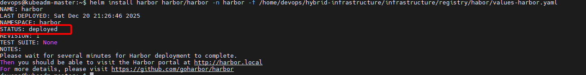
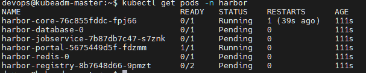

# Triển khai Harbor trên on‑prem Kubernetes (Kubeadm)

:::tip[TLDR;]

- Cài đặt Harbor bằng Helm trên cụm K8s on‑prem.
- Expose Harbor qua Ingress‑NGINX (NodePort) để có thể truy cập từ máy dev.
- Đạt được trạng thái “Harbor dashboard truy cập được”, để chuẩn bị cho CI/CD (build/push image) ở các phase sau.

:::

## 1. Bối cảnh & mục tiêu

Ở giai đoạn lab này, trọng tâm là **Harbor hoạt động ổn định**, chấp nhận chưa bật persistence đầy đủ cho database/redis để tránh phức tạp về storage, tập trung vào flow DevOps/GitOps.


---

## 2. Thiết kế Harbor cho lab on‑prem

Trong môi trường on‑prem Kubeadm giả lập trên GCP:

- **Ingress layer** đã có sẵn:
  - Ingress‑NGINX Controller với Service NodePort:
    - HTTP: `30131`
    - HTTPS: `32690`
- Harbor được triển khai trong namespace `harbor` và expose qua Ingress, sử dụng host `harbor.local`.
- Do chưa có giải pháp storage “chuẩn” (NFS, CSI driver, Rook, v.v.), Harbor trong phase này được cấu hình:
  - Tạm **không bật persistence cho database/redis/jobservice** (dùng `emptyDir`, đủ để lab chạy).
  - Có thể bật persistence riêng cho registry sau này khi storage ổn định hơn.

Điều này giúp tránh các lỗi phức tạp về permission/hostPath, tập trung vào: Harbor UI, project, auth, và flow build/push image.

---

## 3. Các bước triển khai chính

### 3.1. Cài Helm trên kubeadm‑master

Trên node control‑plane:

```bash
curl https://raw.githubusercontent.com/helm/helm/main/scripts/get-helm-3 | bash
helm version
```

### 3.2. Chuẩn bị namespace và Helm repo Harbor

Tách namespace `harbor` giúp quản lý tài nguyên Harbor rõ ràng và dễ xóa/điều chỉnh.

```bash
kubectl create namespace harbor

helm repo add harbor https://helm.goharbor.io
helm repo update
```

### 3.3. Cấu hình Harbor bằng values.yaml (lab mode)

Tạo file `values-harbor.yaml`:

```bash
expose:
  type: ingress
  ingress:
    hosts:
      core: harbor.local
    controller: default
    className: nginx
  tls:
    enabled: false

externalURL: http://harbor.local

persistence:
  enabled: false    # Lab mode: tắt persistence global, dùng emptyDir

database:
  type: internal
  internal:
    enabled: true
  persistence:
    enabled: false

redis:
  type: internal
  internal:
    enabled: true
  persistence:
    enabled: false

jobservice:
  persistence:
    enabled: false

chartmuseum:
  enabled: false

trivy:
  enabled: false

notary:
  enabled: false

harborAdminPassword: "Harbor12345"
```

Điểm quan trọng ở bản cấu hình này:

- Harbor chạy qua Ingress class `nginx` với host `harbor.local`.
- **TLS tạm thời tắt**, dùng HTTP để lab đỡ phức tạp.
- Tắt persistence DB/Redis/Jobservice để tránh lỗi PVC/PV, giúp pod lên ổn định.
- Giữ mật khẩu admin riêng (sau login cần đổi).

### 3.4. Cài Harbor bằng Helm

```bash
helm install harbor harbor/harbor \
  -n harbor \
  -f values-harbor.yaml
```



Sau đó kiểm tra:

```bash
kubectl get pods -n harbor
```



### 3.5. Kiểm tra Ingress và truy cập UI

Xem Ingress:

```
kubectl get ingress -n harbor
```


Trên máy dev (laptop/PC), thêm vào file `hosts`:

```
<EXTERNAL_IP_NODE>    harbor.local
```

Trong đó `<EXTERNAL_IP_NODE>` là External IP của 1 node on‑prem (ví dụ `kubeadm-master`).

Mở trình duyệt:

```
http://harbor.local:30131
```

Đăng nhập:

- Username: `admin`
- Password: `Harbor12345` (hoặc giá trị bạn đã đặt)

## 4. Các lỗi gặp trong Phase 2.1 & cách xử lý

### 4.1. PVC `Pending` vì StorageClass/provisioner không phù hợp

**Triệu chứng:**  
PVC `data-harbor-redis-0`, `database-data-harbor-database-0`, `harbor-jobservice`, `harbor-registry` ở trạng thái `Pending`, event báo:

```
Waiting for a volume to be created either by the external provisioner 'pd.csi.storage.gke.io'...
```

**Nguyên nhân:**  
Cluster là kubeadm trên GCE VM, không phải GKE. Provisioner `pd.csi.storage.gke.io` chỉ chạy trên GKE, nên PVC chờ hoài không được PV.

**Cách xử lý (lab mode):**

- Gỡ Harbor và xóa PVC/PV cũ.
- Chuyển sang cấu hình Harbor **không dùng PVC** (tắt persistence DB/Redis/Jobservice), dùng `emptyDir` như trong `values-harbor.yaml` cuối cùng.
- Chấp nhận DB/Redis mất dữ liệu khi pod restart trong giai đoạn lab.

## 5. Tạm kết

Đây là nền tảng để bước sang:

- Tạo project `dev`/`prod` trong Harbor.
- Cấu hình `docker`/`nerdctl` login & push image.
- Tích hợp với pipeline CI và GitOps trong các phase tiếp theo.
