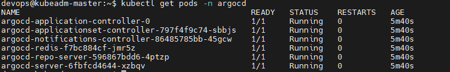

# Cài ArgoCD trên on‑premise K8s và expose qua Ingress

:::tip[TLDR;]

- Deploy ArgoCD bằng Helm trên cụm K8s on‑prem.
- Expose ArgoCD qua Ingress‑NGINX, truy cập được bằng domain nội bộ (vd: `argocd.local`).
- Đăng nhập thành công vào UI ArgoCD với tài khoản admin (ready cho bước tạo Application và GitOps ở các phase sau).
  :::


---

## 2. Thiết kế ArgoCD trên on‑prem cluster

Môi trường:

- Cụm Kubeadm on‑prem (3 node) đã có:
  - `ingress-nginx` (Ingress Controller) expose qua NodePort 30131 (HTTP).
  - `harbor` (registry) chạy ổn, truy cập được qua `harbor.local:30131`.

ArgoCD sẽ:

- Chạy trong namespace `argocd`.
- Được cài bằng chart `argo/argo-cd` (Helm).
- Expose qua Ingress‑NGINX, dùng host `argocd.local`, HTTP (chưa dùng TLS ở phase này).
- Kết nối tới repo IaC sau này (vd: `hybrid-infrastructure`) để thực thi GitOps.

---

## 3. Các bước triển khai ArgoCD

### 3.1. Tạo namespace và thêm Helm repo

Trên `kubeadm-master`:

```bash
kubectl create namespace argocd

helm repo add argo https://argoproj.github.io/argo-helm
helm repo update
```

Namespace riêng giúp tách ArgoCD khỏi workload khác, dễ quản lý và cleanup.

### 3.2. Tạo file values cho ArgoCD

Tạo file `values-argocd.yaml` (theo structure repo IaC):

```bash
nano values-argocd.yaml
```

Ví dụ cấu hình tối giản:

```bash
server:
  ingress:
    enabled: true
    ingressClassName: nginx
    hosts:
      - argocd.local
    https: false
  extraArgs:
    - --insecure
  service:
    type: ClusterIP

configs:
  params:
    server.insecure: "true"

dex:
  enabled: false   # tắt SSO Dex cho đơn giản giai đoạn đầu

redis:
  enabled: true

controller:
  resources:
    requests:
      cpu: 100m
      memory: 256Mi

repoServer:
  resources:
    requests:
      cpu: 100m
      memory: 256Mi
```

Điểm chính:

- Bật Ingress, dùng class `nginx`, host `argocd.local`, HTTP.
- `server.insecure` giúp không cần TLS và đơn giản hóa UI cho lab.
- Tắt Dex (SSO) để UI chỉ dùng local user `admin`.

### 3.3. Cài ArgoCD bằng Helm

```bash
helm install argocd argo/argo-cd \
  -n argocd \
  -f values-argocd.yaml
```


Kiểm tra pod:

```bash
kubectl get pods -n argocd
```



Kiểm tra Ingress:

```bash
kubectl get ingress -n argocd
kubectl describe ingress argocd-server -n argocd
```


Nếu host ban đầu là `argocd.example.com` (default chart), có thể patch lại:

```bash
kubectl patch ingress argocd-server -n argocd \
  --type='json' \
  -p='[{"op": "replace", "path": "/spec/rules/0/host", "value": "argocd.local"}]'
```

---

## 4. Cấu hình hosts và truy cập UI ArgoCD

Trên máy dev (laptop/PC):

- Sửa file hosts:

  - Linux/macOS: `/etc/hosts`
  - Windows: `C:\Windows\System32\drivers\etc\hosts`

Thêm dòng:

```
<EXTERNAL_IP_NODE>  argocd.local
```

Trong đó `<EXTERNAL_IP_NODE>` là External IP của node on‑prem đang lắng NodePort 30131 (thường là master).

Test:

```
curl -I http://argocd.local:30131
```

Nếu không nhận 404 default của NGINX mà nhận status khác (200/302/401) là Ingress đã match.

Sau đó, mở trình duyệt:

```
http://argocd.local:30131
```

Trang login ArgoCD sẽ hiện ra.

### 4.1. Lấy mật khẩu admin

Trên `kubeadm-master`:

```bash
kubectl get secret argocd-initial-admin-secret -n argocd \
  -o jsonpath='{.data.password}' | base64 -d; echo
```

Dùng:

- Username: `admin`
- Password: chuỗi lấy ở trên

Sau khi login xong, nên đổi mật khẩu trong UI (`User Info` → `Change Password`) cho an toàn.

---

## 5. Lỗi & cách xử lý

### 5.1. 404 Not Found khi truy cập ArgoCD qua Ingress

**Triệu chứng:**  
Truy cập `http://argocd.local:30131` nhận 404 từ NGINX (trang default Ingress‑NGINX), dù pod `argocd-server` đã `Running`.

**Nguyên nhân:**  
Ingress `argocd-server` được chart tạo ra với host mặc định `argocd.example.com`, nhưng máy dev dùng host `argocd.local` trong URL/hosts, nên Ingress‑NGINX không match rule.

**Cách xử lý:**

- Kiểm tra Ingress:

  ```bash
  kubectl describe ingress argocd-server -n argocd
  ```

  Thấy:

  ```bash
  Host: argocd.example.com
  ```

- Sửa host cho đúng bằng một trong hai cách:

  - Patch trực tiếp:

    ```bash
    kubectl patch ingress argocd-server -n argocd \
      --type='json' \
      -p='[{"op": "replace", "path": "/spec/rules/0/host", "value": "argocd.local"}]'
    ```

  - Hoặc sửa `values-argocd.yaml` (`hosts: [argocd.local]`) rồi `helm upgrade`.

- Đảm bảo file hosts trên máy dev trỏ đúng:

  ```
  <EXTERNAL_IP_NODE>  argocd.local
  ```

Sau khi host Ingress và host header trùng nhau, 404 biến mất, UI ArgoCD vào được bình thường.

---

## 6. Tạm kết

Đây là nền tảng để bước sang các phase tiếp theo:

- Cấu trúc repo GitOps (`hybrid-infrastructure`).
- Tạo ArgoCD Application cho app demo đầu tiên (deploy từ Git, không dùng `kubectl apply` tay).
- Sau đó mở rộng ra multi‑cluster GitOps với GKE.
