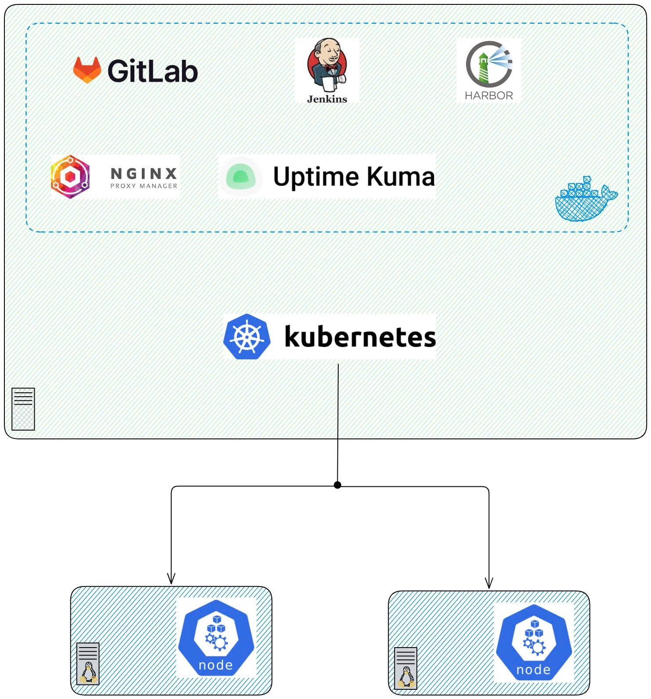
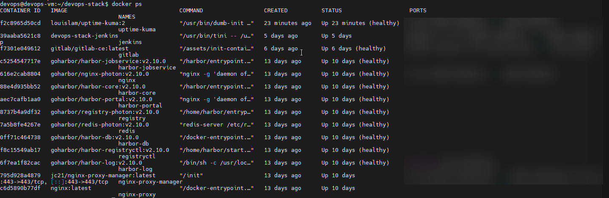

# Bài 3: Infrastructure - Giả lập On-premise và thiết lập DevOps Stack

Sau khi đã có cái nhìn tổng quan, hôm nay chúng ta sẽ bắt tay vào xây dựng nền móng. Một hệ thống Hybrid-Cloud bắt đầu từ việc chuẩn bị môi trường chạy Lab ổn định. Sau bài này, ta sẽ có được một hệ thống như hình:



## 1. Tại sao lại dùng Compute Engine giả lập On-premise?

Trong thực tế, không phải ai cũng có sẵn một dàn Server vật lý tại nhà. Vì vậy, mình sử dụng **Google Compute Engine (VM)** để giả lập cụm On-premise.

- **Cấu hình tối ưu (Cost Saving):** Để chạy mượt Jenkins, GitLab, Harbor và K8s cùng lúc, mình khuyến nghị dùng dòng **e2-standard-4** (4 vCPU, 16 GB RAM).

:::tip
**Mẹo:** Hãy dùng **Spot VM** để tiết kiệm tới 70% chi phí.
:::

## 2. Thiết lập không gian làm việc

Tạo thư mục quản lý tập trung trên máy `devops-vm`:

```bash
mkdir ~/devops-stack && cd ~/devops-stack
```

## 3. Cài đặt DevOps Stack (Docker Compose)

Trước tiên, chúng ta cần tạo 1 file docker riêng cho **Jenkins** vì cần phải cài đặt Docker và Google Cloud CLI vào trong Jenkins để phục vụ việc build và push image to Artifact Registry sau này

```bash
mkdir ~/jenkins
sudo nano Dockerfile
```
Copy và dán vào `Dockerfile`

```Dockerfile
FROM jenkins/jenkins:lts
USER root

# 1. Install base lib
RUN apt-get update && apt-get install -y \
    lsb-release \
    curl \
    gnupg \
    apt-transport-https \
    ca-certificates

# 2. Install Docker
RUN curl -fsSLo /usr/share/keyrings/docker-archive-keyring.asc \
    https://download.docker.com/linux/debian/gpg \
    && echo "deb [arch=$(dpkg --print-architecture) signed-by=/usr/share/keyrings/docker-archive-keyring.asc] \
    https://download.docker.com/linux/debian $(lsb_release -cs) stable" > /etc/apt/sources.list.d/docker.list \
    && apt-get update && apt-get install -y docker-ce-cli

# 3. Install GCI 
RUN echo "deb [signed-by=/usr/share/keyrings/cloud.google.gpg] https://packages.cloud.google.com/apt cloud-sdk main" | \
    tee -a /etc/apt/sources.list.d/google-cloud-sdk.list \
    && curl https://packages.cloud.google.com/apt/doc/apt-key.gpg | \
    gpg --dearmor -o /usr/share/keyrings/cloud.google.gpg \
    && apt-get update && apt-get install -y google-cloud-cli

# 4. Remove to reduce image size
RUN rm -rf /var/lib/apt/lists/*

USER jenkins
```

Trở về lại thư mục `devops-stack`, tạo file `docker-compose.yml` để quản lý Jenkins, GitLab và Nginx Proxy Manager (NPM). 

```yaml
services:
  nginx-proxy-manager:
    image: "jc21/nginx-proxy-manager:latest"
    container_name: nginx-proxy-manager
    restart: always
    ports:
      - "80:80" # HTTP Traffic
      - "81:81" # Web UI Admin
      - "443:443" # HTTPS Traffic
    volumes:
      - ./npm/data:/data
      - ./npm/letsencrypt:/etc/letsencrypt
    networks:
      - devops-network
      - harbor_network # Config để npm connect được với harbor

  # Jenkins
  jenkins:
    build: ./jenkins # Path to Jenkins Dockerfile
    container_name: jenkins
    # ports:
    #   - "50000:50000"
    volumes:
      - jenkins_data:/var/jenkins_home
      - /var/run/docker.sock:/var/run/docker.sock
    user: root
    restart: always
    networks:
      - devops-network
      - harbor_network # Config để Jenkins push image tới harbor

  # GitLab
  gitlab:
    image: gitlab/gitlab-ce:latest
    container_name: gitlab
    hostname: git.codebyluke.io.vn
    ports:
      - "222:22"
    volumes:
      - gitlab_config:/etc/gitlab
      - gitlab_logs:/var/log/gitlab
      - gitlab_data:/var/opt/gitlab
    environment:
      GITLAB_OMNIBUS_CONFIG: |
        external_url 'http://gitlab.codebyluke.io.vn'
        gitlab_rails['gitlab_shell_ssh_port'] = 222
    restart: always
    networks:
      - devops-network

  #Uptime Kuma
  uptime-kuma:
    image: louislam/uptime-kuma:2
    container_name: uptime-kuma
    restart: always
    volumes:
      - uptime_kuma_data:/app/data
    networks:
      - devops-network

volumes:
  jenkins_data:
  gitlab_config:
  gitlab_logs:
  gitlab_data:
  uptime_kuma_data:

networks:
  devops-network:
    driver: bridge
  harbor_network:
    external: true
    name: harbor_harbor
```

:::tip[Tại sao lại sử dụng NPM]
Việc dùng NPM giúp chúng ta cấu hình Domain và SSL cho Harbor/GitLab cực kỳ dễ dàng sau này.
:::


---

## 4. Cài đặt Harbor (Private Registry)

Harbor không chỉ là nơi lưu trữ Image, nó còn tích hợp quét lỗ hổng bảo mật (Vulnerability Scanning). Vì Harbor khá nặng, chúng ta sẽ cài đặt nó theo dạng **Offline Installer** để đảm bảo tính ổn định.

**Bước 4.1: Tải và giải nén Harbor**

```bash
# Truy cập trang Release của Harbor trên Github để lấy bản mới nhất
wget https://github.com/goharbor/harbor/releases/download/v2.10.0/harbor-offline-installer-v2.10.0.tgz
tar xvzf harbor-offline-installer-v2.10.0.tgz
cd harbor
```

**Bước 4.2: Cấu hình file `harbor.yml`**
Copy file mẫu và chỉnh sửa:

```bash
cp harbor.yml.tmpl harbor.yml
nano harbor.yml
```

Các thông số **bắt buộc** cần sửa:

- **hostname:** Điền IP của máy ảo.
- **http/port:** Mặc định là 80. Nếu bạn đã dùng port 80 cho Nginx Proxy Manager, hãy đổi port Harbor thành `8083`.
- **external_url:** Tên miền của bạn (VD: <u>registry.codebyluke.io.vn</u>) - Harbor sẽ hiểu rằng mọi request trả về cho client phải dùng domain này thay vì IP.
- **https:** Nếu bạn định cấu hình SSL qua Nginx Proxy Manager (NPM), bạn có thể **comment (vô hiệu hóa)** toàn bộ phần https trong file này để NPM lo phần chứng chỉ.
- **harbor_admin_password:** Đặt mật khẩu quản trị cho bạn.

**Bước 4.3: Chạy Script cài đặt**
Nếu bạn muốn cài thêm tính năng quét bảo mật (Trivy), hãy thêm flag `--with-trivy`:

```bash
sudo ./install.sh --with-trivy
```

Sau khi chạy xong, Harbor sẽ khởi chạy một loạt container. Bạn có thể kiểm tra bằng lệnh `docker ps`.



**Bước 4.4: Cấu hình "Insecure Registries" (Quan trọng)**
Vì mặc định Docker yêu cầu HTTPS, nếu bạn dùng HTTP cho Harbor, bạn phải báo cho Docker biết:

```bash
sudo nano /etc/docker/daemon.json
# Thêm dòng sau:
{
  "insecure-registries" : ["<hostname của harbor đã config ở trên>"]
}
# Sau đó restart docker
sudo systemctl restart docker

```

---

## 5. Cài đặt cụm K8s On-premise (1 Master - 2 Worker)

Xem lại [link](https://blog.codebyluke.io.vn/docs/DevOps/Kubernetes/deploy_onpremis)

## 6. Cấu hình Firewall & Network

Ta cần mở các port sau trên Google Cloud Firewall:

- **80, 443:** Nginx Proxy Manager (Cửa ngõ chính).
- **81:** UI quản lý của Nginx Proxy Manager.
- **222**: Gitlab SSH
- **30000-32767:** Dải port dành cho NodePort của Kubernetes.

---

## Kết luận

Xong bài này, chúng ta đã có một "đại bản doanh" đầy đủ vũ khí:

- **GitLab** sẵn sàng nhận code
- **Jenkins** sẵn sàng chạy pipeline
- **Harbor** sẵn sàng chứa image
- **K8s** sẵn sàng chạy ứng dụng
- **Uptime Kuma** sẵn sàng giám sát

Ở bài sau, thay vì phải gõ `http://<IP>:<port>` để truy cập services thì chúng ta sẽ cấu hình **Nginx Proxy Manager** để có thể truy cập bằng `domain` một cách chuẩn chỉnh và chuyên nghiệp
