# Bài 3: Infrastructure - Giả lập On-premise và thiết lập DevOps Stack

Sau khi đã có cái nhìn tổng quan, hôm nay chúng ta sẽ bắt tay vào xây dựng nền móng. Một hệ thống Hybrid-Cloud bắt đầu từ việc chuẩn bị môi trường chạy Lab ổn định. Sau bài này, ta sẽ có được một hệ thống như hình:

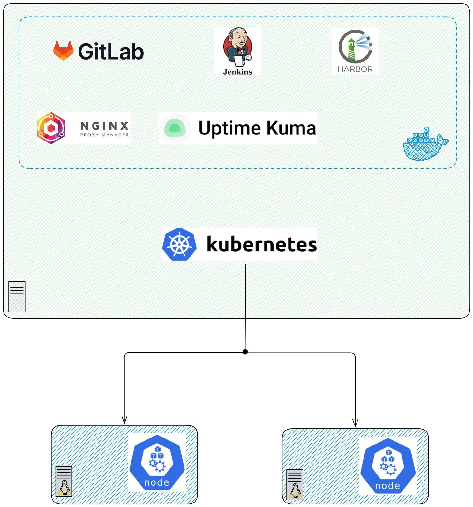

## 1. Tại sao lại dùng Compute Engine giả lập On-premise?

Trong thực tế, không phải ai cũng có sẵn một dàn Server vật lý tại nhà. Vì vậy, mình sử dụng **Google Compute Engine (VM)** để giả lập cụm On-premise.

- **Cấu hình tối ưu (Cost Saving):** Để chạy mượt Jenkins, GitLab, Harbor và K8s cùng lúc, mình khuyến nghị dùng dòng **e2-standard-4** (4 vCPU, 16 GB RAM).

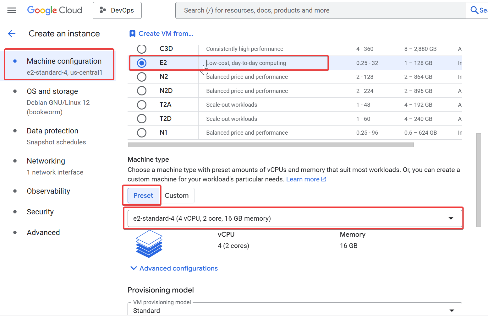

- **Hệ điều hành và lưu trữ:** Ở đây ta sẽ sử dụng **Ubuntu 25.10 Minimal** và **100 GB** lưu trữ (trong thực tế, ta sẽ cần cấu hình một bộ nhớ lớn hơn để chứa image của Harbor sau này)

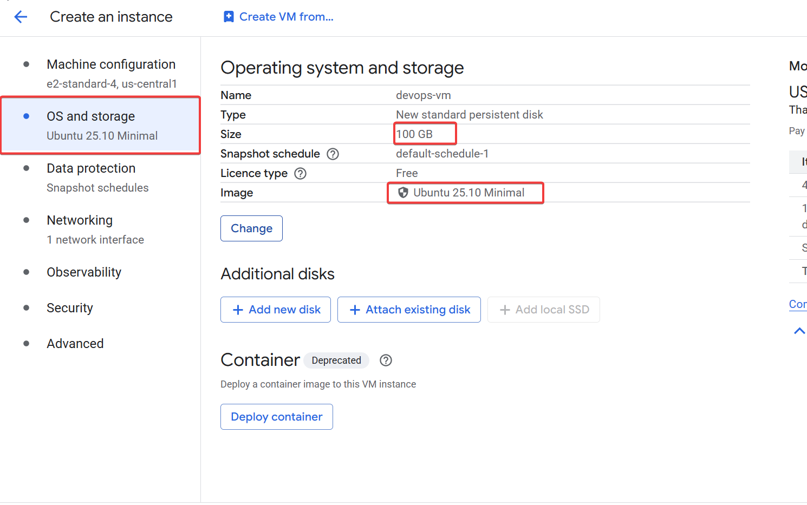

- **Network:** Ta sẽ cần check `Allow HTTP/HTTPS traffic` để chạy install package, ngoài ra sẽ thêm một `custom tag` (ở đây là `devops-tag`) để sau này sử dụng

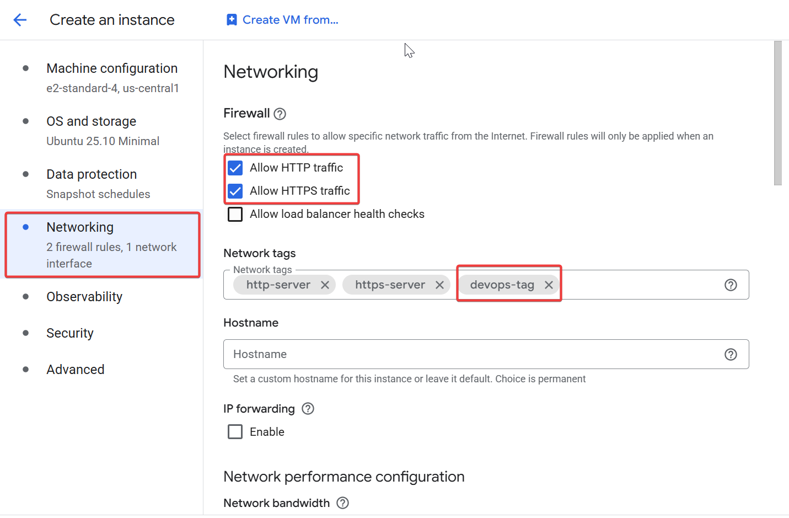

- **Security:** Vì sau này ta sẽ quản lý `manifest` trên GKE và On-Premise bằng ArgoCD (được cài ở VM này) nên ta cần check `Allow full access to all Cloud APIs` để ArgoCD có thể thêm GKE thành cluster

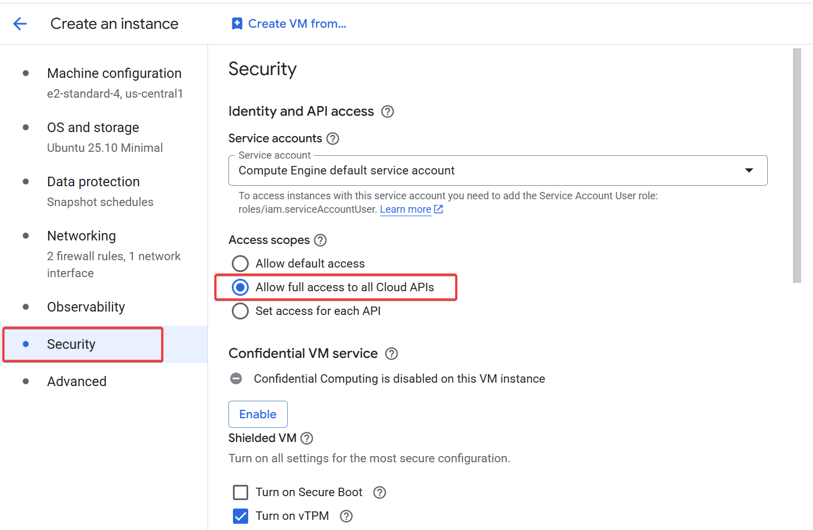

:::tip[Mẹo]
Với mục đích làm lab thì ở bước cấu hình HĐH ta có thể dùng **Spot VM** để tiết kiệm tới 70% chi phí

> Tính năng này cho phép ta thuê lại những resource đang rảnh của Google với giá rẻ nhưng Google có thể thu hồi bất cứ lúc nào, ta vẫn có thể start lại service nhưng dữ liệu có thể bị mất => phù hợp với stateless app hoặc ci-cd pipeline

Ngoài ra, ta nên cấu hình `static external IP` ở bước network, nếu không có thì sau mỗi lần bật/tắt sẽ bị đổi IP
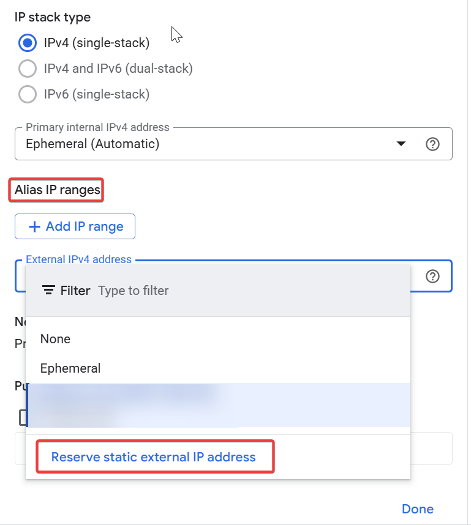
:::

## 2. Thiết lập không gian làm việc

### Kết nối với máy local

Ở đây, ta sẽ sử dụng SSH client là **MobaXterm** ([link](https://mobaxterm.mobatek.net)) để kết nối với VM trên GCP.

1. Trước tiên, ta cần phải tạo `SSH key` ở máy local, mở `cmd` và chạy câu lệnh:

```bash
ssh-keygen -t ed25519 -C "devops" -f "path-to-your-folder"
# passpharse có thể để trống
```

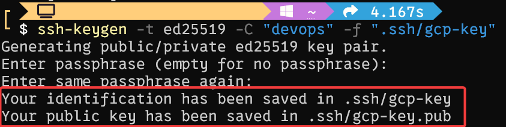

2. Truy cập vào đường dẫn bạn vừa tạo `SSH key`, mở file có đuôi `.pub` và copy nội dung.
3. Truy cập vào Metadata trên GCP để thêm `public key`
   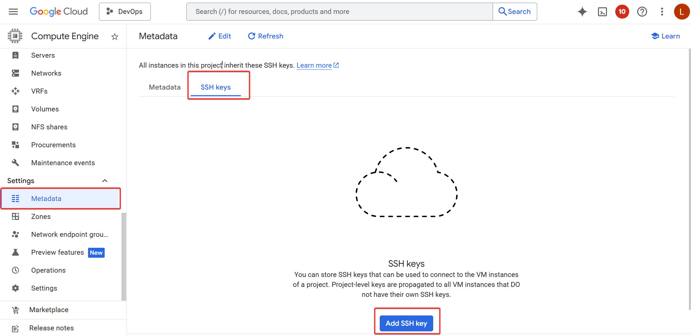

4. Tạo `session` mới trên **MobaXterm** với cấu hình sau:

- **Remote host:** `devops@<vm-external-ip>`
- Chọn **Use private key** và trỏ đến file `private key` tương ứng.

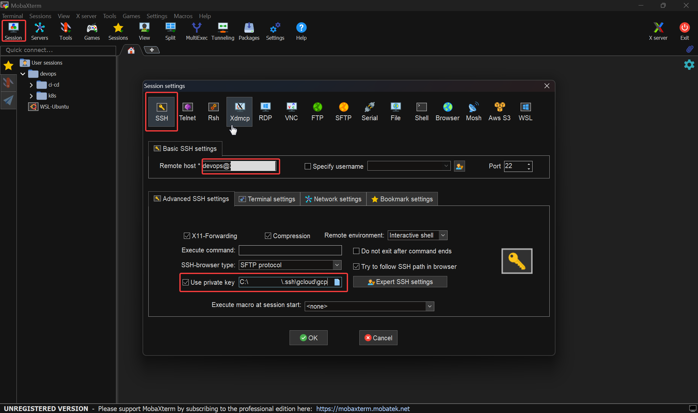

Kiểm tra kết nối
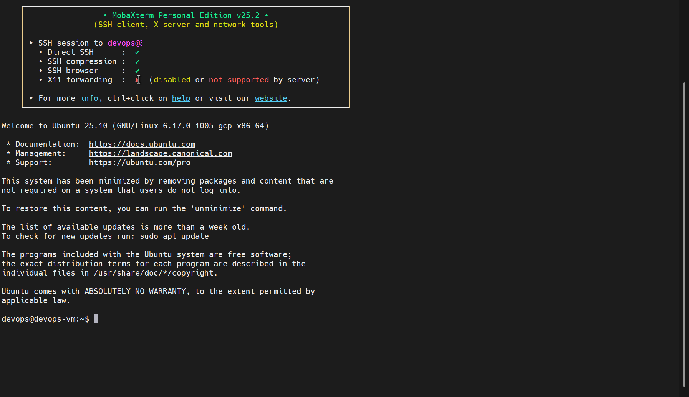

## 3. Cài đặt Harbor (Private Registry)

Harbor không chỉ là nơi lưu trữ Image, nó còn tích hợp quét lỗ hổng bảo mật (Vulnerability Scanning). Vì Harbor khá nặng, chúng ta sẽ cài đặt nó theo dạng **Offline Installer** để đảm bảo tính ổn định.

**Bước 3.1: Tải và giải nén Harbor**

```bash
# Tạo thư mục quản lý tập trung
mkdir ~/devops-stack && cd devops-stack
# Truy cập trang Release của Harbor trên Github để lấy bản mới nhất
wget https://github.com/goharbor/harbor/releases/download/v2.10.0/harbor-offline-installer-v2.10.0.tgz
tar xvzf harbor-offline-installer-v2.10.0.tgz
cd harbor
```

**Bước 3.2: Cấu hình file `harbor.yml`**
Copy file mẫu và chỉnh sửa:

```bash
grep -v "^[[:space:]]*#" harbor.yml.tmpl | grep -v "^$" > harbor.yml
nano harbor.yml
```

Các thông số **bắt buộc** cần sửa:

- **hostname:** Điền IP của máy ảo.
- **http/port:** Mặc định là 80. Nếu bạn đã dùng port 80 cho Nginx Proxy Manager, hãy đổi port Harbor thành `8083`.
- **external_url (thêm vào sau section http):** Tên miền của bạn (VD: <u>registry.codebyluke.io.vn</u>) - Harbor sẽ hiểu rằng mọi request trả về cho client phải dùng domain này thay vì IP.
- **https:** Nginx Proxy Manager (NPM) sẽ lo phần chứng chỉ nên ta có thể **comment (vô hiệu hóa)** toàn bộ phần https
- **harbor_admin_password:** Đặt mật khẩu quản trị cho bạn.

```yaml
hostname: <YOUR-EXTERNAL-IP>
http:
  port: 8083
external_url: https://<your-domain-name>
harbor_admin_password: Harbor12345
database:
  password: root123
  max_idle_conns: 100
  max_open_conns: 900
  conn_max_lifetime: 5m
  conn_max_idle_time: 0
data_volume: /data
trivy:
  ignore_unfixed: false
  skip_update: false
  offline_scan: false
  security_check: vuln
  insecure: false
jobservice:
  max_job_workers: 10
  job_loggers:
    - STD_OUTPUT
    - FILE
  logger_sweeper_duration: 1 #days
notification:
  webhook_job_max_retry: 3
  webhook_job_http_client_timeout: 3 #seconds
log:
  level: info
  local:
    rotate_count: 50
    rotate_size: 200M
    location: /var/log/harbor
_version: 2.10.0
proxy:
  http_proxy:
  https_proxy:
  no_proxy:
  components:
    - core
    - jobservice
    - trivy
upload_purging:
  enabled: true
  age: 168h
  interval: 24h
  dryrun: false
cache:
  enabled: false
  expire_hours: 24
```

**Bước 3.3: Chạy Script cài đặt**
Nếu bạn muốn cài thêm tính năng quét bảo mật (Trivy), hãy thêm flag `--with-trivy`:

```bash
sudo ./install.sh --with-trivy
```

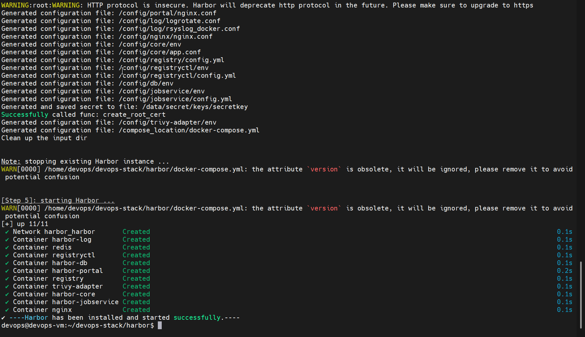

:::note[Cài đặt thư viện]

- Nếu bạn gặp lỗi `docker not found`, là do bạn chưa cài đặt Docker. Bạn có thể tham khảo [ở đây](../../Docker/linux-installation.md)

- Nếu bạn gặp thông báo `nano not found`, đây là do bạn chưa cài đặt thư viện, chạy câu lệnh sau để cài đặt:

```bash
sudo apt-get update && sudo apt-get install nano -y
```

:::

**Bước 3.4: Cấu hình "Insecure Registries" (Quan trọng)**
Vì mặc định Docker yêu cầu HTTPS, nếu bạn dùng HTTP cho Harbor, bạn phải báo cho Docker biết:

```bash
sudo nano /etc/docker/daemon.json
# Thêm dòng sau:
{
  "insecure-registries" : ["<hostname của harbor đã config ở trên>"]
}
# Sau đó restart docker
sudo systemctl restart docker

```

---

## 4. Cài đặt DevOps Stack (Docker Compose)

Trước tiên, chúng ta cần tạo 1 file docker riêng cho **Jenkins** vì cần phải cài đặt Docker và Google Cloud CLI vào trong Jenkins để phục vụ việc build và push image to Artifact Registry sau này

```bash
mkdir ~/jenkins && cd jenkins
sudo nano Dockerfile
```

Copy và dán vào `Dockerfile`

```Dockerfile
FROM jenkins/jenkins:lts
USER root

# 1. Install base lib
RUN apt-get update && apt-get install -y \
    lsb-release \
    curl \
    gnupg \
    apt-transport-https \
    ca-certificates

# 2. Install Docker
RUN curl -fsSLo /usr/share/keyrings/docker-archive-keyring.asc \
    https://download.docker.com/linux/debian/gpg \
    && echo "deb [arch=$(dpkg --print-architecture) signed-by=/usr/share/keyrings/docker-archive-keyring.asc] \
    https://download.docker.com/linux/debian $(lsb_release -cs) stable" > /etc/apt/sources.list.d/docker.list \
    && apt-get update && apt-get install -y docker-ce-cli

# 3. Install GCI
RUN echo "deb [signed-by=/usr/share/keyrings/cloud.google.gpg] https://packages.cloud.google.com/apt cloud-sdk main" | \
    tee -a /etc/apt/sources.list.d/google-cloud-sdk.list \
    && curl https://packages.cloud.google.com/apt/doc/apt-key.gpg | \
    gpg --dearmor -o /usr/share/keyrings/cloud.google.gpg \
    && apt-get update && apt-get install -y google-cloud-cli

# 4. Remove to reduce image size
RUN rm -rf /var/lib/apt/lists/*

USER jenkins
```

Trở về lại thư mục `devops-stack`, tạo file `docker-compose.yml` để quản lý Jenkins, GitLab và Nginx Proxy Manager (NPM).

```bash
cd ..
sudo nano docker-compose.yml
```

Copy và dán vào `docker-compose.yml`

```yaml
services:
  nginx-proxy-manager:
    image: "jc21/nginx-proxy-manager:latest"
    container_name: nginx-proxy-manager
    restart: always
    ports:
      - "80:80" # HTTP Traffic
      - "81:81" # Web UI Admin
      - "443:443" # HTTPS Traffic
    volumes:
      - ./npm/data:/data
      - ./npm/letsencrypt:/etc/letsencrypt
    networks:
      - devops-network
      - harbor_network # Config để npm connect được với harbor

  # Jenkins
  jenkins:
    build: ./jenkins # Path to Jenkins Dockerfile
    container_name: jenkins
    # ports:
    #   - "50000:50000"
    volumes:
      - jenkins_data:/var/jenkins_home
      - /var/run/docker.sock:/var/run/docker.sock
    user: root
    restart: always
    networks:
      - devops-network
      - harbor_network # Config để Jenkins push image tới harbor

  # GitLab
  gitlab:
    image: gitlab/gitlab-ce:latest
    container_name: gitlab
    hostname: git.codebyluke.io.vn
    ports:
      - "222:22"
    volumes:
      - gitlab_config:/etc/gitlab
      - gitlab_logs:/var/log/gitlab
      - gitlab_data:/var/opt/gitlab
    environment:
      GITLAB_OMNIBUS_CONFIG: |
        external_url 'http://gitlab.codebyluke.io.vn'
        gitlab_rails['gitlab_shell_ssh_port'] = 222
    restart: always
    networks:
      - devops-network

  #Uptime Kuma
  uptime-kuma:
    image: louislam/uptime-kuma:2
    container_name: uptime-kuma
    restart: always
    volumes:
      - uptime_kuma_data:/app/data
    networks:
      - devops-network

volumes:
  jenkins_data:
  gitlab_config:
  gitlab_logs:
  gitlab_data:
  uptime_kuma_data:

networks:
  devops-network:
    driver: bridge
  harbor_network:
    external: true
    name: harbor_harbor
```

Sau đó chạy `docker compose up -d` để cài đặt images

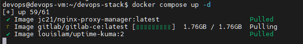

Kiểm tra bằng lệnh `docker ps` để chắc rằng các images (Harbor, Jenkins, Uptime kuma, etc) đều chạy

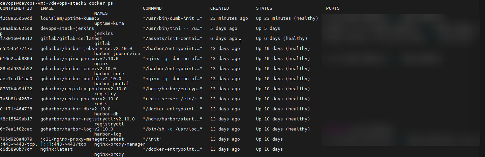

---

## 5. Cài đặt cụm K8s On-premise (1 Master - 2 Worker)

Ta sẽ sử dụng lại VM chạy docker làm máy **master** và phải tạo thêm 2 máy **worker** với cấu hình như sau

- **Cấu hình hạ tầng:** Vì đây là máy worker nên cấu hình sẽ thấp hơn so với máy master, ở đây ta s4 chọn **e2-standard-2** (2 vCPU, 8 GB RAM).
  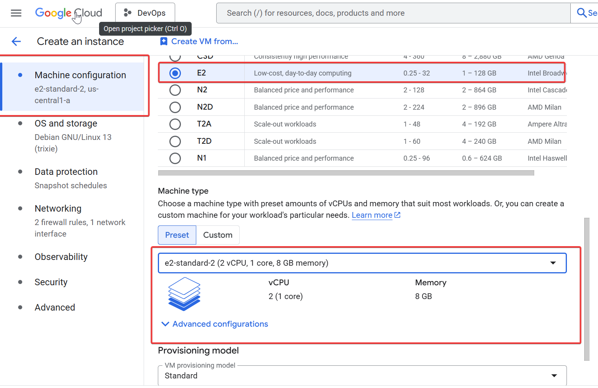

- **Hệ điều hành và lưu trữ:** Ở đây ta sẽ sử dụng HĐH như master là **Ubuntu 25.10 Minimal**, nhưng storage chỉ là **50GB**

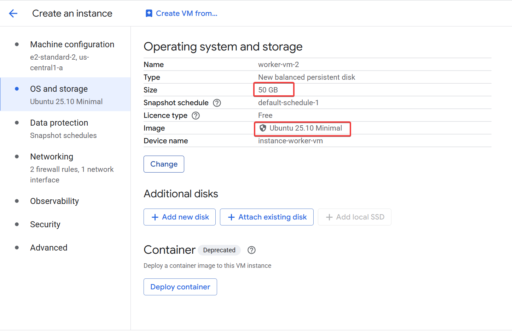

- **Network:** Check `Allow HTTP/HTTPS traffic`

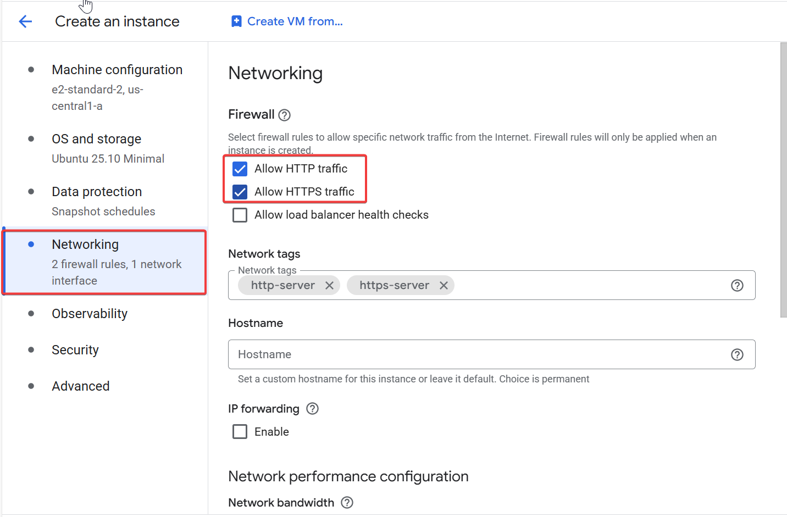

:::danger[Set external IP static]

Mặc định khi tạo VM trên GCP, cả Internal/External IP đều là Dynamic (Ephemeral - Tạm thời). Tuy nhiên, cơ chế thay đổi của 2 cái là khác nhau:

- **External:** Thay đổi khi bạn STOP/DELETE máy ảo
- **Internal:** Chỉ thay đổi khi bạn DELETE

Do là môi trường lab, nên khi làm xong một phần, ta có thể tắt máy ảo (giảm thiểu chi phí) để bữa sau làm tiếp => cần phải thay đổi **External IP** thành **static**. Bước làm như sau:

1. Vào menu **VPC Network** -> **IP addresses**.
2. Bạn sẽ thấy dòng IP External của máy VM đang có Type là Ephemeral.
3. Bấm vào dấu 3 chấm ở cuối dòng -> Chọn **Promote to static IP address**.
4. Đặt một cái tên (ví dụ: `devops-vm-ip`) -> Bấm Reserve.

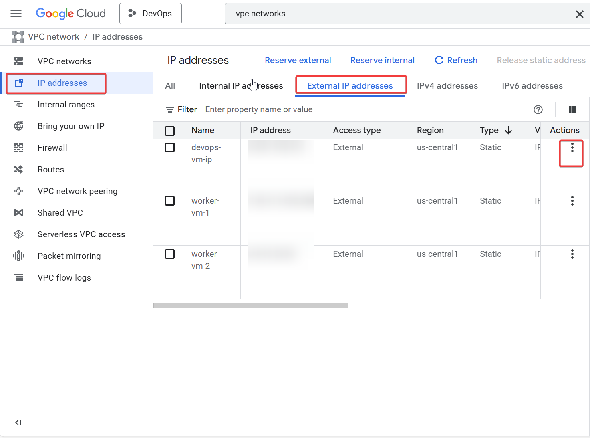

:::

Sau khi tạo xong 2 máy **worker**, ta sẽ làm theo [bài viết](../../Kubernetes/deploy_onpremis.md#4-turn-off-swap) để cài đặt cụm **K8s on-premise**

## 6. Cấu hình Firewall & Network

Ta cần mở các port sau trên Google Cloud Firewall:

- **80, 443:** Nginx Proxy Manager (Cửa ngõ chính).
- **81:** UI quản lý của Nginx Proxy Manager.
- **222**: Gitlab SSH
- **30000-32767:** Dải port dành cho NodePort của Kubernetes.

Cách làm:

1. Truy cập **Firewall** trong VPC để tạo

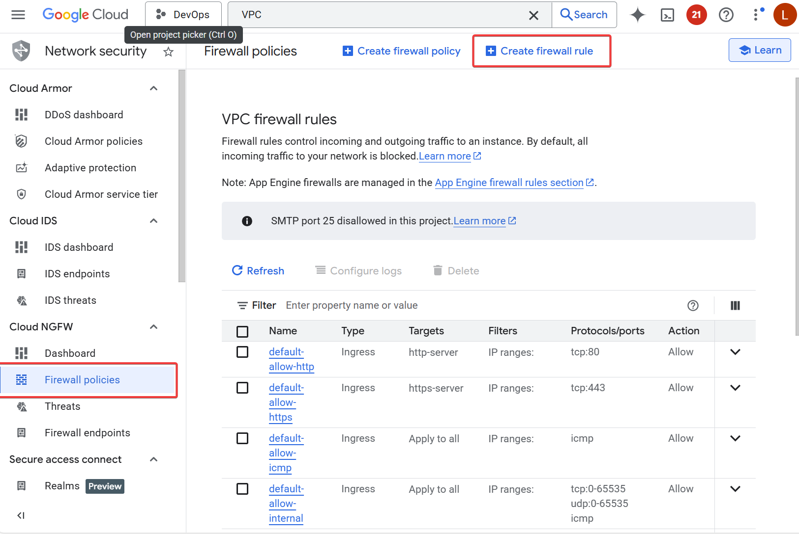

2. Chọn những thông số sau

- **Direct of traffic:** `Ingress`
- **Allow on match:** `Allow`
- **Source IPV4 ranges:** `0.0.0.0/0` (cấu hình này cho phép mọi ip có thể truy cập được)
- **Targets:** `Specified target tags` -> **Target tags:** Điền `devops-tag` hoặc tag custom bạn tạo ở [phần trên](#1-tại-sao-lại-dùng-compute-engine-giả-lập-on-premise)

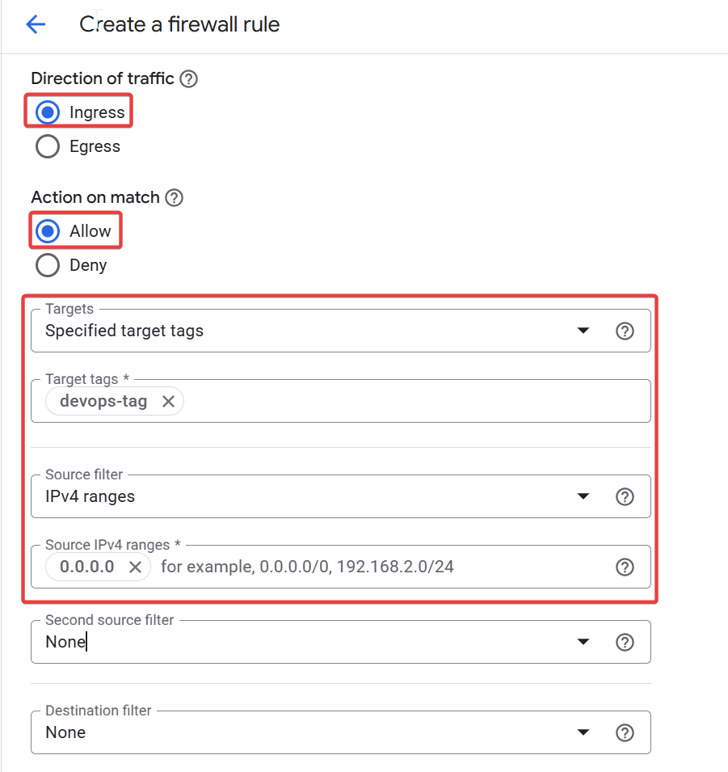

- **Protocol and ports:** `Specified protocols and ports` -> Chọn **TCP** và điền những port cần mở

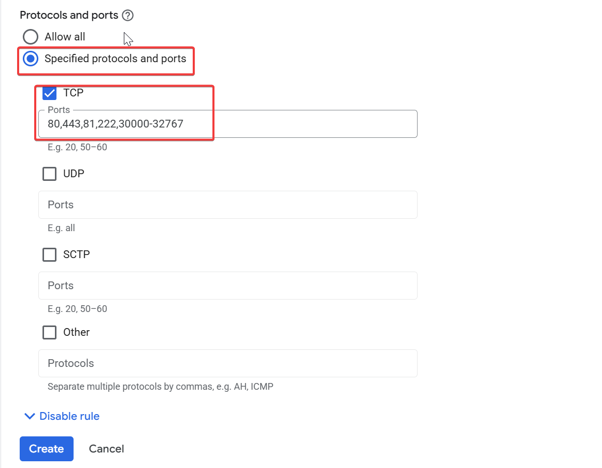

:::danger[Allow all firewall]
**TUYỆT ĐỐI KHÔNG CHỌN ALLOW ALL TRONG MÔI TRƯỜNG PRODUCTION**

Ở môi trường lab hoặc trong trường hợp chưa xác định được những port nào cần mở thì bạn có thể chọn **Allow all** nhưng nên setup lại khi đã khoanh vùng được ports

:::

---

## Kết luận

Xong bài này, chúng ta đã có một "đại bản doanh" đầy đủ vũ khí:

- **GitLab** sẵn sàng nhận code
- **Jenkins** sẵn sàng chạy pipeline
- **Harbor** sẵn sàng chứa image
- **K8s** sẵn sàng chạy ứng dụng
- **Uptime Kuma** sẵn sàng giám sát

Ở [bài sau](04-ConfigNPM.md), thay vì phải gõ `http://<IP>:<port>` để truy cập services thì chúng ta sẽ cấu hình **Nginx Proxy Manager** để có thể truy cập bằng `domain` một cách chuẩn chỉnh và chuyên nghiệp
