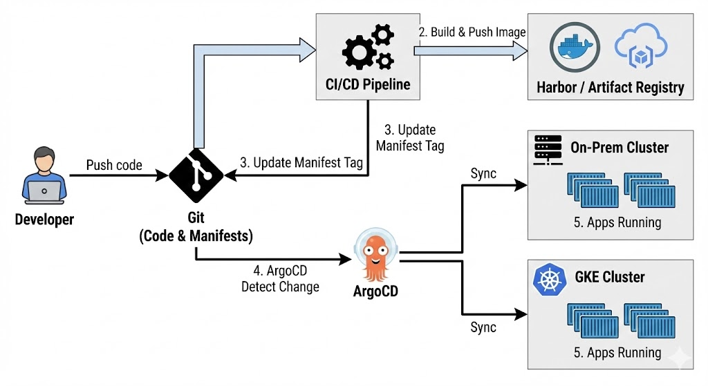

# Bài 4: Nginx Proxy Manager - Quy hoạch Domain và SSL cho hệ thống DevOps

Trong một hệ thống Hybrid-Cloud, việc quản lý hàng chục dịch vụ trên các port khác nhau (`8080`, `8081`, `8083`,...) là một thảm họa về vận hành. Đó là lý do chúng ta cần một "Người điều phối giao thông" - **Nginx Proxy Manager (NPM)**.



Bài viết này sẽ hướng dẫn bạn cách biến những địa chỉ IP thô kệch thành các Subdomain chuyên nghiệp như `jenkins.codebyluke.io.vn` hay `registry.codebyluke.io.vn`.

### 1. Nginx Proxy Manager (NPM) là gì?

NPM là một giao diện quản trị Web dựa trên Nginx, cho phép bạn tạo các Proxy Hosts, quản lý chứng chỉ SSL (Let's Encrypt) chỉ bằng vài cú click chuột. Thay vì phải cấu hình file `.conf` phức tạp của Nginx, bạn chỉ cần một giao diện trực quan.

### 2. Quy hoạch tên miền (Domain Mapping)

Trước khi cấu hình, chúng ta cần thống nhất sơ đồ ánh xạ từ Domain về các Port mà chúng ta đã cài đặt ở Bài 3:

| Dịch vụ         | Subdomain dự kiến           | Cấu hình Forward (container:Port) |
| --------------- | --------------------------- | --------------------------------- |
| **Jenkins**     | `jenkins.codebyluke.io.vn`  | `jenkins:8081`                    |
| **GitLab**      | `git.codebyluke.io.vn`      | `gitlab:80`                       |
| **Harbor**      | `registry.codebyluke.io.vn` | `nginx:80`                        |
| **Uptime Kuma** | `kuma.codebyluke.io.vn`     | `uptime-kuma:3001`                |

---

### 3. Các bước cấu hình thực tế

#### Bước 3.1: Trỏ DNS tại Cloudflare (hoặc nhà cung cấp Domain)

Trước tiên, bạn phải vào trang quản trị Domain và tạo các bản ghi **A Record** trỏ về IP Public của máy ảo (`34.121.44`).

- Ví dụ: Tạo bản ghi `registry` trỏ tới `34.70.11.44`.

#### Bước 3.2: Tạo Proxy Host cho Harbor (Trường hợp đặc biệt)

Harbor yêu cầu một số cấu hình đặc biệt để việc đẩy Image không bị lỗi:

1. Truy cập NPM tại port `81`.
2. Chọn **Add Proxy Host**.
3. **Details:** - Domain Names: `registry.codebyluke.io.vn`

- Scheme: `http`
- Forward Hostname/IP: `34.70.11.44` (IP nội bộ hoặc IP Public đều được).
- Forward Port: `8083`.
- Bật **Websockets Support** (Rất quan trọng cho các kết nối liên tục của Docker).

4. **Custom Nginx Configuration (Nâng cao):**
   Trong tab **Advanced**, bạn nên thêm đoạn code này để cho phép upload những Image nặng:

```nginx
client_max_body_size 0;
proxy_set_header X-Forwarded-Proto $scheme;
```

---

### 4. Giải quyết bài toán SSL (HTTPS)

Để hệ thống chuyên nghiệp và an toàn hơn, bạn có thể cấp chứng chỉ SSL miễn phí qua tab **SSL** trong NPM.

- Chọn **Request a new SSL Certificate**.
- Đồng ý với các điều khoản của Let's Encrypt.
- NPM sẽ tự động thực hiện quá trình HTTP Challenge và cấp Cert cho bạn trong vòng 30 giây.

---

### 5. Tại sao cấu hình này lại quan trọng cho Hybrid-Cloud?

Khi bạn chuyển vùng sự cố (Failover) từ GKE về On-premise, ứng dụng của bạn vẫn phải có cùng một Domain. Việc sử dụng NPM ở "đầu cầu" On-premise giúp chúng ta giữ nguyên cấu hình URL của ứng dụng, giúp người dùng cuối không hề nhận ra sự thay đổi ở phía backend.

> **Kinh nghiệm xương máu:** "Lần đầu mình cài Harbor, mình quên bật `Websockets Support` và không chỉnh `client_max_body_size`. Kết quả là cứ mỗi khi push image nặng trên 500MB là Nginx báo lỗi `413 Request Entity Too Large`. Đừng quên dòng cấu hình Advanced nếu bạn không muốn Pipeline bị nghẽn cổ chai nhé!"

---

### Kết luận

Bây giờ, mọi dịch vụ của chúng ta đã "có danh có phận" trên Internet thông qua các Domain đẹp. Đây là bước chuẩn bị cuối cùng để chúng ta bước vào phần hấp dẫn nhất: **Xây dựng Jenkins Pipeline thực thụ.**

Hẹn gặp lại các bạn ở **Bài 5: Jenkins Pipeline - Khi code bắt đầu bay lên Cloud!**
