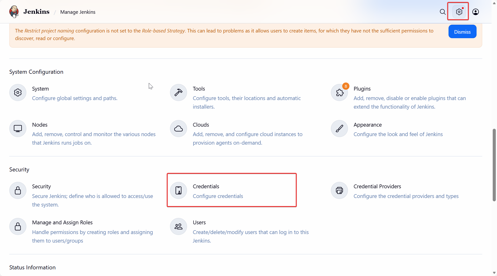

# Bài 5: GitLab - Thiết lập "Trạm chỉ huy" và Tư duy GitOps

Trong một hệ thống CI/CD chuyên nghiệp, cách bạn tổ chức Repository (kho chứa mã nguồn) sẽ quyết định độ linh hoạt và an toàn của toàn bộ quy trình. Hôm nay, chúng ta sẽ cùng thiết lập GitLab – nơi không chỉ lưu code mà còn là trung tâm điều phối của mô hình Hybrid-Cloud.

---

## 1. Lấy mật khẩu quản trị (Root) lần đầu tiên

Sau khi chạy Docker Compose, GitLab sẽ mất khoảng 2-5 phút để khởi động hoàn toàn. Khi truy cập vào domain `gitlab.codebyluke.io.vn`, bạn sẽ thấy màn hình đăng nhập. Vậy mật khẩu mặc định là gì?

Kể từ các phiên bản mới, GitLab không còn cho phép đặt mật khẩu ngay trên giao diện ở lần đầu truy cập. Thay vào đó, nó tự động tạo một mật khẩu ngẫu nhiên và lưu trong container. Để lấy mật khẩu này, bạn cần thực hiện lệnh sau trên máy `devops-vm`:

```bash
# Thay 'gitlab' bằng tên container của bạn nếu bạn đặt tên khác trong docker-compose
sudo docker exec -it gitlab grep 'Password:' /etc/gitlab/initial_root_password
```

:::tip[Lưu ý quan trọng]

- **Thời hạn:** File mật khẩu này sẽ tự động bị xóa sau **24 giờ**. Hãy đăng nhập bằng user `root` và đổi mật khẩu cá nhân của bạn ngay lập tức.
- **Nếu không thấy file:** Nếu bạn chạy lệnh trên mà báo lỗi không tìm thấy file, có thể là do container chưa khởi động xong hoặc bạn đã quá thời hạn 24h. Lúc này, bạn sẽ cần dùng lệnh `gitlab-rake` để reset mật khẩu thủ công (mình sẽ để lệnh dự phòng ở phần Comment nếu bạn nào cần).
  :::

---

## 1. Group và Repository: Tư duy tổ chức theo GitOps

Để quản lý chuyên nghiệp, chúng ta không nên tạo các dự án rời rạc. Hãy bắt đầu bằng cách tạo một **Group** tên là `hybrid-cloud`.


**Tại sao phải tách thành 2 Repository?**
Trong mô hình GitOps, mình sẽ tạo 2 kho chứa riêng biệt:

1. **`ecommerce-app`**: Chứa source code ứng dụng (NodeJS/Python/Java...), Unit Test và quan trọng nhất là `Dockerfile`.

2. **`ecommerce-manifest`**: Chứa các file cấu hình hạ tầng Kubernetes (Deployment, Service, Ingress, ConfigMap...).


:::tip [Bí mật kỹ thuật]
Việc tách đôi giúp tránh lỗi "vòng lặp vô tận". Nếu bạn để chung, khi Jenkins build xong và tự động update tag image mới vào file YAML rồi push ngược lại Git, GitLab sẽ lại thấy có thay đổi và kích hoạt Jenkins build tiếp... cứ thế mãi không dừng.
:::

---

### 2. Cấu hình định danh (External URL & SSH)

Để Jenkins và các công cụ khác có thể "nói chuyện" được với GitLab thông qua Domain chúng ta đã cấu hình ở [Bài 4](./04-ConfigNPM.md), bạn cần thực hiện hai thao tác sau:

**2.1. Sửa lỗi đường dẫn Clone (External URL)**
Nếu bạn thấy link clone trên GitLab hiện IP container hoặc `localhost`, hãy vào file cấu hình `gitlab.rb` trên máy chủ và chỉnh sửa:

```bash
external_url 'http://gitlab.codebyluke.io.vn'
```

Sau đó chạy `gitlab-ctl reconfigure`. Lúc này, mọi đường dẫn sẽ chuẩn hóa theo Domain qua Nginx Proxy Manager.

**2.2. Kết nối bằng SSH Key**
Thay vì dùng mật khẩu (kém an toàn), chúng ta sử dụng cặp khóa SSH:

- Tạo key trên máy Jenkins: `ssh-keygen -t rsa`.
- Copy nội dung file `.pub` và dán vào phần **SSH Keys** trong Profile của bạn trên GitLab.
  
- Chìa khóa riêng (Private Key) sẽ được giữ lại để cấu hình vào Jenkins ở bài sau.

---

### 3. Personal Access Token (PAT) - Chìa khóa cho sự tự động

Để Jenkins có quyền "thay mặt" bạn cập nhật phiên bản ứng dụng vào Repo `ecommerce-manifest`, bạn cần tạo một **Personal Access Token**:

1. Vào **User Settings** -> **Access Tokens**.
2. Đặt tên là `jenkins-token`.
3. Tích chọn quyền: `write_repository`.
4. Lưu mã Token này lại (chúng ta sẽ dùng nó để Jenkins "ghi đè" cấu hình YAML hoàn toàn tự động).

---

### 💡 Góc kinh nghiệm: "Đừng quên cấu hình Network cho GitLab"

Trong quá trình làm, mình từng gặp lỗi Jenkins không thể clone code dù đã add đúng SSH Key. Hóa ra là do GitLab chạy trong Docker có cơ chế bảo mật chặn các yêu cầu từ mạng nội bộ (Outbound requests).

- **Mẹo:** Hãy vào **Admin Area** -> **Settings** -> **Network** -> **Outbound requests**, tích chọn _"Allow requests to the local network"_ để Jenkins và GitLab có thể tìm thấy nhau dễ dàng hơn.

---

### Kết luận

Xong Bài 5, chúng ta đã có một "trạm chỉ huy" GitLab cực kỳ chuẩn chỉnh với tư duy GitOps hiện đại. Mọi thứ đã sẵn sàng để được kéo về và xử lý bởi bộ máy thực thi.

Ở bài tiếp theo, mình sẽ cùng các bạn cấu hình **Jenkins** – nơi chúng ta sẽ biến những dòng code này thành những Container chạy trên Cloud, kèm theo hệ thống phân quyền QA chuyên nghiệp.

Hẹn gặp lại các bạn ở **Bài 6: Jenkins - Thiết lập "Bộ máy thực thi" và Phân quyền QA!**
