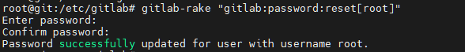
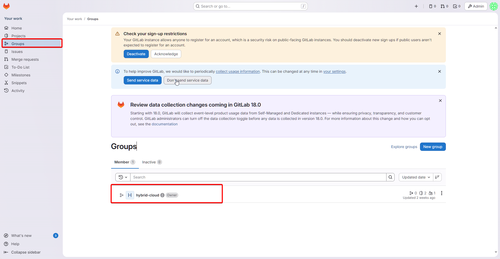
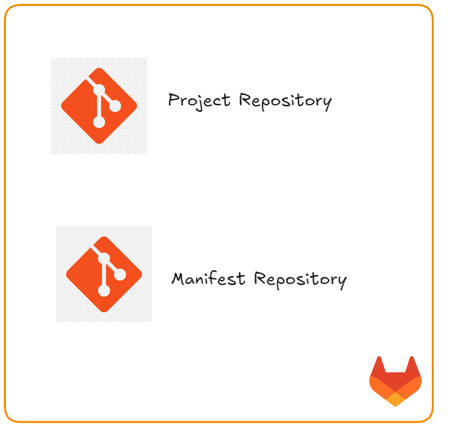
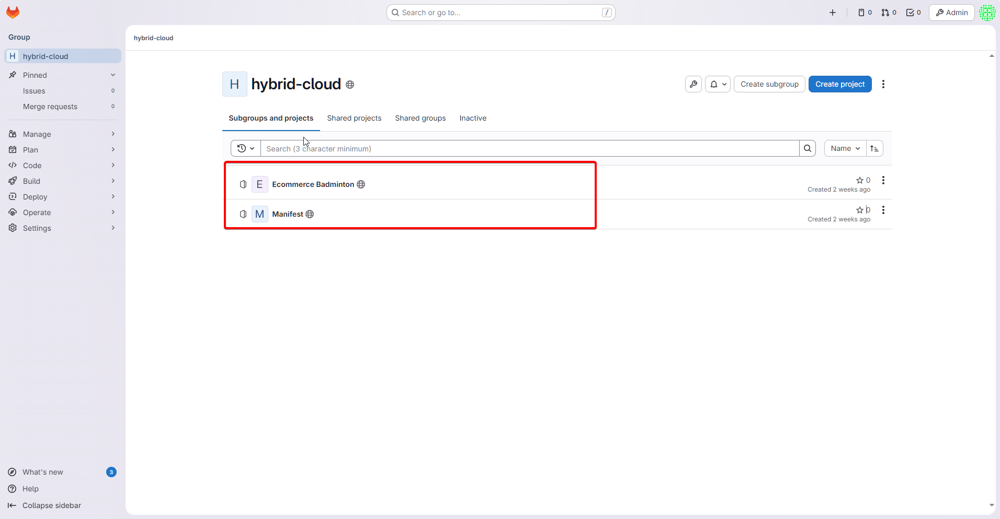
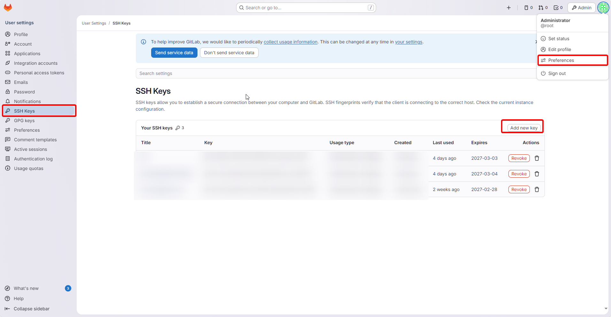
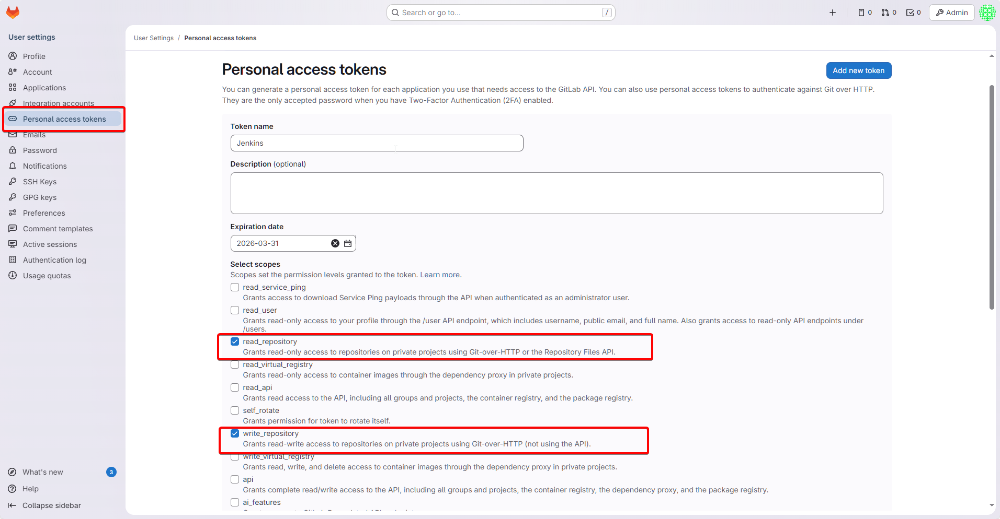

# Bài 5: GitLab - Thiết lập "Trạm chỉ huy" và Tư duy GitOps

Trong một hệ thống CI/CD chuyên nghiệp, cách bạn tổ chức Repository (kho chứa mã nguồn) sẽ quyết định độ linh hoạt và an toàn của toàn bộ quy trình. Hôm nay, chúng ta sẽ cùng thiết lập GitLab – nơi không chỉ lưu code mà còn là trung tâm điều phối của mô hình Hybrid-Cloud.

---

## 1. Lấy mật khẩu quản trị (Root) lần đầu tiên

Sau khi chạy Docker Compose, GitLab sẽ mất khoảng 2-5 phút để khởi động hoàn toàn. Khi truy cập vào domain `gitlab.codebyluke.io.vn`, bạn sẽ thấy màn hình đăng nhập. Vậy mật khẩu mặc định là gì?

Kể từ các phiên bản mới, GitLab không còn cho phép đặt mật khẩu ngay trên giao diện ở lần đầu truy cập. Thay vào đó, nó tự động tạo một mật khẩu ngẫu nhiên và lưu trong container. Để lấy mật khẩu này, bạn cần thực hiện lệnh sau trên máy `devops-vm`:

```bash
# Thay 'gitlab' bằng tên container của bạn nếu bạn đặt tên khác trong docker-compose
sudo docker exec -it gitlab grep 'Password:' /etc/gitlab/initial_root_password
```

:::tip[Reset root password]

- **Lưu ý:** File mật khẩu này sẽ tự động bị xóa sau **24 giờ**. Hãy đăng nhập bằng user `root` và đổi mật khẩu cá nhân của bạn ngay lập tức.
- **Nếu không thấy file:** Nếu bạn chạy lệnh trên mà báo lỗi không tìm thấy file, có thể là do container chưa khởi động xong hoặc bạn đã quá thời hạn 24h. Lúc này, bạn sẽ cần dùng lệnh `gitlab-rake` để reset mật khẩu thủ công. Cách làm như sau:

1. Truy cập vào VM và chạy lệnh sau để truy cập `gitlab` container

```bash
# Access gitlab container
sudo docker exec -it gitlab /bin/bash
```

2. Chạy câu lệnh sau và chờ một lúc (nhanh hay chậm tùy vào resource của VM)

```bash
# CD to gitlab folder
cd /etc/gitlab
# Reset root password
gitlab-rake "gitlab:password:reset[root]"
```



:::

---

## 2. Group và Repository: Tư duy tổ chức theo GitOps

Để quản lý chuyên nghiệp, chúng ta không nên tạo các dự án rời rạc. Hãy bắt đầu bằng cách tạo một **Group** tên là `hybrid-cloud`.



Tiếp theo, ta sẽ tạo 2 `repository` tương ứng:



- **Project Repository:** Chứa source code ứng dụng (NodeJS/Python/Java...), Unit Test và quan trọng nhất là `Dockerfile`.
- **Manifest Repository:** Chứa các file cấu hình hạ tầng Kubernetes (Deployment, Service, Ingress, ConfigMap...).



:::note[Repository demo]
Với mục đích demo, bạn có thể sử dụng project mẫu sau:

- [Project repository](https://github.com/LocNguyenPV/Ecommerce-badminton)
- [Manifest repository](https://github.com/LocNguyenPV/hybrid-cloud-manifest)

:::

:::tip[Tại sao phải tách thành 2 Repository?]
Việc tách đôi giúp tránh lỗi "vòng lặp vô tận". Nếu bạn để chung, khi Jenkins build xong và tự động update tag image mới vào file YAML rồi push ngược lại Git, GitLab sẽ lại thấy có thay đổi và kích hoạt Jenkins build tiếp... cứ thế mãi không dừng. Ngoài ra, nó còn giúp tổ chức code rõ ràng và dễ quản lý.
:::

---

## 3. Cấu hình

Để Jenkins có thể "nói chuyện" được với GitLab thông qua Domain chúng ta đã cấu hình ở [Bài 4](./04-ConfigNPM.md) và có thể clone/push code lên repository thì ta cần phải thực hiện vài việc sau:

### 3.1. Sửa lỗi đường dẫn Clone (External URL)

Nếu bạn thấy link clone trên GitLab hiện IP container hoặc `localhost`, hãy vào file cấu hình `gitlab.rb` trên máy chủ và chỉnh sửa:

```bash
external_url 'http://gitlab.codebyluke.io.vn'
```

Sau đó chạy `gitlab-ctl reconfigure`. Lúc này, mọi đường dẫn sẽ chuẩn hóa theo Domain qua Nginx Proxy Manager.

### 3.2. Kết nối bằng SSH Key (Dành cho máy dev)

Thay vì dùng mật khẩu (kém an toàn), chúng ta sử dụng cặp khóa SSH:

- Tạo key trên máy local của bạn với câu lệnh: `ssh-keygen -t ed25519`.
- Copy nội dung file `.pub` và dán vào phần **SSH Keys** trong Profile của bạn trên GitLab.
  
- Cấu hình lại file `config` ở máy bạn (`C:\Users\<Your-PC-Name>\.ssh`)

```cmd
Host gitlab-personal
  HostName your-domain-gitlab-name
  User git
  IdentityFile YOUR-PATH-TO-PRIVATE-KEY
  Port 222 # Vì container đang map port 222:22
  PreferredAuthentications publickey
```

- Sau đó, sử dụng lệnh sau để kiểm thử kết nối

```bash
ssh -T git@gitlab-personal
```

### 3.3. Personal Access Token (PAT) - Chìa khóa cho sự tự động

Việc quản lý quyền truy cập thông qua Personal Access Token (PAT) là bước cực kỳ quan trọng để đảm bảo tính bảo mật và khả năng tự động hóa mượt mà cho hệ thống CI/CD.

Dưới đây là cách phân loại và định nghĩa lại 3 loại token này một cách rõ ràng, dễ hiểu hơn:

---

## Danh sách các Personal Access Token (PAT) cần thiết

Để hệ thống vận hành tự động, chúng ta cần khởi tạo 3 **PAT** riêng biệt trên GitLab với các phạm vi quyền (scopes) cụ thể như sau:

### 1. jenkins-report-token

- **Mục đích:** Cho phép Jenkins gửi thông báo trạng thái (Success/Fail) của các giai đoạn build về giao diện GitLab.
- **Quyền hạn (Scope):** `api`
- **Vị trí sử dụng:** Cấu hình trong phần `GitLab Connection` của Jenkins.

### 2. jenkins-pipeline-token

- **Mục đích:** Đây là quyền "vận hành" chính, cho phép Jenkins tương tác trực tiếp với mã nguồn để thực hiện các thay đổi tự động.
- **Quyền hạn (Scopes):**
- `read_repository`: Để Jenkins có thể tải (clone) mã nguồn về kiểm tra.
- `write_repository`: Để Jenkins tự động cập nhật tag phiên bản mới vào các file manifest trong repo `ecommerce-manifest`.

- **Vị trí sử dụng:** Lưu trong `Jenkins Credentials`.

### 3. argocd-token

- **Mục đích:** Cung cấp "quyền xem" cho ArgoCD để nó có thể theo dõi sự thay đổi trong repository manifest và đồng bộ lên Kubernetes.
- **Quyền hạn (Scope):** `read_repository`
- **Vị trí sử dụng:** Cấu hình trong phần `Repository Connection` của giao diện quản trị ArgoCD.

<!-- ### Bảng tổng hợp nhanh

| Tên Token            | Đối tượng sử dụng | Quyền hạn (Scope)         | Chức năng chính                            |
| -------------------- | ----------------- | ------------------------- | ------------------------------------------ |
| **jenkins-report**   | Jenkins           | `api`                     | Cập nhật trạng thái Build Stage lên GitLab |
| **jenkins-pipeline** | Jenkins           | `read_repo`, `write_repo` | Clone code và tự động Update Manifest      |
| **argocd-pat**       | ArgoCD            | `read_repo`               | Đọc file Manifest để đồng bộ lên Cluster   | -->

:::danger[Lưu ý bảo mật]
Hãy đặt ngày hết hạn (Expiry date) cho các token này và lưu trữ chúng an toàn trong các trình quản lý biến môi trường của Jenkins/ArgoCD, tuyệt đối không viết trực tiếp vào mã nguồn.
:::

Quy trình thực hiện như sau:

- Vào **User Settings** -> **Personal Access Tokens**.
- Đặt tên cho token.
- Tích chọn quyền tương ứng (**Lưu mã Token này lại để sử dụng cho bài sau**)



:::tip[Security fix cho Gilab]
Trong quá trình làm, mình từng gặp lỗi Jenkins không thể clone code dù đã add đúng Key. Hóa ra là do GitLab chạy trong Docker có cơ chế bảo mật chặn các yêu cầu từ mạng nội bộ (Outbound requests).

=> Hãy vào **Admin Area** -> **Settings** -> **Network** -> **Outbound requests**, tích chọn _"Allow requests to the local network"_ để Jenkins và GitLab có thể tìm thấy nhau dễ dàng hơn.
:::

---

## Kết luận

Xong Bài 5, chúng ta đã có một "trạm chỉ huy" GitLab cực kỳ chuẩn chỉnh với tư duy GitOps hiện đại. Mọi thứ đã sẵn sàng để được kéo về và xử lý bởi bộ máy thực thi.

Ở bài tiếp theo, mình sẽ cùng các bạn cấu hình **Jenkins** – nơi chúng ta sẽ biến những dòng code này thành những Container chạy trên Cloud, kèm theo hệ thống phân quyền QA chuyên nghiệp.

Hẹn gặp lại các bạn ở [**Bài 6: Jenkins - Thiết lập "Bộ máy thực thi" và Phân quyền QA!**](06-ConfigJenkins.md)
