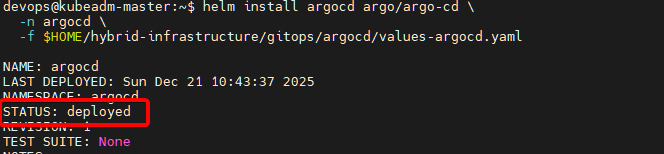

# Bài 6: Jenkins - Thiết lập "Bộ máy thực thi" và Phân quyền QA chuyên nghiệp

Sau khi đã có "trạm chỉ huy" GitLab ở [bài trước](06-ConfigJenkins.md), hôm nay chúng ta sẽ đánh thức "gã khổng lồ" **Jenkins**. Đây là nơi mọi logic build, test, push image và đặc biệt là bước phê duyệt của QA sẽ diễn ra.


## 1. Cài đặt các "Vũ khí" (Plugins) bắt buộc

Để Jenkins có thể xử lý được luồng Hybrid-Cloud phức tạp, bạn cần cài đặt bộ tứ Plugin sau (Vào **Manage Jenkins** -> **Plugins**):



1. **Role-based Authorization Strategy:** Để tạo ra cơ chế phân quyền (RBAC) chuẩn doanh nghiệp.
2. **Docker Pipeline:** Cho phép Jenkins chạy các lệnh Docker ngay trong script.
3. **Pipeline Graph View:** Để chúng ta có cái nhìn trực quan về các bước build.

:::tip[Plugin for SSH]
Nếu bạn lựa chọn kết nối Jenkins với Gitlab thông qua SSH key thì cần phải cài thêm **SSH agent**, plugin này cho phép pipeline sử dụng SSH key để clone/push code
:::

## 2. Quản lý Credentials

Thay vì dùng SSH phức tạp, chúng ta sẽ dùng **PAT (Personal Access Token)** đã tạo ở Bài 5 làm Credential duy nhất.

:::tip[Domain Credentials]

Để tiện cho việc quản lý credentials theo từng project, chúng ta có thể khởi tạo

:::

1. Vào **Manage Jenkins** -> **Credentials** -> **System** -> **Global credentials**.

2. Chọn **Add Credentials**.
3. **Kind:** Username with password.
4. **Username:** `gitlab-token-user` (hoặc tên bất kỳ).
5. **Password:** Dán mã **PAT** từ GitLab vào.
6. **ID:** `gitlab-pat-creds` (Ghi nhớ ID này để dùng trong code Pipeline).

> **Lưu ý:** Đừng quên tạo thêm một Credential tương tự cho **Harbor** với ID là `harbor-creds` để Jenkins có quyền đẩy Image lên Registry nhé!

### 3. Role-based Strategy: Phân quyền cho QA (RBAC)

Trong thực tế, Developer không nên là người tự nhấn nút "Deploy lên Production". Chúng ta cần một lớp kiểm duyệt từ QA.

**Bước 1: Kích hoạt RBAC**
Vào **Manage Jenkins** -> **Security**, tại phần **Authorization**, chọn **Role-Based Strategy**.

**Bước 2: Tạo Role cho QA**
Vào **Manage Jenkins** -> **Manage and Assign Roles** -> **Manage Roles**:

* Tạo Role tên là `qa_approver`.
* Cấp quyền: `Overall/Read` và `Job/Build` (để họ có thể nhấn nút Approve trong Pipeline).

**Bước 3: Gán Role cho User**
Tạo một User mới tên là `qa_user`. Sau đó vào **Assign Roles** và gán Role `qa_approver` cho user này. Lúc này, QA chỉ có thể xem và duyệt, không thể "phá" hệ thống của bạn.

### 4. Kết nối Webhook: "Ngòi nổ" tự động

Để mỗi khi bạn `git push`, Jenkins sẽ tự chạy:

1. Tạo một **Pipeline Job** mới trên Jenkins.
2. Trong phần **Build Triggers**, tích chọn **Build when a change is pushed to GitLab**.
3. Copy đường dẫn **GitLab webhook URL** hiển thị tại đó.
4. Quay lại GitLab Repo `ecommerce-app` -> **Settings** -> **Webhooks** -> Dán URL vào và lưu lại.

### 5. Test: "First Blood" Pipeline

Hãy tạo một Pipeline đơn giản để kiểm tra xem Jenkins đã kéo được code bằng PAT chưa:

```groovy
pipeline {
    agent any
    stages {
        stage('Checkout') {
            steps {
                // Sử dụng PAT để kéo code
                git credentialsId: 'gitlab-pat-creds', url: 'http://git.codebyluke.io.vn/hybrid-cloud/ecommerce-app.git'
            }
        }
        stage('QA Approve') {
            steps {
                input message: 'QA xác nhận bản build này ổn chứ?'
            }
        }
    }
}

```

---

### 💡 Góc kinh nghiệm: "Tại sao nên dùng PAT thay vì SSH?"

Khi mình mới bắt đầu, mình từng loay hoay cả ngày với lỗi `Permission denied (publickey)` của SSH. Từ khi chuyển sang dùng **PAT qua HTTPS**, mọi thứ trở nên sáng sủa hơn hẳn. Bạn vừa có thể **Clone** code, vừa có thể dùng chính Token đó để **Push** thay đổi lên repo Manifest một cách mượt mà. Trong DevOps, đôi khi "Đơn giản chính là đỉnh cao của sự tinh tế".

---

### Kết luận

Jenkins đã sẵn sàng, QA đã có "ghế" để ngồi đợi duyệt. Ở bài tiếp theo, chúng ta sẽ bước vào phần "nghệ thuật" nhất: **Viết Jenkinsfile hoàn chỉnh** để thực hiện Build - Push - Notify và tự động cập nhật Manifest.

Hẹn gặp lại các bạn ở **Bài 7: Jenkinsfile - Nghệ thuật điều phối luồng Hybrid-Cloud!**

---

**Gợi ý cho Phong:**

1. **Hình ảnh:** Phong hãy chụp giao diện lúc Jenkins đang dừng ở bước `Input` chờ QA Approve. Đây là hình ảnh rất "ăn tiền" cho bài viết này.
2. **Mẹo nhỏ:** Nhắc người đọc là sau khi đổi sang Role-based Strategy, nếu lỡ tay cấu hình sai mà bị khóa (Lock out), hãy vào file `config.xml` của Jenkins để sửa lại.

Phong thấy nội dung bài này đã đúng với luồng bạn đang triển khai chưa? Nếu ok, mình sẽ giúp bạn soạn thảo **Bài 7** với một bản **Jenkinsfile thực chiến** có đầy đủ các bước push image lên Harbor nhé!