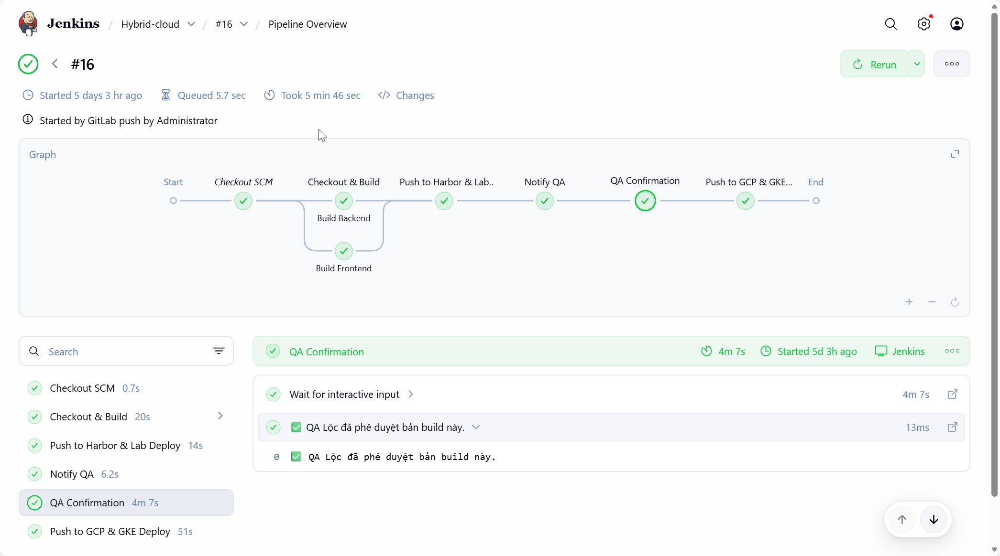
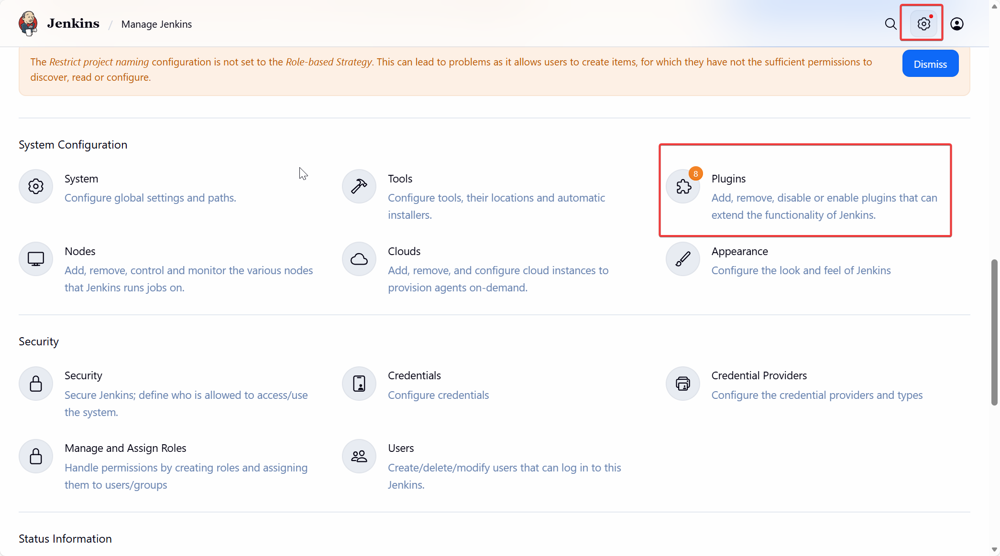
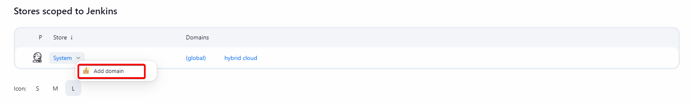
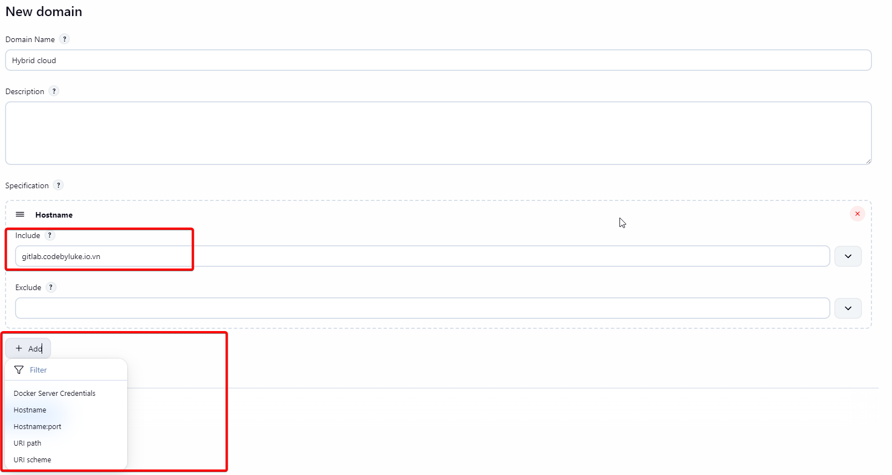

# Bài 6: Jenkins - Thiết lập "Bộ máy thực thi" và Phân quyền QA chuyên nghiệp

Sau khi đã có "trạm chỉ huy" GitLab ở [bài trước](06-ConfigJenkins.md), hôm nay chúng ta sẽ đánh thức "gã khổng lồ" **Jenkins**. Đây là nơi mọi logic build, test, push image và đặc biệt là bước phê duyệt của QA sẽ diễn ra.

## 1. Cài đặt Plugins

Để Jenkins có thể xử lý được luồng Hybrid-Cloud phức tạp, bạn cần cài đặt bộ tứ Plugin sau (Vào **Manage Jenkins** -> **Plugins**):

1. **Role-based Authorization Strategy:** Để tạo ra cơ chế phân quyền (RBAC) chuẩn doanh nghiệp.
2. **Docker Pipeline:** Cho phép Jenkins chạy các lệnh Docker ngay trong script.
3. **Pipeline Graph View:** Để chúng ta có cái nhìn trực quan về các bước build.

:::tip[Plugin for SSH]
Nếu bạn lựa chọn kết nối Jenkins với Gitlab thông qua SSH key thì cần phải cài thêm **SSH agent**, plugin này cho phép pipeline sử dụng SSH key để clone/push code
:::

## 2. Quản lý Credentials

Thay vì dùng SSH phức tạp, chúng ta sẽ dùng **PAT (Personal Access Token)** đã tạo ở Bài 5 làm Credential.

Để tiện cho việc quản lý credentials theo từng project, chúng ta có thể khởi tạo domain `hybrid-cloud` để chứa những token liên quan đến project

:::tip[Advance]
Nếu muốn cấu hình domain một cách chuyên nghiệp hơn thì có thể sử dụng thêm cấu hình filter hostname/URI khi tạo `domain`

:::

## Kết luận

Jenkins đã sẵn sàng, ở bài tiếp theo, chúng ta sẽ hoàn thiện cấu hình Jenkins, từ kết nối với Gitlab và phân quyền một cách hoàn chỉnh cho `QA`. Hẹn gặp lại các bạn ở **Bài 7: Jenkins Security - Phân quyền RBAC nâng cao**
