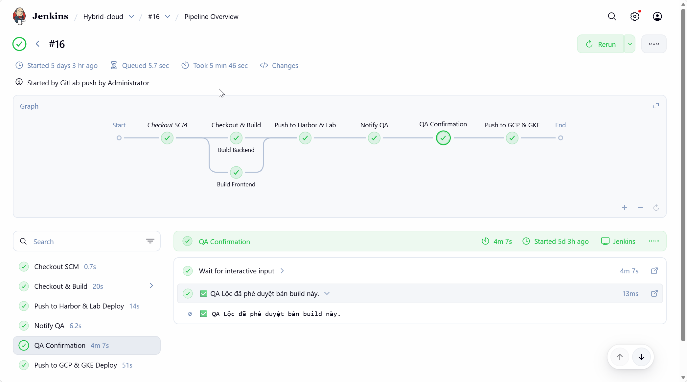
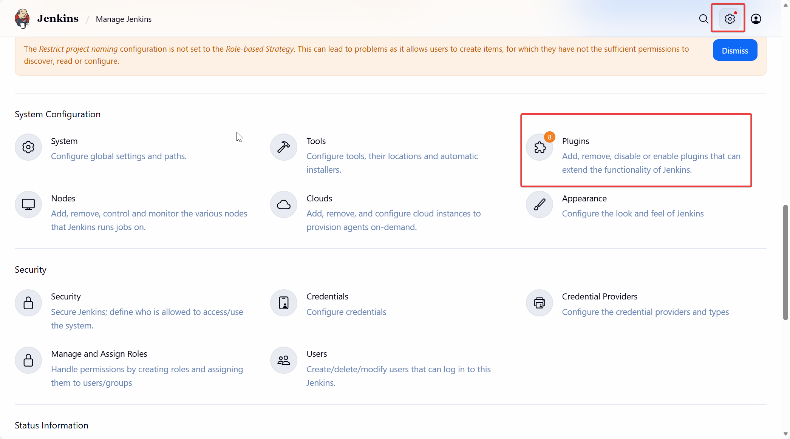
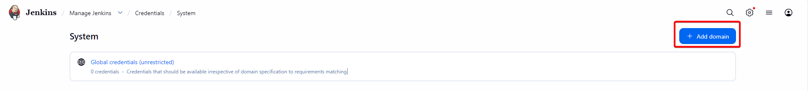
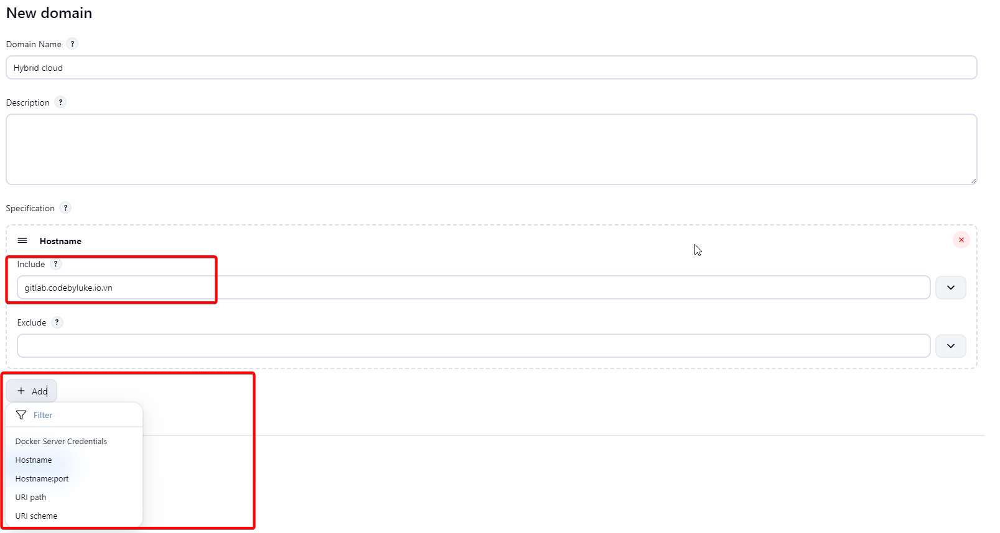

# Bài 6: Jenkins - Thiết lập "Bộ máy thực thi"

Sau khi đã có "trạm chỉ huy" GitLab ở [bài trước](06-ConfigJenkins.md), hôm nay chúng ta sẽ đánh thức "gã khổng lồ" **Jenkins**. Đây là nơi mọi logic build, test, push image và đặc biệt là bước phê duyệt của QA sẽ diễn ra.



## 1. Lấy mật khẩu quản trị (Root) lần đầu tiên

Tương tự như `gitlab`, ta cũng cần lấy `initialPassword` cho jenkins. Để lấy mật khẩu này, bạn cần thực hiện lệnh sau trên máy VM:

```bash
# Thay 'jenkins' bằng tên container của bạn nếu bạn đặt tên khác trong docker-compose
sudo docker exec -it jenkins cat /var/jenkins_home/secrets/initialAdminPassword
```

## 2. Cài đặt Plugins

Để Jenkins có thể xử lý được luồng Hybrid-Cloud phức tạp, bạn cần cài đặt bộ tứ Plugin sau (Vào **Manage Jenkins** -> **Plugins**):



1. **[Role-based Authorization Strategy](https://plugins.jenkins.io/role-strategy/):** Để tạo ra cơ chế phân quyền (RBAC) chuẩn doanh nghiệp.
2. **[Docker Pipeline](https://plugins.jenkins.io/docker-workflow/):** Cho phép Jenkins chạy các lệnh Docker ngay trong script.
3. **[Blue Ocean](https://plugins.jenkins.io/blueocean/):** Đây là plugin mang lại trải nghiệm người dùng (UX) hiện đại cho Jenkins, thay thế giao diện "Classic" cũ kỹ
4. **[Gitlab](https://plugins.jenkins.io/gitlab-plugin/):** Plugin hỗ trợ kết nối `Jenkins` với `Gitlab`

:::tip[Plugin for SSH]
Nếu bạn lựa chọn kết nối Jenkins với Gitlab thông qua SSH key thì cần phải cài thêm [**SSH agent**](https://plugins.jenkins.io/ssh-agent/), plugin này cho phép pipeline sử dụng SSH key để clone/push code
:::

## 3. Quản lý Credentials

Để tiện cho việc quản lý credentials theo từng project, chúng ta cần tạo domain `Hybrid Cloud` để chứa những token liên quan đến project

1. Truy cập theo đường dẫn để tạo `https://<your-jenkins-domain>/manage/credentials/store/system/`
   
2. Đặt tên domain là `Hybrid Cloud`

:::tip[Advance]
Nếu muốn cấu hình domain một cách chuyên nghiệp hơn thì có thể sử dụng thêm cấu hình filter hostname/URI khi tạo `domain`

:::

## Kết luận

Jenkins đã sẵn sàng, ở bài tiếp theo, chúng ta sẽ hoàn thiện cấu hình Jenkins, từ kết nối với Gitlab và phân quyền một cách hoàn chỉnh cho `QA`. Hẹn gặp lại các bạn ở [**Bài 7: Jenkins Security - Phân quyền RBAC nâng cao**](07-ConfigRoleJenkins.md)
