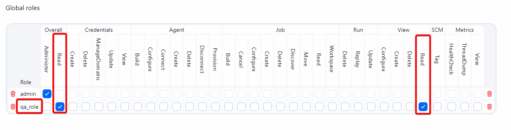
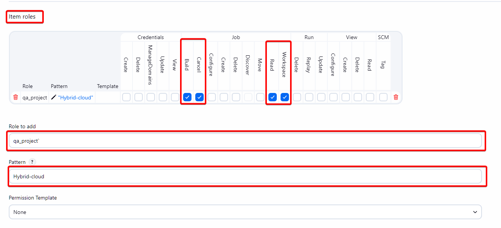
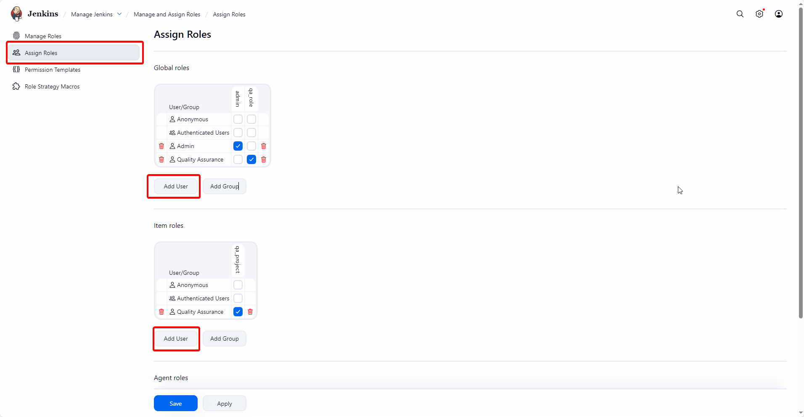
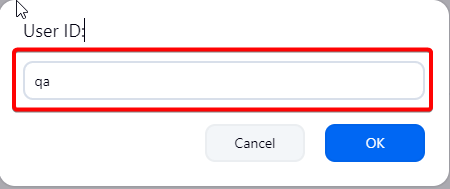
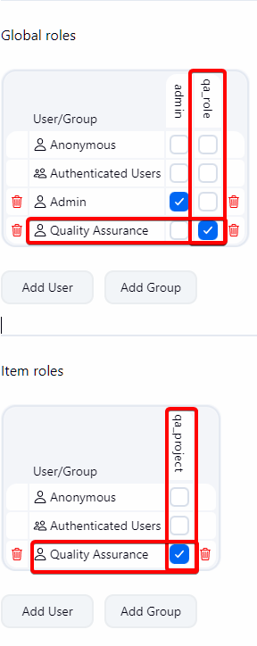

# Bài 7: Jenkins Security - Phân quyền RBAC nâng cao

Ở [bài trước](06-ConfigJenkins.md), chúng ta đã cài đặt Jenkins và kích hoạt RBAC. Tuy nhiên, nếu dừng lại ở đó, Jenkins vẫn như một "ngôi nhà chưa khóa cửa". Hôm nay, chúng ta sẽ thiết lập ma trận phân quyền (Role Matrix) chi tiết cho `QA`.

## Phân quyền QA: Best Practices với RBAC

Trong plugin **Role-based Authorization Strategy**, sai lầm phổ biến là cấp quyền trực tiếp vào Global Role.

:::tip[Tư duy đúng đắn]

Chia tách rõ ràng:

- **Global** (để đăng nhập)
- **Item** (để làm việc).

:::

### 1. Global Role: `qa_role`

Đây là chiếc "thẻ ra vào" tòa nhà. QA cần nó để đăng nhập và nhìn thấy giao diện chính, nhưng không được phép chỉnh sửa hệ thống.

Truy cập vào **Manage Jenkins** -> **Manage And Assign Role**

**Permissions cần cấp:**

- `Overall` -> `Read`: **Bắt buộc**. Không có quyền này user không login được.
- `View` -> `Read`: Để nhìn thấy các Group/View.

:::danger[Lưu ý]
Tuyệt đối **KHÔNG** cấp quyền `Administer`, `Credentials`, hay `Run Scripts`.
:::

### 2. Item Role: `qa_project`

Đây là "chìa khóa phòng làm việc". Chúng ta sẽ giới hạn QA chỉ được tác động vào đúng dự án họ phụ trách.

- **Pattern (Quan trọng):** Sử dụng Regex để khớp tên Job. Ví dụ: `ecommerce-.*` (QA chỉ nhìn thấy các Job bắt đầu bằng từ khóa `ecommerce-`).

> Ở đây ta sẽ setup Pattern với giá trị `Hybrid-cloud` để thuận tiện cho bài lab

:::danger[Quan trọng]
Đừng dùng `.*` nếu bạn không muốn QA thấy cả các Job bảo trì hệ thống.
:::

- **Permissions cần cấp (Best Practice):**
- `Job` -> `Read`: Xem Job.
- `Job` -> `Build`: **bắt buộc phải có** thì QA mới nhấn nút **Approve (Input Step)** trong Pipeline được.
- `Job` -> `Cancel`: Hủy build nếu bị treo.
- `Job` -> `Workspace`: Cho phép xem file để debug (tùy chọn).

:::danger[Quan trọng]
Đừng set những quyền này cho `QA`:

- `Job/Configure` (Sửa pipeline)
- `Job/Delete` (Xóa job).

:::

### 3. Assign Roles

Sau khi định nghĩa xong 2 Role trên, tiến hành gán `role` cho user `QA`.

- Vào mục **Assign Roles**
- Chọn **Add user** ở `Global` và `Item`

- Nhập **User Id** là `qa` (hoặc username bạn tạo ở bài trước)

- Sau khi tạo, tích chọn `role` tương ứng

---

## Kết luận

Vậy là xong phần tạo role cho `QA`, nếu trong tương lai có thêm những role khác thì ta có thể làm lại những bước này. Tiếp theo ta sẽ cấu hình `credentials` để "thông quan" với **Gitlab**, **Google Cloud Artifact Registry**, **Telegram Channel**
