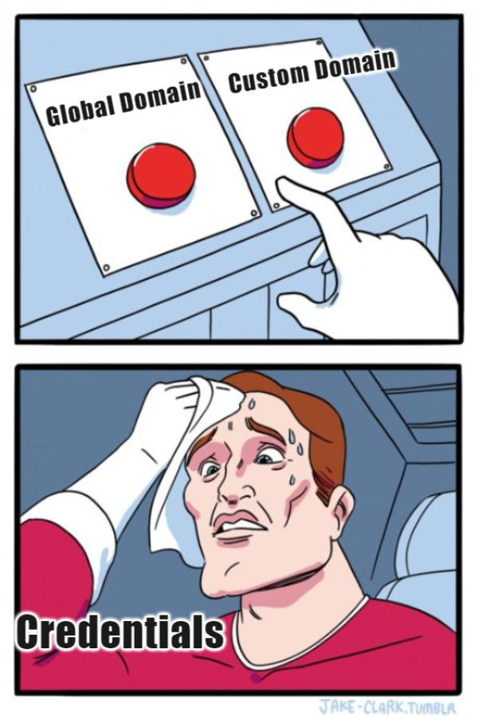
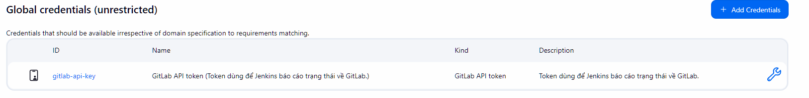
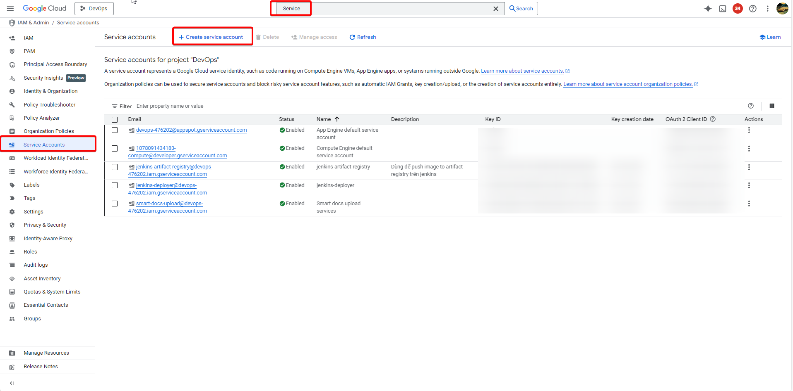
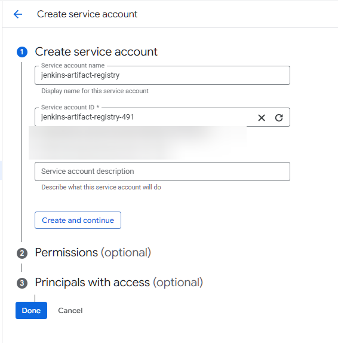
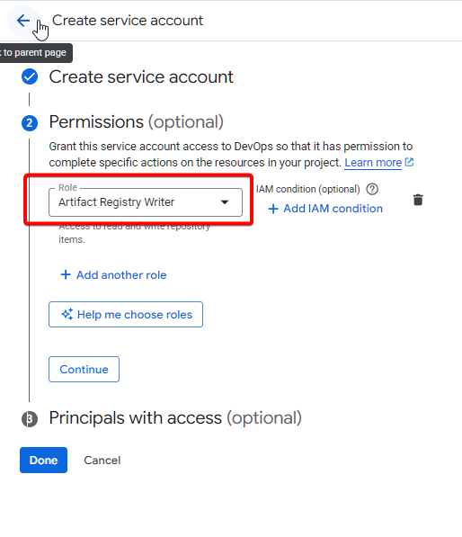
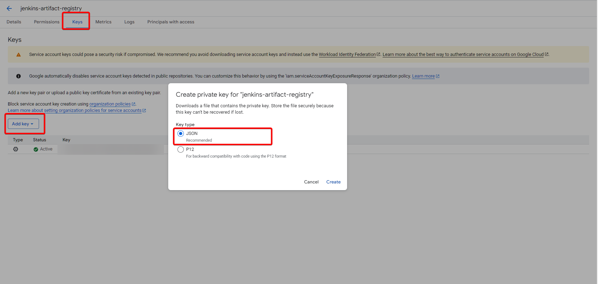
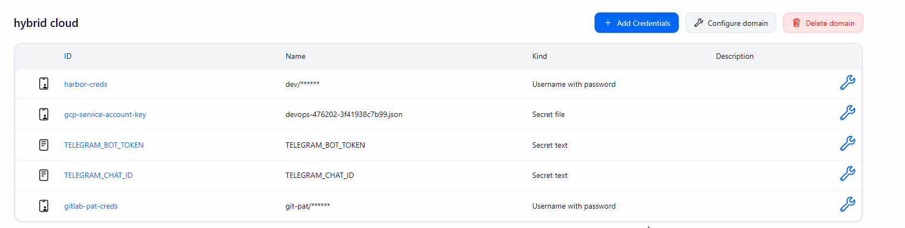

# Bài 8: Jenkins Security - Chứa thông tin "nhạy cảm" sao cho đúng

Ở [bài trước](07-ConfigRoleJenkins.md), chúng ta đã cấu hình phân quyền cho `QA` role. Ở bài này, chúng ta sẽ đi về phần thông tin "nhạy cảm" (token, password) trong Jenkins.

## 1. Chiến lược Credentials: System Domain vs. Global Domain

Trước khi cấu hình kết nối, hãy làm rõ một khái niệm dễ gây "lú" trong Jenkins: **Credential Domains**.

### Global Domain:

- Dành cho các plugin hệ thống (như GitLab Plugin) để giao tiếp API.
- Đây là nơi chứa các Token dùng cho việc cấu hình hệ thống Jenkins, không dùng trực tiếp trong Pipeline của dự án.

### Custom Domain:

- Dành cho các Job/Pipeline sử dụng.
- Credentials ở đây dùng trong pipeline cho từng `domain` riêng biệt

---

## Phân chia credentials

Dưới đây là bảng tổng hợp danh sách Credentials cần tạo trên Jenkins, được chia theo Domain và mục đích sử dụng cụ thể:

### Bảng quy hoạch Credentials cho dự án Hybrid Cloud

| Credential ID (Name)          | Domain           | Loại (Kind)            | Mô tả & Mục đích sử dụng                                                                                                   |
| ----------------------------- | ---------------- | ---------------------- | -------------------------------------------------------------------------------------------------------------------------- |
| **`gitlab-api-token`**        | **Global**       | GitLab API Token       | Dùng để cấu hình kết nối hệ thống. Cho phép Jenkins báo cáo trạng thái Build (Pending/Success) về GitLab Merge Request.    |
| **`gitlab-pat-creds`**        | **Hybrid Cloud** | Username with password | Chứa PAT Token. Dùng trong **Pipeline** để thực hiện lệnh `git clone` (lấy code) và `git push` (cập nhật Manifest GitOps). |
| **`telegram-bot-token`**      | **Hybrid Cloud** | Secret text            | Token của BotFather. Dùng để xác thực Bot khi gửi thông báo.                                                               |
| **`telegram-chat-id`**        | **Hybrid Cloud** | Secret text            | ID của Group chat hoặc User nhận thông báo.                                                                                |
| **`gcp-service-account-key`** | **Hybrid Cloud** | Secret file            | File JSON chứa Key của Google Service Account. Dùng để xác thực khi Push lên `Artifact Registry`.                          |
| **`harbor-creds`**            | **Hybrid Cloud** | Username with password | Tài khoản đăng nhập Harbor (`admin`/`Harbor12345`). Dùng để push image lên Private Registry.                               |

## 2. Cấu hình kết nối GitLab (Integration)

Bạn còn nhớ 2 token ở **Gitlab** tạo ở [bài 5](05-ConfigGitLab.md) không? Bây giờ chúng ta sẽ sử dụng tại đây

### Bước 1: Tạo Credential cho System (Kết nối API)

1. Vào **Manage Jenkins** -> **Credentials**.
2. Chọn **Domain** là `global`
3. Add Credential:

- **Kind:** `GitLab API Token` (Bắt buộc chọn đúng loại này).
- **Token:** Dán chuỗi PAT của `jenkins-report` vào.
- **ID:** `gitlab-api-token`.
- **Description:** Token dùng để Jenkins báo cáo trạng thái về GitLab.

### Bước 2: Tạo Credential cho Pipeline (clone/push code)

1. Vẫn trong **Credentials**, chuyển sang `Hybrid cloud`.
2. Add Credential:

- **Kind:** `Username with password`.
- **Username:** Tên bất kỳ
  > Thông thường sẽ sử dụng `git-pat` (hoặc `oauth2`).
- **Password:** Dán chuỗi PAT của `jenkins-pipeline` vào.
- **ID:** `gitlab-pat-creds` (Ghi nhớ ID này để dùng trong Jenkinsfile).

:::note[Best Practice]
Hoàn toàn có thể sử dụng 1 **PAT** cho 2 credentials trên nhưng nên tách ra cho chuyên nghiệp hơn
:::

## 3. Cấu hình credential cho Telegram

Trong pipeline sẽ có phần gửi thông báo đến telegram cho `QA` biết được có phiên bản mới vừa được deploy để kiểm thử nên cần chứa credential để gửi thông tin tới Telegram. Ta sẽ cần 2 thông tin sau `TELEGRAM_BOT_TOKEN` và `TELEGRAM_CHAT_ID`

:::tip
Nếu bạn chưa biết cách lấy 2 thông tin trên, có thể tham khảo bài viết tại [đây](../../../Tips/CreateAndGetBotTelegramToken.md)
:::

Sau khi có được 2 thông tin trên, ta cần tạo 2 `credential` tương ứng cho từng cái:

- **Domain:** `Hybrid cloud`
- **Kind:** Secret text

## 4. Cấu hình credential cho Harbor

Trước khi gửi thông báo cho `QA`, ta cần phải push image lên **Harbor** trước. Do đó ta cũng cần tạo credential để pipeline sử dụng

- **Domain:** `Hybrid cloud`
- **Kind:** Username with password
- **Username:** `admin`
- **Password:** `Harbor12345`
- **ID:** `harbor-creds`

:::tip[Security tip]
Tốt nhất là nên tạo một user khác với `admin` trong **Harbor** để tránh việc vi phạm
:::

## 5. Cấu hình credential cho GCP

Sau khi `QA` PASSED, ta sẽ push image đó lên **Artifact Registry** để GKE có thể pull về. Nhưng cách cấu hình ở đây hơi khác với những phần còn lại, ta sẽ tạo một `service-account` trên GCP, tải file `cred.json` để import vào Jenkins

Các bước tạo `service-account`:

- Truy cập GCP, chọn `Services Account`
- Chọn `Create service account`
  
- **Account name:** `jenkins-artifact-registry`
- **Account description:** `Push image from pipeline to registry`
  
- **Permission:** `Artifact Registry Writer`

- Lưu lại, sau đó truy cập để tạo **Key**
  - **Key type:** JSON

- Trình duyệt sẽ tự động tải về một file `JSON`

Import trên Jenkins:

- **Domain:** `Hybrid cloud`
- **Kind:** Secret File (Upload file `JSON` lên)
- **ID:** `gcp-service-account-key`

:::danger
Cách này chỉ dùng cho mục đích bài lab, không nên sử dụng trong thực tế vì có khả năng bị lộ key.
:::

## Kết luận

Sau khi cấu hình xong, phần `credentials` của `Hybrid cloud` sẽ như hình

Ở bài tiếp theo, ta sẽ sử dụng credential để kết nối Gitlab một cách chuẩn chỉnh.
