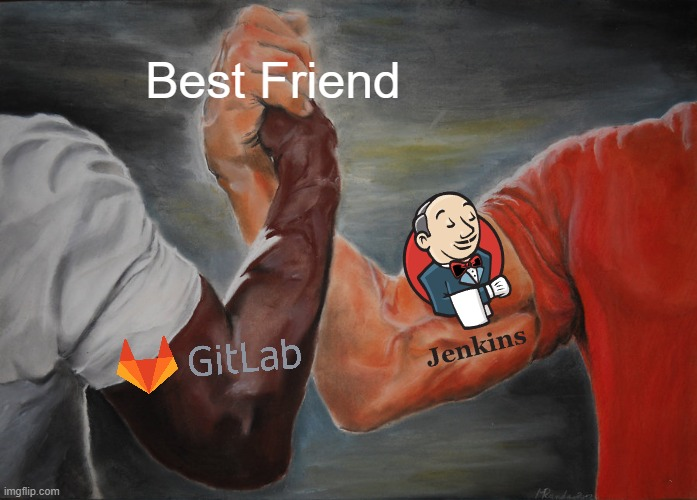
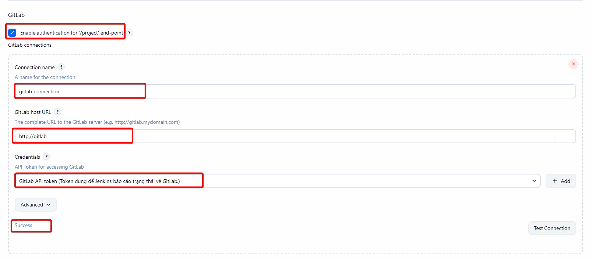

# Bài 9: Jenkins - Kết nối GitLab "chuẩn chỉ"

Ở [bài trước](08-ConfigCredentialsJenkins.md), chúng ta đã cài đặt `credentials` hoàn chỉnh cho bài lab. Ở bài viết này chúng ta sẽ sử dụng để kết nối với **Gitlab**

## Kích hoạt kết nối trong System Configuration

1. Vào **Manage Jenkins** -> **System**.
2. Tìm mục **GitLab**.
3. Click chọn **Enable authentication for '/project' end-point**
4. **Connection Name:** Đặt tên `gitlab-connection`.
5. **GitLab Host URL:** Nhập Domain GitLab của bạn.
   > Do hiện giờ ta đang host chung Jenkins và Gitlab ở VM và chung 1 mạng network nên ta có thể điền `http://<container-gitlab-name>`
6. **Credentials:** Chọn ID `gitlab-api-token` vừa tạo ở **Global domain**.
7. Bấm **Test Connection**.

- 🔴 Failed: Kiểm tra lại mạng hoặc loại Token.
- 🟢 Success: Chúc mừng, Jenkins và GitLab đã "bắt tay" thành công!

---

## Kết luận

Đến đây, Jenkins của bạn đã đạt chuẩn "Security-First":

1. **QA User:** Chỉ làm đúng việc, không thể phá hoại.
2. **Credentials:** Được tổ chức khoa học, phân tách rõ ràng giữa mục đích quản trị hệ thống và thực thi pipeline.

Hệ thống đã sẵn sàng. Ở bài tiếp theo, chúng ta sẽ bắt tay vào viết **Jenkinsfile** đầu tiên để hiện thực hóa quy trình CI/CD!
