# Bài 9: Jenkins - Kết nối GitLab "chuẩn chỉ"

Ở [bài trước](08-ConfigCredentialsJenkins.md), chúng ta đã cài đặt `credentials` hoàn chỉnh cho bài lab. Ở bài viết này chúng ta sẽ sử dụng để kết nối với **Gitlab**

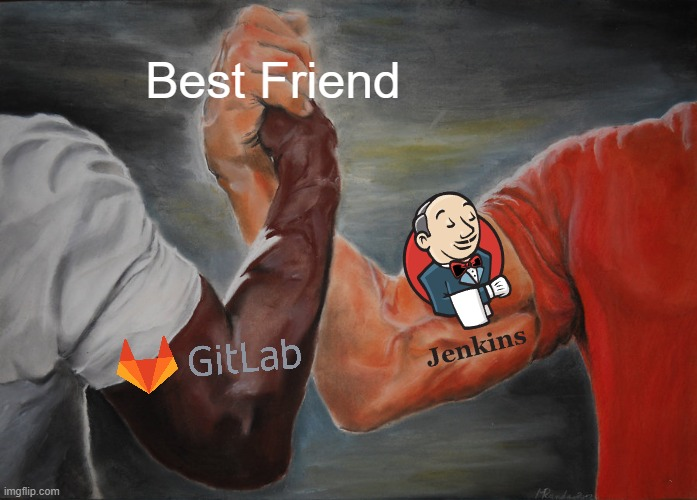

## Kích hoạt kết nối trong System Configuration

1. Vào **Manage Jenkins** -> **System**.
2. Tìm mục **GitLab**.
3. Click chọn **Enable authentication for '/project' end-point**
4. **Connection Name:** Đặt tên `gitlab-connection`.
5. **GitLab Host URL:** Nhập Domain GitLab của bạn.
   > Do hiện giờ ta đang host chung Jenkins và Gitlab ở VM và chung 1 mạng network nên ta có thể điền `http://<container-gitlab-name>`
6. **Credentials:** Chọn ID `gitlab-api-token` vừa tạo ở **Global domain**.
7. Bấm **Test Connection**.

- 🔴 Failed: Kiểm tra lại mạng hoặc loại Token.
- 🟢 Success: Chúc mừng, Jenkins và GitLab đã "bắt tay" thành công!

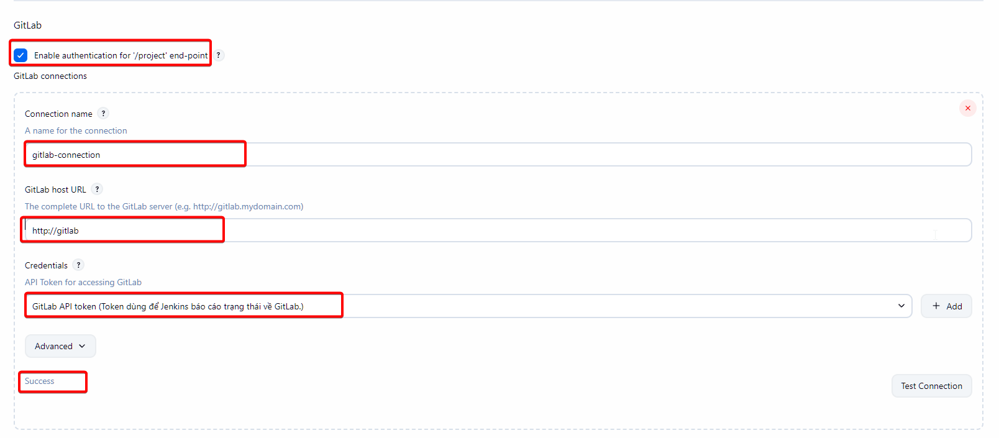

## Tích hợp Gitlab repository vào Jenkins

Tiếp theo ta sẽ khởi tạo một pipeline trong Jenkins:

1. Tạo pipeline với tên `Hybrid cloud`, chọn `item type` là `Pipeline` sau đó nhấn `OK`

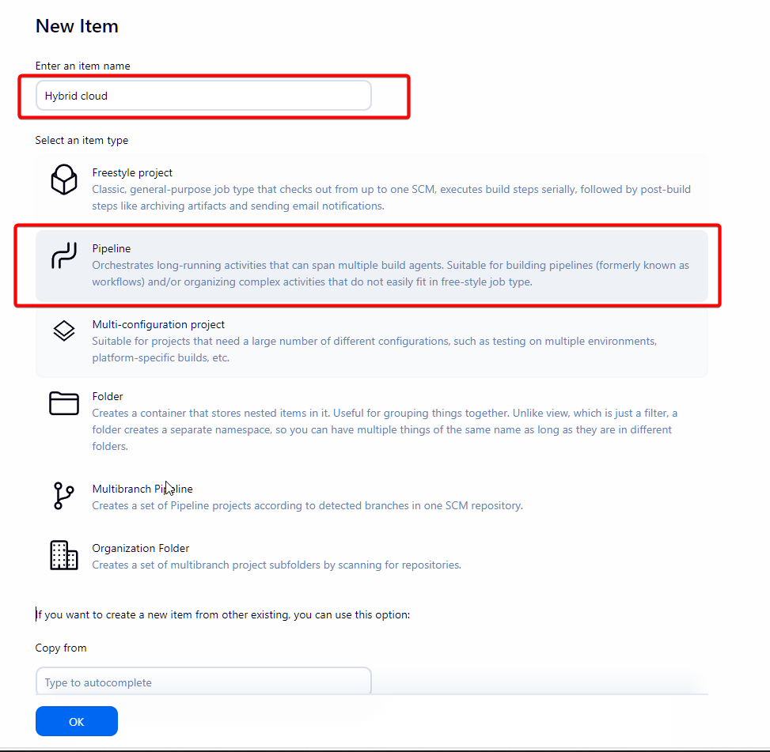

2. Chọn `gitlab-connection` (hoặc tên bạn đã cấu hình ở [phần trên](#kích-hoạt-kết-nối-trong-system-configuration))

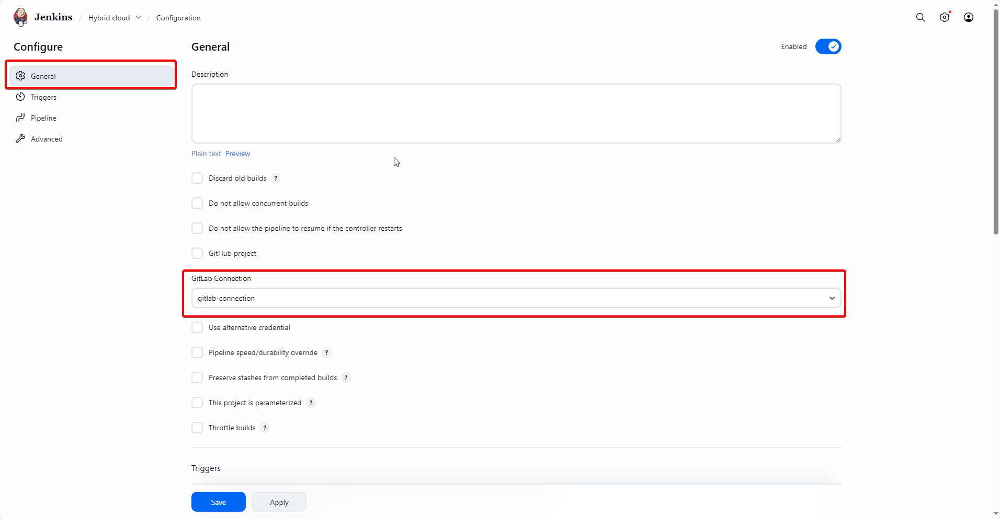

3. Ở phần `Triggers`, ta chọn `Build when a pushed to Gitlab` và lưu lại đường dẫn webhook URL để cấu hình sau

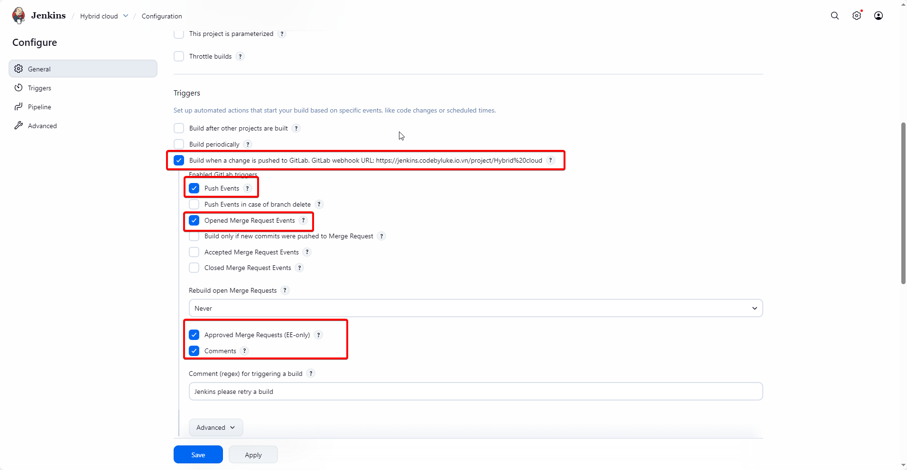

:::note[Secret token]
Ngoài ra, ta cũng cần lấy `secret token` cho cấu hình webhook
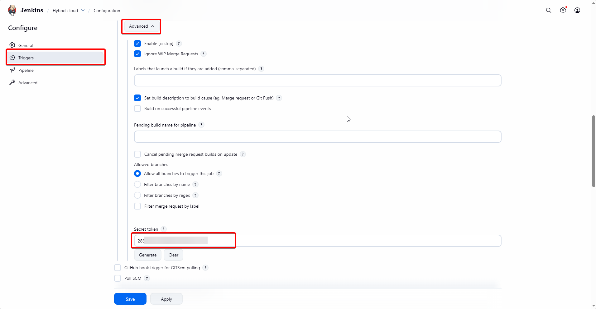
:::

4. Ở phần `Pipeline`, ta chọn `Pipeline script from SCM` và cấu hình như sau:
   - **SCM:** Chọn `git`
   - **Repository URL:** Lấy URL repo của project (không phải Manifest)
   - **Credentials:** Chọn credential đã tạo ở [phần 2 của bài trước](./08-ConfigCredentialsJenkins.md#bước-2-tạo-credential-cho-pipeline-clonepush-code)
   - **Branch Specifier:** Sửa lại `main` hoặc branch tương ứng (Jenkins sẽ lấy `Jenkinfile` từ branch cấu hình)

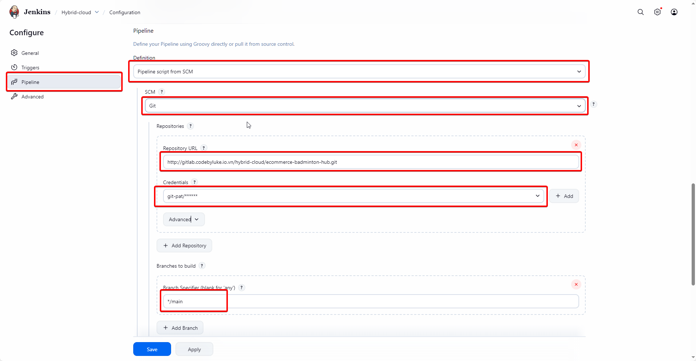

5. Sau khi cấu hình xong pipeline, ở trang chủ sẽ như sau

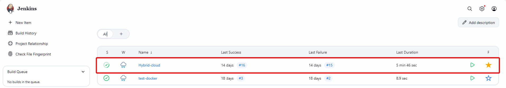

Ta đã hoàn tất cấu hình bên Jenkins, tiếp theo ta cần phải cấu hình webhook để trigger build pipeline khi push / merge commit vào branch `main`

## Cấu hình Webhook bên Gitlab

1. Truy cập vào project repo trên gitlab

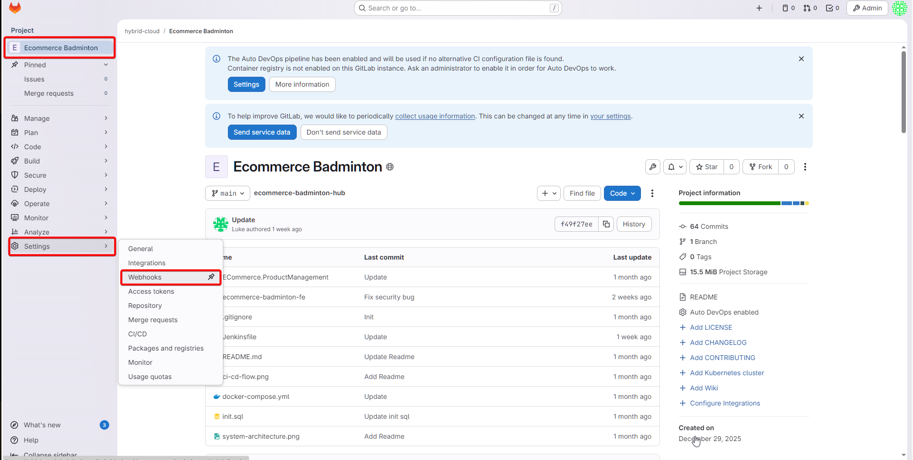

2. Cấu hình webhook như sau:
   - **Name:** `Jenkins`
   - **Webhook URL:** Webhook URL đã lưu
   - **Secret token:** Secret token đã lưu

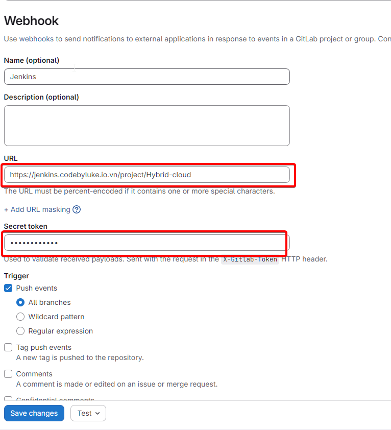

3. Sau khi tạo sẽ như hình

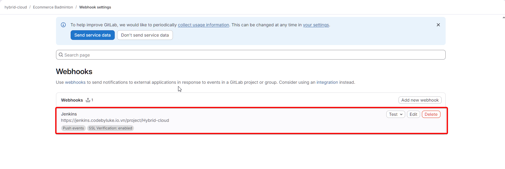

4. Kiểm thử webhook
   - Nhấn nút `Test` với `Push event` để trigger Jenkins build pipeline

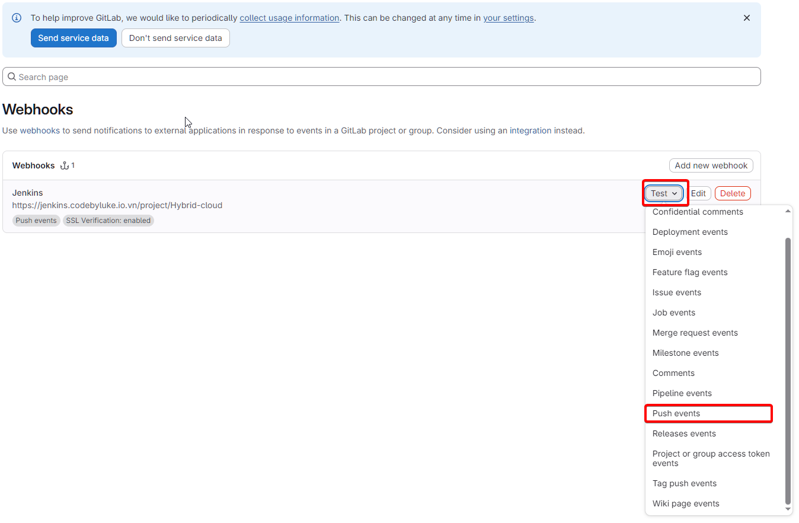

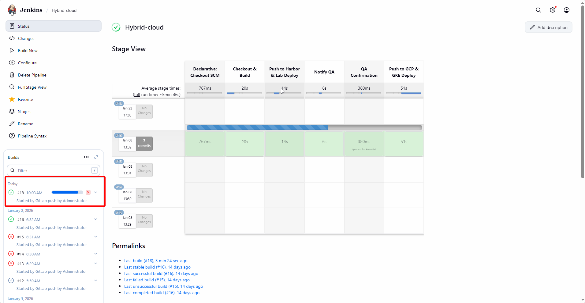

:::tip[Lưu ý cho Custom Domain]

Nếu pipeline không thể nhìn thấy và sử dụng các `credentials` trong **Custom Domain**, bạn nên kiểm tra lại cấu hình **Specification** khi tạo Domain, nếu có cấu hình `HostName` thì nên đảm bảo đúng với Domain của bạn. Ví dụ:

- **Specification:** Hostname
- **Include:** `*.codebyluke.io.vn` (hoặc liệt kê cụ thể: `git.codebyluke.io.vn`, `registry.codebyluke.io.vn`).

:::

---

## Kết luận

Đến đây, Jenkins của bạn đã đạt chuẩn "Security-First":

1. **QA User:** Chỉ làm đúng việc, không thể phá hoại.
2. **Credentials:** Được tổ chức khoa học, phân tách rõ ràng giữa mục đích quản trị hệ thống và thực thi pipeline.
3. **Gitlab connection:** Trigger pipeline thông qua webhook

Hệ thống đã hoàn thành 70%. Ở [bài tiếp theo](./10-InstallArgoCD.md), chúng ta sẽ bắt đầu cấu hình **ArgoCD**!
