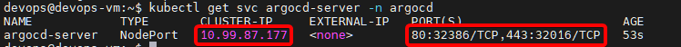
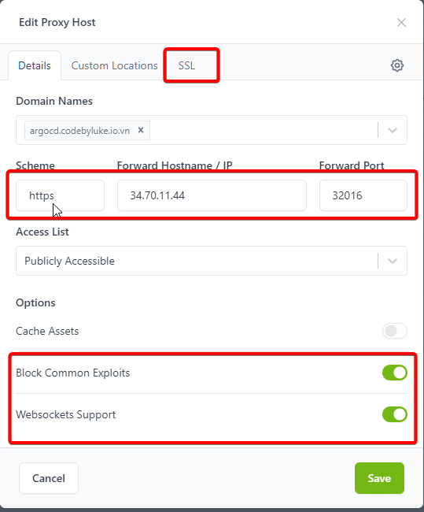
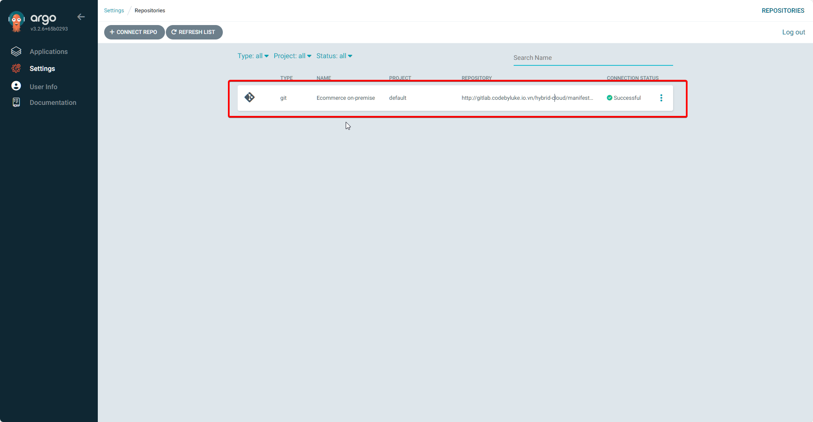

# Bài 8: GitOps - ArgoCD và quản lý đa cụm

Sau chuỗi bài về CI (Continuous Integration) với Jenkins, chúng ta đã có Container Image nằm gọn trong Harbor. Giờ là lúc đưa ứng dụng "lên sóng" (CD - Continuous Delivery).

Thay vì để Jenkins chạy lệnh `kubectl apply` (cách làm cũ, rủi ro bảo mật cao), chúng ta sẽ áp dụng **GitOps** với **ArgoCD**. ArgoCD sẽ đóng vai trò như một "tháp canh", liên tục đối chiếu giữa trạng thái mong muốn (Git) và thực tế (Cluster) để đồng bộ.

Trong bài này, chúng ta sẽ thiết lập kiến trúc **Centralized Management**: ArgoCD chạy tại **On-premise** (để tiết kiệm tài nguyên Cloud) nhưng quản lý deployments cho cả **Local** và **GKE**.

### 0. Chuẩn bị: Hạ tầng mạng Calico (Network CNI)

Trước khi cài ArgoCD, hãy đảm bảo cụm K8s On-premise của bạn đang sử dụng **Calico**. Calico cung cấp hiệu năng tốt hơn và tính năng Network Policy (quan trọng để bảo mật ArgoCD sau này).

SSH vào cụm master node và chạy lệnh sau để cài đặt Calico Operator và Custom Resources:

```bash
# Cài Operator
kubectl create -f https://raw.githubusercontent.com/projectcalico/calico/v3.27.0/manifests/tigera-operator.yaml
# Nạp cấu hình mạng
kubectl create -f https://raw.githubusercontent.com/projectcalico/calico/v3.27.0/manifests/custom-resources.yaml

```

Chờ vài phút cho đến khi `kubectl get nodes` báo trạng thái `Ready`.

---

### 1. Cài đặt ArgoCD trên On-premise

Chúng ta sẽ tiến hành cài đặt ArgoCD trên cụm K8s on-premise

**1: Cài đặt Manifest**

```bash
kubectl create namespace argocd
kubectl apply -n argocd -f https://raw.githubusercontent.com/argoproj/argo-cd/stable/manifests/install.yaml

```

**Bước 1.2: Cài đặt ArgoCD CLI**
Bạn cần CLI để thực hiện lệnh join cluster GKE sau này.

```bash
curl -sSL -o argocd-linux-amd64 https://github.com/argoproj/argo-cd/releases/latest/download/argocd-linux-amd64
sudo install -m 555 argocd-linux-amd64 /usr/local/bin/argocd
rm argocd-linux-amd64
```

**Bước 1.3: Expose ra ngoài (NodePort)**
Để truy cập được từ trình duyệt qua Nginx, chúng ta chuyển Service sang NodePort:

```bash
kubectl patch svc argocd-server -n argocd -p '{"spec": {"type": "NodePort"}}'
```

Kiểm tra port vừa được gán (ví dụ `30080`):

```bash
kubectl get svc argocd-server -n argocd
```



**Bước 1.4: Lấy mật khẩu đăng nhập ban đầu**

```bash
kubectl -n argocd get secret argocd-initial-admin-secret -o jsonpath="{.data.password}" | base64 -d; echo
```

---

### 2. Cấu hình Reverse Proxy (Nginx Proxy Manager)

Đây là bước các bạn mới rất hay gặp lỗi `502 Bad Gateway`.

1. Truy cập Nginx Proxy Manager.
2. Tạo **Proxy Host** mới:

- **Domain Names:** `argocd.codebyluke.io.vn`.
- **Forward IP:** IP của máy VM On-premise (`34.70.xx.xx`).
- **Forward Port:** `30080` (Port NodePort lấy ở bước 1.3).
- **Scheme:** ⚠️ **HTTPS** (Bắt buộc! Vì ArgoCD server tự chạy SSL).
- **Tab SSL:** Request chứng chỉ Let's Encrypt mới & Force SSL.



---

### 3. Kết nối Git Repository (Private)

ArgoCD cần quyền đọc repo `ecommerce-manifest` của bạn.

1. Đăng nhập ArgoCD UI -> **Settings** -> **Repositories**.
2. Chọn **Connect Repo using HTTPS**.
3. Điền thông tin:

- **Type:** `Git`.
- **Project:** `default`.
- **Repository URL:** `http://git.codebyluke.io.vn/hybrid-cloud/ecommerce-manifest.git` (Manifest repository)
- **Username:** `git`.
- **Password:** Dùng chính cái **PAT** (Token) bạn đã tạo ở bài Jenkins.

4. Nhấn **Connect**. Nếu hiện trạng thái **Successful** màu xanh là OK.
   

:::tip[Best Practice]

Ở bước này, để tách biệt thì ta có thể tạo một **PAT** riêng biệt cho ArgoCD, chỉ cần quyền `read_api` vì ArgoCD không cần update gì file manifest cả

:::

---

### 4. Kết nối cụm GKE (Remote Cluster)

Bây giờ chúng ta sẽ thêm cụm Google Kubernetes Engine vào ArgoCD.

**Bước 4.1: Chuẩn bị Kubeconfig**
Trên máy `devops-vm` (nơi cài ArgoCD CLI), hãy login vào GKE:

```bash
# Lấy credentials GKE về máy
gcloud container clusters get-credentials <TEN_CLUSTER_GKE> --region <REGION> --project <PROJECT_ID>
```

**Bước 4.2: Đổi tên Context (Best Practice)**
Tên context mặc định của GKE rất dài, hãy đổi lại cho dễ quản lý:

```bash
# Lấy tên context
kubectl config get-contexts

# Đổi tên context GKE thành 'gke-cloud'
kubectl config rename-context <CONTEXT_GKE_DAI_NGOANG> gke-cloud

# Đổi tên context K8s hiện tại thành 'on-prem-local'
kubectl config rename-context default on-prem-local

```

**Bước 4.3: Add Cluster vào ArgoCD**
Đăng nhập CLI và add cluster:

```bash
# Login vào ArgoCD qua domain
argocd login argocd.codebyluke.io.vn

# Add cụm GKE
argocd cluster add gke-cloud
```

_Lệnh này sẽ tự động tạo ServiceAccount trên GKE để ArgoCD có quyền điều khiển._

---

### 5. Triển khai ứng dụng (Application Deployment)

Chúng ta sẽ deploy ứng dụng E-commerce lên cả 2 môi trường cùng lúc.

**Môi trường 1: On-premise**

- **New App:** `ecommerce-on-prem`
- **Source:** Repo Manifest, path: `ecommerce/overlays/on-premise`
- **Destination:** `https://kubernetes.default.svc` (Chính là cụm K3s cài ArgoCD).
- **Sync Policy:** Automatic (Prune + Self Heal).

**Môi trường 2: Google Cloud (GKE)**

- **New App:** `ecommerce-gke`
- **Source:** Repo Manifest, path: `ecommerce/overlays/cloud`
- **Destination:** Chọn URL cụm GKE vừa add ở bước 4.3.

Sau khi nhấn Create, ArgoCD sẽ bắt đầu kéo Manifest về và đồng bộ. Các ô xanh lá cây (Synced/Healthy) sẽ lần lượt hiện lên.

---

### 6. Góc kinh nghiệm: Xử lý lỗi Pull Image từ Harbor

Một vấn đề 99% các bạn sẽ gặp: Pod báo lỗi `ImagePullBackOff` hoặc `ErrImagePull`.
**Lý do:** K8s (cả K3s và GKE) không thể kéo image từ Harbor Private Registry vì thiếu thông tin đăng nhập.

**Giải pháp:**
Bạn cần tạo Secret `regcred` trên cả 2 cụm K8s và patch vào ServiceAccount `default`.

```bash
# Chạy lệnh này trên cả 2 context (on-prem-local và gke-cloud)
kubectl create secret docker-registry regcred \
  --docker-server=registry.codebyluke.io.vn \
  --docker-username=admin \
  --docker-password=Harbor12345 \
  --docker-email=admin@example.com

# Patch vào ServiceAccount default để Pod tự động dùng
kubectl patch serviceaccount default -p '{"imagePullSecrets": [{"name": "regcred"}]}'

```

---

### Kết luận

Hệ thống **GitOps Hybrid-Cloud** của chúng ta đã thành hình!

1. **Code** nằm ở GitLab.
2. **Jenkins** build và đẩy Image vào Harbor.
3. **ArgoCD** (trên nền Calico K3s) tự động phát hiện thay đổi và cập nhật ứng dụng lên cả On-premise và GKE.

Ở bài tiếp theo, chúng ta sẽ tối ưu hóa quy trình bằng cách thêm **Ingress Controller** để user có thể truy cập vào web E-commerce từ Internet!
