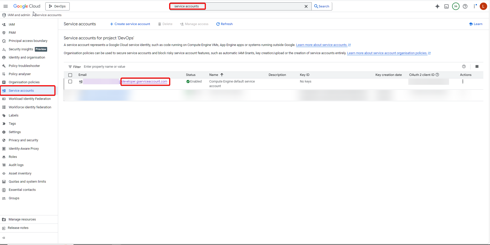
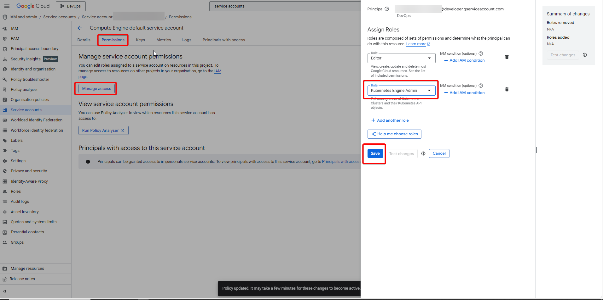
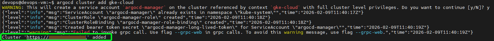
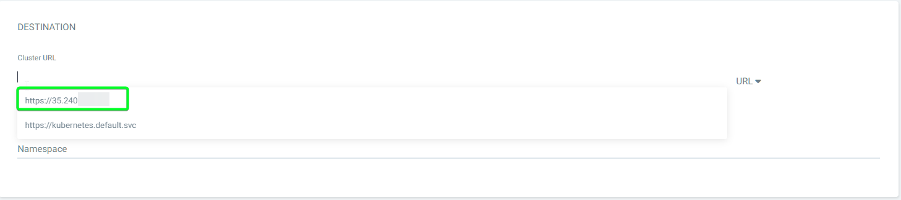
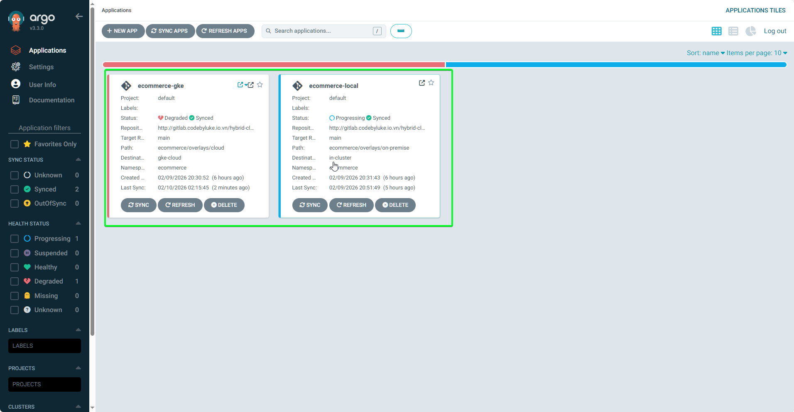
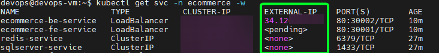

# Bài 10: GitOps - ArgoCD và quản lý đa cụm

Sau chuỗi bài về CI (Continuous Integration) với Jenkins, Gitlab. Giờ là lúc đưa ứng dụng "lên sóng" (CD - Continuous Delivery).

Thay vì để Jenkins chạy lệnh `kubectl apply` (cách làm cũ, rủi ro bảo mật cao), chúng ta sẽ áp dụng **GitOps** với **ArgoCD**. ArgoCD sẽ đóng vai trò như một "tháp canh", liên tục đối chiếu giữa trạng thái mong muốn (Git) và thực tế (Cluster) để đồng bộ.

Trong bài này, chúng ta sẽ thiết lập kiến trúc **Centralized Management**: ArgoCD chạy tại **On-premise** (để tiết kiệm tài nguyên Cloud) nhưng quản lý deployments cho cả **Local** và **GKE**.

### 1. Cài đặt ArgoCD trên On-premise

Chúng ta sẽ tiến hành cài đặt ArgoCD trên cụm K8s on-premise

**1: Cài đặt Manifest**

```bash
kubectl create namespace argocd
kubectl apply -n argocd -f https://raw.githubusercontent.com/argoproj/argo-cd/stable/manifests/install.yaml

```

**Bước 1.2: Cài đặt ArgoCD CLI**
Bạn cần CLI để thực hiện lệnh join cluster GKE sau này.

```bash
curl -sSL -o argocd-linux-amd64 https://github.com/argoproj/argo-cd/releases/latest/download/argocd-linux-amd64
sudo install -m 555 argocd-linux-amd64 /usr/local/bin/argocd
rm argocd-linux-amd64
```

**Bước 1.3: Expose ra ngoài (NodePort)**
Để truy cập được từ trình duyệt qua Nginx, chúng ta chuyển Service sang NodePort:

```bash
kubectl patch svc argocd-server -n argocd -p '{"spec": {"type": "NodePort"}}'
```

Kiểm tra port vừa được gán (ví dụ `30080`):

```bash
kubectl get svc argocd-server -n argocd
```


**Bước 1.4: Lấy mật khẩu đăng nhập ban đầu**

```bash
kubectl -n argocd get secret argocd-initial-admin-secret -o jsonpath="{.data.password}" | base64 -d; echo
```

---

### 2. Cấu hình Reverse Proxy (Nginx Proxy Manager)

Đây là bước các bạn mới rất hay gặp lỗi `502 Bad Gateway`.

1. Truy cập Nginx Proxy Manager.
2. Tạo **Proxy Host** mới:

- **Domain Names:** `argocd.codebyluke.io.vn`.
- **Forward IP:** IP của máy VM On-premise (`34.70.xx.xx`).
- **Forward Port:** `30080` (Port NodePort lấy ở bước 1.3).
- **Scheme:** ⚠️ **HTTPS** (Bắt buộc! Vì ArgoCD server tự chạy SSL).
- **Tab SSL:** Request chứng chỉ Let's Encrypt mới & Force SSL.


---

### 3. Kết nối Git Repository (Private)

ArgoCD cần quyền đọc repo `ecommerce-manifest` của bạn.

1. Đăng nhập ArgoCD UI -> **Settings** -> **Repositories**.
2. Chọn **Connect Repo using HTTPS**.
3. Điền thông tin:

- **Type:** `Git`.
- **Project:** `default`.
- **Repository URL:** `http://gitlab.codebyluke.io.vn/hybrid-cloud/manifest.git` (Manifest repository)
- **Username:** `git`.
- **Password:** `argocd-token` đã tạo ở [bài trước](./06-ConfigJenkins.md#3-quản-lý-credentials).

4. Nhấn **Connect**. Nếu hiện trạng thái **Successful** màu xanh là OK.


---

### 4. Kết nối cụm GKE (Remote Cluster)

Bây giờ chúng ta sẽ thêm cụm Google Kubernetes Engine vào ArgoCD trên máy **VM**

**Bước 4.1: Cài đặt `gke-gcloud-auth-plugin`**
Vì ta cần thêm cụm GKE vào ArgoCD nên cần cài đặt plugin trước

```bash
# 1. Cập nhật danh sách gói và cài đặt các gói hỗ trợ HTTPS
sudo apt-get update
sudo apt-get install apt-transport-https ca-certificates gnupg curl -y

# 2. Thêm khóa GPG của Google để xác thực gói tin
curl https://packages.cloud.google.com/apt/doc/apt-key.gpg | sudo gpg --dearmor -o /usr/share/keyrings/cloud.google.gpg

# 3. Thêm repository của Google Cloud vào hệ thống
echo "deb [signed-by=/usr/share/keyrings/cloud.google.gpg] https://packages.cloud.google.com/apt cloud-sdk main" | sudo tee -a /etc/apt/sources.list.d/google-cloud-sdk.list

# 4. Cài đặt plugin
sudo apt-get update
sudo apt-get install google-cloud-sdk-gke-gcloud-auth-plugin -y

# Xác nhận cài đặt thành công chưa
gke-gcloud-auth-plugin --version

```

**Bước 4.2: Chuẩn bị Kubeconfig**

```bash
# Lấy credentials GKE về máy
gcloud container clusters get-credentials <TEN_CLUSTER_GKE> --region <REGION> --project <PROJECT_ID>
```

**Bước 4.2: Đổi tên Context (Best Practice)**
Tên context mặc định của GKE rất dài, hãy đổi lại cho dễ quản lý:

```bash
# Lấy tên context
kubectl config get-contexts

# Đổi tên context GKE thành 'gke-cloud'
kubectl config rename-context <CONTEXT_GKE_DAI_NGOANG> gke-cloud

```

**Bước 4.3: Thêm role cho máy VM**
Trước khi thêm **GKE** vào ArgoCD, ta cần phải cấu hình thêm role `Kubernetes Engine Admin` cho `Service Account` của VM.

1. Truy cập vào GCP, vào **Service Account** và tìm email có đuôi `***@developer.gserviceaccount.com`



2. Truy cập tab `Permissions` và `Manage access` để thêm role



:::note[Tại sao ArgoCD cần quyền này?]
Khi bạn chạy `argocd cluster add`, ArgoCD sẽ thực hiện các bước sau:

1. Tạo một ServiceAccount tên là argocd-manager bên trong cluster GKE.
2. Tạo một ClusterRole để định nghĩa các quyền mà ArgoCD có (thường là quyền Admin để nó có thể deploy ứng dụng).
3. Tạo một ClusterRoleBinding để gắn quyền đó cho ServiceAccount trên.

Do đó ta cần cấu hình thêm role `Kubernetes Engine Admin` cho máy VM. Nếu không hệ thống từ chối cho bạn tạo ClusterRole vì tài khoản của bạn chưa được "tin tưởng" tuyệt đối trong nội bộ Kubernetes.
:::

**Bước 4.3: Add Cluster vào ArgoCD**
Đăng nhập CLI và add cluster:

```bash
# Login vào ArgoCD qua domain (login bằng email và password)
argocd login argocd.codebyluke.io.vn

# Add cụm GKE
argocd cluster add gke-cloud
```

Nếu **GKE** được thêm thành công sẽ xuất hiện thông báo như hình



---

### 5. Triển khai ứng dụng (Application Deployment)

Chúng ta sẽ deploy ứng dụng E-commerce lên cả 2 môi trường cùng lúc.

**Môi trường 1: On-premise**

- **New App:** `ecommerce-on-prem`
- **Source:** Repo Manifest, path: `ecommerce/overlays/on-premise`
- **Destination:**
  - **Cluster URL:** `https://kubernetes.default.svc` (Chính là cụm K8s cài ArgoCD).
  - **Namespace:** `ecommerce`
- **Sync Policy:** Automatic (Prune + Self Heal).

**Môi trường 2: Google Cloud (GKE)**

- **New App:** `ecommerce-gke`
- **Source:** Repo Manifest, path: `ecommerce/overlays/cloud`
- **Destination:**
  - **Cluster URL:** `https://<GKE-IP>` (Chính là cụm K8s cài ArgoCD).
  - **Namespace:** `ecommerce`



Sau khi nhấn Create, ArgoCD sẽ bắt đầu kéo Manifest về và đồng bộ. Các ô xanh lá cây (Synced/Healthy) sẽ lần lượt hiện lên.



:::tip[Lấy IP trên GKE]
Vì bài này ta sử dụng `Service: LoadBalancer`, GCP sẽ tự động tạo một `External IP` và một bộ cân bằng tải trên GCP để dẫn luồng vào Cluster. Ta có thể sử dụng lệnh `kubectl get svc -n <NAMESPACE-ECOMMERCE>` (có thể chạy trên Google Console / VM) để lấy `External IP` của app



**Note:** Nếu chạy lệnh mà thấy cột `EXTERNAL-IP` vẫn hiện `<pending>`, hãy đợi khoảng 1-2 phút để GCP cấp phát IP nhé.

:::

---

### Kết luận

Hệ thống **GitOps Hybrid-Cloud** của chúng ta đã thành hình!

1. **Code** nằm ở GitLab.
2. **Jenkins** build và đẩy Image vào Harbor.
3. **ArgoCD** (trên nền Calico) tự động phát hiện thay đổi và cập nhật ứng dụng lên cả On-premise và GKE.

Ở bài tiếp theo, chúng ta sẽ bắt đầu triển khai kịch bản **Failover**
