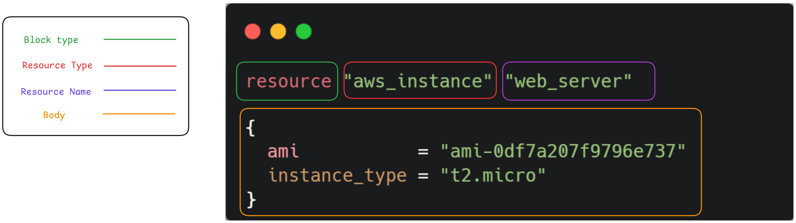

# Giải mã HCL: Ngôn ngữ "thần thánh" giúp bạn cai nghiện Click chuột


Bao năm nay, chúng ta sống yên bình trong căn phòng mang tên "ClickOps" – nơi mọi thứ được giải quyết bằng giao diện đồ họa, chuột trái và chuột phải. Bỗng một ngày đẹp trời, chúng ta lại biết tới khái niệm **Infrastructure as Code (IaC)**. Và đứng sau cái khái niệm đó là cái thứ xa lạ, đang khiến chúng ta hoảng sợ tột độ, chính là HCL (HashiCorp Configuration Language).

> "HCL là cái quái gì? Tại sao tôi phải học code? JSON với YAML chưa đủ hành tôi hay sao?"

Đừng vội hét lên như trong ảnh! Thật ra, `HCL` không đáng sợ như Jack Torrance đâu. Ngược lại, nó được sinh ra để cứu rỗi bạn khỏi những file JSON đầy dấu ngoặc rối rắm hay những file YAML thụt lề sai một ly đi một dặm.

Cùng "mổ xẻ" HCL xem nó có gì mà ghê gớm thế!

---

## 1. Giải phẫu một khối lệnh

Trước khi đi vào chi tiết, hãy nhìn vào cấu trúc cơ bản nhất của HCL:

- **Block Type (Loại khối):** Bạn muốn làm gì? (Tạo tài nguyên `resource`, khai báo biến `variable`, hay xuất kết quả `output`?).
- **Resource Type (Loại tài nguyên):** Món hàng bạn muốn là gì? (Máy ảo AWS `aws_instance`, máy ảo Proxmox `proxmox_vm_qemu`...).
  _Cái này do Provider quy định, không được bịa._
- **Resource Name (Tên định danh):** Bạn đặt tên riêng cho nó là gì? (`web_server`, `database_01`...).
- **Body (Phần thân):** Nằm trong `{ }`, chứa các thông số chi tiết.



---

## 2. Ví dụ tổng quát: Một file cấu hình "chuẩn chỉnh"

Thay vì học lý thuyết suông, mình sẽ đưa ra một đoạn code mẫu bao gồm **TẤT CẢ** các thành phần quan trọng của HCL:

- Comment
- Attribute
- Data type
- Condition
- Function

Hãy copy đoạn code này vào VS Code để thấy màu sắc hiển thị rõ ràng hơn:

```hcl
# -----------------------------------------------------------
# 1. COMMENT (GHI CHÚ)
# Dòng này dùng để giải thích code, Terraform sẽ bỏ qua nó.
# -----------------------------------------------------------

# Block type: variable
variable "environment" {
  type    = string
  default = "dev"
}

# Block type: resource
resource "aws_instance" "web_server" {

  # 2. ATTRIBUTE (THUỘC TÍNH) & DATA TYPES (KIỂU DỮ LIỆU)

  # String (Chuỗi): Tên hoặc ID, đặt trong ngoặc kép
  ami           = "ami-0df7a207f9796e737"
  instance_type = "t2.micro"

  # Number (Số): Dung lượng ổ cứng, số CPU...
  root_block_device {
    volume_size = 20
  }

  # Boolean (Đúng/Sai): Các nút bật/tắt
  associate_public_ip_address = true

  # List (Danh sách): Khi một thuộc tính có nhiều giá trị
  vpc_security_group_ids = ["sg-123456", "sg-789012"]

  # Map (Bảng Key-Value): Thường dùng để gắn nhãn (Tags)
  tags = {
    Project = "Blog-Demo"
    Owner   = "VinhThai"
  }

  # 3. CONDITION (ĐIỀU KIỆN)
  # Logic: Nếu là môi trường 'prod' thì tạo 2 máy, còn lại tạo 1 máy.
  # Cú pháp: Điều_kiện ? Giá_trị_Đúng : Giá_trị_Sai
  count = var.environment == "prod" ? 2 : 1

  # 4. FUNCTION (HÀM XỬ LÝ)
  # Sử dụng hàm có sẵn để biến đổi dữ liệu
  # upper(): Viết hoa toàn bộ
  # format(): Định dạng tên máy theo số thứ tự (Web-Server-1, Web-Server-2)
  tags_all = {
    Name = upper(format("web-server-%d", count.index + 1))
  }
}

```

---

## 3. Phân tích chi tiết

### A. Comment (Ghi chú)

Đừng bao giờ coi thường cái này. Code là để cho máy chạy, nhưng Comment là để cho "chính bạn của tương lai" đọc. Nếu bạn không có thói quen comment, một ngày nào đó bạn sẽ gặp tình huống này


Cách sử dụng:

- Dùng `#` hoặc `//` cho ghi chú 1 dòng.
- Dùng `/* ... */` cho ghi chú nhiều dòng.

### B. Attribute & Data Types (Thuộc tính & Dữ liệu)

Trong phần thân `{ ... }`, chúng ta gán giá trị cho các thuộc tính theo dạng `key = value`.

- **String:** `"Hello"`. Dễ hiểu nhất.
- **Number:** `10`, `2.5`. Không cần ngoặc kép.
- **Boolean:** `true` / `false`. Lưu ý không để trong ngoặc kép (nếu `"true"` thì nó hiểu là chuỗi ký tự, không phải logic).
- **List (Mảng):** `["item1", "item2"]`. Dùng khi bạn muốn gán nhiều Security Group, nhiều Subnet cho một máy.
- **Map (Object):** `{ key = "value" }`. Rất hữu dụng khi dùng `tags` để quản lý tài nguyên.

### C. Condition (Điều kiện)

Terraform không dùng `if { ... } else { ... }` dài dòng như lập trình C#/Java. Nó dùng **Phép toán 3 ngôi (Ternary Operator)** cực kỳ gọn gàng.

```hcl
count = var.environment == "prod" ? 2 : 1
```

- **Dịch:** "Biến môi trường (`var.environment` ) có phải là 'prod' không?"
- **Nếu Có (`?`):** Lấy số 2.
- **Nếu Không (`:`):** Lấy số 1.

### D. Function (Hàm)

Bạn không thể tự viết hàm mới trong HCL, nhưng Terraform cung cấp sẵn một "kho vũ khí" với hàng trăm hàm (Built-in Functions).

- `upper("abc")` -> `"ABC"`
- `min(1, 5, 2)` -> `1`
- `timestamp()` -> Lấy giờ hiện tại.
- `file("script.sh")` -> Đọc nội dung file script để chạy lệnh.

Trong ví dụ trên, mình dùng kết hợp `upper` và `format` để tự động đặt tên máy chủ cho chuyên nghiệp (`WEB-SERVER-1`, `WEB-SERVER-2`...) mà không cần gõ tay.

:::tip[Pro Tips]

1. **Đừng nhớ hết:** Không ai nhớ hết được các thuộc tính của `aws_instance` hay `proxmox_vm_qemu`. Hãy luôn mở sẵn trang **Terraform Registry** để tra cứu ("Copy-Paste Engineering" là một kỹ năng đấy!).
2. **Dùng `terraform fmt`:** Code HCL lộn xộn? Thụt đầu dòng linh tinh? Hãy gõ lệnh này trong Terminal. Terraform sẽ tự động format lại code của bạn đẹp như tranh vẽ.

:::

---

## Tổng kết

Vậy là bạn đã nắm được "ngữ pháp" cơ bản của HCL.

- **Block** là cái hộp.
- **Attribute** là thông số.
- **Data type** là loại dữ liệu
- **Comment** giúp bạn hiểu chính bạn trong tương lai
- **Condition** giúp code thông minh hơn.
- **Function** giúp xử lý dữ liệu động.

Giờ đây, khi nhìn vào một file code Terraform dài cả trăm dòng, bạn sẽ không còn sợ hãi nữa mà sẽ thấy nó rất logic và mạch lạc.

Trong bài tiếp theo, ta sẽ đi qua phần **Meta Argument** trong HCL.

Happy Coding!
