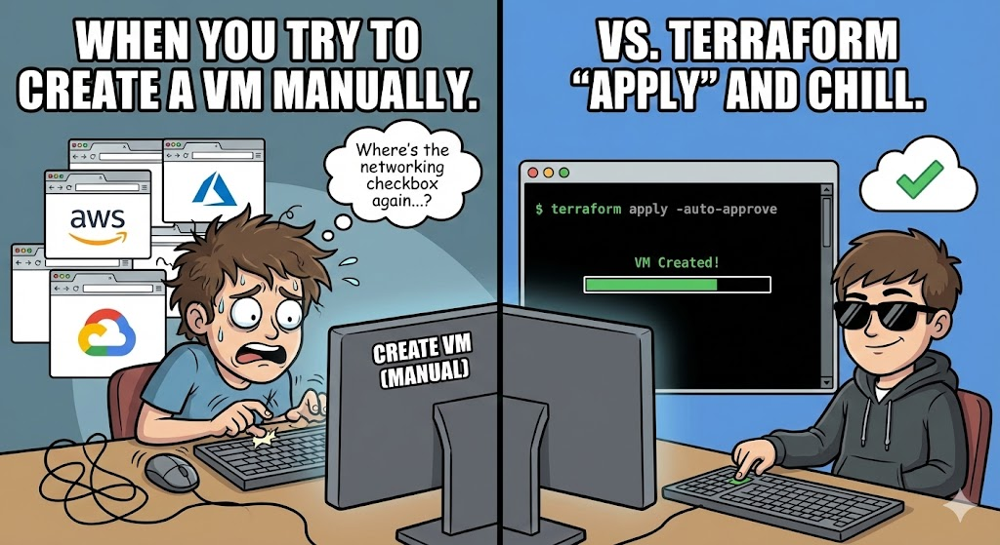
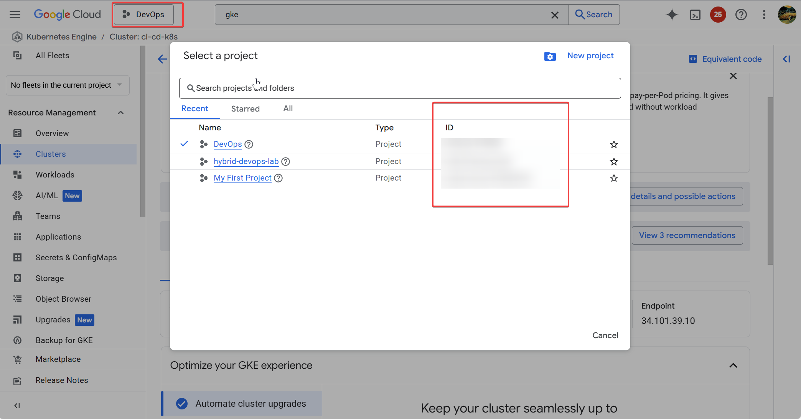
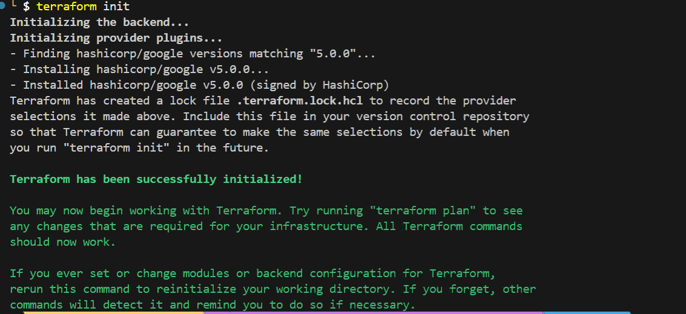
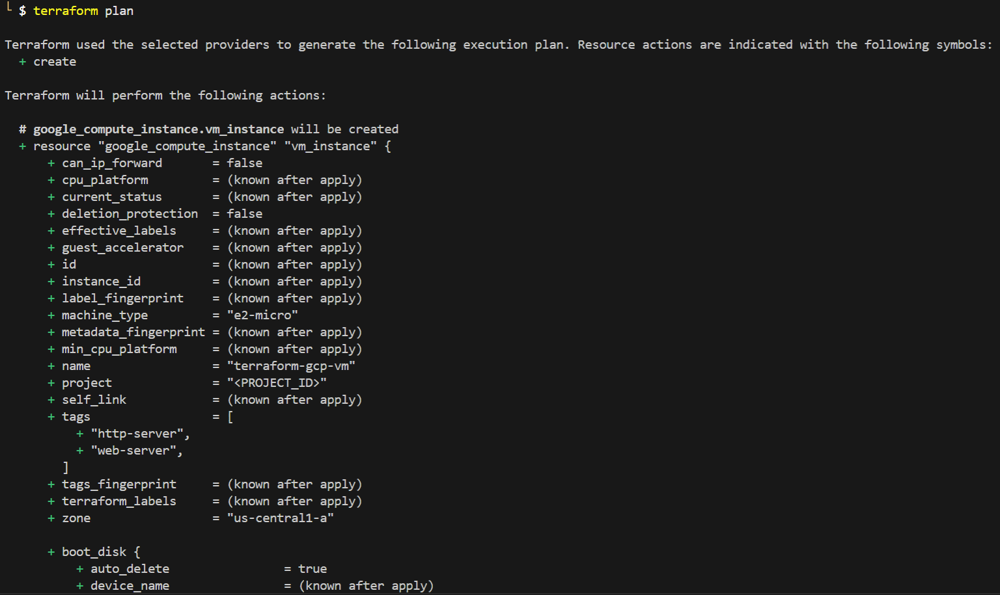
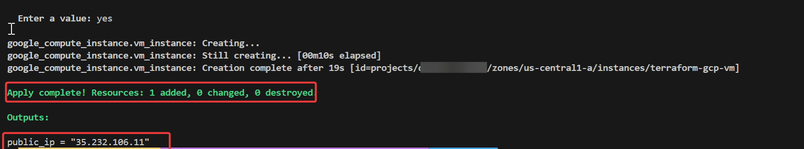
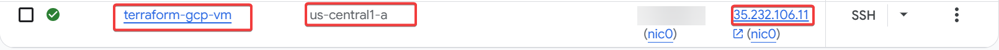
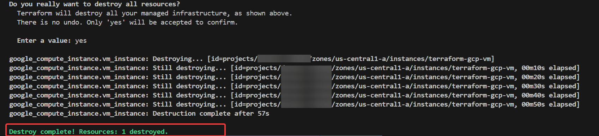

# Tự động triển khai VM trên Google Cloud (Chuẩn CLI)



Mục tiêu của bài Lab này rất đơn giản: **Dùng Terraform để tạo một máy ảo trên Google Cloud mà không tốn một xu nào (Free Tier).**

---

## 1. Chuẩn bị: Tạo Service Account trên GCP

Khác với Proxmox dùng User/Pass, các Cloud lớn như AWS hay GCP yêu cầu bảo mật cao hơn thông qua **Service Account Key**. Thay vì click chuột mỏi tay trên Console, bạn hãy mở **PowerShell** (hoặc Terminal) lên và chạy bộ lệnh sau để lấy Key "thần tốc".

:::info[Yêu cầu] 
Trước khi vô bài lab, ta cần phải chuẩn bị vài thứ:
- Cài đặt [Google Cloud SDK](https://cloud.google.com/sdk/docs/install) và đăng nhập (`gcloud auth login`).
- Lấy **PROJECT_ID** 

:::

```bash

cd /path-to-your-project

# 1. Cấu hình Project ID (Thay cái ID project của bạn vào đây)
$PROJECT_ID = "terraform-lab-123456"
gcloud config set project $PROJECT_ID

# 2. Tạo Service Account tên là 'terraform-user'
gcloud iam service-accounts create terraform-user `
    --display-name "Terraform User"

# 3. Lấy Email của nó lưu vào biến
$SA_EMAIL = "terraform-user@$PROJECT_ID.iam.gserviceaccount.com"

# 4. Trao quyền (Compute Admin để tạo máy, ServiceAccountUser để tự chạy)
gcloud projects add-iam-policy-binding $PROJECT_ID `
    --member="serviceAccount:$SA_EMAIL" `
    --role="roles/compute.admin"

gcloud projects add-iam-policy-binding $PROJECT_ID `
    --member="serviceAccount:$SA_EMAIL" `
    --role="roles/iam.serviceAccountUser"

# 5. TẠO KEY (File gcp-key.json sẽ xuất hiện ngay tại thư mục bạn đứng)
gcloud iam service-accounts keys create gcp-key.json `
    --iam-account=$SA_EMAIL

```

**Kết quả:** Bạn sẽ thấy file `gcp-key.json` xuất hiện

:::danger[Cảnh báo] 
Thêm ngay `gcp-key.json` vào `.gitignore`. Tuyệt đối không đẩy file này lên Git nếu không muốn mất tiền oan vì hacker
:::

---

## 2. Viết Code Terraform

:::tip[GCP free tier]
Google Cloud có gói miễn phí vĩnh viễn (Always Free) nếu bạn dùng đúng cấu hình `e2-micro` và ổ cứng `Standard`.
:::

Tạo file `main.tf` và copy nội dung sau:

```hcl
terraform {
  required_providers {
    google = {
      source  = "hashicorp/google"
      version = "5.0.0"
    }
  }
}

provider "google" {
  # Dùng file key vừa tạo bằng CLI
  credentials = file("gcp-key.json") 

  # Thay Project ID của bạn vào đây
  project     = "<PROJECT_ID>"
  
  # LƯU Ý: Để dùng Free Tier, bắt buộc chọn region Mỹ
  # (us-west1, us-central1, hoặc us-east1)
  region      = "us-central1"
  zone        = "us-central1-a"
}

resource "google_compute_instance" "vm_instance" {
  name         = "terraform-gcp-vm"
  machine_type = "e2-micro" # <--- Đây là gói miễn phí (2 vCPU, 1GB RAM)
  
  # Cần cho phép HTTP/HTTPS để sau này làm Web Server
  tags = ["web-server", "http-server"]

  boot_disk {
    initialize_params {
      # Hệ điều hành Ubuntu 22.04 LTS
      image = "ubuntu-os-cloud/ubuntu-2204-lts"
      
      # Google cho miễn phí 30GB mỗi tháng
      size  = 30 
      type  = "pd-standard" # Bắt buộc là pd-standard mới free (SSD là tốn tiền)
    }
  }

  network_interface {
    network = "default"
    access_config {
      # Để trống block này để Google tự cấp Public IP
    }
  }
}

# In ra IP sau khi chạy xong
output "public_ip" {
  value = google_compute_instance.vm_instance.network_interface.0.access_config.0.nat_ip
}

```

---

## 3. Triển khai (Deploy)

Mở Terminal tại thư mục code và gõ:

1. **`terraform init`**: Tải plugin Google Cloud về máy.



2. **`terraform plan`**: Terraform sẽ tính toán và báo cho bạn biết nó sắp tạo 1 VM ở `us-central1`.



3. **`terraform apply`**: Gõ `yes`, chờ khoảng 1p Terraform sẽ trả về một địa chỉ IP, ví dụ: `34.123.xx.xx`.



Bạn có thể kiểm tra trên [Google Cloud Console](https://console.cloud.google.com/compute/instances) để thấy máy ảo đang chạy.



Khi không còn cần xài nữa, ta chỉ cần chạy lệnh sau để xóa VM:

```cmd
terraform destroy
```

Gõ `yes` để xóa sạch mọi thứ. Điều này đảm bảo bạn không bao giờ bị trừ tiền vì những tài nguyên bị lãng quên (Zombies resources).



:::tip[Troubleshooting (Gỡ lỗi thường gặp)]

1. **Lỗi `Compute Engine API has not been used`**:
- Project mới tạo chưa bật API. Bạn cần vào link trong thông báo lỗi và bấm **Enable API**.


2. **Lỗi quota hoặc tính tiền**:
- Đảm bảo bạn chọn đúng `e2-micro` và region tại Mỹ (`us-central1`). Nếu chọn Singapore (`asia-southeast1`), bạn sẽ bị tính phí vì region này không nằm trong gói Free Tier.
:::

---

## Tổng kết

Vậy là bạn đã biết cách gõ code để khởi tạo một máy ảo trên môi trường cloud. Ở [bài tiếp theo](./02-proxmox-vm-clone.md), ta sẽ sử dụng Terraform để khởi tạo máy ảo trên môi trường on-premise thông qua Proxmox. 

