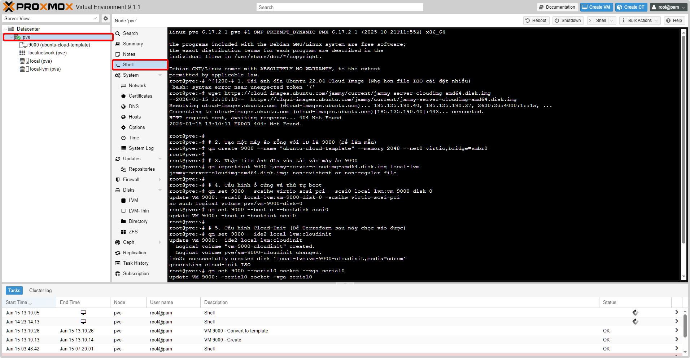
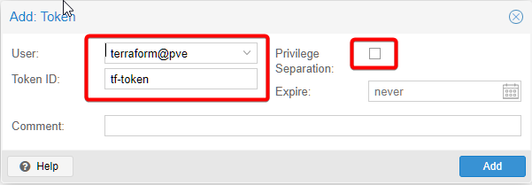
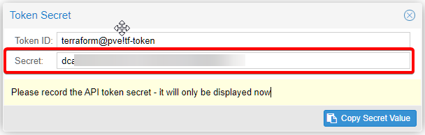
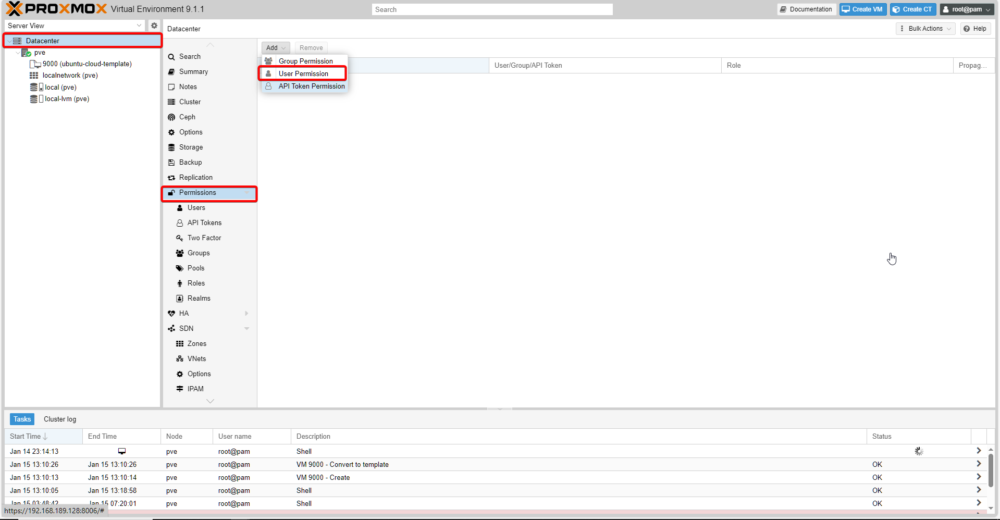
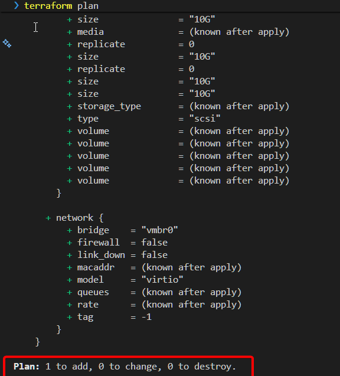

```hcl
terraform {
  required_providers {
    proxmox = {
      source  = "telmate/proxmox"
      version = "3.0.2-rc07"
    }
  }
}


provider "proxmox" {
  # Thay IP này bằng IP Proxmox của bạn
  pm_api_url = "https://<YOUR-PROXMOX-IP>:8006/api2/json"

  # Thông tin đăng nhập
  pm_api_token_id     = "<API-TOKEN-ID>"
  pm_api_token_secret = "<API-TOKEN-SECRET>"

  # Bỏ qua lỗi chứng chỉ SSL
  pm_tls_insecure = true
}

resource "proxmox_vm_qemu" "test_server" {
  # 1. Cấu hình cơ bản
  name        = "terraform-vm-01"
  target_node = "pve"

  # 2. Clone từ template cloud-init
  clone      = "ubuntu-cloud-template"
  full_clone = true

  # 3. CPU & RAM (theo schema mới)
  cpu {
    type = "host"
    cores   = 2
    sockets = 1
  }

  memory = 2048

  agent    = 1
  os_type  = "cloud-init"
  scsihw   = "virtio-scsi-pci"
  bootdisk = "scsi0"

  # 4. Ổ cứng
  disk {
    type    = "disk"
    slot    = "scsi0"
    storage = "local-lvm"
    size    = "10G"
  }

  # 5. Mạng (bắt buộc có id)
  network {
    id     = 0 # net0
    model  = "virtio"
    bridge = "vmbr0"
  }

  # 6. Cloud-Init
  # ipconfig0 = "ip=192.168.1.50/24,gw=192.168.1.1"
  ipconfig0 = "ip=dhcp"

  ciuser     = "luke"
  cipassword = "password123"
}
```
