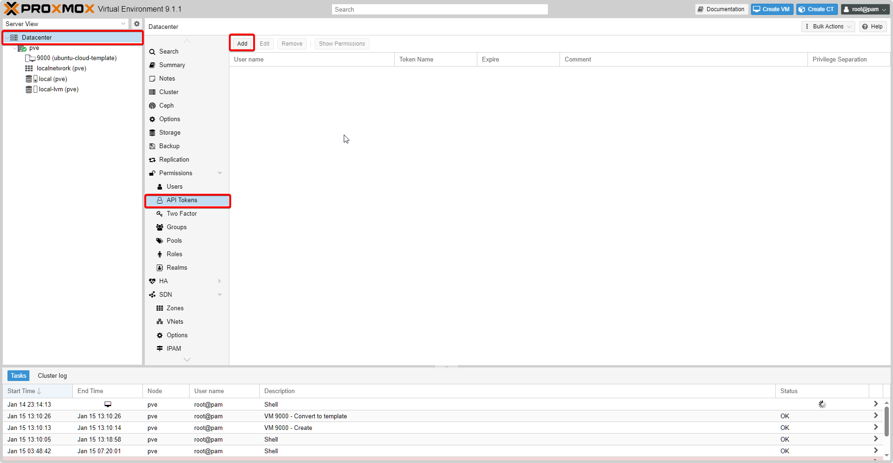
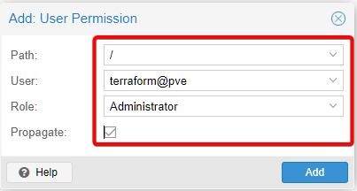
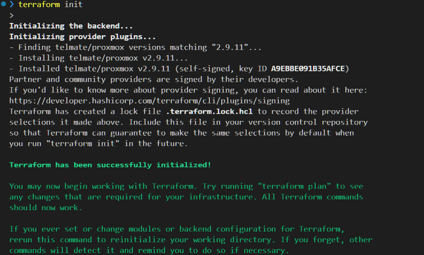
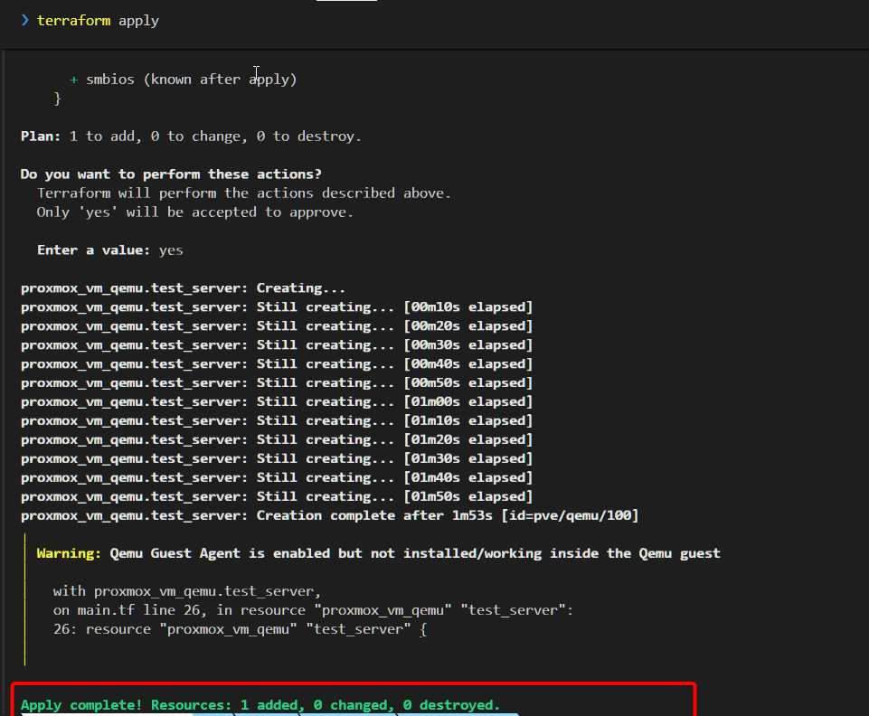
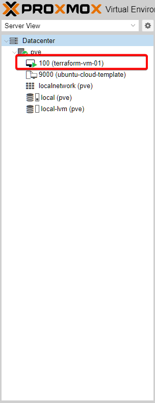
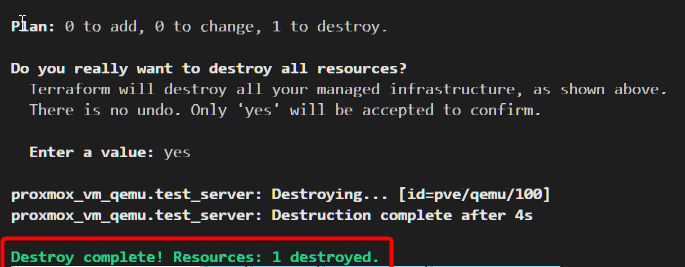

# Tự động triển khai VM trên Proxmox

Mục tiêu bài này rất đơn giản: **Không truy cập vào Web UI của Proxmox.** Chúng ta sẽ ngồi ở VS Code, gõ lệnh, và máy ảo tự động được tạo ra.

---

## 1. Chuẩn bị tài nguyên

:::tip[Cài đặt hạ tầng]
Trước khi vô bài lab, chúng ta sẽ cần phải cài đặt Proxmox và Terraform. Nếu bạn chưa có thì có thể tham khảo link sau:

- [Cài đặt Proxmox với VMWare](../../../Tips/InstallProxmoxWithVMWare.md)
- [Cài đặt Terraform trên Window](../../../Tips/InstallTerraformAndExtensionOnWindows.md)
:::

### Template

Terraform trên Proxmox hoạt động chủ yếu dựa trên cơ chế **Clone**. Tức là bạn cần một cái máy mẫu (Template) để nó nhân bản ra.

Nếu bạn chưa có Template Ubuntu Cloud-Init, hãy SSH vào Proxmox và chạy đoạn script "mì ăn liền" sau:


```bash
# 1. Tải ảnh Ubuntu 22.04 Cloud Image (Nhẹ hơn file ISO cài đặt)
wget https://cloud-images.ubuntu.com/jammy/current/jammy-server-cloudimg-amd64.disk.img

# 2. Tạo máy ảo rỗng ID 9000
qm create 9000 --name "ubuntu-cloud-template" --memory 2048 --net0 virtio,bridge=vmbr0

# 3. Nhập đĩa vào máy ảo
qm importdisk 9000 jammy-server-cloudimg-amd64.disk.img local-lvm

# 4. Cấu hình phần cứng & Cloud-Init
qm set 9000 --scsihw virtio-scsi-pci --scsi0 local-lvm:vm-9000-disk-0
qm set 9000 --boot c --bootdisk scsi0
qm set 9000 --ide2 local-lvm:cloudinit
qm set 9000 --serial0 socket --vga serial0
qm set 9000 --agent enabled=1

# 5. Biến thành Template (Quan trọng!)
qm template 9000

```

**Kết quả:** Bạn sẽ thấy một VM tên là `ubuntu-cloud-template` với icon hình cuốn vở trên giao diện Proxmox.


### API key
Để Terraform có thể truy cập và khởi tạo máy ảo một cách tự động thì ta cần phải cung cấp thông tin đăng nhập / API key. Để cho sát với thực tế, ta sẽ tạo một User riêng và cấp **API Token** giới hạn quyền.

#### Bước 1: Tạo User mới

1. Truy cập Proxmox Web UI -> **Datacenter** -> **Permissions** -> **Users**.
2. Bấm **Add**.
3. Điền thông tin:
    - **User name:** `terraform`
    - **Realm:** `Proxmox VE authentication server` (quan trọng: chọn `pve` để tách biệt với user hệ thống Linux).
    - **Password:** Đặt mật khẩu bất kỳ (dùng để login web nếu cần).
4. Bấm **Add**.


:::note[Realm: Sự khác biệt giữa pve và pam]
**1. Linux PAM standard authentication (`pam`)**

- **Bản chất:** Đây là User của **Hệ điều hành Linux** (Debian) đang chạy bên dưới Proxmox.
- **Đặc điểm:** Nếu bạn tạo một user thuộc realm này, user đó vừa đăng nhập được vào Web Proxmox, vừa có thể SSH vào server vật lý để chạy lệnh Linux.
- **Rủi ro:** Nếu bạn xóa user này trong Linux, user trên Proxmox cũng mất. Dùng realm này cho Terraform là hơi "thừa quyền" và rủi ro bảo mật cao.

**2. Proxmox VE authentication server (`pve`)**

- **Bản chất:** Đây là User **"nội bộ"**, chỉ tồn tại và sống trong phần mềm Proxmox. Nó không liên quan gì đến hệ điều hành Linux bên dưới.
- **Đặc điểm:** User này chỉ dùng để đăng nhập Web UI hoặc gọi API. Nó **không thể** SSH vào hệ điều hành để gõ lệnh `rm -rf /` được.
- **Tại sao nên dùng cho Terraform?** Đây là lựa chọn chuẩn bài (Best Practice). Chúng ta cần một Service Account chỉ chuyên làm nhiệm vụ quản lý máy ảo, tách biệt hoàn toàn với quyền quản trị hệ thống (System Admin).

**Tóm lại:** Khi làm Lab hoặc Production, hãy luôn chọn Realm là **Proxmox VE authentication server (`pve`)** cho các user chạy tự động (Automation User) như Terraform.
:::


#### Bước 2: Tạo API Token
1. Vào tab **API Tokens** (ngay cạnh tab Users).



2. Bấm **Add**.
3. Chọn User: `terraform@pve`.
4. **Token ID:** Đặt tên tùy ý, ví dụ `tf-token`.
5. **Privilege Separation:** Unchecked.
    - **Lưu ý:** Tính năng này giúp Token hoạt động độc lập. Quyền của Token sẽ tách biệt với quyền của User.
6. Bấm **Add**.


:::danger[LƯU Ý SỐNG CÒN] 
Màn hình sẽ hiện ra **Secret Value** (chuỗi ký tự dài ngoằng). Bạn phải **COPY NGAY** và lưu vào đâu đó an toàn. Sau khi tắt cửa sổ này, bạn sẽ **KHÔNG BAO GIỜ** xem lại được nó nữa.


:::

#### Bước 3: Cấp quyền 
Rất nhiều bạn tạo xong Token, copy vào code chạy thì bị lỗi `403 Forbidden` hoặc `cannot retrieve user list`. Lý do là User chứa token này chưa được cấp quyền.

1. Vào tab **Permissions** (ngoài cùng).
2. Bấm **Add** -> Chọn **User Permission**

3. Điền thông tin:
    - **Path**: `/`
    - **User**: `terraform@pve`
    - **Role**: Administrator
    - **Propagate**: Check
4. Bấm **Add**.



:::tip[Best Practice]
Với cấu hình hiện tại thì `API token` sẽ có quyền giống user `terraform`, nhưng trong thực tế ta sẽ có những best practice sau:
- Chọn **Privilege Separation** khi tạo `API token` - Điều này giúp token sẽ có quyền tách bách với user.
- Custom permission phù hợp cho token
- Ở phần cấp quyền, thay vì chọn **User Permission**, ta sẽ chọn **API Key Permission**. 
:::


## 2. Code Terraform

Tạo file `main.tf` và copy nội dung sau:


```hcl
terraform {
  required_providers {
    proxmox = {
      source  = "telmate/proxmox"
      version = "3.0.2-rc07"
    }
  }
}


provider "proxmox" {
  # Thay IP này bằng IP Proxmox của bạn
  pm_api_url = "https://<YOUR-PROXMOX-IP>:8006/api2/json"

  # Thông tin đăng nhập
  pm_api_token_id     = "<API-TOKEN-ID>"
  pm_api_token_secret = "<API-TOKEN-SECRET>"

  # Bỏ qua lỗi chứng chỉ SSL
  pm_tls_insecure = true
}

resource "proxmox_vm_qemu" "test_server" {
  # 1. Cấu hình cơ bản
  name        = "terraform-vm-01"
  target_node = "pve"

  # 2. Clone từ template cloud-init
  clone      = "ubuntu-cloud-template"
  full_clone = true

  # 3. CPU & RAM (theo schema mới)
  cpu {
    type = "host"
    cores   = 2
    sockets = 1
  }

  memory = 2048

  agent    = 1
  os_type  = "cloud-init"
  scsihw   = "virtio-scsi-pci"
  bootdisk = "scsi0"

  # 4. Ổ cứng
  disk {
    type    = "disk"
    slot    = "scsi0"
    storage = "local-lvm"
    size    = "10G"
  }

  # 5. Mạng (bắt buộc có id)
  network {
    id     = 0 # net0
    model  = "virtio"
    bridge = "vmbr0"
  }

  # 6. Cloud-Init
  # ipconfig0 = "ip=192.168.1.50/24,gw=192.168.1.1"
  ipconfig0 = "ip=dhcp"

  ciuser     = "luke"
  cipassword = "password123"
}
```


---

## 3. Triển khai (The Magic Moment)

Mở Terminal và gõ "thần chú":

1. `terraform init` -> Tải đồ nghề.




2. `terraform plan` -> Lên kế hoạch.


3. `terraform apply` -> Đồng ý triển khai




Sau khi chạy xong, ta sẽ thấy có một máy ảo được tạo ở trên Proxmox



Khi không còn nhu cầu xài nữa, ta chỉ cần chạy lệnh `terraform destroy` để xóa đi



---

## 4. Nhật ký gỡ lỗi (Troubleshooting)

Đời không như mơ, đây là những lỗi mình đã gặp phải và cách xử lý, hy vọng giúp bạn tiết kiệm vài giờ đồng hồ vò đầu bứt tai.

### 🐛 Lỗi 1: `Error: vm 'ubuntu-cloud-template' not found`

* **Hiện tượng:** Terraform bảo không tìm thấy template, dù mình đã tạo rồi.
* **Nguyên nhân:**
1. Sai tên: Trong code là `ubuntu-cloud-template` nhưng trên Proxmox lại đặt là `template-ubuntu`.
2. Sai Node: Khai báo `target_node = "pve"` nhưng tên máy thật là `pve1` hoặc `proxmox`.


* **Cách fix:** Kiểm tra kỹ tên VM (dùng lệnh `qm config <vmid> | grep name`) và tên Node, sửa lại trong code cho khớp 100%.

### 🐛 Lỗi 2: `Error: 500 no such file '/cluster/nextid'`

* **Hiện tượng:** Terraform không thể tự động lấy ID tiếp theo cho máy ảo.
* **Nguyên nhân:** Dịch vụ Cluster của Proxmox bị "kẹt" hoặc file host bị sai (thường gặp khi chạy Proxmox trên VMware/VirtualBox).
* **Cách fix:**
* *Cách "chữa cháy":* Thêm dòng `vmid = 101` vào code để chỉ định cứng ID luôn.
* *Cách triệt để:* Kiểm tra file `/etc/hosts` trên Proxmox xem IP và Hostname có khớp nhau không, sau đó reboot.

### 🐛 Lỗi 3: `valid credentials but cannot retrieve user list`

* **Hiện tượng:** Đăng nhập được nhưng không có quyền làm gì cả.
* **Nguyên nhân:** Dùng **API Token** nhưng quên chưa cấp quyền cho chính cái Token đó (do tính năng *Privilege Separation*).
* **Cách fix:** Vào Proxmox -> Datacenter -> Permissions -> Add **API Token Permission** -> Gán role **Administrator** cho Token `terraform@pve!mytoken` (nhớ chọn đúng Token có dấu `!`).

---

## Tổng kết

Hy vọng bài viết này giúp các bạn tự tin hơn trên con đường IaC.

