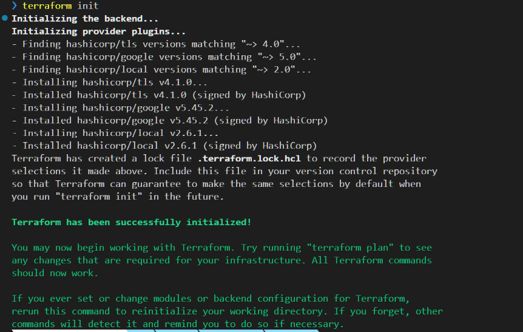
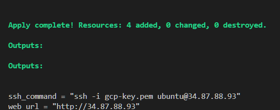
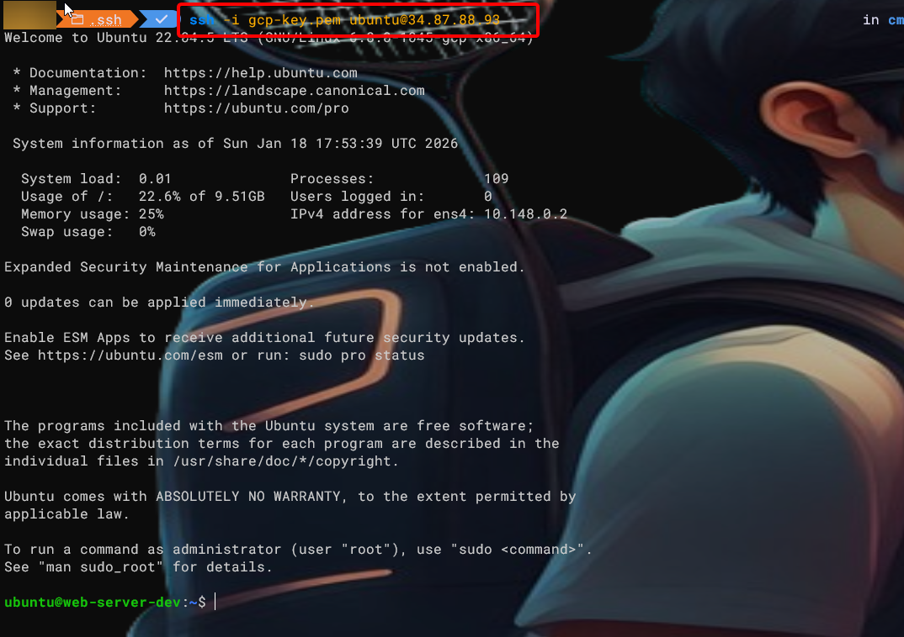
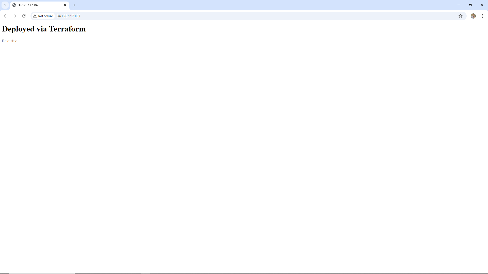
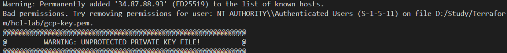

# Thực hành viết code HCL

Nhiều bạn mới học thường copy-paste code trên mạng về chạy được là thôi (mình cũng đã từng 😂). Nhưng để trở thành một DevOps thực thụ, bạn cần hiểu tại sao code lại viết như vậy.

Hôm nay, mình sẽ chia sẻ một file `main.tf` dùng để dựng Web Server trên Google Cloud. File này là một **bài tập tổng hợp** chứa đựng những tinh hoa cơ bản nhất của HCL mà bạn cần nắm vững.

## 1. Code hoàn chỉnh

Trước tiên, ta cần tạo một file `install_nginx.sh` với nội dung sau:

```bash
#!/bin/bash
sudo apt-get update
sudo apt-get install -y nginx
sudo echo "<h1>Deployed via Terraform</h1><p>Env: ${env_name}</p>" > /var/www/html/index.html
sudo systemctl enable nginx
sudo systemctl start nginx
```

Sau đó, ta sẽ tạo thêm file `main.tf` trong cùng một thư mục:

```hcl
terraform {
  required_version = ">= 1.0.0"
  required_providers {
    google = {
      source  = "hashicorp/google"
      version = "~> 5.0"
    }
    local = {
      source  = "hashicorp/local"
      version = "~> 2.0"
    }
    tls = {
      source  = "hashicorp/tls"
      version = "~> 4.0"
    }
  }
}

# --- CẤU HÌNH BIẾN  ---

variable "project_id" {
  description = "ID Project GCP của bạn"
  type        = string

  # 👇 BẠN ĐIỀN ID PROJECT CỦA BẠN VÀO DÒNG DƯỚI NÀY 👇
  default = "<PROJECT_ID>"
}

variable "project_config" {
  description = "Cấu hình môi trường"
  type = object({
    env           = string
    instance_size = map(string)
    whitelist_ips = list(string)
  })

  default = {
    env = "dev"
    instance_size = {
      dev  = "e2-micro" # Gói rẻ nhất ở Singapore
      prod = "e2-medium"
    }
    whitelist_ips = ["0.0.0.0/0"]
  }
}

# --- PROVIDER ---

provider "google" {
  project = var.project_id # Lấy từ default ở trên
  region  = "asia-southeast1"
  zone    = "asia-southeast1-a"
}

# --- SSH KEY TỰ ĐỘNG ---
resource "tls_private_key" "ssh_key" {
  algorithm = "RSA"
  rsa_bits  = 4096
}

resource "local_file" "private_key_pem" {
  content         = tls_private_key.ssh_key.private_key_pem
  filename        = "${path.module}/gcp-key.pem"
  file_permission = "0400"
}

# --- NETWORK & FIREWALL ---

resource "google_compute_firewall" "web_firewall" {
  name    = "allow-http-ssh-${var.project_config.env}"
  network = "default"

  allow {
    protocol = "tcp"
    ports    = ["80", "22"]
  }

  source_ranges = var.project_config.whitelist_ips
  target_tags   = ["web-server-${var.project_config.env}"]
}

# --- MÁY ẢO (INSTANCE) ---

resource "google_compute_instance" "web_server" {
  name         = "web-server-${var.project_config.env}"
  machine_type = var.project_config.env == "prod" ? var.project_config.instance_size["prod"] : var.project_config.instance_size["dev"]
  tags         = ["web-server-${var.project_config.env}"]

  boot_disk {
    initialize_params {
      image = "ubuntu-os-cloud/ubuntu-2204-lts"
    }
  }

  network_interface {
    network = "default"
    access_config {
      # Tự động cấp Public IP
    }
  }

  # Nhúng SSH Key vào máy ảo
  metadata = {
    ssh-keys = "ubuntu:${tls_private_key.ssh_key.public_key_openssh}"
  }

  # Script cài Web Server
  metadata_startup_script = <<-EOF
    #!/bin/bash
    apt-get update
    apt-get install -y nginx
    echo "<h1>Deployed via Terraform (Single File)</h1><p>Env: ${var.project_config.env}</p>" > /var/www/html/index.html
    systemctl enable nginx
    systemctl start nginx
  EOF
}

# --- OUTPUTS (KẾT QUẢ) ---

output "ssh_command" {
  description = "Copy dòng này để SSH"
  value       = "ssh -i gcp-key.pem ubuntu@${google_compute_instance.web_server.network_interface.0.access_config.0.nat_ip}"
}

output "web_url" {
  description = "Bấm vào để xem web"
  value       = "http://${google_compute_instance.web_server.network_interface.0.access_config.0.nat_ip}"
}
```

---

## 2. Giải phẫu ngữ pháp HCL (Deep Dive)

Chúng ta hãy cùng soi kính lúp vào các kỹ thuật HCL đã được sử dụng trong file này nhé.

### Kỹ thuật 1: Cấu trúc Block, Attribute và Data Type

Trước khi đi vào các logic phức tạp, hãy nhìn vào những thành phần cơ bản nhất cấu tạo nên file HCL này.

#### 1. Attribute (Thuộc tính / Tham số)

Trong HCL, mọi thứ nằm trong dấu ngoặc nhọn `{ ... }` thường là các **Attribute**. Chúng hoạt động theo cơ chế `key = value` (Tên = Giá trị).

Ví dụ trong block `resource "google_compute_instance"`:

```hcl
resource "google_compute_instance" "web_server" {
  name         = "web-server-dev"  # <-- Attribute "name" có giá trị là chuỗi
  machine_type = "e2-micro"        # <-- Attribute "machine_type"
  allow_stopping_for_update = true # <-- Attribute kiểu Boolean
}
```

:::note[Lưu ý]
Trong tài liệu Terraform, khi bạn **cài đặt** giá trị như trên, gọi là **Arguments**. Khi bạn **lấy giá trị ra** gọi là **Attributes**. Nhưng để dễ hiểu, bạn cứ coi chúng là các cặp khóa-giá trị cấu hình.
:::

#### 2. Data Types (Các kiểu dữ liệu)

Terraform là ngôn ngữ **định kiểu mạnh** (Strongly Typed). Dưới đây là các kiểu dữ liệu xuất hiện ngay trong bài lab này:

**Primitive Types (Kiểu nguyên thủy):**

    - **`string`**: Chuỗi ký tự, bao quanh bởi dấu ngoặc kép `""`.
    - Ví dụ: `region = "asia-southeast1"`

**`number`**: Số nguyên hoặc số thực.

    - Ví dụ: `rsa_bits = 4096` (trong block tạo key).

**`bool`**: Đúng/Sai (`true` hoặc `false`).

    - Thường dùng để bật tắt tính năng.

**`list` (Danh sách):**

    - Một mảng các giá trị được đánh thứ tự, nằm trong `[]`.
    - Ví dụ: `whitelist_ips = ["0.0.0.0/0", "1.1.1.1"]`.
    - Cách dùng: Truy cập phần tử đầu tiên bằng index `[0]`.

**`map` (Bản đồ/Từ điển):**

    - Tập hợp các cặp `key = value`, nằm trong `{}`.
    - Ví dụ: Biến `instance_size` ánh xạ môi trường sang cấu hình:

```hcl
instance_size = {
  dev  = "e2-micro"
  prod = "e2-medium"
}
# Cách dùng: Truy cập bằng key: `var.instance_size["dev"]`.
```

---

### Kỹ thuật 2: Kiểu dữ liệu phức hợp (Complex Types)

Thay vì khai báo rời rạc từng biến như `var.env`, `var.size`, `var.ip`, HCL cho phép chúng ta gom nhóm lại thành một **Object**.

```hcl
variable "project_config" {
  type = object({
    env           = string
    instance_size = map(string)  # Map: Key-Value
    whitelist_ips = list(string) # List: Mảng
  })

  default = {
    env = "dev"
    instance_size = {
      dev  = "e2-micro"
      prod = "e2-medium"
    }
    whitelist_ips = ["0.0.0.0/0"]
  }
}
```

### Kỹ thuật 3: Toán tử 3 ngôi (Ternary Operator) - Logic "Nếu... Thì..."

HCL là ngôn ngữ khai báo (Declarative), nó không có vòng lặp `if-else` như Python. Thay vào đó, chúng ta dùng toán tử 3 ngôi để xử lý logic điều kiện.

```hcl
machine_type = var.project_config.env == "prod" ? var.project_config.instance_size["prod"] : var.project_config.instance_size["dev"]
```

**Giải thích:**

- **Điều kiện:** `var.project_config.env == "prod"`
- **Nếu đúng (?):** Dùng gói to (`e2-medium`).
- **Nếu sai (:):** Dùng gói nhỏ (`e2-micro`).
- **Ứng dụng:** Cực kỳ hữu ích để viết một file code dùng chung cho nhiều môi trường (Dev/Staging/Prod).

Chào bạn, đây là sự điều chỉnh tuyệt vời. Việc bổ sung cảnh báo về lỗi `^M` (CRLF) vào bài viết sẽ giúp người đọc tránh được "cú lừa" đau đớn mà bạn vừa trải qua. Nó biến bài blog từ lý thuyết suông thành kinh nghiệm thực chiến đắt giá.

Bạn hãy thay thế đoạn **"Kỹ thuật 3: Heredoc Syntax"** cũ bằng nội dung mới dưới đây nhé:

---

### Kỹ thuật 4: Sử dụng hàm

Trong đoạn code trên, ta có sử dụng hàm `templatefile` để tải đoạn script `install_nginx.sh` và truyền giá trị cho tham số `env_name`. Đây là một trong những cách "chia để trị" trong triển khải IaC

```hcl
  metadata_startup_script = templatefile("${path.module}/install_nginx.sh", {
    env_name = var.project_config.env
  })
```

---

### Kỹ thuật 5: Phụ thuộc ngầm định (Implicit Dependency)

Bạn sẽ thấy trong block tạo máy ảo `google_compute_instance`, chúng ta không hề bảo nó "Hãy đợi tạo SSH Key xong rồi mới tạo VM". Nhưng Terraform vẫn tự biết. Tại sao?

```hcl
metadata = {
  # Terraform thấy dòng này tham chiếu tới resource tls_private_key
  ssh-keys = "ubuntu:${tls_private_key.ssh_key.public_key_openssh}"
}
```

**Bài học:** Khi Resource A tham chiếu đến thuộc tính của Resource B, Terraform tự động hiểu A phụ thuộc vào B. Nó sẽ vẽ ra đồ thị (Graph) và tạo B trước, A sau. Đây là sức mạnh cốt lõi của Terraform.

---

## 3. Triển khai code

Đã hiểu ngữ pháp rồi, giờ hãy bắt tay vào thực hành để thấy sự kỳ diệu của Terraform.

### Bước 1: Chuẩn bị môi trường

1. Tạo một thư mục mới tên là `hcl-practice`.
2. Tạo file `main.tf` và dán toàn bộ đoạn code ở trên vào.
3. **Quan trọng:** Sửa dòng `default = "terraform-lab-123456"` trong block `variable "project_id"` thành ID Project GCP thực tế của bạn.

### Bước 2: Xác thực (Authentication)

Trước khi chạy `apply` chúng ta phải đăng nhập trực tiếp qua CLI trước.

Mở Terminal và chạy:

```bash
gcloud auth application-default login
```

Một cửa sổ trình duyệt sẽ hiện ra, bạn hãy đăng nhập vào tài khoản Google Cloud của mình và bấm **Allow**. Lúc này, Terraform sẽ tự động "mượn" quyền của bạn để chạy.

### Bước 3: Triển khai (Deploy)

Gõ lần lượt các lệnh sau vào Terminal:

**1. Khởi tạo (`init`):**
Tải các plugin cần thiết (Google, TLS, Local) về máy.

```bash
terraform init
```



**2. Lên kế hoạch (`plan`):**
Xem trước những gì Terraform sắp làm. Hãy để ý xem nó có báo tạo 4 tài nguyên (Key, File, Firewall, Instance) không.

```bash
terraform plan
```


**3. Áp dụng (`apply`):**
Gõ `yes` để xác nhận.

```bash
terraform apply
```

Sau khoảng 1 phút, Terraform sẽ nhả ra kết quả (Output) màu xanh lá cây:



- Hãy thử copy dòng `ssh_command` và paste vào terminal, bạn sẽ thấy mình lọt vào trong server mà không cần nhập mật khẩu!



- Bấm vào `web_url`, bạn sẽ thấy trang web hiện ra với dòng chữ báo môi trường hiện tại.



:::tip[Fix lỗi **UNPROTECTED PRIVATE KEY FILE**]
Khi bạn access `ssh` nhưng gặp lỗi sau


Hãy copy file `gcp-key.pem` vào ổ C và chạy lại. Đây chỉ là cơ chế bảo vệ của GCP khi nó nhận thấy file secret key của bạn quá **OPEN**

:::

### Bước 5: Dọn dẹp (Destroy)

Đừng quên nguyên tắc vàng của Cloud: **Dùng xong phải tắt** để không bị trừ tiền oan.

```bash
terraform destroy
```

---

:::tip[💡 Bonus Tip: Debug code HCL bằng `console`]

Nếu bạn viết một logic phức tạp (ví dụ toán tử 3 ngôi) và không chắc nó chạy đúng hay sai, đừng chạy `apply` vội. Hãy dùng lệnh:

```bash
terraform console
```

Tại đây bạn có thể gõ thử để kiểm tra logic:

```hcl
> 1 + 2
3
> "dev" == "prod" ? "t3.medium" : "t3.micro"
"t3.micro"

```

Đây là cách nhanh nhất để học và kiểm tra ngữ pháp HCL đấy!
:::

---

## Tổng kết

Qua bài lab nhỏ này, chúng ta không chỉ có một Web Server trên Google Cloud, mà quan trọng hơn là đã nắm vững các cú pháp nền tảng của HCL. Bạn hãy chạy thử file này nhưng sửa đổi biến `env = "prod"` và chạy thử xem máy ảo có tự động to lên không nhé!
