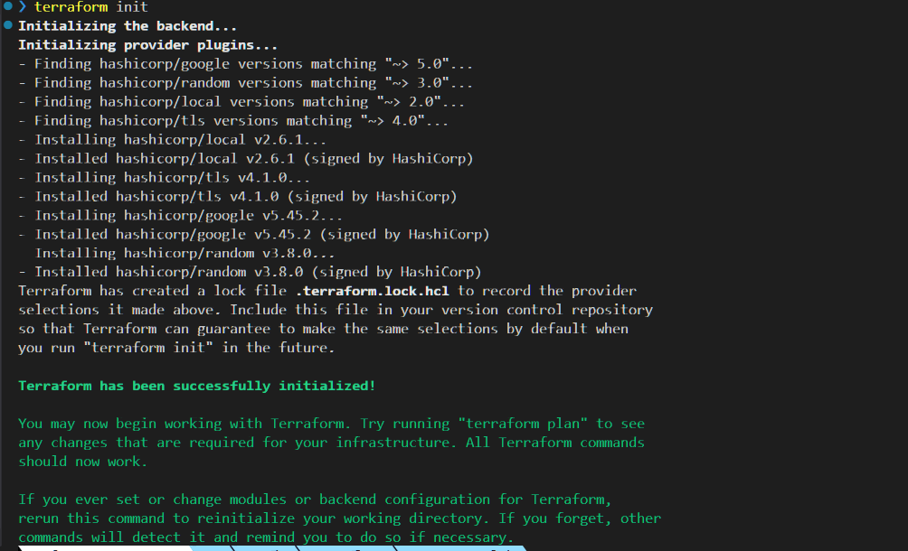
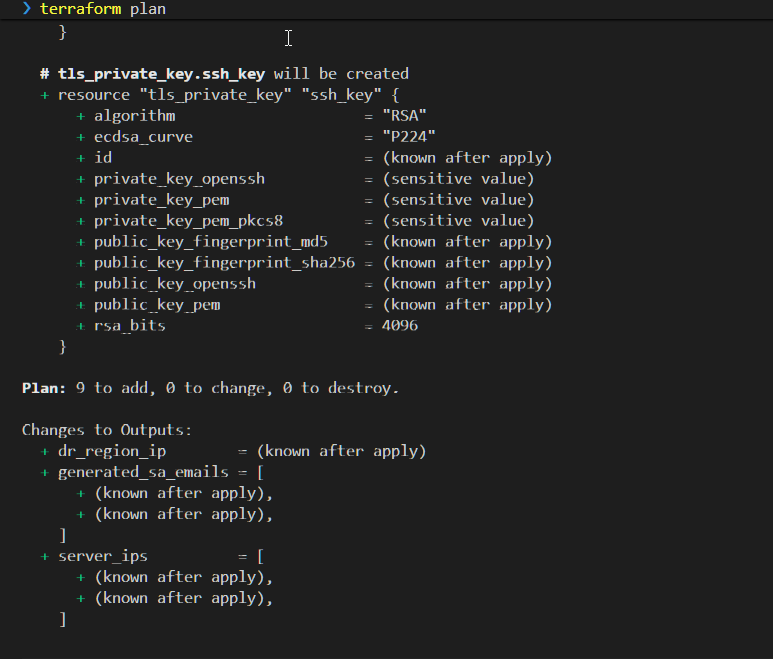
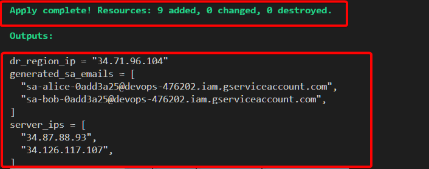
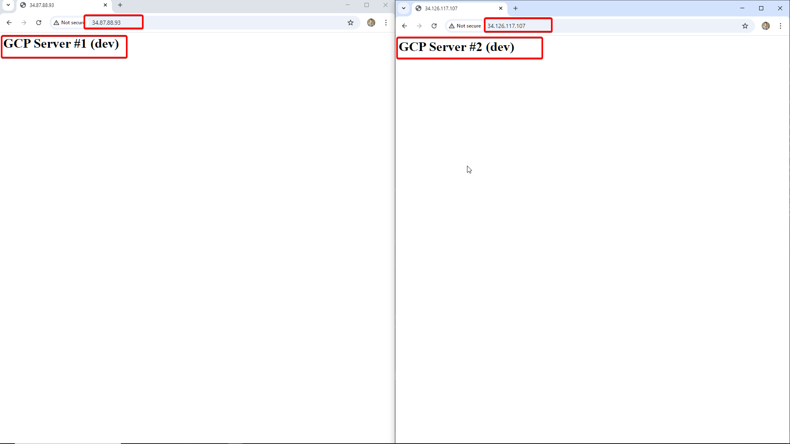
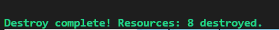

# Thực hành với Meta-Arguments (Multi-Region & Scaling)

Để xây dựng những hệ thống lớn, linh hoạt và "thông minh" như các Senior DevOps, chỉ biết `resource` thôi là chưa đủ.

Bạn cần phải biết đến **Meta-Arguments**.

Nếu Resource là những viên gạch, thì Meta-Arguments chính là "xi măng cốt thép" giúp bạn uốn nắn hạ tầng theo ý muốn:

- Tạo 100 máy ảo chỉ với 1 dòng code?
- Triển khai hệ thống ở Singapore và Mỹ cùng lúc?
- Update Firewall mà không làm rớt mạng?

Hôm nay, chúng ta sẽ thực hành một bài Lab trên Google Cloud để làm chủ 5 quyền năng này.

## 1. Kịch bản Lab (Architecture)

Chúng ta sẽ viết một file `main.tf` duy nhất (All-in-One) để giải quyết bài toán hóc búa sau:

1. **Scaling:** Tự động tạo 2 Web Server (Nginx) tại Singapore.
2. **Multi-Region (DR):** Tạo sẵn một IP tĩnh tại Mỹ (US) để dự phòng thảm họa.
3. **Identity:** Tạo danh sách Service Account quản trị viên từ một Map cấu hình.
4. **Zero Downtime:** Cập nhật Firewall không gây mất kết nối.

---

## 2. Code terraform

Bạn hãy tạo file `main.tf` và copy nội dung sau vào.

```hcl
# [1] BLOCK: Terraform configuration
terraform {
  required_version = ">= 1.0.0"
  required_providers {
    google = {
      source  = "hashicorp/google"
      version = "~> 5.0"
    }
    random = {
      source  = "hashicorp/random"
      version = "~> 3.0"
    }
    local = {
      source  = "hashicorp/local"
      version = "~> 2.0"
    }
    tls = {
      source  = "hashicorp/tls"
      version = "~> 4.0"
    }
  }
}

# --- PROVIDERS (META-ARGUMENT: ALIAS) ---

# Provider Chính (Singapore)
provider "google" {
  project = var.project_id
  region  = "asia-southeast1"
  zone    = "asia-southeast1-a"
}

# [META-ARGUMENT 1: Provider Alias]
# Provider phụ cho Disaster Recovery (Mỹ - Iowa)
provider "google" {
  alias   = "dr_region"
  project = var.project_id
  region  = "us-central1"
  zone    = "us-central1-a"
}

# --- VARIABLES ---

variable "project_id" {
  description = "ID Project GCP của bạn"
  type        = string
  default     = "<PROJECT-ID>" # <--- THAY ID CỦA BẠN VÀO ĐÂY
}

variable "project_config" {
  type = object({
    env            = string
    instance_size  = map(string)
    whitelist_ips  = list(string)
    instance_count = number
  })

  default = {
    env = "dev"
    instance_size = {
      dev  = "e2-micro"
      prod = "e2-medium"
    }
    whitelist_ips  = ["0.0.0.0/0"]
    instance_count = 2 # Scaling: Tạo 2 servers
  }
}

variable "sysadmin_users" {
  description = "Danh sách Service Account quản trị (Map)"
  type        = map(string)
  default = {
    "alice" = "DevOps Lead"
    "bob"   = "SysAdmin Intern"
  }
}

# --- FIX: RANDOM ID GENERATOR ---
resource "random_id" "lab_id" {
  byte_length = 4
  keepers = {
    env = var.project_config.env
  }
}

# --- RESOURCES ---

# 1. SSH KEY (GCP dùng Metadata Global, không cần tạo KeyPair từng vùng)
resource "tls_private_key" "ssh_key" {
  algorithm = "RSA"
  rsa_bits  = 4096
}

resource "local_file" "private_key_pem" {
  content         = tls_private_key.ssh_key.private_key_pem
  filename        = "${path.module}/generated-key.pem"
  file_permission = "0400"
}

# [DEMO ALIAS]: Thay vì tạo KeyPair (vì GCP Key là global),
# ta tạo 1 IP Tĩnh ở Mỹ để chứng minh Provider Alias hoạt động.
resource "google_compute_address" "dr_static_ip" {
  # [META-ARGUMENT 1: Provider]
  provider = google.dr_region

  name = "dr-ip-${var.project_config.env}-${random_id.lab_id.hex}"
}

# 2. IAM (SERVICE ACCOUNTS)
resource "google_service_account" "sysadmins" {
  # [META-ARGUMENT 3: For_each]
  # Duyệt qua map user để tạo SA
  for_each = var.sysadmin_users

  account_id   = "sa-${each.key}-${random_id.lab_id.hex}"
  display_name = "${each.value} (Managed by Terraform)"
}

# 3. FIREWALL (Network)
resource "google_compute_firewall" "tony_web_fw" {
  # [FIX DUPLICATE] Thêm random suffix
  name    = "allow-web-${var.project_config.env}-${random_id.lab_id.hex}"
  network = "default"

  allow {
    protocol = "tcp"
    ports    = ["80", "22"]
  }

  source_ranges = var.project_config.whitelist_ips

  # Firewall GCP áp dụng theo Tag
  target_tags = ["web-server-${var.project_config.env}"]

  # [META-ARGUMENT 2: Lifecycle]
  # Tạo Rule mới xong rồi mới xóa Rule cũ -> Tránh mất kết nối
  lifecycle {
    create_before_destroy = true
  }
}

# 4. COMPUTE (VM INSTANCES)
resource "google_compute_instance" "web_server" {
  # [META-ARGUMENT 4: Count]
  # Scaling: Tạo 2 máy ảo
  count = var.project_config.instance_count

  # [META-ARGUMENT 5: Depends_on]
  # Bắt buộc chờ tạo xong Service Account mới được tạo máy (Giả lập logic phụ thuộc)
  depends_on = [
    google_service_account.sysadmins
  ]

  name         = "web-server-${var.project_config.env}-${count.index}-${random_id.lab_id.hex}"
  machine_type = var.project_config.env == "prod" ? var.project_config.instance_size["prod"] : var.project_config.instance_size["dev"]

  # Gắn tag để Firewall nhận diện
  tags = ["web-server-${var.project_config.env}"]

  boot_disk {
    initialize_params {
      image = "ubuntu-os-cloud/ubuntu-2204-lts"
    }
  }

  network_interface {
    network = "default"
    access_config {
      # Tự động cấp IP Public
    }
  }

  # Nhúng SSH Key vào Metadata của máy
  metadata = {
    ssh-keys = "ubuntu:${tls_private_key.ssh_key.public_key_openssh}"
  }

  # Script cài đặt Nginx
  # Script cài Web Server
  metadata_startup_script = templatefile("${path.module}/install_nginx.sh", {
    env_name  = var.project_config.env,
    env_index = count.index + 1
  })

  # Nhãn quản lý (Labels - khác với Tags)
  labels = {
    env        = var.project_config.env
    managed_by = "terraform"
  }
}

# --- OUTPUTS ---

output "server_ips" {
  description = "Danh sách IP của các server (Splat Operator)"
  # Cú pháp Splat [*] lấy toàn bộ IP của các máy trong count
  value = google_compute_instance.web_server[*].network_interface.0.access_config.0.nat_ip
}

output "dr_region_ip" {
  description = "IP dự phòng tại Mỹ (Được tạo bởi Provider Alias)"
  value       = google_compute_address.dr_static_ip.address
}

output "generated_sa_emails" {
  description = "Email của các Service Account vừa tạo (For loop)"
  # Dùng vòng lặp for để lấy ra danh sách email đẹp mắt
  value = [for sa in google_service_account.sysadmins : sa.email]
}
```

---

## 3. Phân tích code

Hãy cùng mổ xẻ xem điều gì đang diễn ra bên dưới các dòng code trên.

### 1. `provider` (alias)

Mặc định Terraform chỉ kết nối tới 1 vùng (Region). Nhưng nếu bạn muốn làm Disaster Recovery (DR), bạn cần kết nối tới vùng khác.

- **Code:** `provider = google.dr_region`
- **Tác dụng:** Resource IP tĩnh được tạo ở **Mỹ (`us-central1`)**, trong khi toàn bộ hệ thống còn lại nằm ở **Singapore**. Đây là nền tảng của kiến trúc Multi-Cloud/Multi-Region.

### 2. `count`

Thay vì copy-paste 10 lần block `resource` để tạo 10 máy chủ, ta dùng `count`.

- **Code:** `count = 2`
- **Tác dụng:** Terraform tự động tạo ra một mảng 2 máy ảo.
- **Biến `count.index`:** Giúp phân biệt các máy (máy 0, máy 1) để đặt tên (`web-server-0`, `web-server-1`) tránh trùng lặp.

### 3. `for_each`

`count` rất tốt, nhưng nó có điểm yếu chết người khi dùng cho User (xóa user ở giữa sẽ làm lệch index toàn bộ user phía sau). `for_each` ra đời để giải quyết việc này.

- **Code:** `for_each = var.sysadmin_users`
- **Tác dụng:** Nó lặp qua từng cặp Key-Value (Alice, Bob). Nếu bạn xóa Alice, Bob vẫn an toàn vì Bob được định danh bằng Key "bob", không phải bằng số thứ tự.

### 4. `lifecycle` (create_before_destroy)

Đây là kỹ thuật **Zero Downtime**.

- **Vấn đề:** Mặc định khi sửa Firewall, Terraform sẽ Xóa cái cũ -> Tạo cái mới. Trong tích tắc đó, server sẽ bị mất mạng.
- **Giải pháp:** `create_before_destroy = true` ép Terraform tạo Rule mới song song, đảm bảo Rule mới chạy ổn định rồi mới dám xóa Rule cũ.

### 5. `depends_on`

Terraform thường tự biết thứ tự chạy. Nhưng đôi khi bạn muốn can thiệp thủ công bằng cách thêm sự phụ thuộc cho nó.

- **Code:** `depends_on = [ google_service_account.sysadmins ]`
- **Tác dụng:** Ra lệnh "Không được tạo máy ảo cho đến khi danh sách Admin được tạo xong". Kỹ thuật này rất quan trọng khi các tài nguyên phụ thuộc nhau về mặt logic nghiệp vụ (Application Logic) chứ không phải kỹ thuật.

---

## 4. Thực hành (Hands-on)

Hãy mở Terminal và chứng kiến sức mạnh của Meta-Arguments:

1. **Đăng nhập:** `gcloud auth application-default login`
2. **Khởi tạo:** `terraform init`



3. **Kiểm tra:** `terraform plan`



4. **Chạy:** `terraform apply` -> Gõ `yes`.

**Kiểm tra kết quả:**

- Terraform sẽ output ra 2 IP của máy ảo tại Singapore.
- Nó cũng output ra 1 IP tĩnh tại Mỹ (`dr_ip_us`).



- Truy cập vào 2 URL sẽ cho ra `index` như hình



5. **Dọn dẹp (Destroy):**

Đừng quên nguyên tắc vàng của Cloud: **Dùng xong phải tắt** để không bị trừ tiền oan.

```bash
terraform destroy
```



## 5. Tổng kết

Với 5 Meta-Arguments này, bạn có thể kiểm soát quy mô (Scaling), độ tin cậy (Lifecycle) và kiến trúc (Multi-region) của hệ thống một cách tinh tế.

Hãy thử sửa `instance_count = 5` và chạy lại xem Terraform "nhân bản" server nhanh thế nào nhé!
