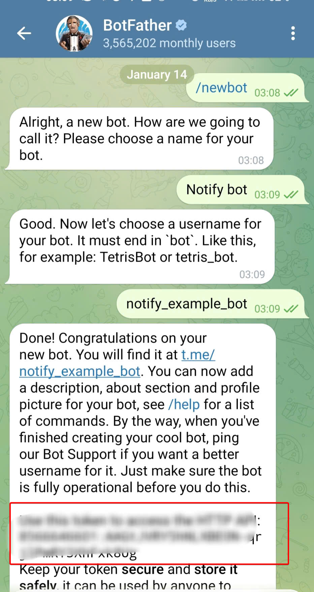
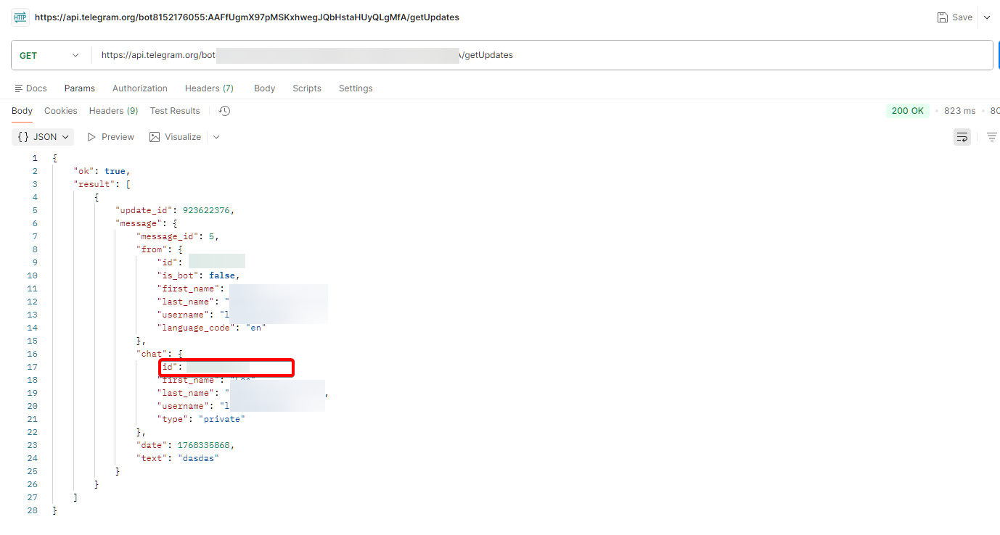

# Tạo Telegram Bot - "Người đưa tin" cho hệ thống

Trong thực tế, đôi khi chúng ta sẽ cần thiết lập một kênh để gửi thông báo một cách tự động để thông báo tình trạng hệ thống, trạng thái của project, etc. Với bài này tôi sẽ hướng dẫn bạn cách thực hiện tạo **telegram bot** để thực hiện việc này.

### Bước 1: Xin giấy phép từ "Bố Già" (BotFather)

Mọi Bot trên Telegram đều được sinh ra từ một con bot trùm tên là **BotFather**.

1. Mở Telegram, tìm kiếm từ khóa: `@BotFather` (có tích xanh).
2. Gõ lệnh: `/newbot`
3. **BotFather** sẽ hỏi tên hiển thị (Name): _Đặt tên tùy thích_.
4. **BotFather** hỏi tên định danh (Username): _Bắt buộc phải kết thúc bằng chữ `bot` và không trùng với ai_.

Sau khi tạo thành công, BotFather sẽ đưa cho bạn một chuỗi ký tự dài. Đó chính là **Token API**.

> **Ví dụ:** `789012345:AAHnb_Gz...`



---

### Bước 2: Lấy Chat ID (Địa chỉ người nhận)

Token giúp Jenkins điều khiển Bot, nhưng Bot cần biết phải gửi tin nhắn cho ai. **Chat ID** chính là số nhà của bạn (hoặc Group chat của team).

#### Cách 1: Lấy ID cá nhân

1. Tìm tên con bot bạn vừa tạo (@ten_bot_cua_ban) và bấm **Start**.
2. Gửi một tin nhắn bất kỳ cho nó (Ví dụ: "Hello").

#### Cách 2: Lấy ID của Group (Khuyên dùng cho Team)

1. Tạo một Group mới (ví dụ: "DevOps Alerts").
2. Add con bot vừa tạo vào Group này.
3. Gửi một tin nhắn bất kỳ vào Group (Ví dụ: "/start @ten_bot_cua_ban").

### Lấy Chat ID

Mở trình duyệt web và truy cập đường dẫn sau (thay Token của bạn vào):

```text
https://api.telegram.org/bot<BOT_TOKEN>/getUpdates
```

Bạn sẽ nhận được một chuỗi JSON. Hãy tìm đoạn `chat` -> `id`:

- Nếu là cá nhân: Số dương (Ví dụ: `123456789`).
- Nếu là Group: Số âm (Ví dụ: `-987654321`).



---

### Bước 3: Test thử "phát súng" đầu tiên

Kiểm thử Bot hoạt động bằng cách dán đường dẫn sau vào trình duyệt để test gửi tin nhắn:

```text
https://api.telegram.org/bot<TOKEN>/sendMessage?chat_id=<CHAT_ID>&text=Hello+Test
```

Nếu điện thoại bạn có thông báo "Hello Test" 🔔, chúc mừng bạn! Bạn đã có đầy đủ thông tin (`TOKEN_BOT` và `CHAT_ID`) để gửi thông báo một cách tự động
