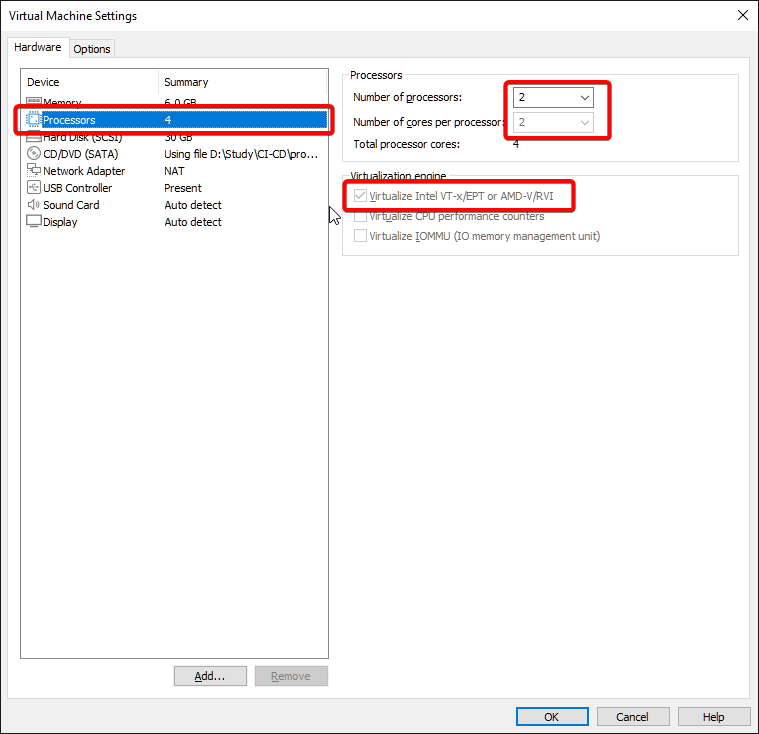
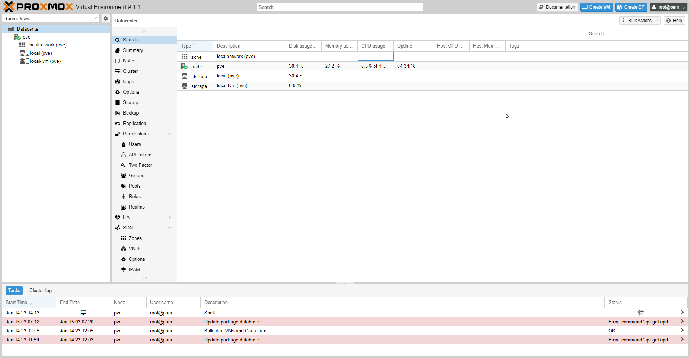
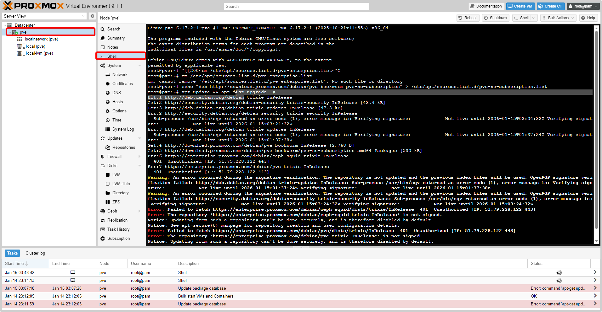

# Xây dựng Server "Ngon-Bổ-Rẻ": Hướng dẫn cài đặt Proxmox VE trên VMware Workstation

Bạn muốn học DevOps, Kubernetes hay Terraform nhưng không có tiền mua server vật lý? Bạn muốn dựng một HomeLab xịn xò để nghịch ngợm nhưng sợ làm hỏng máy tính chính?

Đừng lo! Hôm nay mình sẽ hướng dẫn các bạn cách biến chiếc Laptop/PC hàng ngày thành một "Data Center thu nhỏ" bằng kỹ thuật **Nested Virtualization** (Ảo hóa lồng nhau). Chúng ta sẽ cài đặt **Proxmox VE** – hệ điều hành ảo hóa doanh nghiệp – chạy ngay trên nền **VMware Workstation**.

---

## 1. Chuẩn bị hạ tầng (Prerequisites)

Để triển khai thành công, bạn cần phải có những điều kiện sau

### Cấu hình PC tối thiểu:

- **CPU:** Intel Core i5 hoặc AMD Ryzen 5 trở lên (Cần hỗ trợ ảo hóa VT-x/AMD-V).
- **RAM:** Tối thiểu 8GB (Khuyên dùng **16GB** để chạy mượt).
- **Ổ cứng:** Còn trống khoảng 50GB (SSD là bắt buộc, HDD sẽ rất chậm).

### Phần mềm:

- **VMware Workstation Pro 17**: Hiện đã **miễn phí** cho người dùng cá nhân. [Tải tại đây](https://support.broadcom.com/).

- **ISO Proxmox VE**: Tải bản mới nhất tại [trang chủ Proxmox](https://www.proxmox.com/en/downloads).

---

## 2. Thiết lập máy ảo trên VMware

Nhiều bạn cài xong bật không lên, hoặc bật lên mà không tạo được máy ảo con, nguyên nhân nằm ở bước này.

**Bước 1:** Mở VMware, chọn **Create a New Virtual Machine** -> **Typical**.

**Bước 2:** Chọn file ISO Proxmox bạn vừa tải.

:::tip[Lưu ý]
Nếu VMware không tự nhận diện OS, hãy chọn thủ công: **Linux** -> Version **Debian 12 (64-bit)** (Vì Proxmox 8 được xây dựng trên nhân Debian 12).
:::

**Bước 3:** Đặt tên và chọn nơi lưu trữ (Nên để ở ổ SSD).

**Bước 4:** Cấu hình phần cứng (Customize Hardware) - **CỰC KỲ QUAN TRỌNG**:

- **Memory:** Cấp cho Proxmox khoảng **6GB - 8GB** RAM.


- **Processors:** 2 CPU, 2 Core (Tổng 4 cores).

- Tích vào ô: **Virtualize Intel VT-x/EPT or AMD-V/RVI**.

:::note[Giải thích]
Cái này cho phép Proxmox nhìn thấy CPU vật lý của bạn để nó có thể tạo ra các máy ảo con bên trong nó. Quên tích cái này là coi như bỏ!
:::



- **Network Adapter:**
- Nếu bạn dùng dây mạng LAN: Chọn **Bridged** (Proxmox sẽ nhận IP ngang hàng với PC).
- Nếu bạn dùng **Wi-Fi**: Chọn **NAT** (Proxmox sẽ nhận mạng từ PC, ổn định hơn cho Laptop).

---

## 3. Tiến hành cài đặt Proxmox VE

Sau khi cấu hình xong, bấm **Finish** và **Power On** máy ảo.

1. Màn hình Welcome hiện ra, chọn **Install Proxmox VE (Graphical)**.
2. **EULA:** Chọn "I agree".
3. **Target Harddisk:** Để mặc định và Next.
4. **Country:** Gõ `Vietnam` -> Timezone `Asia/Ho_Chi_Minh`.
5. **Password:** Đặt mật khẩu cho tài khoản `root` (Nhớ kỹ mật khẩu này nhé!).
6. **Email:** điền admin@local.test cũng được.
7. **Network Configuration:**

- **Hostname:** Đặt tên cho server, ví dụ: `pve.lab.local`.
- **IP Address:** Hãy ghi nhớ địa chỉ IP này (Ví dụ: `192.168.100.128`). Đây là chìa khóa để vào trang quản trị.

7. Bấm **Install** và chờ đợi (khoảng 5-10 phút).

Sau khi cài xong, máy sẽ tự khởi động lại và hiện màn hình đen (Console) với dòng chữ:
`https://[IP-CUA-BAN]:8006/`

---

## 4. Đăng nhập và Cấu hình cơ bản

Bây giờ, đừng dùng VMware nữa. Hãy thoát chuột ra ngoài Windows (`Ctrl + Alt`), mở trình duyệt Chrome/Edge lên và truy cập địa chỉ IP trên (nhớ có `https://` và đuôi `:8006`).

:::tip[Cảnh báo bảo mật]
Trình duyệt sẽ báo "Your connection is not private". Đừng sợ, bấm **Advanced** -> **Proceed to... (unsafe)**.
:::

**Đăng nhập:**

- User: `root`
- Password: (Mật khẩu bạn đặt ở bước 3).



### Fix lỗi "No Subscription" (Làm sạch giao diện)

Mặc định Proxmox sẽ hiện thông báo đòi mua bản quyền mỗi khi đăng nhập. Với bản Free, chúng ta cần chỉnh lại nguồn cập nhật (Repository).

1. Vào Shell của Proxmox (Chọn Node `pve` -> **Shell**).
2. Chạy lệnh sau để tắt repo Enterprise và thêm repo No-Subscription:

```bash
# Xóa repo doanh nghiệp (cần trả tiền)
rm /etc/apt/sources.list.d/pve-enterprise.list

# Thêm repo miễn phí
echo "deb http://download.proxmox.com/debian/pve bookworm pve-no-subscription" > /etc/apt/sources.list.d/pve-no-subscription.list

# Cập nhật hệ thống
apt update && apt dist-upgrade -y

```



---

## 5. Troubleshooting (Gỡ lỗi thường gặp)

**Lỗi: "Virtualized Intel VT-x/EPT is not supported on this platform"**

- **Triệu chứng:** VMware báo lỗi ngay khi bật máy, không cho cài.
- **Nguyên nhân:** Windows đang chiếm quyền ảo hóa (thường do Hyper-V hoặc tính năng Core Isolation).
- **Cách sửa:**

1. Tắt **Hyper-V** trong "Turn Windows features on or off".
2. Tắt **Memory Integrity** trong "Windows Security -> Device Security -> Core isolation".
3. Chạy CMD (Admin): `bcdedit /set hypervisorlaunchtype off` và khởi động lại máy.

**Lỗi: Proxmox không có mạng (Ping 8.8.8.8 không được)**

- Kiểm tra lại cài đặt mạng trong VMware. Nếu đang dùng Wi-Fi mà để Bridged rất hay lỗi, hãy chuyển sang **NAT**.

---

## 6. Tổng kết

Chúc mừng! Bạn vừa tiết kiệm được vài triệu đồng tiền mua server. Bây giờ bạn đã có một môi trường ảo hóa chuyên nghiệp (Hypervisor Type-1) chạy ngay trong máy tính cá nhân.
