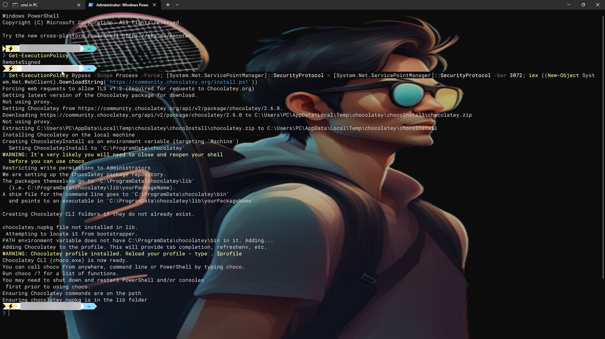
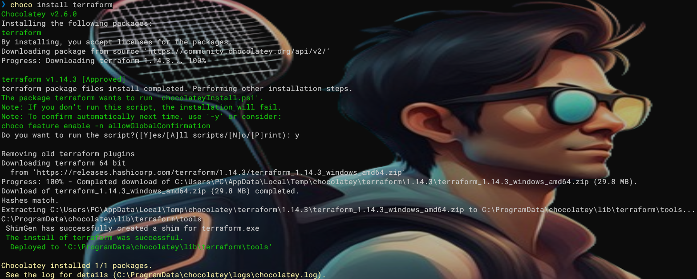
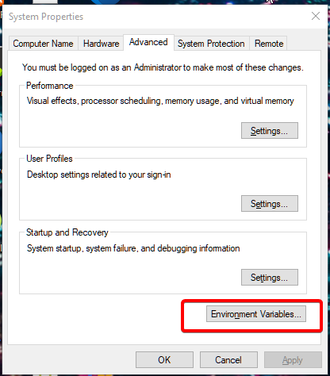
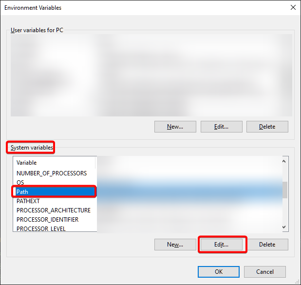
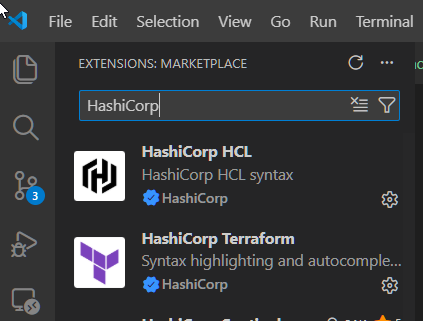

# [DevOps 101] Cài đặt Terraform "chuẩn chỉ" trên Windows với Chocolatey & VS Code

Trước khi bắt tay vào viết những dòng code hạ tầng đầu tiên ("Hello World"), chúng ta cần chuẩn bị một môi trường làm việc chuyên nghiệp.

Nếu bạn đang dùng Windows, việc cài đặt các công cụ dòng lệnh (CLI) đôi khi khá cực khổ vì phải tải file zip, giải nén, rồi set biến môi trường thủ công. Hôm nay, mình sẽ hướng dẫn các bạn cách làm điều đó theo phong cách "dân Pro" bằng **Chocolatey**, và biến VS Code thành vũ khí tối thượng để viết code HCL.

---

## 1. Chocolatey là gì? Tại sao cần nó?

Nếu Linux có `apt` hay `yum`, macOS có `brew`, thì Windows có **Chocolatey**.

Đây là một trình quản lý gói (Package Manager). Thay vì phải lên Google tìm phần mềm, tải bộ cài `.exe`, bấm Next -> Next -> Finish, bạn chỉ cần gõ **một dòng lệnh** là xong.

### Cài đặt Chocolatey

1. Bấm phím `Windows`, gõ **PowerShell**.
2. Chuột phải vào kết quả, chọn **Run as Administrator** (Bắt buộc).
3. Copy và dán dòng lệnh sau vào PowerShell rồi nhấn Enter:

```powershell
Set-ExecutionPolicy Bypass -Scope Process -Force; [System.Net.ServicePointManager]::SecurityProtocol = [System.Net.ServicePointManager]::SecurityProtocol -bor 3072; iex ((New-Object System.Net.WebClient).DownloadString('https://community.chocolatey.org/install.ps1'))

```



4. Chờ chạy xong, gõ lệnh `choco -v`. Nếu thấy hiện số phiên bản (ví dụ `2.2.2`) là thành công!

---

## 2. Cài đặt Terraform qua Chocolatey

Đây là lý do tại sao mình khuyên dùng Chocolatey: **Nó tự động cấu hình PATH cho bạn.** Bạn sẽ không cần lo về việc Windows không nhận diện lệnh `terraform`.

Tại cửa sổ PowerShell (Admin) ở trên, gõ lệnh:

```powershell
choco install terraform -y

```

Chờ vài giây để nó tải và cài đặt. Sau khi xong, bạn hãy **tắt PowerShell đi và mở lại** (để nó cập nhật biến môi trường).



**Kiểm tra kết quả:**

Gõ lệnh:

```bash
terraform -version

```

Nếu hiện ra `Terraform v1.x.x` -> Chúc mừng, bạn đã cài xong!

---

## 3. Cấu hình PATH thủ công (Dự phòng)

Nếu bạn cài bằng Chocolatey thì bước này **thường không cần thiết**. Tuy nhiên, nếu bạn gõ `terraform` mà máy báo lỗi _"is not recognized as an internal or external command"_, thì bạn cần thêm nó vào PATH thủ công.

1. Bấm phím `Windows`, gõ **"env"** -> Chọn **Edit the system environment variables**.
2. Bấm nút **Environment Variables**.



3. Ở mục **System variables** (khung dưới), tìm dòng có tên **Path** -> Bấm **Edit**.



4. Bấm **New**, và dán đường dẫn thư mục chứa file `terraform.exe` vào.

> Nếu cài bằng Choco, thường nó nằm ở:\_ `C:\ProgramData\chocolatey\bin`

5. Bấm OK liên tục để lưu.
6. Khởi động lại Terminal/PowerShell để nhận diện.

---

## 4. Cài đặt extensions trên VS Code để code Terraform

Viết code Terraform (HCL) bằng Notepad là một cực hình. Hãy sử dụng **Visual Studio Code (VS Code)** và cài thêm các Extension chính chủ để được gợi ý code (IntelliSense) và tô màu cú pháp.

### Bước 1: Mở Extension Marketplace

Mở VS Code, bấm vào biểu tượng 4 ô vuông bên trái (hoặc phím tắt `Ctrl + Shift + X`).

### Bước 2: Cài đặt "HashiCorp Terraform"

- Gõ tìm kiếm: `HashiCorp Terraform`.
- Chọn cái của tác giả **HashiCorp**.
- Bấm **Install**.

:::note[Tác dụng]
Đây là extension quan trọng nhất. Nó giúp tô màu code `.tf`, tự động gợi ý khi bạn gõ `resource`, và báo lỗi cú pháp ngay khi bạn gõ sai.
:::

### Bước 3: Cài đặt "HashiCorp HCL"

- Gõ tìm kiếm: `HashiCorp HCL`.
- Chọn extension của tác giả **HashiCorp**.
- Bấm **Install**.

:::note[Tác dụng]
Hỗ trợ tô màu cú pháp cho các file cấu hình `.hcl` (ví dụ file `terraform.lock.hcl` hoặc các file config của Nomad/Consul sau này).
:::



---

## 5. Kiểm tra môi trường lần cuối

Để chắc chắn mọi thứ đã sẵn sàng, hãy làm một bài test nhỏ:

1. Tạo một thư mục mới tên là `terraform-demo`.
2. Mở thư mục đó bằng VS Code.
3. Tạo file `main.tf`.
4. Gõ thử chữ `res` và chờ 1 giây.
5. Nếu VS Code hiện ra gợi ý `resource` -> Extension hoạt động tốt.
6. Mở Terminal trong VS Code (`Ctrl + ~`) và gõ `terraform -version`. Nếu ra số phiên bản -> Terraform hoạt động tốt.

---

## Tổng kết

Vậy là bạn đã có đầy đủ "gươm giáo":

- **Chocolatey:** Để cài phần mềm nhanh gọn.
- **Terraform CLI:** Đã nằm trong PATH, gọi đâu có đó.
- **VS Code + Extensions:** Hỗ trợ tận răng khi viết code.
